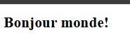

i18n

```bash
mkdir -p templates translations/en/LC_MESSAGES translations/fr/LC_MESSAGES
touch 0-app.py templates/0-index.html \
1-app.py templates/1-index.html \
2-app.py templates/2-index.html \
3-app.py babel.cfg templates/3-index.html \
translations/en/LC_MESSAGES/messages.po \
translations/fr/LC_MESSAGES/messages.po \
translations/en/LC_MESSAGES/messages.mo \
translations/fr/LC_MESSAGES/messages.mo \
4-app.py templates/4-index.html \
5-app.py templates/5-index.html \
6-app.py templates/6-index.html \
7-app.py templates/7-index.html \
app.py templates/index.html \
translations/en/LC_MESSAGES/messages.po \
translations/fr/LC_MESSAGES/messages.po
```
```bash
python3 -m venv .venv
source .venv/bin/activate
deactivate
pip freeze > requirements.txt
```

# Task0
## 0. Basic Flask app

0-app.py
```python
#!/usr/bin/env python3
"""
Basic Flask app
"""
from flask import Flask, render_template

app = Flask(__name__)


@app.route('/')
def index():
    """Render the index page"""
    return render_template('0-index.html')


if __name__ == "__main__":
    app.run(host="0.0.0.0", port=5000)
```

templates/0-index.html
```html
<!DOCTYPE html>
<html lang="en">
<head>
    <meta charset="UTF-8">
    <title>Welcome to Holberton</title>
</head>
<body>
    <h1>Hello world</h1>
</body>
</html>
```

```bash
(.venv) root@UID7E:/mnt/d/Users/steph/Documents/5ème_trimestre/holbertonschool-we
b_back_end/i18n# python3 0-app.py
 * Serving Flask app '0-app'
 * Debug mode: off
WARNING: This is a development server. Do not use it in a production deployment. Use a production WSGI server instead.
 * Running on all addresses (0.0.0.0)
 * Running on http://127.0.0.1:5000
 * Running on http://172.18.71.179:5000
Press CTRL+C to quit
127.0.0.1 - - [11/Aug/2025 22:00:16] "GET / HTTP/1.1" 200 -
127.0.0.1 - - [11/Aug/2025 22:00:16] "GET /favicon.ico HTTP/1.1" 404 -

```

# Task1
## 1. Basic Babel setup

Install the Babel Flask extension:
```bash
$ pip3 install flask_babel
```

1-app.py
```python
#!/usr/bin/env python3
"""
Basic Flask app with Babel setup
"""
from flask import Flask, render_template
from flask_babel import Babel


class Config:
    """Configuration for Babel and available languages"""
    LANGUAGES = ["en", "fr"]
    BABEL_DEFAULT_LOCALE = "en"
    BABEL_DEFAULT_TIMEZONE = "UTC"


app = Flask(__name__)
app.config.from_object(Config)

babel = Babel(app)


@app.route('/')
def index():
    """Render the index page"""
    return render_template('1-index.html')


if __name__ == "__main__":
    app.run(host="0.0.0.0", port=5000)

```

templates/1-index.html
```html
<!DOCTYPE html>
<html lang="en">
<head>
    <meta charset="UTF-8">
    <title>Welcome to Holberton</title>
</head>
<body>
    <h1>Hello world</h1>
</body>
</html>

```

```bash
(.venv) root@UID7E:/mnt/d/Users/steph/Documents/5ème_trimestre/holbertonschool-we
b_back_end/i18n# python3 1-app.py
 * Serving Flask app '1-app'
 * Debug mode: off
WARNING: This is a development server. Do not use it in a production deployment. Use a production WSGI server instead.
 * Running on all addresses (0.0.0.0)
 * Running on http://127.0.0.1:5000
 * Running on http://172.18.71.179:5000
Press CTRL+C to quit
127.0.0.1 - - [11/Aug/2025 22:22:40] "GET / HTTP/1.1" 200 -

```


# Task2
## 2. Get locale from request

2-app.py
```python
#!/usr/bin/env python3
"""
Flask app: detect locale from request using Flask-Babel
"""
from flask import Flask, render_template, request
from flask_babel import Babel


class Config:
    """Configuration for Babel and available languages"""
    LANGUAGES = ["en", "fr"]
    BABEL_DEFAULT_LOCALE = "en"
    BABEL_DEFAULT_TIMEZONE = "UTC"


app = Flask(__name__)
app.config.from_object(Config)

babel = Babel()  # create Babel instance without binding


def get_locale():
    """Select the best match between client's Accept-Language and supported LANGUAGES."""
    return request.accept_languages.best_match(app.config["LANGUAGES"])


# Initialize Babel with our locale selector
babel.init_app(app, locale_selector=get_locale)


@app.route("/")
def index():
    """Render the index page"""
    return render_template("2-index.html")


if __name__ == "__main__":
    app.run(host="0.0.0.0", port=5000)

```

templates/2-index.html
```html
<!DOCTYPE html>
<html lang="en">
<head>
  <meta charset="UTF-8" />
  <title>Welcome to Holberton</title>
</head>
<body>
  <h1>Hello world</h1>
</body>
</html>

```

```bash
(.venv) root@UID7E:/mnt/d/Users/steph/Documents/5ème_trimestre/holbertonschool-we
b_back_end/i18n# python3 2-app.py
 * Serving Flask app '2-app'
 * Debug mode: off
WARNING: This is a development server. Do not use it in a production deployment. Use a production WSGI server instead.
 * Running on all addresses (0.0.0.0)
 * Running on http://127.0.0.1:5000
 * Running on http://172.18.71.179:5000
Press CTRL+C to quit
127.0.0.1 - - [11/Aug/2025 22:26:24] "GET / HTTP/1.1" 200 -


```

# Task3
## 3. Parametrize templates

3-app.py
```python
#!/usr/bin/env python3
"""
Flask app: parametrized templates with Flask-Babel
"""
from flask import Flask, render_template, request
from flask_babel import Babel


class Config:
    """
    Application configuration for Flask-Babel.

    Attributes:
        LANGUAGES (list[str]): List of supported locales (e.g., ["en", "fr"]).
        BABEL_DEFAULT_LOCALE (str): Fallback locale when no match is found.
        BABEL_DEFAULT_TIMEZONE (str): Default timezone used by Babel.
    """
    LANGUAGES = ["en", "fr"]
    BABEL_DEFAULT_LOCALE = "en"
    BABEL_DEFAULT_TIMEZONE = "UTC"


app = Flask(__name__)
app.config.from_object(Config)

babel = Babel()


def get_locale():
    """
    Select the best-matching locale from the client's Accept-Language header.

    Returns:
        str | None: The best match among supported languages, or None.
    """
    return request.accept_languages.best_match(app.config["LANGUAGES"])


babel.init_app(app, locale_selector=get_locale)


@app.route("/")
def index():
    """
    Render the translated home page.

    Returns:
        str: Rendered HTML of templates/3-index.html.
    """
    return render_template("3-index.html")


if __name__ == "__main__":
    app.run(host="0.0.0.0", port=5000)

```

templates/3-index.html
```html
<!DOCTYPE html>
<html lang="{{ get_locale() or 'en' }}">
<head>
  <meta charset="UTF-8" />
  <title>{{ _('home_title') }}</title>
</head>
<body>
  <h1>{{ _('home_header') }}</h1>
</body>
</html>

```

générer avec
```bash
pybabel extract -F babel.cfg -o messages.pot .
pybabel update -i messages.pot -d translations
pybabel compile -d translations
```

translations/en/LC_MESSAGES/messages.po
```bash
# English translations for PROJECT.
# Copyright (C) 2025 ORGANIZATION
# This file is distributed under the same license as the PROJECT project.
# FIRST AUTHOR <EMAIL@ADDRESS>, 2025.
#
msgid ""
msgstr ""
"Project-Id-Version: PROJECT VERSION\n"
"Report-Msgid-Bugs-To: EMAIL@ADDRESS\n"
"POT-Creation-Date: 2025-08-11 22:45+0200\n"
"PO-Revision-Date: 2025-08-11 22:37+0200\n"
"Last-Translator: FULL NAME <EMAIL@ADDRESS>\n"
"Language: en\n"
"Language-Team: en <LL@li.org>\n"
"Plural-Forms: nplurals=2; plural=(n != 1)\n"
"MIME-Version: 1.0\n"
"Content-Type: text/plain; charset=utf-8\n"
"Content-Transfer-Encoding: 8bit\n"
"Generated-By: Babel 2.8.0\n"

#: templates/3-index.html:5
msgid "home_title"
msgstr "Welcome to Holberton"

#: templates/3-index.html:8
msgid "home_header"
msgstr "Hello world!"


```

translations/fr/LC_MESSAGES/messages.po
```bash
# French translations for PROJECT.
# Copyright (C) 2025 ORGANIZATION
# This file is distributed under the same license as the PROJECT project.
# FIRST AUTHOR <EMAIL@ADDRESS>, 2025.
#
msgid ""
msgstr ""
"Project-Id-Version: PROJECT VERSION\n"
"Report-Msgid-Bugs-To: EMAIL@ADDRESS\n"
"POT-Creation-Date: 2025-08-11 22:45+0200\n"
"PO-Revision-Date: 2025-08-11 22:37+0200\n"
"Last-Translator: FULL NAME <EMAIL@ADDRESS>\n"
"Language: fr\n"
"Language-Team: fr <LL@li.org>\n"
"Plural-Forms: nplurals=2; plural=(n > 1)\n"
"MIME-Version: 1.0\n"
"Content-Type: text/plain; charset=utf-8\n"
"Content-Transfer-Encoding: 8bit\n"
"Generated-By: Babel 2.8.0\n"

#: templates/3-index.html:5
msgid "home_title"
msgstr "Bienvenue chez Holberton"

#: templates/3-index.html:8
msgid "home_header"
msgstr "Bonjour monde!"


```

translations/en/LC_MESSAGES/messages.mo
```bash

```

translations/fr/LC_MESSAGES/messages.mo
```bash

```

Use the _ or gettext function to parametrize your templates. Use the message IDs home_title and home_header.

Create a babel.cfg file containing
```bash
[python: **.py]
[jinja2: **/templates/**.html]
```
Then initialize your translations with
```bash
$ pybabel extract -F babel.cfg -o messages.pot .
```
and your two dictionaries with
```bash
$ pybabel init -i messages.pot -d translations -l en
$ pybabel init -i messages.pot -d translations -l fr
```
Then edit files translations/[en|fr]/LC_MESSAGES/messages.po to provide the correct value for each message ID for each language. Use the following translations:

msgid	English	French
home_title	"Welcome to Holberton"	"Bienvenue chez Holberton"
home_header	"Hello world!"	"Bonjour monde!"
Then compile your dictionaries with

```bash
$ pybabel compile -d translations
```
Reload the home page of your app and make sure that the correct messages show up.


```bash
root@UID7E:/mnt/d/Users/steph/Documents/5ème_trimestre/holbertonschool-web_back_e
nd/i18n# pybabel extract -F babel.cfg -o messages.pot .
extracting messages from 0-app.py
extracting messages from 1-app.py
extracting messages from 2-app.py
extracting messages from 3-app.py
extracting messages from 4-app.py
extracting messages from 5-app.py
extracting messages from 6-app.py
extracting messages from 7-app.py
extracting messages from app.py
extracting messages from templates/0-index.html
extracting messages from templates/1-index.html
extracting messages from templates/2-index.html
extracting messages from templates/3-index.html
extracting messages from templates/4-index.html
extracting messages from templates/5-index.html
extracting messages from templates/6-index.html
extracting messages from templates/7-index.html
extracting messages from templates/index.html
writing PO template file to messages.pot
root@UID7E:/mnt/d/Users/steph/Documents/5ème_trimestre/holbertonschool-web_back_e
nd/i18n#

root@UID7E:/mnt/d/Users/steph/Documents/5ème_trimestre/holbertonschool-web_back_e
nd/i18n# pybabel init -i messages.pot -d translations -l en
creating catalog translations/en/LC_MESSAGES/messages.po based on messages.pot
root@UID7E:/mnt/d/Users/steph/Documents/5ème_trimestre/holbertonschool-web_back_e
nd/i18n# pybabel init -i messages.pot -d translations -l fr
creating catalog translations/fr/LC_MESSAGES/messages.po based on messages.pot
root@UID7E:/mnt/d/Users/steph/Documents/5ème_trimestre/holbertonschool-web_back_e
nd/i18n#

root@UID7E:/mnt/d/Users/steph/Documents/5ème_trimestre/holbertonschool-web_back_e
nd/i18n# pybabel compile -d translations
compiling catalog translations/en/LC_MESSAGES/messages.po to translations/en/LC_MESSAGES/messages.mo
compiling catalog translations/fr/LC_MESSAGES/messages.po to translations/fr/LC_MESSAGES/messages.mo
root@UID7E:/mnt/d/Users/steph/Documents/5ème_trimestre/holbertonschool-web_back_e
nd/i18n#
```


```bash
(.venv) root@UID7E:/mnt/d/Users/steph/Documents/5ème_trimestre/holbertonschool-we
b_back_end/i18n# python3 3-app.py
 * Serving Flask app '3-app'
 * Debug mode: off
WARNING: This is a development server. Do not use it in a production deployment. Use a production WSGI server instead.
 * Running on all addresses (0.0.0.0)
 * Running on http://127.0.0.1:5000
 * Running on http://172.18.71.179:5000
Press CTRL+C to quit
127.0.0.1 - - [11/Aug/2025 22:44:59] "GET / HTTP/1.1" 200 -

```

```bash
root@UID7E:/mnt/d/Users/steph/Documents/5ème_trimestre/holbertonschool-web_back_e
nd/i18n# pybabel extract -F babel.cfg -o messages.pot .
extracting messages from 0-app.py
extracting messages from 1-app.py
extracting messages from 2-app.py
extracting messages from 3-app.py
extracting messages from 4-app.py
extracting messages from 5-app.py
extracting messages from 6-app.py
extracting messages from 7-app.py
extracting messages from app.py
extracting messages from templates/0-index.html
extracting messages from templates/1-index.html
extracting messages from templates/2-index.html
extracting messages from templates/3-index.html
extracting messages from templates/4-index.html
extracting messages from templates/5-index.html
extracting messages from templates/6-index.html
extracting messages from templates/7-index.html
extracting messages from templates/index.html
writing PO template file to messages.pot
root@UID7E:/mnt/d/Users/steph/Documents/5ème_trimestre/holbertonschool-web_back_e
nd/i18n# pybabel update -i messages.pot -d translations
updating catalog translations/en/LC_MESSAGES/messages.po based on messages.pot
updating catalog translations/fr/LC_MESSAGES/messages.po based on messages.pot
root@UID7E:/mnt/d/Users/steph/Documents/5ème_trimestre/holbertonschool-web_back_e
nd/i18n# pybabel compile -d translations
compiling catalog translations/en/LC_MESSAGES/messages.po to translations/en/LC_MESSAGES/messages.mo
compiling catalog translations/fr/LC_MESSAGES/messages.po to translations/fr/LC_MESSAGES/messages.mo
root@UID7E:/mnt/d/Users/steph/Documents/5ème_trimestre/holbertonschool-web_back_e
nd/i18n#

```

```bash
(.venv) root@UID7E:/mnt/d/Users/steph/Documents/5ème_trimestre/holbertonschool-we
b_back_end/i18n# python3 3-app.py
 * Serving Flask app '3-app'
 * Debug mode: off
WARNING: This is a development server. Do not use it in a production deployment. Use a production WSGI server instead.
 * Running on all addresses (0.0.0.0)
 * Running on http://127.0.0.1:5000
 * Running on http://172.18.71.179:5000
Press CTRL+C to quit
127.0.0.1 - - [11/Aug/2025 22:56:46] "GET / HTTP/1.1" 200 -


(.venv) root@UID7E:/mnt/d/Users/steph/Documents/5ème_trimestre/holbertonschool-we
b_back_end/i18n# pybabel compile -d translations
compiling catalog translations/en/LC_MESSAGES/messages.po to translations/en/LC_MESSAGES/messages.mo
compiling catalog translations/fr/LC_MESSAGES/messages.po to translations/fr/LC_MESSAGES/messages.mo
(.venv) root@UID7E:/mnt/d/Users/steph/Documents/5ème_trimestre/holbertonschool-we
b_back_end/i18n#

(.venv) root@UID7E:/mnt/d/Users/steph/Documents/5ème_trimestre/holbertonschool-we
b_back_end/i18n# python3 3-app.py
 * Serving Flask app '3-app'
 * Debug mode: off
WARNING: This is a development server. Do not use it in a production deployment. Use a production WSGI server instead.
 * Running on all addresses (0.0.0.0)
 * Running on http://127.0.0.1:5000
 * Running on http://172.18.71.179:5000
Press CTRL+C to quit
127.0.0.1 - - [11/Aug/2025 22:56:46] "GET / HTTP/1.1" 200 -

```



# Task4
## 4. Force locale with URL parameter

4-app.py
```python
#!/usr/bin/env python3
"""
Flask app: force locale via URL parameter with Flask-Babel.

- Supports locales: en, fr
- If a request has ?locale=fr|en, use it; otherwise use Accept-Language.
"""
from flask import Flask, render_template, request
from flask_babel import Babel


class Config:
    """
    Application configuration for Flask-Babel.

    Attributes:
        LANGUAGES (list[str]): Supported locales.
        BABEL_DEFAULT_LOCALE (str): Fallback locale when no match is found.
        BABEL_DEFAULT_TIMEZONE (str): Default timezone for Babel.
    """
    LANGUAGES = ["en", "fr"]
    BABEL_DEFAULT_LOCALE = "en"
    BABEL_DEFAULT_TIMEZONE = "UTC"


app = Flask(__name__)
app.config.from_object(Config)

babel = Babel()


def get_locale():
    """
    Locale selector: URL param takes precedence, else Accept-Language.

    Returns:
        str | None: Selected locale among supported languages.
    """
    # 1) Force from URL ?locale=...
    forced = request.args.get("locale", type=str)
    if forced and forced in app.config["LANGUAGES"]:
        return forced
    # 2) Fallback to best match from headers
    return request.accept_languages.best_match(app.config["LANGUAGES"])


# Bind Babel with our selector
babel.init_app(app, locale_selector=get_locale)


@app.route("/")
def index():
    """Render translated home page for step 4."""
    return render_template("4-index.html")


if __name__ == "__main__":
    app.run(host="0.0.0.0", port=5000)

```

templates/4-index.html
```html
<!DOCTYPE html>
<html lang="en">
<head>
  <meta charset="UTF-8" />
  <title>{{ _('home_title') }}</title>
</head>
<body>
  <h1>{{ _('home_header') }}</h1>
</body>
</html>

```
Test in your browser:

http://127.0.0.1:5000/?locale=en → <h1>Hello world!</h1>

http://127.0.0.1:5000/?locale=fr → <h1>Bonjour monde!</h1>

```bash
(.venv) root@UID7E:/mnt/d/Users/steph/Documents/5ème_trimestre/holbertonschool-we
b_back_end/i18n# python3 4-app.py
 * Serving Flask app '4-app'
 * Debug mode: off
WARNING: This is a development server. Do not use it in a production deployment. Use a production WSGI server instead.
 * Running on all addresses (0.0.0.0)
 * Running on http://127.0.0.1:5000
 * Running on http://172.18.71.179:5000
Press CTRL+C to quit
127.0.0.1 - - [11/Aug/2025 23:10:35] "GET / HTTP/1.1" 200 -
127.0.0.1 - - [11/Aug/2025 23:10:37] "GET / HTTP/1.1" 200 -
127.0.0.1 - - [11/Aug/2025 23:10:55] "GET /?locale=en HTTP/1.1" 200 -
127.0.0.1 - - [11/Aug/2025 23:11:05] "GET /?locale=fr HTTP/1.1" 200 -
```


# Task5
## 5. Mock logging in

5-app.py
```python
#!/usr/bin/env python3
"""
Flask app: mock login + translated messages.

- Mock users via ?login_as=<id>
- Store current user in flask.g.user (or None)
- Force locale via ?locale=fr|en, else use Accept-Language
"""
from flask import Flask, render_template, request, g
from flask_babel import Babel


class Config:
    """
    Application configuration for Flask-Babel.

    Attributes:
        LANGUAGES (list[str]): Supported locales.
        BABEL_DEFAULT_LOCALE (str): Fallback locale.
        BABEL_DEFAULT_TIMEZONE (str): Default timezone.
    """
    LANGUAGES = ["en", "fr"]
    BABEL_DEFAULT_LOCALE = "en"
    BABEL_DEFAULT_TIMEZONE = "UTC"


# Mock "database" of users
users = {
    1: {"name": "Balou", "locale": "fr", "timezone": "Europe/Paris"},
    2: {"name": "Beyonce", "locale": "en", "timezone": "US/Central"},
    3: {"name": "Spock", "locale": "kg", "timezone": "Vulcan"},
    4: {"name": "Teletubby", "locale": None, "timezone": "Europe/London"},
}

app = Flask(__name__)
app.config.from_object(Config)

babel = Babel()


def get_locale():
    """
    Locale selector: URL param takes precedence, else Accept-Language.
    """
    forced = request.args.get("locale", type=str)
    if forced in app.config["LANGUAGES"]:
        return forced
    return request.accept_languages.best_match(app.config["LANGUAGES"])


babel.init_app(app, locale_selector=get_locale)


def get_user():
    """
    Return the mocked user dict from ?login_as=<id>, or None.
    """
    uid = request.args.get("login_as", type=int)
    if uid and uid in users:
        return users[uid]
    return None


@app.before_request
def before_request():
    """
    Run before each request. Attach current user (if any) to flask.g.
    """
    g.user = get_user()


@app.route("/")
def index():
    """
    Render translated home page for step 5.
    """
    return render_template("5-index.html")


if __name__ == "__main__":
    app.run(host="0.0.0.0", port=5000)

```

templates/5-index.html
```html
<!DOCTYPE html>
<html lang="en">
<head>
  <meta charset="UTF-8" />
  <title>{{ _('home_title') }}</title>
</head>
<body>
  <h1>{{ _('home_header') }}</h1>

  
    <p>{{ _('logged_in_as', username=g.user['name']) }}</p>
  
    <p>{{ _('not_logged_in') }}</p>
  
</body>
</html>

```

```bash
pybabel extract -F babel.cfg -o messages.pot .
pybabel update -i messages.pot -d translations
pybabel compile -d translations
python3 5-app.py
```

```bash
(.venv) root@UID7E:/mnt/d/Users/steph/Documents/5ème_trimestre/holbertonschool-we
b_back_end/i18n# pybabel extract -F babel.cfg -o messages.pot .
pybabel update -i messages.pot -d translations
pybabel compile -d translations
python3 5-app.py
extracting messages from 0-app.py
extracting messages from 1-app.py
extracting messages from 2-app.py
extracting messages from 3-app.py
extracting messages from 4-app.py
extracting messages from 5-app.py
extracting messages from 6-app.py
extracting messages from 7-app.py
extracting messages from app.py
extracting messages from templates/0-index.html
extracting messages from templates/1-index.html
extracting messages from templates/2-index.html
extracting messages from templates/3-index.html
extracting messages from templates/4-index.html
extracting messages from templates/5-index.html
extracting messages from templates/6-index.html
extracting messages from templates/7-index.html
extracting messages from templates/index.html
writing PO template file to messages.pot
updating catalog translations/en/LC_MESSAGES/messages.po based on messages.pot
updating catalog translations/fr/LC_MESSAGES/messages.po based on messages.pot
compiling catalog translations/en/LC_MESSAGES/messages.po to translations/en/LC_MESSAGES/messages.mo
compiling catalog translations/fr/LC_MESSAGES/messages.po to translations/fr/LC_MESSAGES/messages.mo
 * Serving Flask app '5-app'
 * Debug mode: off
WARNING: This is a development server. Do not use it in a production deployment. Use a production WSGI server instead.
 * Running on all addresses (0.0.0.0)
 * Running on http://127.0.0.1:5000
 * Running on http://172.18.71.179:5000
Press CTRL+C to quit
127.0.0.1 - - [11/Aug/2025 23:26:27] "GET /?locale=fr HTTP/1.1" 200 -
127.0.0.1 - - [11/Aug/2025 23:26:39] "GET /?locale=en HTTP/1.1" 200 -
127.0.0.1 - - [11/Aug/2025 23:27:00] "GET /?locale=fr HTTP/1.1" 200 -
127.0.0.1 - - [11/Aug/2025 23:27:17] "GET /?locale=en HTTP/1.1" 200 -
127.0.0.1 - - [11/Aug/2025 23:27:35] "GET /?locale=fr HTTP/1.1" 200 -
127.0.0.1 - - [11/Aug/2025 23:28:38] "GET /?login_as=2 HTTP/1.1" 200 -
127.0.0.1 - - [11/Aug/2025 23:29:31] "GET /?locale=en/?login_as=2 HTTP/1.1" 200 -
127.0.0.1 - - [11/Aug/2025 23:30:34] "GET /?login_as=2&locale=en HTTP/1.1" 200 -
127.0.0.1 - - [11/Aug/2025 23:31:01] "GET /?login_as=2&locale=fr HTTP/1.1" 200 -

```
http://127.0.0.1:5000/?locale=en
Hello world!
You are not logged in.

http://127.0.0.1:5000/?locale=fr
Bonjour monde!
Vous n'êtes pas connecté.

http://127.0.0.1:5000/?login_as=2
Bonjour monde!
Vous êtes connecté en tant que Beyonce.

http://127.0.0.1:5000/?login_as=2&locale=en
Hello world!
You are logged in as Beyonce.

http://127.0.0.1:5000/?login_as=2&locale=fr
Bonjour monde!
Vous êtes connecté en tant que Beyonce.

# Task6
## 6. Use user locale

6-app.py
```python
#!/usr/bin/env python3
"""
Flask app: locale priority (URL > user setting > headers > default).

- Mock users via ?login_as=<id>
- Store current user in flask.g.user
- Locale selection order:
  1) ?locale=fr|en
  2) g.user["locale"] if supported
  3) Accept-Language best match
  4) Default ("en")
"""
from flask import Flask, render_template, request, g
from flask_babel import Babel


class Config:
    """
    App config for Flask-Babel.
    """
    LANGUAGES = ["en", "fr"]
    BABEL_DEFAULT_LOCALE = "en"
    BABEL_DEFAULT_TIMEZONE = "UTC"


# Mock users database
users = {
    1: {"name": "Balou", "locale": "fr", "timezone": "Europe/Paris"},
    2: {"name": "Beyonce", "locale": "en", "timezone": "US/Central"},
    3: {"name": "Spock", "locale": "kg", "timezone": "Vulcan"},  # invalid/unsupported
    4: {"name": "Teletubby", "locale": None, "timezone": "Europe/London"},
}

app = Flask(__name__)
app.config.from_object(Config)

babel = Babel()


def get_user():
    """
    Return mocked user dict from ?login_as=<id>, else None.
    """
    uid = request.args.get("login_as", type=int)
    return users.get(uid) if uid in users else None


@app.before_request
def before_request():
    """
    Attach current user to flask.g for this request.
    """
    g.user = get_user()


def get_locale():
    """
    Locale selector with priority:
    URL param -> user setting -> Accept-Language -> default.
    """
    # 1) URL param
    forced = request.args.get("locale", type=str)
    if forced in app.config["LANGUAGES"]:
        return forced

    # 2) User setting
    user = getattr(g, "user", None)
    if user:
        uloc = user.get("locale")
        if uloc in app.config["LANGUAGES"]:
            return uloc

    # 3) Accept-Language header
    match = request.accept_languages.best_match(app.config["LANGUAGES"])
    if match:
        return match

    # 4) Default
    return app.config["BABEL_DEFAULT_LOCALE"]


# Bind Babel with our selector
babel.init_app(app, locale_selector=get_locale)


@app.route("/")
def index():
    """
    Render translated home page for step 6.
    """
    return render_template("6-index.html")


if __name__ == "__main__":
    app.run(host="0.0.0.0", port=5000)

```

templates/6-index.html
```html
<!DOCTYPE html>
<html lang="en">
<head>
  <meta charset="UTF-8" />
  <title>{{ _('home_title') }}</title>
</head>
<body>
  <h1>{{ _('home_header') }}</h1>

  
    <p>{{ _('logged_in_as', username=g.user['name']) }}</p>
  
    <p>{{ _('not_logged_in') }}</p>
  
</body>
</html>
```

```bash
(.venv) root@UID7E:/mnt/d/Users/steph/Documents/5ème_trimestre/holbertonschool-we
b_back_end/i18n# python3 6-app.py
 * Serving Flask app '6-app'
 * Debug mode: off
WARNING: This is a development server. Do not use it in a production deployment. Use a production WSGI server instead.
 * Running on all addresses (0.0.0.0)
 * Running on http://127.0.0.1:5000
 * Running on http://172.18.71.179:5000
Press CTRL+C to quit
127.0.0.1 - - [11/Aug/2025 23:37:33] "GET /?login_as=3&locale=fr HTTP/1.1" 200 -
```

http://127.0.0.1:5000/?login_as=3&locale=fr
Bonjour monde!
Vous êtes connecté en tant que Spock.


# Task7
## 7. Infer appropriate time zone

7-app.py
```python
#!/usr/bin/env python3
"""
Flask app: locale + timezone selection with Flask-Babel.

Priority rules:
- Locale: URL (?locale) > user setting > Accept-Language > default
- Timezone: URL (?timezone) > user setting > default ("UTC")
"""
from flask import Flask, render_template, request, g
from flask_babel import Babel
import pytz
from pytz.exceptions import UnknownTimeZoneError


class Config:
    """
    App config for Flask-Babel.

    Attributes:
        LANGUAGES (list[str]): Supported locales.
        BABEL_DEFAULT_LOCALE (str): Fallback locale.
        BABEL_DEFAULT_TIMEZONE (str): Default timezone ("UTC").
    """
    LANGUAGES = ["en", "fr"]
    BABEL_DEFAULT_LOCALE = "en"
    BABEL_DEFAULT_TIMEZONE = "UTC"


# Mock users database
users = {
    1: {"name": "Balou", "locale": "fr", "timezone": "Europe/Paris"},
    2: {"name": "Beyonce", "locale": "en", "timezone": "US/Central"},
    3: {"name": "Spock", "locale": "kg", "timezone": "Vulcan"},  # invalid/unsupported
    4: {"name": "Teletubby", "locale": None, "timezone": "Europe/London"},
}

app = Flask(__name__)
app.config.from_object(Config)

babel = Babel()


def get_user():
    """
    Return mocked user dict from ?login_as=<id>, else None.
    """
    uid = request.args.get("login_as", type=int)
    return users.get(uid) if uid in users else None


@app.before_request
def before_request():
    """
    Attach current user to flask.g for this request.
    """
    g.user = get_user()


def get_locale():
    """
    Locale selector with priority:
    URL param -> user setting -> Accept-Language -> default.
    """
    # 1) URL param
    forced = request.args.get("locale", type=str)
    if forced in app.config["LANGUAGES"]:
        return forced

    # 2) User setting
    user = getattr(g, "user", None)
    if user:
        uloc = user.get("locale")
        if uloc in app.config["LANGUAGES"]:
            return uloc

    # 3) Accept-Language header
    match = request.accept_languages.best_match(app.config["LANGUAGES"])
    if match:
        return match

    # 4) Default
    return app.config["BABEL_DEFAULT_LOCALE"]


def get_timezone():
    """
    Timezone selector with priority:
    URL param -> user setting -> default ("UTC").

    Validates provided timezones using pytz.timezone.
    """
    # 1) URL param
    tz = request.args.get("timezone", type=str)
    if tz:
        try:
            pytz.timezone(tz)
            return tz
        except UnknownTimeZoneError:
            pass  # ignore invalid URL-provided timezone

    # 2) User setting
    user = getattr(g, "user", None)
    if user:
        utz = user.get("timezone")
        if utz:
            try:
                pytz.timezone(utz)
                return utz
            except UnknownTimeZoneError:
                pass  # ignore invalid user timezone (e.g., "Vulcan")

    # 3) Default
    return app.config["BABEL_DEFAULT_TIMEZONE"]


# Bind Babel with our selectors
babel.init_app(app, locale_selector=get_locale, timezone_selector=get_timezone)


@app.route("/")
def index():
    """
    Render translated home page for step 7.
    """
    return render_template("7-index.html")


if __name__ == "__main__":
    app.run(host="0.0.0.0", port=5000)

```

templates/7-index.html
```html
<!DOCTYPE html>
<html lang="en">
<head>
  <meta charset="UTF-8" />
  <title>{{ _('home_title') }}</title>
</head>
<body>
  <h1>{{ _('home_header') }}</h1>

  
    <p>{{ _('logged_in_as', username=g.user['name']) }}</p>
  
    <p>{{ _('not_logged_in') }}</p>
  
</body>
</html>

```

```bash
python -m unittest -q

```

```bash
(.venv) root@UID7E:/mnt/d/Users/steph/Documents/5ème_trimestre/holbertonschool-we
b_back_end/i18n# python -m unittest -q
----------------------------------------------------------------------
Ran 5 tests in 0.039s

OK
(.venv) root@UID7E:/mnt/d/Users/steph/Documents/5ème_trimestre/holbertonschool-we
b_back_end/i18n# python -m unittest -q
[CLIENT] GET /?{'login_as': '2', 'locale': 'fr', 'timezone': 'Europe/Paris'} -> status=200, title='Bienvenue chez Holberton', h1='Bonjour monde!'
[SELECTORS] query={'login_as': '2', 'locale': 'fr', 'timezone': 'Europe/Paris'} -> locale='fr', timezone='Europe/Paris'
[ASSERT HTML] expected_h1='Bonjour monde!', got_h1='Bonjour monde!'
[CLIENT] GET /?{'timezone': 'US/Central'} -> status=200, title='Welcome to Holberton', h1='Hello world!'
[SELECTORS] query={'timezone': 'US/Central'} -> locale='en', timezone='US/Central'
[ASSERT HTML] expected_h1='Hello world!', got_h1='Hello world!'
[CLIENT] GET /?{'timezone': 'NotAZone'} -> status=200, title='Welcome to Holberton', h1='Hello world!'
[SELECTORS] query={'timezone': 'NotAZone'} -> locale='en', timezone='UTC'
[ASSERT HTML] expected_h1='Hello world!', got_h1='Hello world!'
[CLIENT] GET /?{'login_as': '1'} -> status=200, title='Bienvenue chez Holberton', h1='Bonjour monde!'
[SELECTORS] query={'login_as': '1'} -> locale='fr', timezone='Europe/Paris'
[ASSERT HTML] expected_h1='Bonjour monde!', got_h1='Bonjour monde!'
[CLIENT] GET /?{'login_as': '3'} -> status=200, title='Welcome to Holberton', h1='Hello world!'
[SELECTORS] query={'login_as': '3'} -> locale='en', timezone='UTC'
[ASSERT HTML] expected_h1='Hello world!', got_h1='Hello world!'
----------------------------------------------------------------------
Ran 5 tests in 0.137s

OK
(.venv) root@UID7E:/mnt/d/Users/steph/Documents/5ème_trimestre/holbertonschool-we
b_back_end/i18n#

```
1-User ID 1 – Locale FR, timezone Europe/Paris
http://127.0.0.1:5000/?login_as=1

2-User ID 3 – Locale non supportée, timezone invalide → fallback EN + UTC
http://127.0.0.1:5000/?login_as=3

3-Timezone forcée US/Central (valide)
http://127.0.0.1:5000/?timezone=US/Central

4-Timezone forcée invalide → ignorée → fallback UTC
http://127.0.0.1:5000/?timezone=NotAZone

5-User ID 2 + forcage locale FR + forcage timezone Europe/Paris
http://127.0.0.1:5000/?login_as=2&locale=fr&timezone=Europe/Paris

```bash
(.venv) root@UID7E:/mnt/d/Users/steph/Documents/5ème_trimestre/holbertonschool-we
b_back_end/i18n# python3 7-app.py
 * Serving Flask app '7-app'
 * Debug mode: off
WARNING: This is a development server. Do not use it in a production deployment. Use a production WSGI server instead.
 * Running on all addresses (0.0.0.0)
 * Running on http://127.0.0.1:5000
 * Running on http://172.18.71.179:5000
Press CTRL+C to quit
127.0.0.1 - - [11/Aug/2025 23:44:16] "GET /?login_as=3&locale=fr HTTP/1.1" 200 -
127.0.0.1 - - [11/Aug/2025 23:54:27] "GET /?login_as=1 HTTP/1.1" 200 -
127.0.0.1 - - [11/Aug/2025 23:54:36] "GET /?login_as=3 HTTP/1.1" 200 -
127.0.0.1 - - [11/Aug/2025 23:54:44] "GET /?timezone=US/Central HTTP/1.1" 200 -
127.0.0.1 - - [11/Aug/2025 23:54:54] "GET /?timezone=NotAZone HTTP/1.1" 200 -
127.0.0.1 - - [11/Aug/2025 23:55:02] "GET /?login_as=2&locale=fr&timezone=Europe/Paris HTTP/1.1" 200 -
```

# Task8
## 8. Display the current time

app.py
```python
#!/usr/bin/env python3
"""
Flask app (step 8): display current time with locale & timezone.
"""
from datetime import datetime
from flask import Flask, render_template, request, g
from flask_babel import Babel, format_datetime
import pytz
from pytz.exceptions import UnknownTimeZoneError


class Config:
    LANGUAGES = ["en", "fr"]
    BABEL_DEFAULT_LOCALE = "en"
    BABEL_DEFAULT_TIMEZONE = "UTC"


# Mock users
users = {
    1: {"name": "Balou", "locale": "fr", "timezone": "Europe/Paris"},
    2: {"name": "Beyonce", "locale": "en", "timezone": "US/Central"},
    3: {"name": "Spock", "locale": "kg", "timezone": "Vulcan"},
    4: {"name": "Teletubby", "locale": None, "timezone": "Europe/London"},
}

app = Flask(__name__)
app.config.from_object(Config)
babel = Babel()


def get_user():
    uid = request.args.get("login_as", type=int)
    return users.get(uid) if uid in users else None


@app.before_request
def before_request():
    g.user = get_user()


def get_locale():
    # 1) URL
    forced = request.args.get("locale", type=str)
    if forced in app.config["LANGUAGES"]:
        return forced
    # 2) User
    if g.get("user"):
        uloc = g.user.get("locale")
        if uloc in app.config["LANGUAGES"]:
            return uloc
    # 3) Header
    match = request.accept_languages.best_match(app.config["LANGUAGES"])
    if match:
        return match
    # 4) Default
    return app.config["BABEL_DEFAULT_LOCALE"]


def get_timezone():
    # 1) URL
    tz = request.args.get("timezone", type=str)
    if tz:
        try:
            pytz.timezone(tz)
            return tz
        except UnknownTimeZoneError:
            pass
    # 2) User
    if g.get("user"):
        utz = g.user.get("timezone")
        if utz:
            try:
                pytz.timezone(utz)
                return utz
            except UnknownTimeZoneError:
                pass
    # 3) Default
    return app.config["BABEL_DEFAULT_TIMEZONE"]


babel.init_app(app, locale_selector=get_locale, timezone_selector=get_timezone)


@app.route("/")
def index():
    """
    Render the home page with current localized time.
    """
    now_utc = datetime.utcnow()  # naive UTC datetime
    # format_datetime utilisera locale + timezone sélectionnés par Babel
    current_time = format_datetime(now_utc)
    return render_template("index.html", current_time=current_time)


if __name__ == "__main__":
    app.run(host="0.0.0.0", port=5000)

```

templates/index.html
```html
<!DOCTYPE html>
<html lang="en">
<head>
  <meta charset="UTF-8" />
  <title>{{ _('home_title') }}</title>
</head>
<body>
  <h1>{{ _('home_header') }}</h1>

  
    <p>{{ _('logged_in_as', username=g.user['name']) }}</p>
  
    <p>{{ _('not_logged_in') }}</p>
  

  <p>{{ _('current_time_is', current_time=current_time) }}</p>
</body>
</html>

```

```bash
pybabel extract -F babel.cfg -o messages.pot .
pybabel update -i messages.pot -d translations
pybabel compile -d translations
python3 app.py
```

```bash
(.venv) root@UID7E:/mnt/d/Users/steph/Documents/5ème_trimestre/holbertonschool-we
b_back_end/i18n# pybabel extract -F babel.cfg -o messages.pot .
pybabel update -i messages.pot -d translations
pybabel compile -d translations
python3 app.py
extracting messages from 0-app.py
extracting messages from 1-app.py
extracting messages from 2-app.py
extracting messages from 3-app.py
extracting messages from 4-app.py
extracting messages from 5-app.py
extracting messages from 6-app.py
extracting messages from 7-app.py
extracting messages from app.py
extracting messages from test_7_app_unittest copy.py
extracting messages from test_7_app_unittest.py
extracting messages from templates/0-index.html
extracting messages from templates/1-index.html
extracting messages from templates/2-index.html
extracting messages from templates/3-index.html
extracting messages from templates/4-index.html
extracting messages from templates/5-index.html
extracting messages from templates/6-index.html
extracting messages from templates/7-index.html
extracting messages from templates/index.html
writing PO template file to messages.pot
updating catalog translations/en/LC_MESSAGES/messages.po based on messages.pot
updating catalog translations/fr/LC_MESSAGES/messages.po based on messages.pot
compiling catalog translations/en/LC_MESSAGES/messages.po to translations/en/LC_MESSAGES/messages.mo
compiling catalog translations/fr/LC_MESSAGES/messages.po to translations/fr/LC_MESSAGES/messages.mo
 * Serving Flask app 'app'
 * Debug mode: off
WARNING: This is a development server. Do not use it in a production deployment. Use a production WSGI server instead.
 * Running on all addresses (0.0.0.0)
 * Running on http://127.0.0.1:5000
 * Running on http://172.18.71.179:5000
Press CTRL+C to quit
127.0.0.1 - - [12/Aug/2025 00:06:58] "GET /?login_as=1 HTTP/1.1" 200 -
127.0.0.1 - - [12/Aug/2025 00:07:18] "GET /?login_as=2 HTTP/1.1" 200 -
127.0.0.1 - - [12/Aug/2025 00:07:36] "GET /?locale=fr&timezone=Europe/Paris HTTP/1.1" 200 -
127.0.0.1 - - [12/Aug/2025 00:07:59] "GET /?timezone=NotAZone HTTP/1.1" 200 -


```

http://127.0.0.1:5000/?login_as=1
Bonjour monde!
Vous êtes connecté en tant que Balou.

Nous sommes le 12 août 2025, 00:06:58.

http://127.0.0.1:5000/?login_as=2
Hello world!
You are logged in as Beyonce.

The current time is Aug 11, 2025, 5:07:18 PM.

http://127.0.0.1:5000/?locale=fr&timezone=Europe/Paris
Bonjour monde!
Vous n'êtes pas connecté.

Nous sommes le 12 août 2025, 00:07:36.

http://127.0.0.1:5000/?timezone=NotAZone
Bonjour monde!
Vous n'êtes pas connecté.

Nous sommes le 11 août 2025, 22:07:59.


http://127.0.0.1:5000/?login_as=1 → FR + Europe/Paris → “Nous sommes le …”

http://127.0.0.1:5000/?login_as=2 → EN + US/Central → “The current time is …”

http://127.0.0.1:5000/?locale=fr&timezone=Europe/Paris → FR + Paris.

http://127.0.0.1:5000/?timezone=NotAZone → timezone ignorée → défaut UTC.
