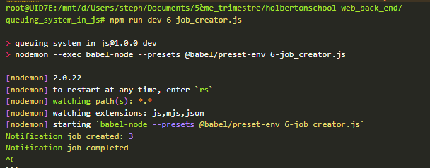
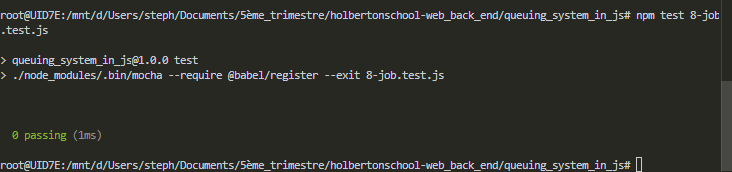

# queuing_system_in_js

```bash
root@UID7E:/mnt/d/Users/steph/Documents/5ème_trimestre/holbertonschool-web_back_end/queuing_system_in_js#  wget http://download.redis.io/releases/redis-6.0.10.tar.gz
--2025-08-27 20:07:39--  http://download.redis.io/releases/redis-6.0.10.tar.gz
Resolving download.redis.io (download.redis.io)... 104.18.27.34, 104.18.26.34, 2606:4700::6812:1b22, ...
Connecting to download.redis.io (download.redis.io)|104.18.27.34|:80... connected.
HTTP request sent, awaiting response... 200 OK
Length: 2271970 (2.2M) [application/octet-stream]
Saving to: ‘redis-6.0.10.tar.gz’

redis-6.0.10.tar.gz           100%[=================================================>]   2.17M  9.49MB/s    in 0.2s

2025-08-27 20:07:40 (9.49 MB/s) - ‘redis-6.0.10.tar.gz’ saved [2271970/2271970]

root@UID7E:/mnt/d/Users/steph/Documents/5ème_trimestre/holbertonschool-web_back_end/queuing_system_in_js# tar xzf redis-6.0.10.tar.gz
root@UID7E:/mnt/d/Users/steph/Documents/5ème_trimestre/holbertonschool-web_back_end/queuing_system_in_js# cd redis-6.0.10
root@UID7E:/mnt/d/Users/steph/Documents/5ème_trimestre/holbertonschool-web_back_end/queuing_system_in_js/redis-6.0.10# make
cd src && make all
make[1]: Entering directory '/mnt/d/Users/steph/Documents/5ème_trimestre/holbertonschool-web_back_end/queuing_system_in_js/redis-6.0.10/src'
    CC Makefile.dep
rm -rf redis-server redis-sentinel redis-cli redis-benchmark redis-check-rdb redis-check-aof *.o *.gcda *.gcno *.gcov redis.info lcov-html Makefile.dep dict-benchmark
rm -f adlist.d quicklist.d ae.d anet.d dict.d server.d sds.d zmalloc.d lzf_c.d lzf_d.d pqsort.d zipmap.d sha1.d ziplist.d release.d networking.d util.d object.d db.d replication.d rdb.d t_string.d t_list.d t_set.d t_zset.d t_hash.d config.d aof.d pubsub.d multi.d debug.d sort.d intset.d syncio.d cluster.d crc16.d endianconv.d slowlog.d scripting.d bio.d rio.d rand.d memtest.d crcspeed.d crc64.d bitops.d sentinel.d notify.d setproctitle.d blocked.d hyperloglog.d latency.d sparkline.d redis-check-rdb.d redis-check-aof.d geo.d lazyfree.d module.d evict.d expire.d geohash.d geohash_helper.d childinfo.d defrag.d siphash.d rax.d t_stream.d listpack.d localtime.d lolwut.d lolwut5.d lolwut6.d acl.d gopher.d tracking.d connection.d tls.d sha256.d timeout.d setcpuaffinity.d anet.d adlist.d dict.d redis-cli.d zmalloc.d release.d ae.d crcspeed.d crc64.d siphash.d crc16.d ae.d anet.d redis-benchmark.d adlist.d dict.d zmalloc.d siphash.d
(cd ../deps && make distclean)
make[2]: Entering directory '/mnt/d/Users/steph/Documents/5ème_trimestre/holbertonschool-web_back_end/queuing_system_in_js/redis-6.0.10/deps'
(cd hiredis && make clean) > /dev/null || true
(cd linenoise && make clean) > /dev/null || true
(cd lua && make clean) > /dev/null || true
(cd jemalloc && [ -f Makefile ] && make distclean) > /dev/null || true
(rm -f .make-*)
make[2]: Leaving directory '/mnt/d/Users/steph/Documents/5ème_trimestre/holbertonschool-web_back_end/queuing_system_in_js/redis-6.0.10/deps'
(rm -f .make-*)
echo STD=-std=c11 -pedantic -DREDIS_STATIC='' >> .make-settings
echo WARN=-Wall -W -Wno-missing-field-initializers >> .make-settings
echo OPT=-O2 >> .make-settings
echo MALLOC=jemalloc >> .make-settings
echo BUILD_TLS= >> .make-settings
echo USE_SYSTEMD= >> .make-settings
echo CFLAGS= >> .make-settings
echo LDFLAGS= >> .make-settings
echo REDIS_CFLAGS= >> .make-settings
echo REDIS_LDFLAGS= >> .make-settings
echo PREV_FINAL_CFLAGS=-std=c11 -pedantic -DREDIS_STATIC='' -Wall -W -Wno-missing-field-initializers -O2 -g -ggdb   -I../deps/hiredis -I../deps/linenoise -I../deps/lua/src -DUSE_JEMALLOC -I../deps/jemalloc/include >> .make-settings
echo PREV_FINAL_LDFLAGS=  -g -ggdb -rdynamic >> .make-settings
(cd ../deps && make hiredis linenoise lua jemalloc)
make[2]: Entering directory '/mnt/d/Users/steph/Documents/5ème_trimestre/holbertonschool-web_back_end/queuing_system_in_js/redis-6.0.10/deps'
(cd hiredis && make clean) > /dev/null || true
(cd linenoise && make clean) > /dev/null || true
(cd lua && make clean) > /dev/null || true
(cd jemalloc && [ -f Makefile ] && make distclean) > /dev/null || true
(rm -f .make-*)
(echo "" > .make-cflags)
(echo "" > .make-ldflags)
MAKE hiredis
cd hiredis && make static
make[3]: Entering directory '/mnt/d/Users/steph/Documents/5ème_trimestre/holbertonschool-web_back_end/queuing_system_in_js/redis-6.0.10/deps/hiredis'
cc -std=c99 -pedantic -c -O3 -fPIC   -Wall -W -Wstrict-prototypes -Wwrite-strings -Wno-missing-field-initializers -g -ggdb net.c
cc -std=c99 -pedantic -c -O3 -fPIC   -Wall -W -Wstrict-prototypes -Wwrite-strings -Wno-missing-field-initializers -g -ggdb hiredis.c
cc -std=c99 -pedantic -c -O3 -fPIC   -Wall -W -Wstrict-prototypes -Wwrite-strings -Wno-missing-field-initializers -g -ggdb sds.c
cc -std=c99 -pedantic -c -O3 -fPIC   -Wall -W -Wstrict-prototypes -Wwrite-strings -Wno-missing-field-initializers -g -ggdb async.c
cc -std=c99 -pedantic -c -O3 -fPIC   -Wall -W -Wstrict-prototypes -Wwrite-strings -Wno-missing-field-initializers -g -ggdb read.c
cc -std=c99 -pedantic -c -O3 -fPIC   -Wall -W -Wstrict-prototypes -Wwrite-strings -Wno-missing-field-initializers -g -ggdb sockcompat.c
ar rcs libhiredis.a net.o hiredis.o sds.o async.o read.o sockcompat.o
make[3]: Leaving directory '/mnt/d/Users/steph/Documents/5ème_trimestre/holbertonschool-web_back_end/queuing_system_in_js/redis-6.0.10/deps/hiredis'
MAKE linenoise
cd linenoise && make
make[3]: Entering directory '/mnt/d/Users/steph/Documents/5ème_trimestre/holbertonschool-web_back_end/queuing_system_in_js/redis-6.0.10/deps/linenoise'
cc  -Wall -Os -g  -c linenoise.c
make[3]: Leaving directory '/mnt/d/Users/steph/Documents/5ème_trimestre/holbertonschool-web_back_end/queuing_system_in_js/redis-6.0.10/deps/linenoise'
MAKE lua
cd lua/src && make all CFLAGS="-O2 -Wall -DLUA_ANSI -DENABLE_CJSON_GLOBAL -DREDIS_STATIC='' " MYLDFLAGS="" AR="ar rcu"
make[3]: Entering directory '/mnt/d/Users/steph/Documents/5ème_trimestre/holbertonschool-web_back_end/queuing_system_in_js/redis-6.0.10/deps/lua/src'
cc -O2 -Wall -DLUA_ANSI -DENABLE_CJSON_GLOBAL -DREDIS_STATIC=''    -c -o lapi.o lapi.c
cc -O2 -Wall -DLUA_ANSI -DENABLE_CJSON_GLOBAL -DREDIS_STATIC=''    -c -o lcode.o lcode.c
cc -O2 -Wall -DLUA_ANSI -DENABLE_CJSON_GLOBAL -DREDIS_STATIC=''    -c -o ldebug.o ldebug.c
cc -O2 -Wall -DLUA_ANSI -DENABLE_CJSON_GLOBAL -DREDIS_STATIC=''    -c -o ldo.o ldo.c
ldo.c: In function ‘f_parser’:
ldo.c:496:7: warning: unused variable ‘c’ [-Wunused-variable]
  496 |   int c = luaZ_lookahead(p->z);
      |       ^
cc -O2 -Wall -DLUA_ANSI -DENABLE_CJSON_GLOBAL -DREDIS_STATIC=''    -c -o ldump.o ldump.c
cc -O2 -Wall -DLUA_ANSI -DENABLE_CJSON_GLOBAL -DREDIS_STATIC=''    -c -o lfunc.o lfunc.c
cc -O2 -Wall -DLUA_ANSI -DENABLE_CJSON_GLOBAL -DREDIS_STATIC=''    -c -o lgc.o lgc.c
cc -O2 -Wall -DLUA_ANSI -DENABLE_CJSON_GLOBAL -DREDIS_STATIC=''    -c -o llex.o llex.c
cc -O2 -Wall -DLUA_ANSI -DENABLE_CJSON_GLOBAL -DREDIS_STATIC=''    -c -o lmem.o lmem.c
cc -O2 -Wall -DLUA_ANSI -DENABLE_CJSON_GLOBAL -DREDIS_STATIC=''    -c -o lobject.o lobject.c
cc -O2 -Wall -DLUA_ANSI -DENABLE_CJSON_GLOBAL -DREDIS_STATIC=''    -c -o lopcodes.o lopcodes.c
cc -O2 -Wall -DLUA_ANSI -DENABLE_CJSON_GLOBAL -DREDIS_STATIC=''    -c -o lparser.o lparser.c
cc -O2 -Wall -DLUA_ANSI -DENABLE_CJSON_GLOBAL -DREDIS_STATIC=''    -c -o lstate.o lstate.c
cc -O2 -Wall -DLUA_ANSI -DENABLE_CJSON_GLOBAL -DREDIS_STATIC=''    -c -o lstring.o lstring.c
cc -O2 -Wall -DLUA_ANSI -DENABLE_CJSON_GLOBAL -DREDIS_STATIC=''    -c -o ltable.o ltable.c
cc -O2 -Wall -DLUA_ANSI -DENABLE_CJSON_GLOBAL -DREDIS_STATIC=''    -c -o ltm.o ltm.c
cc -O2 -Wall -DLUA_ANSI -DENABLE_CJSON_GLOBAL -DREDIS_STATIC=''    -c -o lundump.o lundump.c
cc -O2 -Wall -DLUA_ANSI -DENABLE_CJSON_GLOBAL -DREDIS_STATIC=''    -c -o lvm.o lvm.c
cc -O2 -Wall -DLUA_ANSI -DENABLE_CJSON_GLOBAL -DREDIS_STATIC=''    -c -o lzio.o lzio.c
cc -O2 -Wall -DLUA_ANSI -DENABLE_CJSON_GLOBAL -DREDIS_STATIC=''    -c -o strbuf.o strbuf.c
cc -O2 -Wall -DLUA_ANSI -DENABLE_CJSON_GLOBAL -DREDIS_STATIC=''    -c -o fpconv.o fpconv.c
cc -O2 -Wall -DLUA_ANSI -DENABLE_CJSON_GLOBAL -DREDIS_STATIC=''    -c -o lauxlib.o lauxlib.c
lauxlib.c: In function ‘luaL_loadfile’:
lauxlib.c:577:4: warning: this ‘while’ clause does not guard... [-Wmisleading-indentation]
  577 |    while ((c = getc(lf.f)) != EOF && c != LUA_SIGNATURE[0]) ;
      |    ^~~~~
lauxlib.c:578:5: note: ...this statement, but the latter is misleadingly indented as if it were guarded by the ‘while’
  578 |     lf.extraline = 0;
      |     ^~
cc -O2 -Wall -DLUA_ANSI -DENABLE_CJSON_GLOBAL -DREDIS_STATIC=''    -c -o lbaselib.o lbaselib.c
cc -O2 -Wall -DLUA_ANSI -DENABLE_CJSON_GLOBAL -DREDIS_STATIC=''    -c -o ldblib.o ldblib.c
cc -O2 -Wall -DLUA_ANSI -DENABLE_CJSON_GLOBAL -DREDIS_STATIC=''    -c -o liolib.o liolib.c
cc -O2 -Wall -DLUA_ANSI -DENABLE_CJSON_GLOBAL -DREDIS_STATIC=''    -c -o lmathlib.o lmathlib.c
cc -O2 -Wall -DLUA_ANSI -DENABLE_CJSON_GLOBAL -DREDIS_STATIC=''    -c -o loslib.o loslib.c
cc -O2 -Wall -DLUA_ANSI -DENABLE_CJSON_GLOBAL -DREDIS_STATIC=''    -c -o ltablib.o ltablib.c
ltablib.c: In function ‘addfield’:
ltablib.c:137:3: warning: this ‘if’ clause does not guard... [-Wmisleading-indentation]
  137 |   if (!lua_isstring(L, -1))
      |   ^~
ltablib.c:140:5: note: ...this statement, but the latter is misleadingly indented as if it were guarded by the ‘if’
  140 |     luaL_addvalue(b);
      |     ^~~~~~~~~~~~~
cc -O2 -Wall -DLUA_ANSI -DENABLE_CJSON_GLOBAL -DREDIS_STATIC=''    -c -o lstrlib.o lstrlib.c
cc -O2 -Wall -DLUA_ANSI -DENABLE_CJSON_GLOBAL -DREDIS_STATIC=''    -c -o loadlib.o loadlib.c
cc -O2 -Wall -DLUA_ANSI -DENABLE_CJSON_GLOBAL -DREDIS_STATIC=''    -c -o linit.o linit.c
cc -O2 -Wall -DLUA_ANSI -DENABLE_CJSON_GLOBAL -DREDIS_STATIC=''    -c -o lua_cjson.o lua_cjson.c
cc -O2 -Wall -DLUA_ANSI -DENABLE_CJSON_GLOBAL -DREDIS_STATIC=''    -c -o lua_struct.o lua_struct.c
cc -O2 -Wall -DLUA_ANSI -DENABLE_CJSON_GLOBAL -DREDIS_STATIC=''    -c -o lua_cmsgpack.o lua_cmsgpack.c
cc -O2 -Wall -DLUA_ANSI -DENABLE_CJSON_GLOBAL -DREDIS_STATIC=''    -c -o lua_bit.o lua_bit.c
lua_bit.c: In function ‘bit_band’:
lua_bit.c:101:5: warning: this ‘for’ clause does not guard... [-Wmisleading-indentation]
  101 |     for (i = lua_gettop(L); i > 1; i--) b opr barg(L, i); BRET(b) }
      |     ^~~
lua_bit.c:102:1: note: in expansion of macro ‘BIT_OP’
  102 | BIT_OP(bit_band, &=)
      | ^~~~~~
lua_bit.c:94:18: note: ...this statement, but the latter is misleadingly indented as if it were guarded by the ‘for’
   94 | #define BRET(b)  lua_pushnumber(L, (lua_Number)(SBits)(b)); return 1;
      |                  ^~~~~~~~~~~~~~
lua_bit.c:101:59: note: in expansion of macro ‘BRET’
  101 |     for (i = lua_gettop(L); i > 1; i--) b opr barg(L, i); BRET(b) }
      |                                                           ^~~~
lua_bit.c:102:1: note: in expansion of macro ‘BIT_OP’
  102 | BIT_OP(bit_band, &=)
      | ^~~~~~
lua_bit.c: In function ‘bit_bor’:
lua_bit.c:101:5: warning: this ‘for’ clause does not guard... [-Wmisleading-indentation]
  101 |     for (i = lua_gettop(L); i > 1; i--) b opr barg(L, i); BRET(b) }
      |     ^~~
lua_bit.c:103:1: note: in expansion of macro ‘BIT_OP’
  103 | BIT_OP(bit_bor, |=)
      | ^~~~~~
lua_bit.c:94:18: note: ...this statement, but the latter is misleadingly indented as if it were guarded by the ‘for’
   94 | #define BRET(b)  lua_pushnumber(L, (lua_Number)(SBits)(b)); return 1;
      |                  ^~~~~~~~~~~~~~
lua_bit.c:101:59: note: in expansion of macro ‘BRET’
  101 |     for (i = lua_gettop(L); i > 1; i--) b opr barg(L, i); BRET(b) }
      |                                                           ^~~~
lua_bit.c:103:1: note: in expansion of macro ‘BIT_OP’
  103 | BIT_OP(bit_bor, |=)
      | ^~~~~~
lua_bit.c: In function ‘bit_bxor’:
lua_bit.c:101:5: warning: this ‘for’ clause does not guard... [-Wmisleading-indentation]
  101 |     for (i = lua_gettop(L); i > 1; i--) b opr barg(L, i); BRET(b) }
      |     ^~~
lua_bit.c:104:1: note: in expansion of macro ‘BIT_OP’
  104 | BIT_OP(bit_bxor, ^=)
      | ^~~~~~
lua_bit.c:94:18: note: ...this statement, but the latter is misleadingly indented as if it were guarded by the ‘for’
   94 | #define BRET(b)  lua_pushnumber(L, (lua_Number)(SBits)(b)); return 1;
      |                  ^~~~~~~~~~~~~~
lua_bit.c:101:59: note: in expansion of macro ‘BRET’
  101 |     for (i = lua_gettop(L); i > 1; i--) b opr barg(L, i); BRET(b) }
      |                                                           ^~~~
lua_bit.c:104:1: note: in expansion of macro ‘BIT_OP’
  104 | BIT_OP(bit_bxor, ^=)
      | ^~~~~~
ar rcu liblua.a lapi.o lcode.o ldebug.o ldo.o ldump.o lfunc.o lgc.o llex.o lmem.o lobject.o lopcodes.o lparser.o lstate.o lstring.o ltable.o ltm.o lundump.o lvm.o lzio.o strbuf.o fpconv.o lauxlib.o lbaselib.o ldblib.o liolib.o lmathlib.o loslib.o ltablib.o lstrlib.o loadlib.o linit.o lua_cjson.o lua_struct.o lua_cmsgpack.o lua_bit.o  # DLL needs all object files
ar: `u' modifier ignored since `D' is the default (see `U')
ranlib liblua.a
cc -O2 -Wall -DLUA_ANSI -DENABLE_CJSON_GLOBAL -DREDIS_STATIC=''    -c -o lua.o lua.c
cc -o lua  lua.o liblua.a -lm
/usr/bin/ld: liblua.a(loslib.o): in function `os_tmpname':
loslib.c:(.text+0x2d5): warning: the use of `tmpnam' is dangerous, better use `mkstemp'
cc -O2 -Wall -DLUA_ANSI -DENABLE_CJSON_GLOBAL -DREDIS_STATIC=''    -c -o luac.o luac.c
cc -O2 -Wall -DLUA_ANSI -DENABLE_CJSON_GLOBAL -DREDIS_STATIC=''    -c -o print.o print.c
cc -o luac  luac.o print.o liblua.a -lm
make[3]: Leaving directory '/mnt/d/Users/steph/Documents/5ème_trimestre/holbertonschool-web_back_end/queuing_system_in_js/redis-6.0.10/deps/lua/src'
MAKE jemalloc
cd jemalloc && ./configure --with-version=5.1.0-0-g0 --with-lg-quantum=3 --with-jemalloc-prefix=je_ --enable-cc-silence CFLAGS="-std=gnu99 -Wall -pipe -g3 -O3 -funroll-loops " LDFLAGS=""
configure: WARNING: unrecognized options: --enable-cc-silence
checking for xsltproc... false
checking for gcc... gcc
checking whether the C compiler works... yes
checking for C compiler default output file name... a.out
checking for suffix of executables...
checking whether we are cross compiling... no
checking for suffix of object files... o
checking whether we are using the GNU C compiler... yes
checking whether gcc accepts -g... yes
checking for gcc option to accept ISO C89... none needed
checking whether compiler is cray... no
checking whether compiler supports -std=gnu11... yes
checking whether compiler supports -Wall... yes
checking whether compiler supports -Wshorten-64-to-32... no
checking whether compiler supports -Wsign-compare... yes
checking whether compiler supports -Wundef... yes
checking whether compiler supports -Wno-format-zero-length... yes
checking whether compiler supports -pipe... yes
checking whether compiler supports -g3... yes
checking how to run the C preprocessor... gcc -E
checking for g++... g++
checking whether we are using the GNU C++ compiler... yes
checking whether g++ accepts -g... yes
checking whether g++ supports C++14 features by default... yes
checking whether compiler supports -Wall... yes
checking whether compiler supports -g3... yes
checking whether libstdc++ linkage is compilable... yes
checking for grep that handles long lines and -e... /usr/bin/grep
checking for egrep... /usr/bin/grep -E
checking for ANSI C header files... yes
checking for sys/types.h... yes
checking for sys/stat.h... yes
checking for stdlib.h... yes
checking for string.h... yes
checking for memory.h... yes
checking for strings.h... yes
checking for inttypes.h... yes
checking for stdint.h... yes
checking for unistd.h... yes
checking whether byte ordering is bigendian... no
checking size of void *... 8
checking size of int... 4
checking size of long... 8
checking size of long long... 8
checking size of intmax_t... 8
checking build system type... x86_64-pc-linux-gnu
checking host system type... x86_64-pc-linux-gnu
checking whether pause instruction is compilable... yes
checking number of significant virtual address bits... 48
checking for ar... ar
checking for nm... nm
checking for gawk... gawk
checking malloc.h usability... yes
checking malloc.h presence... yes
checking for malloc.h... yes
checking whether malloc_usable_size definition can use const argument... no
checking for library containing log... -lm
checking whether __attribute__ syntax is compilable... yes
checking whether compiler supports -fvisibility=hidden... yes
checking whether compiler supports -fvisibility=hidden... yes
checking whether compiler supports -Werror... yes
checking whether compiler supports -herror_on_warning... yes
checking whether tls_model attribute is compilable... yes
checking whether compiler supports -Werror... yes
checking whether compiler supports -herror_on_warning... yes
checking whether alloc_size attribute is compilable... yes
checking whether compiler supports -Werror... yes
checking whether compiler supports -herror_on_warning... yes
checking whether format(gnu_printf, ...) attribute is compilable... yes
checking whether compiler supports -Werror... yes
checking whether compiler supports -herror_on_warning... yes
checking whether format(printf, ...) attribute is compilable... yes
checking for a BSD-compatible install... /usr/bin/install -c
checking for ranlib... ranlib
checking for ld... /usr/bin/ld
checking for autoconf... false
checking for memalign... yes
checking for valloc... yes
checking whether compiler supports -O3... yes
checking whether compiler supports -O3... yes
checking whether compiler supports -funroll-loops... yes
checking configured backtracing method... N/A
checking for sbrk... yes
checking whether utrace(2) is compilable... no
checking whether a program using __builtin_unreachable is compilable... yes
checking whether a program using __builtin_ffsl is compilable... yes
checking LG_PAGE... 12
checking pthread.h usability... yes
checking pthread.h presence... yes
checking for pthread.h... yes
checking for pthread_create in -lpthread... yes
checking dlfcn.h usability... yes
checking dlfcn.h presence... yes
checking for dlfcn.h... yes
checking for dlsym... yes
checking whether pthread_atfork(3) is compilable... yes
checking whether pthread_setname_np(3) is compilable... yes
checking for library containing clock_gettime... none required
checking whether clock_gettime(CLOCK_MONOTONIC_COARSE, ...) is compilable... yes
checking whether clock_gettime(CLOCK_MONOTONIC, ...) is compilable... yes
checking whether mach_absolute_time() is compilable... no
checking whether compiler supports -Werror... yes
checking whether syscall(2) is compilable... yes
checking for secure_getenv... yes
checking for sched_getcpu... yes
checking for sched_setaffinity... yes
checking for issetugid... no
checking for _malloc_thread_cleanup... no
checking for _pthread_mutex_init_calloc_cb... no
checking for TLS... yes
checking whether C11 atomics is compilable... no
checking whether GCC __atomic atomics is compilable... yes
checking whether GCC __sync atomics is compilable... yes
checking whether Darwin OSAtomic*() is compilable... no
checking whether madvise(2) is compilable... yes
checking whether madvise(..., MADV_FREE) is compilable... yes
checking whether madvise(..., MADV_DONTNEED) is compilable... yes
checking whether madvise(..., MADV_DO[NT]DUMP) is compilable... yes
checking whether madvise(..., MADV_[NO]HUGEPAGE) is compilable... yes
checking whether to force 32-bit __sync_{add,sub}_and_fetch()... no
checking whether to force 64-bit __sync_{add,sub}_and_fetch()... no
checking for __builtin_clz... yes
checking whether Darwin os_unfair_lock_*() is compilable... no
checking whether Darwin OSSpin*() is compilable... no
checking whether glibc malloc hook is compilable... no
checking whether glibc memalign hook is compilable... no
checking whether pthreads adaptive mutexes is compilable... yes
checking whether compiler supports -D_GNU_SOURCE... yes
checking whether compiler supports -Werror... yes
checking whether compiler supports -herror_on_warning... yes
checking whether strerror_r returns char with gnu source is compilable... yes
checking for stdbool.h that conforms to C99... yes
checking for _Bool... yes
configure: creating ./config.status
config.status: creating Makefile
config.status: creating jemalloc.pc
config.status: creating doc/html.xsl
config.status: creating doc/manpages.xsl
config.status: creating doc/jemalloc.xml
config.status: creating include/jemalloc/jemalloc_macros.h
config.status: creating include/jemalloc/jemalloc_protos.h
config.status: creating include/jemalloc/jemalloc_typedefs.h
config.status: creating include/jemalloc/internal/jemalloc_preamble.h
config.status: creating test/test.sh
config.status: creating test/include/test/jemalloc_test.h
config.status: creating config.stamp
config.status: creating bin/jemalloc-config
config.status: creating bin/jemalloc.sh
config.status: creating bin/jeprof
config.status: creating include/jemalloc/jemalloc_defs.h
config.status: creating include/jemalloc/internal/jemalloc_internal_defs.h
config.status: creating test/include/test/jemalloc_test_defs.h
config.status: executing include/jemalloc/internal/public_symbols.txt commands
config.status: executing include/jemalloc/internal/private_symbols.awk commands
config.status: executing include/jemalloc/internal/private_symbols_jet.awk commands
config.status: executing include/jemalloc/internal/public_namespace.h commands
config.status: executing include/jemalloc/internal/public_unnamespace.h commands
config.status: executing include/jemalloc/internal/size_classes.h commands
config.status: executing include/jemalloc/jemalloc_protos_jet.h commands
config.status: executing include/jemalloc/jemalloc_rename.h commands
config.status: executing include/jemalloc/jemalloc_mangle.h commands
config.status: executing include/jemalloc/jemalloc_mangle_jet.h commands
config.status: executing include/jemalloc/jemalloc.h commands
configure: WARNING: unrecognized options: --enable-cc-silence
===============================================================================
jemalloc version   : 5.1.0-0-g0
library revision   : 2

CONFIG             : --with-version=5.1.0-0-g0 --with-lg-quantum=3 --with-jemalloc-prefix=je_ --enable-cc-silence 'CFLAGS=-std=gnu99 -Wall -pipe -g3 -O3 -funroll-loops ' LDFLAGS=
CC                 : gcc
CONFIGURE_CFLAGS   : -std=gnu11 -Wall -Wsign-compare -Wundef -Wno-format-zero-length -pipe -g3 -fvisibility=hidden -O3 -funroll-loops
SPECIFIED_CFLAGS   : -std=gnu99 -Wall -pipe -g3 -O3 -funroll-loops
EXTRA_CFLAGS       :
CPPFLAGS           : -D_GNU_SOURCE -D_REENTRANT
CXX                : g++
CONFIGURE_CXXFLAGS : -Wall -g3 -fvisibility=hidden -O3
SPECIFIED_CXXFLAGS :
EXTRA_CXXFLAGS     :
LDFLAGS            :
EXTRA_LDFLAGS      :
DSO_LDFLAGS        : -shared -Wl,-soname,$(@F)
LIBS               : -lm -lstdc++ -lpthread
RPATH_EXTRA        :

XSLTPROC           : false
XSLROOT            :

PREFIX             : /usr/local
BINDIR             : /usr/local/bin
DATADIR            : /usr/local/share
INCLUDEDIR         : /usr/local/include
LIBDIR             : /usr/local/lib
MANDIR             : /usr/local/share/man

srcroot            :
abs_srcroot        : /mnt/d/Users/steph/Documents/5ème_trimestre/holbertonschool-web_back_end/queuing_system_in_js/redis-6.0.10/deps/jemalloc/
objroot            :
abs_objroot        : /mnt/d/Users/steph/Documents/5ème_trimestre/holbertonschool-web_back_end/queuing_system_in_js/redis-6.0.10/deps/jemalloc/

JEMALLOC_PREFIX    : je_
JEMALLOC_PRIVATE_NAMESPACE
                   : je_
install_suffix     :
malloc_conf        :
autogen            : 0
debug              : 0
stats              : 1
prof               : 0
prof-libunwind     : 0
prof-libgcc        : 0
prof-gcc           : 0
fill               : 1
utrace             : 0
xmalloc            : 0
log                : 0
lazy_lock          : 0
cache-oblivious    : 1
cxx                : 1
===============================================================================
cd jemalloc && make CFLAGS="-std=gnu99 -Wall -pipe -g3 -O3 -funroll-loops " LDFLAGS="" lib/libjemalloc.a
make[3]: Entering directory '/mnt/d/Users/steph/Documents/5ème_trimestre/holbertonschool-web_back_end/queuing_system_in_js/redis-6.0.10/deps/jemalloc'
make[3]: Warning: File 'Makefile' has modification time 1.3 s in the future
gcc -std=gnu99 -Wall -pipe -g3 -O3 -funroll-loops  -c -D_GNU_SOURCE -D_REENTRANT -Iinclude -Iinclude -DJEMALLOC_NO_PRIVATE_NAMESPACE -o src/jemalloc.sym.o src/jemalloc.c
nm -a src/jemalloc.sym.o | gawk -f include/jemalloc/internal/private_symbols.awk > src/jemalloc.sym
gcc -std=gnu99 -Wall -pipe -g3 -O3 -funroll-loops  -c -D_GNU_SOURCE -D_REENTRANT -Iinclude -Iinclude -DJEMALLOC_NO_PRIVATE_NAMESPACE -o src/arena.sym.o src/arena.c
nm -a src/arena.sym.o | gawk -f include/jemalloc/internal/private_symbols.awk > src/arena.sym
gcc -std=gnu99 -Wall -pipe -g3 -O3 -funroll-loops  -c -D_GNU_SOURCE -D_REENTRANT -Iinclude -Iinclude -DJEMALLOC_NO_PRIVATE_NAMESPACE -o src/background_thread.sym.o src/background_thread.c
nm -a src/background_thread.sym.o | gawk -f include/jemalloc/internal/private_symbols.awk > src/background_thread.sym
gcc -std=gnu99 -Wall -pipe -g3 -O3 -funroll-loops  -c -D_GNU_SOURCE -D_REENTRANT -Iinclude -Iinclude -DJEMALLOC_NO_PRIVATE_NAMESPACE -o src/base.sym.o src/base.c
nm -a src/base.sym.o | gawk -f include/jemalloc/internal/private_symbols.awk > src/base.sym
gcc -std=gnu99 -Wall -pipe -g3 -O3 -funroll-loops  -c -D_GNU_SOURCE -D_REENTRANT -Iinclude -Iinclude -DJEMALLOC_NO_PRIVATE_NAMESPACE -o src/bin.sym.o src/bin.c
nm -a src/bin.sym.o | gawk -f include/jemalloc/internal/private_symbols.awk > src/bin.sym
gcc -std=gnu99 -Wall -pipe -g3 -O3 -funroll-loops  -c -D_GNU_SOURCE -D_REENTRANT -Iinclude -Iinclude -DJEMALLOC_NO_PRIVATE_NAMESPACE -o src/bitmap.sym.o src/bitmap.c
nm -a src/bitmap.sym.o | gawk -f include/jemalloc/internal/private_symbols.awk > src/bitmap.sym
gcc -std=gnu99 -Wall -pipe -g3 -O3 -funroll-loops  -c -D_GNU_SOURCE -D_REENTRANT -Iinclude -Iinclude -DJEMALLOC_NO_PRIVATE_NAMESPACE -o src/ckh.sym.o src/ckh.c
nm -a src/ckh.sym.o | gawk -f include/jemalloc/internal/private_symbols.awk > src/ckh.sym
gcc -std=gnu99 -Wall -pipe -g3 -O3 -funroll-loops  -c -D_GNU_SOURCE -D_REENTRANT -Iinclude -Iinclude -DJEMALLOC_NO_PRIVATE_NAMESPACE -o src/ctl.sym.o src/ctl.c
nm -a src/ctl.sym.o | gawk -f include/jemalloc/internal/private_symbols.awk > src/ctl.sym
gcc -std=gnu99 -Wall -pipe -g3 -O3 -funroll-loops  -c -D_GNU_SOURCE -D_REENTRANT -Iinclude -Iinclude -DJEMALLOC_NO_PRIVATE_NAMESPACE -o src/div.sym.o src/div.c
nm -a src/div.sym.o | gawk -f include/jemalloc/internal/private_symbols.awk > src/div.sym
gcc -std=gnu99 -Wall -pipe -g3 -O3 -funroll-loops  -c -D_GNU_SOURCE -D_REENTRANT -Iinclude -Iinclude -DJEMALLOC_NO_PRIVATE_NAMESPACE -o src/extent.sym.o src/extent.c
nm -a src/extent.sym.o | gawk -f include/jemalloc/internal/private_symbols.awk > src/extent.sym
gcc -std=gnu99 -Wall -pipe -g3 -O3 -funroll-loops  -c -D_GNU_SOURCE -D_REENTRANT -Iinclude -Iinclude -DJEMALLOC_NO_PRIVATE_NAMESPACE -o src/extent_dss.sym.o src/extent_dss.c
nm -a src/extent_dss.sym.o | gawk -f include/jemalloc/internal/private_symbols.awk > src/extent_dss.sym
gcc -std=gnu99 -Wall -pipe -g3 -O3 -funroll-loops  -c -D_GNU_SOURCE -D_REENTRANT -Iinclude -Iinclude -DJEMALLOC_NO_PRIVATE_NAMESPACE -o src/extent_mmap.sym.o src/extent_mmap.c
nm -a src/extent_mmap.sym.o | gawk -f include/jemalloc/internal/private_symbols.awk > src/extent_mmap.sym
gcc -std=gnu99 -Wall -pipe -g3 -O3 -funroll-loops  -c -D_GNU_SOURCE -D_REENTRANT -Iinclude -Iinclude -DJEMALLOC_NO_PRIVATE_NAMESPACE -o src/hash.sym.o src/hash.c
nm -a src/hash.sym.o | gawk -f include/jemalloc/internal/private_symbols.awk > src/hash.sym
gcc -std=gnu99 -Wall -pipe -g3 -O3 -funroll-loops  -c -D_GNU_SOURCE -D_REENTRANT -Iinclude -Iinclude -DJEMALLOC_NO_PRIVATE_NAMESPACE -o src/hooks.sym.o src/hooks.c
nm -a src/hooks.sym.o | gawk -f include/jemalloc/internal/private_symbols.awk > src/hooks.sym
gcc -std=gnu99 -Wall -pipe -g3 -O3 -funroll-loops  -c -D_GNU_SOURCE -D_REENTRANT -Iinclude -Iinclude -DJEMALLOC_NO_PRIVATE_NAMESPACE -o src/large.sym.o src/large.c
nm -a src/large.sym.o | gawk -f include/jemalloc/internal/private_symbols.awk > src/large.sym
gcc -std=gnu99 -Wall -pipe -g3 -O3 -funroll-loops  -c -D_GNU_SOURCE -D_REENTRANT -Iinclude -Iinclude -DJEMALLOC_NO_PRIVATE_NAMESPACE -o src/log.sym.o src/log.c
nm -a src/log.sym.o | gawk -f include/jemalloc/internal/private_symbols.awk > src/log.sym
gcc -std=gnu99 -Wall -pipe -g3 -O3 -funroll-loops  -c -D_GNU_SOURCE -D_REENTRANT -Iinclude -Iinclude -DJEMALLOC_NO_PRIVATE_NAMESPACE -o src/malloc_io.sym.o src/malloc_io.c
src/malloc_io.c: In function ‘malloc_vsnprintf’:
src/malloc_io.c:369:9: warning: case label value exceeds maximum value for type [-Wswitch-outside-range]
  369 |         case '?' | 0x80:                                                \
      |         ^~~~
src/malloc_io.c:581:33: note: in expansion of macro ‘GET_ARG_NUMERIC’
  581 |                                 GET_ARG_NUMERIC(val, 'p');
      |                                 ^~~~~~~~~~~~~~~
src/malloc_io.c:387:9: warning: case label value exceeds maximum value for type [-Wswitch-outside-range]
  387 |         case 'j' | 0x80:                                                \
      |         ^~~~
src/malloc_io.c:581:33: note: in expansion of macro ‘GET_ARG_NUMERIC’
  581 |                                 GET_ARG_NUMERIC(val, 'p');
      |                                 ^~~~~~~~~~~~~~~
src/malloc_io.c:375:9: warning: case label value exceeds maximum value for type [-Wswitch-outside-range]
  375 |         case 'l' | 0x80:                                                \
      |         ^~~~
src/malloc_io.c:581:33: note: in expansion of macro ‘GET_ARG_NUMERIC’
  581 |                                 GET_ARG_NUMERIC(val, 'p');
      |                                 ^~~~~~~~~~~~~~~
src/malloc_io.c:381:9: warning: case label value exceeds maximum value for type [-Wswitch-outside-range]
  381 |         case 'q' | 0x80:                                                \
      |         ^~~~
src/malloc_io.c:581:33: note: in expansion of macro ‘GET_ARG_NUMERIC’
  581 |                                 GET_ARG_NUMERIC(val, 'p');
      |                                 ^~~~~~~~~~~~~~~
src/malloc_io.c:396:9: warning: case label value exceeds maximum value for type [-Wswitch-outside-range]
  396 |         case 'z' | 0x80:                                                \
      |         ^~~~
src/malloc_io.c:581:33: note: in expansion of macro ‘GET_ARG_NUMERIC’
  581 |                                 GET_ARG_NUMERIC(val, 'p');
      |                                 ^~~~~~~~~~~~~~~
nm -a src/malloc_io.sym.o | gawk -f include/jemalloc/internal/private_symbols.awk > src/malloc_io.sym
gcc -std=gnu99 -Wall -pipe -g3 -O3 -funroll-loops  -c -D_GNU_SOURCE -D_REENTRANT -Iinclude -Iinclude -DJEMALLOC_NO_PRIVATE_NAMESPACE -o src/mutex.sym.o src/mutex.c
nm -a src/mutex.sym.o | gawk -f include/jemalloc/internal/private_symbols.awk > src/mutex.sym
gcc -std=gnu99 -Wall -pipe -g3 -O3 -funroll-loops  -c -D_GNU_SOURCE -D_REENTRANT -Iinclude -Iinclude -DJEMALLOC_NO_PRIVATE_NAMESPACE -o src/mutex_pool.sym.o src/mutex_pool.c
nm -a src/mutex_pool.sym.o | gawk -f include/jemalloc/internal/private_symbols.awk > src/mutex_pool.sym
gcc -std=gnu99 -Wall -pipe -g3 -O3 -funroll-loops  -c -D_GNU_SOURCE -D_REENTRANT -Iinclude -Iinclude -DJEMALLOC_NO_PRIVATE_NAMESPACE -o src/nstime.sym.o src/nstime.c
nm -a src/nstime.sym.o | gawk -f include/jemalloc/internal/private_symbols.awk > src/nstime.sym
gcc -std=gnu99 -Wall -pipe -g3 -O3 -funroll-loops  -c -D_GNU_SOURCE -D_REENTRANT -Iinclude -Iinclude -DJEMALLOC_NO_PRIVATE_NAMESPACE -o src/pages.sym.o src/pages.c
nm -a src/pages.sym.o | gawk -f include/jemalloc/internal/private_symbols.awk > src/pages.sym
gcc -std=gnu99 -Wall -pipe -g3 -O3 -funroll-loops  -c -D_GNU_SOURCE -D_REENTRANT -Iinclude -Iinclude -DJEMALLOC_NO_PRIVATE_NAMESPACE -o src/prng.sym.o src/prng.c
nm -a src/prng.sym.o | gawk -f include/jemalloc/internal/private_symbols.awk > src/prng.sym
gcc -std=gnu99 -Wall -pipe -g3 -O3 -funroll-loops  -c -D_GNU_SOURCE -D_REENTRANT -Iinclude -Iinclude -DJEMALLOC_NO_PRIVATE_NAMESPACE -o src/prof.sym.o src/prof.c
nm -a src/prof.sym.o | gawk -f include/jemalloc/internal/private_symbols.awk > src/prof.sym
gcc -std=gnu99 -Wall -pipe -g3 -O3 -funroll-loops  -c -D_GNU_SOURCE -D_REENTRANT -Iinclude -Iinclude -DJEMALLOC_NO_PRIVATE_NAMESPACE -o src/rtree.sym.o src/rtree.c
nm -a src/rtree.sym.o | gawk -f include/jemalloc/internal/private_symbols.awk > src/rtree.sym
gcc -std=gnu99 -Wall -pipe -g3 -O3 -funroll-loops  -c -D_GNU_SOURCE -D_REENTRANT -Iinclude -Iinclude -DJEMALLOC_NO_PRIVATE_NAMESPACE -o src/stats.sym.o src/stats.c
nm -a src/stats.sym.o | gawk -f include/jemalloc/internal/private_symbols.awk > src/stats.sym
gcc -std=gnu99 -Wall -pipe -g3 -O3 -funroll-loops  -c -D_GNU_SOURCE -D_REENTRANT -Iinclude -Iinclude -DJEMALLOC_NO_PRIVATE_NAMESPACE -o src/sz.sym.o src/sz.c
nm -a src/sz.sym.o | gawk -f include/jemalloc/internal/private_symbols.awk > src/sz.sym
gcc -std=gnu99 -Wall -pipe -g3 -O3 -funroll-loops  -c -D_GNU_SOURCE -D_REENTRANT -Iinclude -Iinclude -DJEMALLOC_NO_PRIVATE_NAMESPACE -o src/tcache.sym.o src/tcache.c
nm -a src/tcache.sym.o | gawk -f include/jemalloc/internal/private_symbols.awk > src/tcache.sym
gcc -std=gnu99 -Wall -pipe -g3 -O3 -funroll-loops  -c -D_GNU_SOURCE -D_REENTRANT -Iinclude -Iinclude -DJEMALLOC_NO_PRIVATE_NAMESPACE -o src/ticker.sym.o src/ticker.c
nm -a src/ticker.sym.o | gawk -f include/jemalloc/internal/private_symbols.awk > src/ticker.sym
gcc -std=gnu99 -Wall -pipe -g3 -O3 -funroll-loops  -c -D_GNU_SOURCE -D_REENTRANT -Iinclude -Iinclude -DJEMALLOC_NO_PRIVATE_NAMESPACE -o src/tsd.sym.o src/tsd.c
nm -a src/tsd.sym.o | gawk -f include/jemalloc/internal/private_symbols.awk > src/tsd.sym
gcc -std=gnu99 -Wall -pipe -g3 -O3 -funroll-loops  -c -D_GNU_SOURCE -D_REENTRANT -Iinclude -Iinclude -DJEMALLOC_NO_PRIVATE_NAMESPACE -o src/witness.sym.o src/witness.c
nm -a src/witness.sym.o | gawk -f include/jemalloc/internal/private_symbols.awk > src/witness.sym
/bin/sh include/jemalloc/internal/private_namespace.sh src/jemalloc.sym src/arena.sym src/background_thread.sym src/base.sym src/bin.sym src/bitmap.sym src/ckh.sym src/ctl.sym src/div.sym src/extent.sym src/extent_dss.sym src/extent_mmap.sym src/hash.sym src/hooks.sym src/large.sym src/log.sym src/malloc_io.sym src/mutex.sym src/mutex_pool.sym src/nstime.sym src/pages.sym src/prng.sym src/prof.sym src/rtree.sym src/stats.sym src/sz.sym src/tcache.sym src/ticker.sym src/tsd.sym src/witness.sym > include/jemalloc/internal/private_namespace.gen.h
cp include/jemalloc/internal/private_namespace.gen.h include/jemalloc/internal/private_namespace.gen.h
gcc -std=gnu99 -Wall -pipe -g3 -O3 -funroll-loops  -c -D_GNU_SOURCE -D_REENTRANT -Iinclude -Iinclude -o src/jemalloc.o src/jemalloc.c
gcc -std=gnu99 -Wall -pipe -g3 -O3 -funroll-loops  -c -D_GNU_SOURCE -D_REENTRANT -Iinclude -Iinclude -o src/arena.o src/arena.c
gcc -std=gnu99 -Wall -pipe -g3 -O3 -funroll-loops  -c -D_GNU_SOURCE -D_REENTRANT -Iinclude -Iinclude -o src/background_thread.o src/background_thread.c
gcc -std=gnu99 -Wall -pipe -g3 -O3 -funroll-loops  -c -D_GNU_SOURCE -D_REENTRANT -Iinclude -Iinclude -o src/base.o src/base.c
gcc -std=gnu99 -Wall -pipe -g3 -O3 -funroll-loops  -c -D_GNU_SOURCE -D_REENTRANT -Iinclude -Iinclude -o src/bin.o src/bin.c
gcc -std=gnu99 -Wall -pipe -g3 -O3 -funroll-loops  -c -D_GNU_SOURCE -D_REENTRANT -Iinclude -Iinclude -o src/bitmap.o src/bitmap.c
gcc -std=gnu99 -Wall -pipe -g3 -O3 -funroll-loops  -c -D_GNU_SOURCE -D_REENTRANT -Iinclude -Iinclude -o src/ckh.o src/ckh.c
gcc -std=gnu99 -Wall -pipe -g3 -O3 -funroll-loops  -c -D_GNU_SOURCE -D_REENTRANT -Iinclude -Iinclude -o src/ctl.o src/ctl.c
gcc -std=gnu99 -Wall -pipe -g3 -O3 -funroll-loops  -c -D_GNU_SOURCE -D_REENTRANT -Iinclude -Iinclude -o src/div.o src/div.c
gcc -std=gnu99 -Wall -pipe -g3 -O3 -funroll-loops  -c -D_GNU_SOURCE -D_REENTRANT -Iinclude -Iinclude -o src/extent.o src/extent.c
gcc -std=gnu99 -Wall -pipe -g3 -O3 -funroll-loops  -c -D_GNU_SOURCE -D_REENTRANT -Iinclude -Iinclude -o src/extent_dss.o src/extent_dss.c
gcc -std=gnu99 -Wall -pipe -g3 -O3 -funroll-loops  -c -D_GNU_SOURCE -D_REENTRANT -Iinclude -Iinclude -o src/extent_mmap.o src/extent_mmap.c
gcc -std=gnu99 -Wall -pipe -g3 -O3 -funroll-loops  -c -D_GNU_SOURCE -D_REENTRANT -Iinclude -Iinclude -o src/hash.o src/hash.c
gcc -std=gnu99 -Wall -pipe -g3 -O3 -funroll-loops  -c -D_GNU_SOURCE -D_REENTRANT -Iinclude -Iinclude -o src/hooks.o src/hooks.c
gcc -std=gnu99 -Wall -pipe -g3 -O3 -funroll-loops  -c -D_GNU_SOURCE -D_REENTRANT -Iinclude -Iinclude -o src/large.o src/large.c
gcc -std=gnu99 -Wall -pipe -g3 -O3 -funroll-loops  -c -D_GNU_SOURCE -D_REENTRANT -Iinclude -Iinclude -o src/log.o src/log.c
gcc -std=gnu99 -Wall -pipe -g3 -O3 -funroll-loops  -c -D_GNU_SOURCE -D_REENTRANT -Iinclude -Iinclude -o src/malloc_io.o src/malloc_io.c
src/malloc_io.c: In function ‘je_malloc_vsnprintf’:
src/malloc_io.c:369:9: warning: case label value exceeds maximum value for type [-Wswitch-outside-range]
  369 |         case '?' | 0x80:                                                \
      |         ^~~~
src/malloc_io.c:581:33: note: in expansion of macro ‘GET_ARG_NUMERIC’
  581 |                                 GET_ARG_NUMERIC(val, 'p');
      |                                 ^~~~~~~~~~~~~~~
src/malloc_io.c:387:9: warning: case label value exceeds maximum value for type [-Wswitch-outside-range]
  387 |         case 'j' | 0x80:                                                \
      |         ^~~~
src/malloc_io.c:581:33: note: in expansion of macro ‘GET_ARG_NUMERIC’
  581 |                                 GET_ARG_NUMERIC(val, 'p');
      |                                 ^~~~~~~~~~~~~~~
src/malloc_io.c:375:9: warning: case label value exceeds maximum value for type [-Wswitch-outside-range]
  375 |         case 'l' | 0x80:                                                \
      |         ^~~~
src/malloc_io.c:581:33: note: in expansion of macro ‘GET_ARG_NUMERIC’
  581 |                                 GET_ARG_NUMERIC(val, 'p');
      |                                 ^~~~~~~~~~~~~~~
src/malloc_io.c:381:9: warning: case label value exceeds maximum value for type [-Wswitch-outside-range]
  381 |         case 'q' | 0x80:                                                \
      |         ^~~~
src/malloc_io.c:581:33: note: in expansion of macro ‘GET_ARG_NUMERIC’
  581 |                                 GET_ARG_NUMERIC(val, 'p');
      |                                 ^~~~~~~~~~~~~~~
src/malloc_io.c:396:9: warning: case label value exceeds maximum value for type [-Wswitch-outside-range]
  396 |         case 'z' | 0x80:                                                \
      |         ^~~~
src/malloc_io.c:581:33: note: in expansion of macro ‘GET_ARG_NUMERIC’
  581 |                                 GET_ARG_NUMERIC(val, 'p');
      |                                 ^~~~~~~~~~~~~~~
gcc -std=gnu99 -Wall -pipe -g3 -O3 -funroll-loops  -c -D_GNU_SOURCE -D_REENTRANT -Iinclude -Iinclude -o src/mutex.o src/mutex.c
gcc -std=gnu99 -Wall -pipe -g3 -O3 -funroll-loops  -c -D_GNU_SOURCE -D_REENTRANT -Iinclude -Iinclude -o src/mutex_pool.o src/mutex_pool.c
gcc -std=gnu99 -Wall -pipe -g3 -O3 -funroll-loops  -c -D_GNU_SOURCE -D_REENTRANT -Iinclude -Iinclude -o src/nstime.o src/nstime.c
gcc -std=gnu99 -Wall -pipe -g3 -O3 -funroll-loops  -c -D_GNU_SOURCE -D_REENTRANT -Iinclude -Iinclude -o src/pages.o src/pages.c
gcc -std=gnu99 -Wall -pipe -g3 -O3 -funroll-loops  -c -D_GNU_SOURCE -D_REENTRANT -Iinclude -Iinclude -o src/prng.o src/prng.c
gcc -std=gnu99 -Wall -pipe -g3 -O3 -funroll-loops  -c -D_GNU_SOURCE -D_REENTRANT -Iinclude -Iinclude -o src/prof.o src/prof.c
gcc -std=gnu99 -Wall -pipe -g3 -O3 -funroll-loops  -c -D_GNU_SOURCE -D_REENTRANT -Iinclude -Iinclude -o src/rtree.o src/rtree.c
gcc -std=gnu99 -Wall -pipe -g3 -O3 -funroll-loops  -c -D_GNU_SOURCE -D_REENTRANT -Iinclude -Iinclude -o src/stats.o src/stats.c
gcc -std=gnu99 -Wall -pipe -g3 -O3 -funroll-loops  -c -D_GNU_SOURCE -D_REENTRANT -Iinclude -Iinclude -o src/sz.o src/sz.c
gcc -std=gnu99 -Wall -pipe -g3 -O3 -funroll-loops  -c -D_GNU_SOURCE -D_REENTRANT -Iinclude -Iinclude -o src/tcache.o src/tcache.c
gcc -std=gnu99 -Wall -pipe -g3 -O3 -funroll-loops  -c -D_GNU_SOURCE -D_REENTRANT -Iinclude -Iinclude -o src/ticker.o src/ticker.c
gcc -std=gnu99 -Wall -pipe -g3 -O3 -funroll-loops  -c -D_GNU_SOURCE -D_REENTRANT -Iinclude -Iinclude -o src/tsd.o src/tsd.c
gcc -std=gnu99 -Wall -pipe -g3 -O3 -funroll-loops  -c -D_GNU_SOURCE -D_REENTRANT -Iinclude -Iinclude -o src/witness.o src/witness.c
g++ -Wall -g3 -fvisibility=hidden -O3 -c -D_GNU_SOURCE -D_REENTRANT -Iinclude -Iinclude -o src/jemalloc_cpp.o src/jemalloc_cpp.cpp
ar crus lib/libjemalloc.a src/jemalloc.o src/arena.o src/background_thread.o src/base.o src/bin.o src/bitmap.o src/ckh.o src/ctl.o src/div.o src/extent.o src/extent_dss.o src/extent_mmap.o src/hash.o src/hooks.o src/large.o src/log.o src/malloc_io.o src/mutex.o src/mutex_pool.o src/nstime.o src/pages.o src/prng.o src/prof.o src/rtree.o src/stats.o src/sz.o src/tcache.o src/ticker.o src/tsd.o src/witness.o src/jemalloc_cpp.o
ar: `u' modifier ignored since `D' is the default (see `U')
make[3]: warning:  Clock skew detected.  Your build may be incomplete.
make[3]: Leaving directory '/mnt/d/Users/steph/Documents/5ème_trimestre/holbertonschool-web_back_end/queuing_system_in_js/redis-6.0.10/deps/jemalloc'
make[2]: Leaving directory '/mnt/d/Users/steph/Documents/5ème_trimestre/holbertonschool-web_back_end/queuing_system_in_js/redis-6.0.10/deps'
    CC adlist.o
    CC quicklist.o
    CC ae.o
    CC anet.o
    CC dict.o
    CC server.o
    CC sds.o
    CC zmalloc.o
    CC lzf_c.o
    CC lzf_d.o
    CC pqsort.o
    CC zipmap.o
    CC sha1.o
    CC ziplist.o
    CC release.o
    CC networking.o
    CC util.o
    CC object.o
    CC db.o
    CC replication.o
    CC rdb.o
    CC t_string.o
    CC t_list.o
    CC t_set.o
    CC t_zset.o
    CC t_hash.o
    CC config.o
    CC aof.o
    CC pubsub.o
    CC multi.o
    CC debug.o
    CC sort.o
    CC intset.o
    CC syncio.o
    CC cluster.o
    CC crc16.o
    CC endianconv.o
    CC slowlog.o
    CC scripting.o
    CC bio.o
    CC rio.o
    CC rand.o
    CC memtest.o
    CC crcspeed.o
    CC crc64.o
    CC bitops.o
    CC sentinel.o
    CC notify.o
    CC setproctitle.o
    CC blocked.o
    CC hyperloglog.o
    CC latency.o
    CC sparkline.o
    CC redis-check-rdb.o
    CC redis-check-aof.o
    CC geo.o
    CC lazyfree.o
    CC module.o
    CC evict.o
    CC expire.o
    CC geohash.o
    CC geohash_helper.o
    CC childinfo.o
    CC defrag.o
    CC siphash.o
    CC rax.o
    CC t_stream.o
    CC listpack.o
    CC localtime.o
    CC lolwut.o
    CC lolwut5.o
    CC lolwut6.o
    CC acl.o
    CC gopher.o
    CC tracking.o
    CC connection.o
    CC tls.o
    CC sha256.o
    CC timeout.o
    CC setcpuaffinity.o
    LINK redis-server
    INSTALL redis-sentinel
    CC redis-cli.o
    LINK redis-cli
    CC redis-benchmark.o
    LINK redis-benchmark
    INSTALL redis-check-rdb
    INSTALL redis-check-aof

Hint: It's a good idea to run 'make test' ;)

make[1]: Leaving directory '/mnt/d/Users/steph/Documents/5ème_trimestre/holbertonschool-web_back_end/queuing_system_in_js/redis-6.0.10/src'
root@UID7E:/mnt/d/Users/steph/Documents/5ème_trimestre/holbertonschool-web_back_end/queuing_system_in_js/redis-6.0.10#
```

```bash
root@UID7E:/mnt/d/Users/steph/Documents/5ème_trimestre/holbertonschool-web_back_end/queuing_system_in_js/redis-6.0.10# src/redis-server &
[1] 9125
root@UID7E:/mnt/d/Users/steph/Documents/5ème_trimestre/holbertonschool-web_back_end/queuing_system_in_js/redis-6.0.10#99125:C 27 Aug 2025 20:14:35.374 # oO0OoO0OoO0Oo Redis is starting oO0OoO0OoO0Oo
9125:C 27 Aug 2025 20:14:35.375 # Redis version=6.0.10, bits=64, commit=d7899140, modified=1, pid=9125, just started
9125:C 27 Aug 2025 20:14:35.375 # Warning: no config file specified, using the default config. In order to specify a config file use src/redis-server /path/to/redis.conf
9125:M 27 Aug 2025 20:14:35.375 * Increased maximum number of open files to 10032 (it was originally set to 1024).
9125:M 27 Aug 2025 20:14:35.376 # Could not create server TCP listening socket *:6379: bind: Address already in use
ONGG
PONG: command not found
[1]+  Exit 1                  src/redis-server
root@UID7E:/mnt/d/Users/steph/Documents/5ème_trimestre/holbertonschool-web_back_end/queuing_system_in_js/redis-6.0.10#
```

```bash
ONG
PONG: command not found
root@UID7E:/mnt/d/Users/steph/Documents/5ème_trimestre/holbertonschool-web_back_end/queuing_system_in_js/redis-6.0.10# ss -ltnp | grep 6379
LISTEN 0      511         127.0.0.1:6379       0.0.0.0:*    users:(("redis-server",pid=320,fd=6))
root@UID7E:/mnt/d/Users/steph/Documents/5ème_trimestre/holbertonschool-web_back_end/queuing_system_in_js/redis-6.0.10# src/redis-cli ping
PONG
root@UID7E:/mnt/d/Users/steph/Documents/5ème_trimestre/holbertonschool-web_back_end/queuing_system_in_js/redis-6.0.10# src/redis-cli set Holberton School
src/redis-cli get Holberton     # => "School"
OK
"School"
root@UID7E:/mnt/d/Users/steph/Documents/5ème_trimestre/holbertonschool-web_back_end/queuing_system_in_js/redis-6.0.10# src/redis-cli SAVE
OK
root@UID7E:/mnt/d/Users/steph/Documents/5ème_trimestre/holbertonschool-web_back_end/queuing_system_in_js/redis-6.0.10# ls -lh dump.rdb
ls: cannot access 'dump.rdb': No such file or directory
root@UID7E:/mnt/d/Users/steph/Documents/5ème_trimestre/holbertonschool-web_back_end/queuing_system_in_js/redis-6.0.10# src/redis-cli shutdown
root@UID7E:/mnt/d/Users/steph/Documents/5ème_trimestre/holbertonschool-web_back_end/queuing_system_in_js/redis-6.0.10#
```

# Task 1

```bash
https://github.com/redis/node-redis
Install node_redis using npm
npm install redis@3
```

```bash
root@UID7E:/mnt/d/Users/steph/Documents/5ème_trimestre/holbertonschool-web_back_end/queuing_system_in_js# npm install redis@3
npm warn deprecated inflight@1.0.6: This module is not supported, and leaks memory. Do not use it. Check out lru-cache if you want a good and tested way to coalesce async requests by a key value, which is much more comprehensive and powerful.
npm warn deprecated source-map-url@0.4.1: See https://github.com/lydell/source-map-url#deprecated
npm warn deprecated rimraf@2.6.3: Rimraf versions prior to v4 are no longer supported
npm warn deprecated urix@0.1.0: Please see https://github.com/lydell/urix#deprecated
npm warn deprecated har-validator@5.1.5: this library is no longer supported
npm warn deprecated mkdirp@0.5.4: Legacy versions of mkdirp are no longer supported. Please update to mkdirp 1.x. (Note that the API surface has changed to use Promises in 1.x.)
npm warn deprecated resolve-url@0.2.1: https://github.com/lydell/resolve-url#deprecated
npm warn deprecated glob@7.1.3: Glob versions prior to v9 are no longer supported
npm warn deprecated glob@7.2.3: Glob versions prior to v9 are no longer supported
npm warn deprecated source-map-resolve@0.5.3: See https://github.com/lydell/source-map-resolve#deprecated
npm warn deprecated debug@3.2.6: Debug versions >=3.2.0 <3.2.7 || >=4 <4.3.1 have a low-severity ReDos regression when used in a Node.js environment. It is recommended you upgrade to 3.2.7 or 4.3.1. (https://github.com/visionmedia/debug/issues/797)
npm warn deprecated glob@7.0.6: Glob versions prior to v9 are no longer supported
npm warn deprecated uuid@3.4.0: Please upgrade  to version 7 or higher.  Older versions may use Math.random() in certain circumstances, which is known to be problematic.  See https://v8.dev/blog/math-random for details.
npm warn deprecated request@2.88.2: request has been deprecated, see https://github.com/request/request/issues/3142
npm warn deprecated uuid@2.0.3: Please upgrade  to version 7 or higher.  Older versions may use Math.random() in certain circumstances, which is known to be problematic.  See https://v8.dev/blog/math-random for details.
npm warn deprecated superagent@8.1.2: Please upgrade to superagent v10.2.2+, see release notes at https://github.com/forwardemail/superagent/releases/tag/v10.2.2 - maintenance is supported by Forward Email @ https://forwardemail.net
npm warn deprecated sinon@7.5.0: 16.1.1
npm warn deprecated eslint@6.8.0: This version is no longer supported. Please see https://eslint.org/version-support for other options.
npm warn deprecated core-js@2.6.12: core-js@<3.23.3 is no longer maintained and not recommended for usage due to the number of issues. Because of the V8 engine whims, feature detection in old core-js versions could cause a slowdown up to 100x even if nothing is polyfilled. Some versions have web compatibility issues. Please, upgrade your dependencies to the actual version of core-js.

added 764 packages, and audited 765 packages in 2m

115 packages are looking for funding
  run `npm fund` for details

27 vulnerabilities (5 low, 9 moderate, 8 high, 5 critical)

To address issues that do not require attention, run:
  npm audit fix

To address all issues possible (including breaking changes), run:
  npm audit fix --force

Some issues need review, and may require choosing
a different dependency.

Run `npm audit` for details.
root@UID7E:/mnt/d/Users/steph/Documents/5ème_trimestre/holbertonschool-web_back_end/queuing_system_in_js#
```

```bash
npm run dev 0-redis_client.js
```

```bash
root@UID7E:/mnt/d/Users/steph/Documents/5ème_trimestre/holbertonschool-web_back_end/queuing_system_in_js# npm run dev 0-redis_client.js

> queuing_system_in_js@1.0.0 dev
> nodemon --exec babel-node --presets @babel/preset-env 0-redis_client.js

[nodemon] 2.0.22
[nodemon] to restart at any time, enter `rs`
[nodemon] watching path(s): *.*
[nodemon] watching extensions: js,mjs,json
[nodemon] starting `babel-node --presets @babel/preset-env 0-redis_client.js`
Redis client connected to the server
```

```bash
root@UID7E:/mnt/d/Users/steph/Documents/5ème_trimestre/holbertonschool-web_back_end/queuing_system_in_js# ps ax | grep redis-server
    324 ?        Ssl    0:00 /usr/bin/redis-server 127.0.0.1:6379
   1154 pts/0    S+     0:00 grep --color=auto redis-server
root@UID7E:/mnt/d/Users/steph/Documents/5ème_trimestre/holbertonschool-web_back_end/queuing_system_in_js# npm run dev 0-redis_client.js

> queuing_system_in_js@1.0.0 dev
> nodemon --exec babel-node --presets @babel/preset-env 0-redis_client.js

[nodemon] 2.0.22
[nodemon] to restart at any time, enter `rs`
[nodemon] watching path(s): *.*
[nodemon] watching extensions: js,mjs,json
[nodemon] starting `babel-node --presets @babel/preset-env 0-redis_client.js`
Redis client connected to the server
```


# Task 2:

```bash
root@UID7E:/mnt/d/Users/steph/Documents/5ème_trimestre/holbertonschool-web_back_end/queuing_system_in_js# npm run dev 1-redis_op.js

> queuing_system_in_js@1.0.0 dev
> nodemon --exec babel-node --presets @babel/preset-env 1-redis_op.js

[nodemon] 2.0.22
[nodemon] to restart at any time, enter `rs`
[nodemon] watching path(s): *.*
[nodemon] watching extensions: js,mjs,json
[nodemon] starting `babel-node --presets @babel/preset-env 1-redis_op.js`
Redis client connected to the server
School
Reply: OK
100

```


# Task 3


```bash
root@UID7E:/mnt/d/Users/steph/Documents/5ème_trimestre/holbertonschool-web_back_end/queuing_system_in_js# npm run dev 2-redis_op_async.js

> queuing_system_in_js@1.0.0 dev
> nodemon --exec babel-node --presets @babel/preset-env 2-redis_op_async.js

[nodemon] 2.0.22
[nodemon] to restart at any time, enter `rs`
[nodemon] watching path(s): *.*
[nodemon] watching extensions: js,mjs,json
[nodemon] starting `babel-node --presets @babel/preset-env 2-redis_op_async.js`
Redis client connected to the server
Reply: OK
School
100

```


# Task 4


```bash
root@UID7E:/mnt/d/Users/steph/Documents/5ème_trimestre/holbertonschool-web_back_end/queuing_system_in_js# npm run dev 4-redis_advanced_op.js

> queuing_system_in_js@1.0.0 dev
> nodemon --exec babel-node --presets @babel/preset-env 4-redis_advanced_op.js

[nodemon] 2.0.22
[nodemon] to restart at any time, enter `rs`
[nodemon] watching path(s): *.*
[nodemon] watching extensions: js,mjs,json
[nodemon] starting `babel-node --presets @babel/preset-env 4-redis_advanced_op.js`
Redis client connected to the server
Reply: 1
Reply: 1
Reply: 1
Reply: 1
Reply: 1
Reply: 1
{
  Portland: '50',
  Seattle: '80',
  'New York': '20',
  Bogota: '20',
  Cali: '40',
  Paris: '2'
}

```


# Task 5

Terminal 1
```bash
root@UID7E:/mnt/d/Users/steph/Documents/5ème_trimestre/holbertonschool-web_back_end/queuing_system_in_js# npm run dev 5-subscriber.js

> queuing_system_in_js@1.0.0 dev
> nodemon --exec babel-node --presets @babel/preset-env 5-subscriber.js

[nodemon] 2.0.22
[nodemon] to restart at any time, enter `rs`
[nodemon] watching path(s): *.*
[nodemon] watching extensions: js,mjs,json
[nodemon] starting `babel-node --presets @babel/preset-env 5-subscriber.js`
Redis client connected to the server
```


Terminal 2
```bash
root@UID7E:/mnt/d/Users/steph/Documents/5ème_trimestre/holbertonschool-web_back_end/queuing_system_in_js# npm run dev 5-publisher.js

> queuing_system_in_js@1.0.0 dev
> nodemon --exec babel-node --presets @babel/preset-env 5-publisher.js

[nodemon] 2.0.22
[nodemon] to restart at any time, enter `rs`
[nodemon] watching path(s): *.*
[nodemon] watching extensions: js,mjs,json
[nodemon] starting `babel-node --presets @babel/preset-env 5-publisher.js`
Redis client connected to the server
About to send Holberton Student #1 starts course
About to send Holberton Student #2 starts course
About to send KILL_SERVER
About to send Holberton Student #3 starts course
```


Terminal 1
```bash
root@UID7E:/mnt/d/Users/steph/Documents/5ème_trimestre/holbertonschool-web_back_end/queuing_system_in_js# npm run dev 5-subscriber.js

> queuing_system_in_js@1.0.0 dev
> nodemon --exec babel-node --presets @babel/preset-env 5-subscriber.js

[nodemon] 2.0.22
[nodemon] to restart at any time, enter `rs`
[nodemon] watching path(s): *.*
[nodemon] watching extensions: js,mjs,json
[nodemon] starting `babel-node --presets @babel/preset-env 5-subscriber.js`
Redis client connected to the server
Holberton Student #1 starts course
Holberton Student #2 starts course
KILL_SERVER
[nodemon] clean exit - waiting for changes before restart
^C
```

# Task 6


```bash
root@UID7E:/mnt/d/Users/steph/Documents/5ème_trimestre/holbertonschool-web_back_end/queuing_system_in_js# npm run dev 6-job_creator.js

> queuing_system_in_js@1.0.0 dev
> nodemon --exec babel-node --presets @babel/preset-env 6-job_creator.js

[nodemon] 2.0.22
[nodemon] to restart at any time, enter `rs`
[nodemon] watching path(s): *.*
[nodemon] watching extensions: js,mjs,json
[nodemon] starting `babel-node --presets @babel/preset-env 6-job_creator.js`
Notification job created: 1
```


# Task 7

Terminal 1
```bash
root@UID7E:/mnt/d/Users/steph/Documents/5ème_trimestre/holbertonschool-web_back_end/queuing_system_in_js# npm run dev 6-job_creator.js

> queuing_system_in_js@1.0.0 dev
> nodemon --exec babel-node --presets @babel/preset-env 6-job_creator.js

[nodemon] 2.0.22
[nodemon] to restart at any time, enter `rs`
[nodemon] watching path(s): *.*
[nodemon] watching extensions: js,mjs,json
[nodemon] starting `babel-node --presets @babel/preset-env 6-job_creator.js`
Notification job created: 2
^C
```


Terminal 2
```bash
root@UID7E:/mnt/d/Users/steph/Documents/5ème_trimestre/holbertonschool-web_back_end/queuing_system_in_js# npm run dev 6-job_processor.js

> queuing_system_in_js@1.0.0 dev
> nodemon --exec babel-node --presets @babel/preset-env 6-job_processor.js

[nodemon] 2.0.22
[nodemon] to restart at any time, enter `rs`
[nodemon] watching path(s): *.*
[nodemon] watching extensions: js,mjs,json
[nodemon] starting `babel-node --presets @babel/preset-env 6-job_processor.js`
Sending notification to 4153518780, with message: This is the code to verify your account
Sending notification to 4153518780, with message: This is the code to verify your account
Sending notification to 4153518780, with message: This is the code to verify your account
```


as the same in term1
```bash
root@UID7E:/mnt/d/Users/steph/Documents/5ème_trimestre/holbertonschool-web_back_end/queuing_system_in_js# npm run dev 6-job_creator.js

> queuing_system_in_js@1.0.0 dev
> nodemon --exec babel-node --presets @babel/preset-env 6-job_creator.js

[nodemon] 2.0.22
[nodemon] to restart at any time, enter `rs`
[nodemon] watching path(s): *.*
[nodemon] watching extensions: js,mjs,json
[nodemon] starting `babel-node --presets @babel/preset-env 6-job_creator.js`
Notification job created: 3
Notification job completed
^C
```


# Task 8


```bash
root@UID7E:/mnt/d/Users/steph/Documents/5ème_trimestre/holbertonschool-web_back_end/queuing_system_in_js# npm run dev 7-job_creator.js

> queuing_system_in_js@1.0.0 dev
> nodemon --exec babel-node --presets @babel/preset-env 7-job_creator.js

[nodemon] 2.0.22
[nodemon] to restart at any time, enter `rs`
[nodemon] watching path(s): *.*
[nodemon] watching extensions: js,mjs,json
[nodemon] starting `babel-node --presets @babel/preset-env 7-job_creator.js`
Notification job created: 4
Notification job created: 5
Notification job created: 6
Notification job created: 7
Notification job created: 8
Notification job created: 9
Notification job created: 10
Notification job created: 11
Notification job created: 12
Notification job created: 13
Notification job created: 14

```


# Task 9

terminal 1
```bash
root@UID7E:/mnt/d/Users/steph/Documents/5ème_trimestre/holbertonschool-web_back_end/queuing_system_in_js# npm run dev 7-job_creator.js

> queuing_system_in_js@1.0.0 dev
> nodemon --exec babel-node --presets @babel/preset-env 7-job_creator.js

[nodemon] 2.0.22
[nodemon] to restart at any time, enter `rs`
[nodemon] watching path(s): *.*
[nodemon] watching extensions: js,mjs,json
[nodemon] starting `babel-node --presets @babel/preset-env 7-job_creator.js`
Notification job created: 4
Notification job created: 5
Notification job created: 6
Notification job created: 7
Notification job created: 8
Notification job created: 9
Notification job created: 10
Notification job created: 11
Notification job created: 12
Notification job created: 13
Notification job created: 14
Notification job 4 0% complete
Notification job 5 0% complete
Notification job 4 failed: Phone number 4153518780 is blacklisted
Notification job 5 failed: Phone number 4153518781 is blacklisted
Notification job 6 0% complete
Notification job 6 50% complete
Notification job 7 0% complete
Notification job 7 50% complete
Notification job 6 completed
Notification job 7 completed
Notification job 8 0% complete
Notification job 8 50% complete
Notification job 9 0% complete
Notification job 9 50% complete
Notification job 8 completed
Notification job 9 completed
Notification job 10 0% complete
Notification job 10 50% complete
Notification job 11 0% complete
Notification job 11 50% complete
Notification job 10 completed
Notification job 11 completed
Notification job 12 0% complete
Notification job 12 50% complete
Notification job 13 0% complete
Notification job 13 50% complete
Notification job 12 completed
Notification job 13 completed
Notification job 14 0% complete
Notification job 14 50% complete
Notification job 14 completed
```


Terminal 2
```bash
root@UID7E:/mnt/d/Users/steph/Documents/5ème_trimestre/holbertonschool-web_back_end/queuing_system_in_js# npm run dev 7-job_processor.js

> queuing_system_in_js@1.0.0 dev
> nodemon --exec babel-node --presets @babel/preset-env 7-job_processor.js

[nodemon] 2.0.22
[nodemon] to restart at any time, enter `rs`
[nodemon] watching path(s): *.*
[nodemon] watching extensions: js,mjs,json
[nodemon] starting `babel-node --presets @babel/preset-env 7-job_processor.js`
Sending notification to 4153518743, with message: This is the code 4321 to verify your account
Sending notification to 4153538781, with message: This is the code 4562 to verify your account
Sending notification to 4153118782, with message: This is the code 4321 to verify your account
Sending notification to 4153718781, with message: This is the code 4562 to verify your account
Sending notification to 4159518782, with message: This is the code 4321 to verify your account
Sending notification to 4158718781, with message: This is the code 4562 to verify your account
Sending notification to 4153818782, with message: This is the code 4321 to verify your account
Sending notification to 4154318781, with message: This is the code 4562 to verify your account
Sending notification to 4151218782, with message: This is the code 4321 to verify your account
```


# Task 10


```bash
root@UID7E:/mnt/d/Users/steph/Documents/5ème_trimestre/holbertonschool-web_back_end/queuing_system_in_js# npm run dev 8-job-main.js

> queuing_system_in_js@1.0.0 dev
> nodemon --exec babel-node --presets @babel/preset-env 8-job-main.js

[nodemon] 2.0.22
[nodemon] to restart at any time, enter `rs`
[nodemon] watching path(s): *.*
[nodemon] watching extensions: js,mjs,json
[nodemon] starting `babel-node --presets @babel/preset-env 8-job-main.js`
node:internal/modules/cjs/loader:1215
  throw err;
  ^

Error: Cannot find module '/mnt/d/Users/steph/Documents/5ème_trimestre/holbertonschool-web_back_end/queuing_system_in_js/8-job-main.js'
    at Module._resolveFilename (node:internal/modules/cjs/loader:1212:15)
    at Module._load (node:internal/modules/cjs/loader:1043:27)
    at Function.executeUserEntryPoint [as runMain] (node:internal/modules/run_main:164:12)
    at Object.<anonymous> (/mnt/d/Users/steph/Documents/5ème_trimestre/holbertonschool-web_back_end/queuing_system_in_js/node_modules/@babel/node/lib/_babel-node.js:136:13)
    at Module._compile (node:internal/modules/cjs/loader:1529:14)
    at Module._extensions..js (node:internal/modules/cjs/loader:1613:10)
    at Module.load (node:internal/modules/cjs/loader:1275:32)
    at Module._load (node:internal/modules/cjs/loader:1096:12)
    at Function.executeUserEntryPoint [as runMain] (node:internal/modules/run_main:164:12)
    at node:internal/main/run_main_module:28:49 {
  code: 'MODULE_NOT_FOUND',
  requireStack: []
}

Node.js v20.19.0
[nodemon] app crashed - waiting for file changes before starting...

```


manque 8-job-main.js au-dessus....

```bash
root@UID7E:/mnt/d/Users/steph/Documents/5ème_trimestre/holbertonschool-web_back_end/queuing_system_in_js# npm run dev 8-job-main.js

> queuing_system_in_js@1.0.0 dev
> nodemon --exec babel-node --presets @babel/preset-env 8-job-main.js

[nodemon] 2.0.22
[nodemon] to restart at any time, enter `rs`
[nodemon] watching path(s): *.*
[nodemon] watching extensions: js,mjs,json
[nodemon] starting `babel-node --presets @babel/preset-env 8-job-main.js`
Notification job created: 15

```


# Task 11

8jobtest.js
```bash
// 8-job.test.js
import { expect } from 'chai';
import kue from 'kue';
import createPushNotificationsJobs from './8-job.js';

const queue = kue.createQueue();

describe('createPushNotificationsJobs', () => {
  before(() => {
    // Enter Kue test mode (no processing)
    queue.testMode.enter();
  });

  afterEach(() => {
    // Clear jobs between tests
    queue.testMode.clear();
  });

  after(() => {
    // Exit test mode
    queue.testMode.exit();
  });

  it('display a error message if jobs is not an array', () => {
    expect(() => createPushNotificationsJobs({}, queue)).to.throw('Jobs is not an array');
    expect(() => createPushNotificationsJobs('not an array', queue)).to.throw('Jobs is not an array');
    expect(() => createPushNotificationsJobs(42, queue)).to.throw('Jobs is not an array');
    expect(() => createPushNotificationsJobs(null, queue)).to.throw('Jobs is not an array');
  });

  it('create two new jobs to the queue', () => {
    const list = [
      { phoneNumber: '4153518780', message: 'This is the code 1234 to verify your account' },
      { phoneNumber: '4153518781', message: 'This is the code 4562 to verify your account' },
    ];

    createPushNotificationsJobs(list, queue);

    // Validate jobs created in test mode
    const jobs = queue.testMode.jobs;
    expect(jobs.length).to.equal(2);

    expect(jobs[0].type).to.equal('push_notification_code_3');
    expect(jobs[0].data).to.deep.equal(list[0]);

    expect(jobs[1].type).to.equal('push_notification_code_3');
    expect(jobs[1].data).to.deep.equal(list[1]);
  });
});
```

```bash
root@UID7E:/mnt/d/Users/steph/Documents/5ème_trimestre/holbertonschool-web_back_end/queuing_system_in_js# npm test 8-job.test.js

> queuing_system_in_js@1.0.0 test
> ./node_modules/.bin/mocha --require @babel/register --exit 8-job.test.js


  createPushNotificationsJobs
    ✓ display a error message if jobs is not an array
    1) create two new jobs to the queue


  1 passing (71ms)
  1 failing

  1) createPushNotificationsJobs
       create two new jobs to the queue:
     TypeError: Cannot read properties of undefined (reading 'id')
      at /mnt/d/Users/steph/Documents/5ème_trimestre/holbertonschool-web_back_end/queuing_system_in_js/8-job.js:10:54
      at Job.save (node_modules/kue/lib/queue/test_mode.js:16:28)
      at forEach (8-job.js:8:64)
      at Array.forEach (<anonymous>)
      at createPushNotificationsJobs (8-job.js:7:8)
      at Context.<anonymous> (8-job.test.js:37:32)
      at processImmediate (node:internal/timers:483:21)


root@UID7E:/mnt/d/Users/steph/Documents/5ème_trimestre/holbertonschool-web_back_end/queuing_system_in_js#
```


```bash
Fix 8-job.js

Use the outer job variable; don’t shadow it in the callback. This works both normally and in test mode:

// 8-job.js
export default function createPushNotificationsJobs(jobs, queue) {
  if (!Array.isArray(jobs)) {
    throw new Error('Jobs is not an array');
  }

  jobs.forEach((data) => {
    const job = queue.create('push_notification_code_3', data).save((err) => {
      if (!err) {
        // In test mode, job.id may be undefined; guard just in case
        console.log(`Notification job created: ${job && job.id !== undefined ? job.id : ''}`);
      }
    });

    job.on('complete', () => {
      console.log(`Notification job ${job.id} completed`);
    });

    job.on('failed', (error) => {
      console.log(`Notification job ${job.id} failed: ${error}`);
    });

    job.on('progress', (progress) => {
      console.log(`Notification job ${job.id} ${progress}% complete`);
    });
  });
}
```

```bash
root@UID7E:/mnt/d/Users/steph/Documents/5ème_trimestre/holbertonschool-web_back_end/queuing_system_in_js# npm test 8-job.test.js

> queuing_system_in_js@1.0.0 test
> ./node_modules/.bin/mocha --require @babel/register --exit 8-job.test.js


  0 passing (1ms)

root@UID7E:/mnt/d/Users/steph/Documents/5ème_trimestre/holbertonschool-web_back_end/queuing_system_in_js#
```


8-job.test.js
```bash
// 8-job.test.js
import { expect } from 'chai';
import kue from 'kue';
import createPushNotificationsJobs from './8-job.js';

describe('createPushNotificationsJobs', () => {
  const queue = kue.createQueue();

  before(() => {
    // Enter Kue test mode (no job processing)
    queue.testMode.enter();
  });

  afterEach(() => {
    // Clear jobs between tests
    queue.testMode.clear();
  });

  after(() => {
    // Exit test mode
    queue.testMode.exit();
  });

  it('display a error message if jobs is not an array', () => {
    expect(() => createPushNotificationsJobs({}, queue)).to.throw('Jobs is not an array');
    expect(() => createPushNotificationsJobs('nope', queue)).to.throw('Jobs is not an array');
    expect(() => createPushNotificationsJobs(42, queue)).to.throw('Jobs is not an array');
    expect(() => createPushNotificationsJobs(null, queue)).to.throw('Jobs is not an array');
  });

  it('create two new jobs to the queue', () => {
    const list = [
      { phoneNumber: '4153518780', message: 'This is the code 1234 to verify your account' },
      { phoneNumber: '4153518781', message: 'This is the code 4562 to verify your account' },
    ];

    createPushNotificationsJobs(list, queue);

    const jobs = queue.testMode.jobs;
    expect(jobs).to.have.lengthOf(2);

    expect(jobs[0].type).to.equal('push_notification_code_3');
    expect(jobs[0].data).to.deep.equal(list[0]);

    expect(jobs[1].type).to.equal('push_notification_code_3');
    expect(jobs[1].data).to.deep.equal(list[1]);
  });
});
```

```bash
root@UID7E:/mnt/d/Users/steph/Documents/5ème_trimestre/holbertonschool-web_back_end/queuing_system_in_js# npm test 8-job.test.js

> queuing_system_in_js@1.0.0 test
> ./node_modules/.bin/mocha --require @babel/register --exit 8-job.test.js


  createPushNotificationsJobs
    ✓ display a error message if jobs is not an array
    1) create two new jobs to the queue


  1 passing (65ms)
  1 failing

  1) createPushNotificationsJobs
       create two new jobs to the queue:
     TypeError: Cannot read properties of undefined (reading 'id')
      at /mnt/d/Users/steph/Documents/5ème_trimestre/holbertonschool-web_back_end/queuing_system_in_js/8-job.js:10:54
      at Job.save (node_modules/kue/lib/queue/test_mode.js:16:28)
      at forEach (8-job.js:8:64)
      at Array.forEach (<anonymous>)
      at createPushNotificationsJobs (8-job.js:7:8)
      at Context.<anonymous> (8-job.test.js:37:32)
      at processImmediate (node:internal/timers:483:21)


root@UID7E:/mnt/d/Users/steph/Documents/5ème_trimestre/holbertonschool-web_back_end/queuing_system_in_js#
```


# Task 12


```bash

```

# Task


```bash

```

# Task


```bash

```
