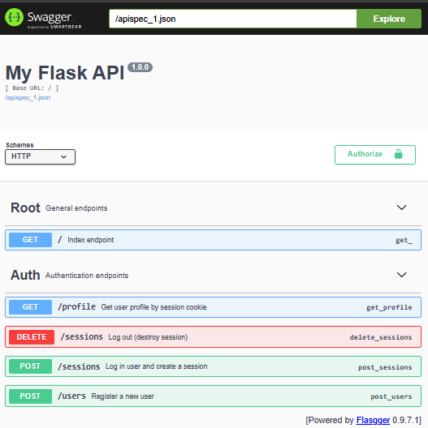
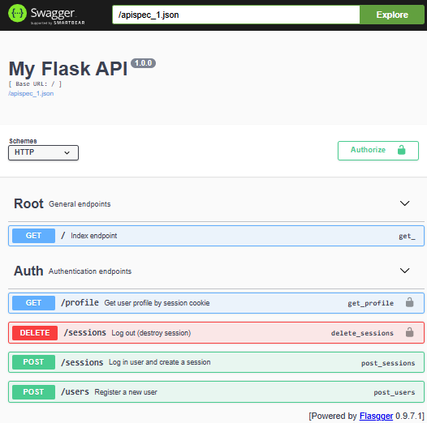
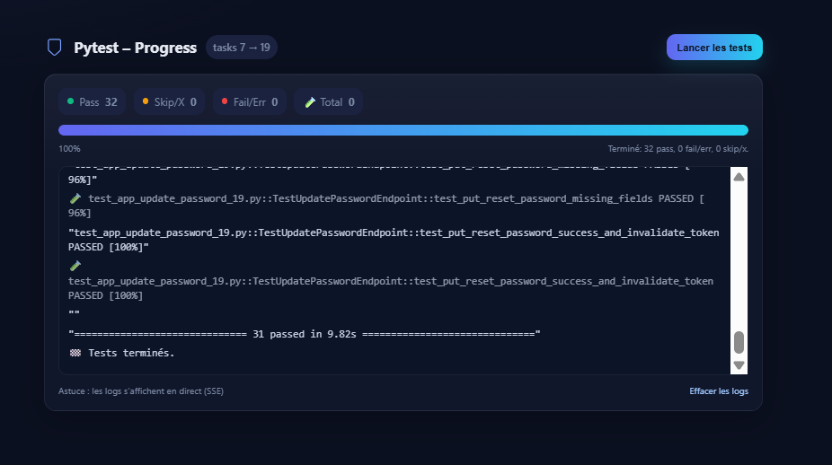
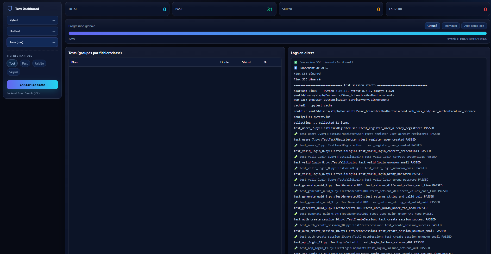
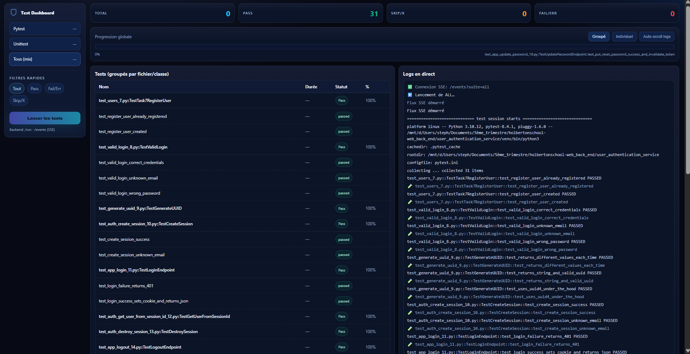
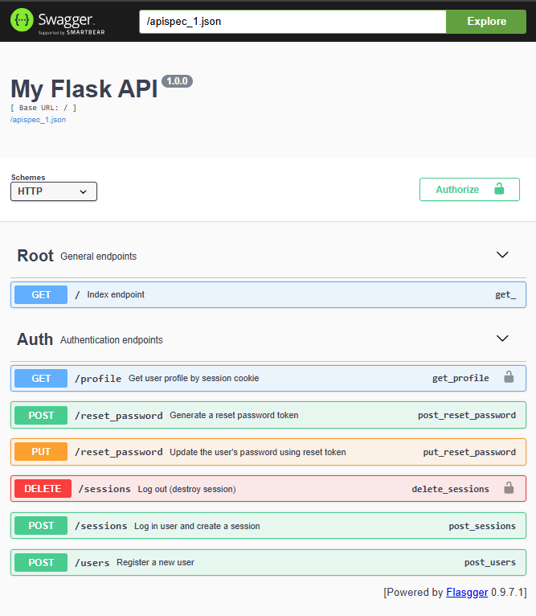

user_authentication_service

```python
python3 -m venv venv
```

```python
pip3 install bcrypt
pip3 install sqlalchemy

```

```bash
source venv/bin/activate
pip install -r requirements.txt

pip install sqlalchemy bcrypt
deactivate
```

Task0
user.py
```python
#!/usr/bin/env python3
"""
This module defines the User model for authentication.
"""
from sqlalchemy.ext.declarative import declarative_base
from sqlalchemy import Column, Integer, String

Base = declarative_base()


class User(Base):
    """
    SQLAlchemy model for the users table.
    """
    __tablename__ = 'users'

    id: int = Column(Integer, primary_key=True)
    email: str = Column(String(250), nullable=False)
    hashed_password: str = Column(String(250), nullable=False)
    session_id: str = Column(String(250), nullable=True)
    reset_token: str = Column(String(250), nullable=True)
```

main.py
```python
#!/usr/bin/env python3
"""
Main file
"""
from user import User

print(User.__tablename__)

for column in User.__table__.columns:
    print("{}: {}".format(column, column.type))
```


```bash
(venv) root@UID7E:/mnt/d/Users/steph/Documents/5ème_trimestre/holbe
rtonschool-web_back_end/user_authentication_service# python3 main.py
users
users.id: INTEGER
users.email: VARCHAR(250)
users.hashed_password: VARCHAR(250)
users.session_id: VARCHAR(250)
users.reset_token: VARCHAR(250)
```

Task1
db.py
```python
#!/usr/bin/env python3
"""DB module
"""
from sqlalchemy import create_engine
from sqlalchemy.ext.declarative import declarative_base
from sqlalchemy.orm import sessionmaker
from sqlalchemy.orm.session import Session

from user import Base, User  # 👈 N'oublie pas d'importer User


class DB:
    """DB class
    """

    def __init__(self) -> None:
        """Initialize a new DB instance
        """
        self._engine = create_engine("sqlite:///a.db", echo=True)
        Base.metadata.drop_all(self._engine)
        Base.metadata.create_all(self._engine)
        self.__session = None

    @property
    def _session(self) -> Session:
        """Memoized session object
        """
        if self.__session is None:
            DBSession = sessionmaker(bind=self._engine)
            self.__session = DBSession()
        return self.__session

    def add_user(self, email: str, hashed_password: str) -> User:
        """Add a new user to the database and return the User object."""
        user = User(email=email, hashed_password=hashed_password)
        self._session.add(user)
        self._session.commit()
        return user
```

main.py
```python
#!/usr/bin/env python3
"""
Main file
"""

from db import DB
from user import User

my_db = DB()

user_1 = my_db.add_user("test@test.com", "SuperHashedPwd")
print(user_1.id)

user_2 = my_db.add_user("test1@test.com", "SuperHashedPwd1")
print(user_2.id)
```

```bash
(venv) root@UID7E:/mnt/d/Users/steph/Documents/5ème_trimestre/holbe
rtonschool-web_back_end/user_authentication_service# python3 main.py
2025-08-07 15:45:01,878 INFO sqlalchemy.engine.Engine BEGIN (implicit)
2025-08-07 15:45:01,879 INFO sqlalchemy.engine.Engine PRAGMA main.table_info("users")
2025-08-07 15:45:01,879 INFO sqlalchemy.engine.Engine [raw sql] ()
2025-08-07 15:45:01,885 INFO sqlalchemy.engine.Engine PRAGMA temp.table_info("users")
2025-08-07 15:45:01,885 INFO sqlalchemy.engine.Engine [raw sql] ()
2025-08-07 15:45:01,886 INFO sqlalchemy.engine.Engine COMMIT
2025-08-07 15:45:01,886 INFO sqlalchemy.engine.Engine BEGIN (implicit)
2025-08-07 15:45:01,886 INFO sqlalchemy.engine.Engine PRAGMA main.table_info("users")
2025-08-07 15:45:01,886 INFO sqlalchemy.engine.Engine [raw sql] ()
2025-08-07 15:45:01,890 INFO sqlalchemy.engine.Engine PRAGMA temp.table_info("users")
2025-08-07 15:45:01,890 INFO sqlalchemy.engine.Engine [raw sql] ()
2025-08-07 15:45:01,891 INFO sqlalchemy.engine.Engine
CREATE TABLE users (
        id INTEGER NOT NULL,
        email VARCHAR(250) NOT NULL,
        hashed_password VARCHAR(250) NOT NULL,
        session_id VARCHAR(250),
        reset_token VARCHAR(250),
        PRIMARY KEY (id)
)


2025-08-07 15:45:01,892 INFO sqlalchemy.engine.Engine [no key 0.00028s] ()
2025-08-07 15:45:01,923 INFO sqlalchemy.engine.Engine COMMIT
2025-08-07 15:45:01,928 INFO sqlalchemy.engine.Engine BEGIN (implicit)
2025-08-07 15:45:01,930 INFO sqlalchemy.engine.Engine INSERT INTO users (email, hashed_password, session_id, reset_token) VALUES (?, ?, ?, ?)
2025-08-07 15:45:01,931 INFO sqlalchemy.engine.Engine [generated in 0.00039s] ('test@test.com', 'SuperHashedPwd', None, None)
2025-08-07 15:45:01,940 INFO sqlalchemy.engine.Engine COMMIT
2025-08-07 15:45:01,957 INFO sqlalchemy.engine.Engine BEGIN (implicit)
2025-08-07 15:45:01,961 INFO sqlalchemy.engine.Engine SELECT users.id AS users_id, users.email AS users_email, users.hashed_password AS users_hashed_password, users.session_id AS users_session_id, users.reset_token AS users_reset_token
FROM users
WHERE users.id = ?
2025-08-07 15:45:01,961 INFO sqlalchemy.engine.Engine [generated in 0.00042s] (1,)
1
2025-08-07 15:45:01,965 INFO sqlalchemy.engine.Engine INSERT INTO users (email, hashed_password, session_id, reset_token) VALUES (?, ?, ?, ?)
2025-08-07 15:45:01,965 INFO sqlalchemy.engine.Engine [cached since 0.0352s ago] ('test1@test.com', 'SuperHashedPwd1', None, None)
2025-08-07 15:45:01,975 INFO sqlalchemy.engine.Engine COMMIT
2025-08-07 15:45:01,991 INFO sqlalchemy.engine.Engine BEGIN (implicit)
2025-08-07 15:45:01,991 INFO sqlalchemy.engine.Engine SELECT users.id AS users_id, users.email AS users_email, users.hashed_password AS users_hashed_password, users.session_id AS users_session_id, users.reset_token AS users_reset_token
FROM users
WHERE users.id = ?
2025-08-07 15:45:01,992 INFO sqlalchemy.engine.Engine [cached since 0.03122s ago] (2,)
2
```

db.py
```python
#!/usr/bin/env python3
"""DB module
"""
from sqlalchemy import create_engine
from sqlalchemy.ext.declarative import declarative_base
from sqlalchemy.orm import sessionmaker
from sqlalchemy.orm.session import Session

from user import Base, User  # 👈 N'oublie pas d'importer User


class DB:
    """DB class
    """

    def __init__(self) -> None:
        """Initialize a new DB instance
        """
        self._engine = create_engine("sqlite:///a.db", echo=False)
        Base.metadata.drop_all(self._engine)
        Base.metadata.create_all(self._engine)
        self.__session = None

    @property
    def _session(self) -> Session:
        """Memoized session object
        """
        if self.__session is None:
            DBSession = sessionmaker(bind=self._engine)
            self.__session = DBSession()
        return self.__session

    def add_user(self, email: str, hashed_password: str) -> User:
        """Add a new user to the database and return the User object."""
        user = User(email=email, hashed_password=hashed_password)
        self._session.add(user)
        self._session.commit()
        return user
```

main.py
```python
#!/usr/bin/env python3
"""
Main file
"""

from db import DB
from user import User

my_db = DB()

user_1 = my_db.add_user("test@test.com", "SuperHashedPwd")
print(user_1.id)

user_2 = my_db.add_user("test1@test.com", "SuperHashedPwd1")
print(user_2.id)
```

```bash
(venv) root@UID7E:/mnt/d/Users/steph/Documents/5ème_trimestre/holbe
rtonschool-web_back_end/user_authentication_service# python3 main.py
1
2
(venv) root@UID7E:/mnt/d/Users/steph/Documents/5ème_trimestre/holbe
rtonschool-web_back_end/user_authentication_service#
```

Task2
db.py
```python
#!/usr/bin/env python3
"""DB module
"""
from sqlalchemy import create_engine
from sqlalchemy.ext.declarative import declarative_base
from sqlalchemy.orm import sessionmaker
from sqlalchemy.orm.session import Session
from sqlalchemy.orm.exc import NoResultFound  # ✅ CORRECT
from sqlalchemy.exc import InvalidRequestError  # ✅ Déjà utilisé


from user import Base, User  # 👈 N'oublie pas d'importer User


class DB:
    """DB class
    """

    def __init__(self) -> None:
        """Initialize a new DB instance
        """
        self._engine = create_engine("sqlite:///a.db", echo=False)
        Base.metadata.drop_all(self._engine)
        Base.metadata.create_all(self._engine)
        self.__session = None

    @property
    def _session(self) -> Session:
        """Memoized session object
        """
        if self.__session is None:
            DBSession = sessionmaker(bind=self._engine)
            self.__session = DBSession()
        return self.__session

    def add_user(self, email: str, hashed_password: str) -> User:
        """Add a new user to the database and return the User object."""
        user = User(email=email, hashed_password=hashed_password)
        self._session.add(user)
        self._session.commit()
        return user

    def find_user_by(self, **kwargs) -> User:
        """Find the first user matching the given filters.

        Args:
            **kwargs: fields to filter by.

        Returns:
            User: the user found.

        Raises:
            NoResultFound: if no user matches.
            InvalidRequestError: if an invalid field is provided.
        """
        if not kwargs:
            raise InvalidRequestError

        try:
            user = self._session.query(User).filter_by(**kwargs).first()
        except Exception as e:
            raise InvalidRequestError from e

        if user is None:
            raise NoResultFound

        return user
```

main.py
```python
#!/usr/bin/env python3
"""
Main file
"""
from db import DB
from user import User

from sqlalchemy.exc import InvalidRequestError
from sqlalchemy.orm.exc import NoResultFound


my_db = DB()

user = my_db.add_user("test@test.com", "PwdHashed")
print(user.id)

find_user = my_db.find_user_by(email="test@test.com")
print(find_user.id)

try:
    find_user = my_db.find_user_by(email="test2@test.com")
    print(find_user.id)
except NoResultFound:
    print("Not found")

try:
    find_user = my_db.find_user_by(no_email="test@test.com")
    print(find_user.id)
except InvalidRequestError:
    print("Invalid")
```

```bash
(venv) root@UID7E:/mnt/d/Users/steph/Documents/5ème_trimestre/holbe
rtonschool-web_back_end/user_authentication_service# python3 main.py
1
1
Not found
Invalid
(venv) root@UID7E:/mnt/d/Users/steph/Documents/5ème_trimestre/holbe
rtonschool-web_back_end/user_authentication_service#
```

Task3
db.py
```python
#!/usr/bin/env python3
"""DB module
"""
from sqlalchemy import create_engine
from sqlalchemy.ext.declarative import declarative_base
from sqlalchemy.orm import sessionmaker
from sqlalchemy.orm.session import Session
from sqlalchemy.orm.exc import NoResultFound  # ✅ CORRECT
from sqlalchemy.exc import InvalidRequestError  # ✅ Déjà utilisé


from user import Base, User  # 👈 N'oublie pas d'importer User


class DB:
    """DB class
    """

    def __init__(self) -> None:
        """Initialize a new DB instance
        """
        self._engine = create_engine("sqlite:///a.db", echo=False)
        Base.metadata.drop_all(self._engine)
        Base.metadata.create_all(self._engine)
        self.__session = None

    @property
    def _session(self) -> Session:
        """Memoized session object
        """
        if self.__session is None:
            DBSession = sessionmaker(bind=self._engine)
            self.__session = DBSession()
        return self.__session

    def add_user(self, email: str, hashed_password: str) -> User:
        """Add a new user to the database and return the User object."""
        user = User(email=email, hashed_password=hashed_password)
        self._session.add(user)
        self._session.commit()
        return user

    def find_user_by(self, **kwargs) -> User:
        """Find the first user matching the given filters.

        Args:
            **kwargs: fields to filter by.

        Returns:
            User: the user found.

        Raises:
            NoResultFound: if no user matches.
            InvalidRequestError: if an invalid field is provided.
        """
        if not kwargs:
            raise InvalidRequestError

        try:
            user = self._session.query(User).filter_by(**kwargs).first()
        except Exception as e:
            raise InvalidRequestError from e

        if user is None:
            raise NoResultFound

        return user

    def update_user(self, user_id: int, **kwargs) -> None:
        """Met à jour un utilisateur puis commit.
        Lève ValueError si un champ est invalide.
        """
        # récupère l'utilisateur (lèvera NoResultFound si introuvable)
        user = self.find_user_by(id=user_id)

        # applique les mises à jour demandées
        for field, value in kwargs.items():
            if not hasattr(user, field):
                raise ValueError(f"Invalid field: {field}")
            setattr(user, field, value)

        # enregistre en base
        self._session.commit()
```

main.py
```python
#!/usr/bin/env python3
"""
Main file
"""
from db import DB
from user import User

from sqlalchemy.exc import InvalidRequestError
from sqlalchemy.orm.exc import NoResultFound


my_db = DB()

email = 'test@test.com'
hashed_password = "hashedPwd"

user = my_db.add_user(email, hashed_password)
print(user.id)

try:
    my_db.update_user(user.id, hashed_password='NewPwd')
    print("Password updated")
except ValueError:
    print("Error")
```

```bash
(venv) root@UID7E:/mnt/d/Users/steph/Documents/5ème_trimestre/holbe
rtonschool-web_back_end/user_authentication_service# python3 main.py
1
Password updated
(venv) root@UID7E:/mnt/d/Users/steph/Documents/5ème_trimestre/holbe
rtonschool-web_back_end/user_authentication_service#
```

Task4
auth.py
```python
#!/usr/bin/env python3
"""Auth module
"""
import bcrypt


def _hash_password(password: str) -> bytes:
    """Retourne un hash bcrypt (bytes) du mot de passe fourni."""
    return bcrypt.hashpw(password.encode('utf-8'), bcrypt.gensalt())

```

main.py
```python
#!/usr/bin/env python3
"""
Main file
"""
from auth import _hash_password

print(_hash_password("Hello Holberton"))
```

```bash
(venv) root@UID7E:/mnt/d/Users/steph/Documents/5ème_trimestre/holbe
rtonschool-web_back_end/user_authentication_service# python3 main.py
b'$2b$12$DyuwYcoqvO5c9D9V8rmFS.IYKIuQtuaWgJwhsBZIWmJEbM/2l.Lti'
(venv) root@UID7E:/mnt/d/Users/steph/Documents/5ème_trimestre/holbe
rtonschool-web_back_end/user_authentication_service#
```

Task5
auth.py
```python
#!/usr/bin/env python3
"""Auth module: enregistrement et gestion des utilisateurs."""
from typing import Optional
import bcrypt
from sqlalchemy.orm.exc import NoResultFound

from db import DB
from user import User


def _hash_password(password: str) -> bytes:
    """Retourne un hash bcrypt (bytes) du mot de passe fourni."""
    return bcrypt.hashpw(password.encode('utf-8'), bcrypt.gensalt())


class Auth:
    """Auth class to interact with the authentication database."""

    def __init__(self) -> None:
        self._db = DB()

    def register_user(self, email: str, password: str) -> User:
        """Crée un nouvel utilisateur si l'email n'existe pas.

        - Si l'utilisateur existe déjà: lève ValueError("User <email> already
        exists")
        - Sinon: hash le mot de passe, crée l'utilisateur et le retourne.
        """
        try:
            # S'il existe déjà, find_user_by ne lèvera pas d'exception
            self._db.find_user_by(email=email)
        except NoResultFound:
            hashed = _hash_password(password)
            # On enregistre en base sous forme de str (bcrypt renvoie des bytes
            return self._db.add_user(email, hashed.decode("utf-8"))

        # Si on arrive ici, un user existe déjà
        raise ValueError(f"User {email} already exists")

```

main.py
```python
#!/usr/bin/env python3
"""
Main file
"""
from auth import _hash_password

print(_hash_password("Hello Holberton"))
```

```bash
(venv) root@UID7E:/mnt/d/Users/steph/Documents/5ème_trimestre/holbe
rtonschool-web_back_end/user_authentication_service# python3 main.py
successfully created a new user!
could not create a new user: User me@me.com already exists
(venv) root@UID7E:/mnt/d/Users/steph/Documents/5ème_trimestre/holbe
rtonschool-web_back_end/user_authentication_service#
```


Task6

```python
pip install flask
python3 app.py
```

app.py
```python
#!/usr/bin/env python3
"""Basic Flask app"""
from flask import Flask, jsonify

app = Flask(__name__)


@app.route("/", methods=["GET"])
def index():
    """GET / route - retourne un message JSON"""
    return jsonify({"message": "Bienvenue"})


if __name__ == "__main__":
    app.run(host="0.0.0.0", port="5000")
```

```bash
(venv) root@UID7E:/mnt/d/Users/steph/Documents/5ème_trimestre/holbe
rtonschool-web_back_end/user_authentication_service# python3 app.py
 * Serving Flask app 'app'
 * Debug mode: off
WARNING: This is a development server. Do not use it in a production deployment. Use a production WSGI server instead.
 * Running on all addresses (0.0.0.0)
 * Running on http://127.0.0.1:5000
 * Running on http://172.18.71.179:5000
Press CTRL+C to quit
```

app.py
```python
#!/usr/bin/env python3
"""Basic Flask app"""
from flask import Flask, jsonify
from flasgger import Swagger

app = Flask(__name__)

# (Optionnel) Métadonnées OpenAPI
swagger = Swagger(app, template={
    "swagger": "2.0",
    "info": {
        "title": "My Flask API",
        "description": "Simple API with Swagger UI (Flasgger)",
        "version": "1.0.0"
    },
    "basePath": "/",
    "schemes": ["http"]
})


@app.route("/", methods=["GET"])
def index():
    """
    Index endpoint
    ---
    tags:
      - Root
    summary: Welcome message
    description: Returns a JSON message welcoming the user to the API.
    produces:
      - application/json
    responses:
      200:
        description: A welcome message
        schema:
          type: object
          properties:
            message:
              type: string
              example: Bienvenue
    """
    # """GET / route - retourne un message JSON"""
    return jsonify({"message": "Bienvenue"})


if __name__ == "__main__":
    app.run(host="0.0.0.0", port="5000")
```


```bash
((venv) root@UID7E:/mnt/d/Users/steph/Documents/5ème_trimestre/holbe
rtonschool-web_back_end/user_authentication_service# python3 app.py
 * Serving Flask app 'app'
 * Debug mode: off
WARNING: This is a development server. Do not use it in a production deployment. Use a production WSGI server instead.
 * Running on all addresses (0.0.0.0)
 * Running on http://127.0.0.1:5000
 * Running on http://172.18.71.179:5000
Press CTRL+C to quit
127.0.0.1 - - [08/Aug/2025 11:22:39] "GET /apidocs/ HTTP/1.1" 200 -
127.0.0.1 - - [08/Aug/2025 11:22:39] "GET /flasgger_static/swagger-ui.css HTTP/1.1" 200 -
127.0.0.1 - - [08/Aug/2025 11:22:39] "GET /flasgger_static/swagger-ui-standalone-preset.js HTTP/1.1" 200 -
127.0.0.1 - - [08/Aug/2025 11:22:39] "GET /flasgger_static/swagger-ui-bundle.js HTTP/1.1" 200 -
127.0.0.1 - - [08/Aug/2025 11:22:40] "GET /flasgger_static/lib/jquery.min.js HTTP/1.1" 200 -
127.0.0.1 - - [08/Aug/2025 11:22:40] "GET /apispec_1.json HTTP/1.1" 200 -
127.0.0.1 - - [08/Aug/2025 11:22:40] "GET /flasgger_static/favicon-32x32.png HTTP/1.1" 200 -
127.0.0.1 - - [08/Aug/2025 11:22:49] "GET / HTTP/1.1" 200 -
```


Task7
app.py
```python
#!/usr/bin/env python3
"""Basic Flask app"""
from flask import Flask, jsonify, request
from flasgger import Swagger
from auth import Auth

app = Flask(__name__)
AUTH = Auth()

# (Optionnel) Métadonnées OpenAPI
swagger = Swagger(app, template={
    "swagger": "2.0",
    "info": {
        "title": "My Flask API",
        "description": "Simple API with Swagger UI (Flasgger)",
        "version": "1.0.0"
    },
    "basePath": "/",
    "schemes": ["http"]
})


@app.route("/", methods=["GET"])
def index():
    """
    Index endpoint
    ---
    tags:
      - Root
    summary: Welcome message
    description: Returns a JSON message welcoming the user to the API.
    produces:
      - application/json
    responses:
      200:
        description: A welcome message
        schema:
          type: object
          properties:
            message:
              type: string
              example: Bienvenue
    """
    # """GET / route - retourne un message JSON"""
    return jsonify({"message": "Bienvenue"})


@app.route("/users", methods=["POST"])
def users():
    """
    Register a new user
    ---
    tags: [Auth]
    consumes:
      - application/x-www-form-urlencoded
    parameters:
      - in: formData
        name: email
        type: string
        required: true
        description: User email
      - in: formData
        name: password
        type: string
        required: true
        description: User password
    responses:
      200:
        description: User created
        schema:
          type: object
          properties:
            email: {type: string, example: bob@me.com}
            message: {type: string, example: user created}
      400:
        description: Email already registered or missing fields
        schema:
          type: object
          properties:
            message: {type: string, example: email already registered}
    """
    email = request.form.get("email")
    password = request.form.get("password")

    try:
        user = AUTH.register_user(email, password)
        return jsonify({"email": email, "message": "user created"})
    except ValueError:
        return jsonify({"message": "email already registered"}), 400


if __name__ == "__main__":
    app.run(host="0.0.0.0", port="5000")
```

```bash
root@UID7E:/mnt/d/Users/steph/Documents/5ème_trimestre/holbe
rtonschool-web_back_end/user_authentication_service# python3 app.py
 * Serving Flask app 'app'
 * Debug mode: off
WARNING: This is a development server. Do not use it in a production deployment. Use a production WSGI server instead.
 * Running on all addresses (0.0.0.0)
 * Running on http://127.0.0.1:5000
 * Running on http://172.18.71.179:5000
Press CTRL+C to quit
127.0.0.1 - - [08/Aug/2025 13:32:20] "GET /apidocs/ HTTP/1.1" 200 -
127.0.0.1 - - [08/Aug/2025 13:32:20] "GET /flasgger_static/swagger-ui.css HTTP/1.1" 304 -
127.0.0.1 - - [08/Aug/2025 13:32:20] "GET /flasgger_static/swagger-ui-bundle.js HTTP/1.1" 304 -
127.0.0.1 - - [08/Aug/2025 13:32:20] "GET /flasgger_static/swagger-ui-standalone-preset.js HTTP/1.1" 304 -
127.0.0.1 - - [08/Aug/2025 13:32:20] "GET /flasgger_static/lib/jquery.min.js HTTP/1.1" 304 -
127.0.0.1 - - [08/Aug/2025 13:32:21] "GET /apispec_1.json HTTP/1.1" 200 -
127.0.0.1 - - [08/Aug/2025 13:32:21] "GET /flasgger_static/favicon-32x32.png HTTP/1.1" 304 -
```

```bash
(venv) root@UID7E:/mnt/d/Users/steph/Documents/5ème_trimestre/holbe
rtonschool-web_back_end/user_authentication_service# curl -XPOST localhost:5000/users -d 'email=bob@me.com' -d 'password=mySuperPwd' -v
Note: Unnecessary use of -X or --request, POST is already inferred.
*   Trying 127.0.0.1:5000...
* Connected to localhost (127.0.0.1) port 5000 (#0)
> POST /users HTTP/1.1
> Host: localhost:5000
> User-Agent: curl/7.81.0
> Accept: */*
> Content-Length: 36
> Content-Type: application/x-www-form-urlencoded
>
* Mark bundle as not supporting multiuse
< HTTP/1.1 200 OK
< Server: Werkzeug/3.1.3 Python/3.10.12
< Date: Fri, 08 Aug 2025 11:36:36 GMT
< Content-Type: application/json
< Content-Length: 48
< Connection: close
<
{"email":"bob@me.com","message":"user created"}
* Closing connection 0
(venv) root@UID7E:/mnt/d/Users/steph/Documents/5ème_trimestre/holbe
rtonschool-web_back_end/user_authentication_service# curl -XPOST localhost:5000/users -d 'email=bob@me.com' -d 'password=mySuperPwd' -v
Note: Unnecessary use of -X or --request, POST is already inferred.
*   Trying 127.0.0.1:5000...
* Connected to localhost (127.0.0.1) port 5000 (#0)
> POST /users HTTP/1.1
> Host: localhost:5000
> User-Agent: curl/7.81.0
> Accept: */*
> Content-Length: 36
> Content-Type: application/x-www-form-urlencoded
>
* Mark bundle as not supporting multiuse
< HTTP/1.1 400 BAD REQUEST
< Server: Werkzeug/3.1.3 Python/3.10.12
< Date: Fri, 08 Aug 2025 11:36:39 GMT
< Content-Type: application/json
< Content-Length: 39
< Connection: close
<
{"message":"email already registered"}
* Closing connection 0
(venv) root@UID7E:/mnt/d/Users/steph/Documents/5ème_trimestre/holbe
rtonschool-web_back_end/user_authentication_service#
```

Task8
auth.py
```python
#!/usr/bin/env python3
"""Auth module: enregistrement et gestion des utilisateurs."""
from typing import Optional
import bcrypt
from sqlalchemy.orm.exc import NoResultFound

from db import DB
from user import User


def _hash_password(password: str) -> bytes:
    """Retourne un hash bcrypt (bytes) du mot de passe fourni."""
    return bcrypt.hashpw(password.encode('utf-8'), bcrypt.gensalt())


class Auth:
    """Auth class to interact with the authentication database."""

    def __init__(self) -> None:
        self._db = DB()

    def register_user(self, email: str, password: str) -> User:
        """Crée un nouvel utilisateur si l'email n'existe pas.

        - Si l'utilisateur existe déjà: lève ValueError("User <email> already
        exists")
        - Sinon: hash le mot de passe, crée l'utilisateur et le retourne.
        """
        try:
            # S'il existe déjà, find_user_by ne lèvera pas d'exception
            self._db.find_user_by(email=email)
        except NoResultFound:
            hashed = _hash_password(password)
            # On enregistre en base sous forme de str (bcrypt renvoie des bytes
            return self._db.add_user(email, hashed.decode("utf-8"))

        # Si on arrive ici, un user existe déjà
        raise ValueError(f"User {email} already exists")

    def valid_login(self, email: str, password: str) -> bool:
        """Valide les identifiants d'un utilisateur."""
        try:
            user = self._db.find_user_by(email=email)
        except NoResultFound:
            return False

        if user.hashed_password is None:
            return False

        # bcrypt.checkpw attend les deux valeurs en bytes
        return bcrypt.checkpw(
            password.encode('utf-8'),
            user.hashed_password.encode('utf-8')
        )
```

main.py
```python
#!/usr/bin/env python3
"""
Main file
"""
from auth import Auth

email = 'bob@bob.com'
password = 'MyPwdOfBob'
auth = Auth()

auth.register_user(email, password)

print(auth.valid_login(email, password))

print(auth.valid_login(email, "WrongPwd"))

print(auth.valid_login("unknown@email", password))

```

```bash
(venv) root@UID7E:/mnt/d/Users/steph/Documents/5ème_trimestre/holbe
rtonschool-web_back_end/user_authentication_service# python3 main.py
True
False
False
```

Task9
auth.py
```python
#!/usr/bin/env python3
"""Auth module: enregistrement et gestion des utilisateurs."""
from typing import Optional
import bcrypt
import uuid  # ✅ Ajout de l'import pour Task 9
from sqlalchemy.orm.exc import NoResultFound

from db import DB
from user import User


def _hash_password(password: str) -> bytes:
    """Retourne un hash bcrypt (bytes) du mot de passe fourni."""
    return bcrypt.hashpw(password.encode('utf-8'), bcrypt.gensalt())


def _generate_uuid() -> str:
    """Génère et retourne un UUID4 en chaîne de caractères."""
    return str(uuid.uuid4())


class Auth:
    """Auth class to interact with the authentication database."""

    def __init__(self) -> None:
        self._db = DB()

    def register_user(self, email: str, password: str) -> User:
        """Crée un nouvel utilisateur si l'email n'existe pas.

        - Si l'utilisateur existe déjà: lève ValueError("User <email> already
        exists")
        - Sinon: hash le mot de passe, crée l'utilisateur et le retourne.
        """
        try:
            # S'il existe déjà, find_user_by ne lèvera pas d'exception
            self._db.find_user_by(email=email)
        except NoResultFound:
            hashed = _hash_password(password)
            # On enregistre en base sous forme de str (bcrypt renvoie des bytes
            return self._db.add_user(email, hashed.decode("utf-8"))

        # Si on arrive ici, un user existe déjà
        raise ValueError(f"User {email} already exists")

    def valid_login(self, email: str, password: str) -> bool:
        """Valide les identifiants d'un utilisateur."""
        try:
            user = self._db.find_user_by(email=email)
        except NoResultFound:
            return False

        if user.hashed_password is None:
            return False

        # bcrypt.checkpw attend les deux valeurs en bytes
        return bcrypt.checkpw(
            password.encode('utf-8'),
            user.hashed_password.encode('utf-8')
        )
```


```bash

```

Task10
auth.py
```python
#!/usr/bin/env python3
"""Auth module: enregistrement et gestion des utilisateurs."""
from typing import Optional
import bcrypt
from sqlalchemy.orm.exc import NoResultFound
import uuid  # ✅ Ajout de l'import pour Task 9

from db import DB
from user import User


def _hash_password(password: str) -> bytes:
    """Retourne un hash bcrypt (bytes) du mot de passe fourni."""
    return bcrypt.hashpw(password.encode('utf-8'), bcrypt.gensalt())


def _generate_uuid() -> str:
    """Génère et retourne un UUID4 en chaîne de caractères."""
    return str(uuid.uuid4())


class Auth:
    """Auth class to interact with the authentication database."""

    def __init__(self) -> None:
        self._db = DB()

    def register_user(self, email: str, password: str) -> User:
        """Crée un nouvel utilisateur si l'email n'existe pas.

        - Si l'utilisateur existe déjà: lève ValueError("User <email> already
        exists")
        - Sinon: hash le mot de passe, crée l'utilisateur et le retourne.
        """
        try:
            # S'il existe déjà, find_user_by ne lèvera pas d'exception
            self._db.find_user_by(email=email)
        except NoResultFound:
            hashed = _hash_password(password)
            # On enregistre en base sous forme de str (bcrypt renvoie des bytes
            return self._db.add_user(email, hashed.decode("utf-8"))

        # Si on arrive ici, un user existe déjà
        raise ValueError(f"User {email} already exists")

    def valid_login(self, email: str, password: str) -> bool:
        """Valide les identifiants d'un utilisateur."""
        try:
            user = self._db.find_user_by(email=email)
        except NoResultFound:
            return False

        if user.hashed_password is None:
            return False

        # bcrypt.checkpw attend les deux valeurs en bytes
        return bcrypt.checkpw(
            password.encode('utf-8'),
            user.hashed_password.encode('utf-8')
        )

    def create_session(self, email: str) -> Optional[str]:
        """Create a session for the user and return the session_id.
        Returns None if the email is unknown.
        """
        try:
            user = self._db.find_user_by(email=email)
        except NoResultFound:
            return None

        session_id = _generate_uuid()
        self._db.update_user(user.id, session_id=session_id)
        return session_id

```

main.py
```python
#!/usr/bin/env python3
"""
Main file
"""
from auth import Auth

email = 'bob@bob.com'
password = 'MyPwdOfBob'
auth = Auth()

auth.register_user(email, password)

print(auth.create_session(email))
print(auth.create_session("unknown@email.com"))
```

```bash
(venv) root@UID7E:/mnt/d/Users/steph/Documents/5ème_trimestre/holbe
rtonschool-web_back_end/user_authentication_service# python3 main.py
4a6350d6-9c9f-492c-a13d-ded1ea4ce603
None
(venv) root@UID7E:/mnt/d/Users/steph/Documents/5ème_trimestre/hol
bertonschool-web_back_end/user_authentication_service# python3 main.py
7ec258e2-67a1-498e-ac4f-fc81228a985d
None
(venv) root@UID7E:/mnt/d/Users/steph/Documents/5ème_trimestre/hol
bertonschool-web_back_end/user_authentication_service#
```

Task11
app.py
```python
#!/usr/bin/env python3
"""Basic Flask app"""
from flask import Flask, jsonify, request, abort
from flasgger import Swagger
from auth import Auth

app = Flask(__name__)
AUTH = Auth()

# (Optionnel) Métadonnées OpenAPI
swagger = Swagger(app, template={
    "swagger": "2.0",
    "info": {
        "title": "My Flask API",
        "description": "Simple API with Swagger UI (Flasgger)",
        "version": "1.0.0"
    },
    "basePath": "/",
    "schemes": ["http"]
})


@app.route("/", methods=["GET"])
def index():
    """
    Index endpoint
    ---
    tags:
      - Root
    summary: Welcome message
    description: Returns a JSON message welcoming the user to the API.
    produces:
      - application/json
    responses:
      200:
        description: A welcome message
        schema:
          type: object
          properties:
            message:
              type: string
              example: Bienvenue
    """
    # """GET / route - retourne un message JSON"""
    return jsonify({"message": "Bienvenue"})


@app.route("/users", methods=["POST"])
def users():
    """
    Register a new user
    ---
    tags: [Auth]
    consumes:
      - application/x-www-form-urlencoded
    parameters:
      - in: formData
        name: email
        type: string
        required: true
        description: User email
      - in: formData
        name: password
        type: string
        required: true
        description: User password
    responses:
      200:
        description: User created
        schema:
          type: object
          properties:
            email: {type: string, example: bob@me.com}
            message: {type: string, example: user created}
      400:
        description: Email already registered or missing fields
        schema:
          type: object
          properties:
            message: {type: string, example: email already registered}
    """
    email = request.form.get("email")
    password = request.form.get("password")

    try:
        user = AUTH.register_user(email, password)
        return jsonify({"email": email, "message": "user created"})
    except ValueError:
        return jsonify({"message": "email already registered"}), 400

@app.route("/sessions", methods=["POST"])
def login():
    """
    Log in user and create a session
    ---
    tags:
      - Auth
    consumes:
      - application/x-www-form-urlencoded
    parameters:
      - in: formData
        name: email
        type: string
        required: true
        description: User email
      - in: formData
        name: password
        type: string
        required: true
        description: User password
    responses:
      200:
        description: Login successful, session created
        schema:
          type: object
          properties:
            email:
              type: string
              example: bob@bob.com
            message:
              type: string
              example: logged in
        headers:
          Set-Cookie:
            description: Session cookie
            type: string
            example: session_id=163fe508-19a2-48ed-a7c8-d9c6e56fabd1; Path=/
      401:
        description: Unauthorized (invalid credentials)
    """
    email = request.form.get("email")
    password = request.form.get("password")

    if not email or not password or not AUTH.valid_login(email, password):
        abort(401)

    session_id = AUTH.create_session(email)
    if session_id is None:
        abort(401)

    resp = jsonify({"email": email, "message": "logged in"})
    resp.set_cookie("session_id", session_id, path="/")
    return resp

if __name__ == "__main__":
    app.run(host="0.0.0.0", port="5000")
```


```bash
(venv) root@UID7E:/mnt/d/Users/steph/Documents/5ème_trimestre/hol
bertonschool-web_back_end/user_authentication_service# curl -XPOST localhost:5000/users -d 'email=bob@bob.com' -d 'password=mySuperPwd'
{"email":"bob@bob.com","message":"user created"}
(venv) root@UID7E:/mnt/d/Users/steph/Documents/5ème_trimestre/hol
bertonschool-web_back_end/user_authentication_service# curl -XPOST localhost:5000/sessions -d 'email=bob@bob.com' -d 'password=mySuperPwd' -v
Note: Unnecessary use of -X or --request, POST is already inferred.
*   Trying 127.0.0.1:5000...
* Connected to localhost (127.0.0.1) port 5000 (#0)
> POST /sessions HTTP/1.1
> Host: localhost:5000
> User-Agent: curl/7.81.0
> Accept: */*
> Content-Length: 37
> Content-Type: application/x-www-form-urlencoded
>
* Mark bundle as not supporting multiuse
< HTTP/1.1 200 OK
< Server: Werkzeug/3.1.3 Python/3.10.12
< Date: Fri, 08 Aug 2025 16:34:33 GMT
< Content-Type: application/json
< Content-Length: 46
< Set-Cookie: session_id=86657708-ff82-4ca3-8343-479069bddbb6; Path=/
< Connection: close
<
{"email":"bob@bob.com","message":"logged in"}
* Closing connection 0
(venv) root@UID7E:/mnt/d/Users/steph/Documents/5ème_trimestre/hol
bertonschool-web_back_end/user_authentication_service# curl -XPOST localhost:5000/sessions -d 'email=bob@bob.com' -d 'password=BlaBla' -v
Note: Unnecessary use of -X or --request, POST is already inferred.
*   Trying 127.0.0.1:5000...
* Connected to localhost (127.0.0.1) port 5000 (#0)
> POST /sessions HTTP/1.1
> Host: localhost:5000
> User-Agent: curl/7.81.0
> Accept: */*
> Content-Length: 33
> Content-Type: application/x-www-form-urlencoded
>
* Mark bundle as not supporting multiuse
< HTTP/1.1 401 UNAUTHORIZED
< Server: Werkzeug/3.1.3 Python/3.10.12
< Date: Fri, 08 Aug 2025 16:35:13 GMT
< Content-Type: text/html; charset=utf-8
< Content-Length: 317
< Connection: close
<
<!doctype html>
<html lang=en>
<title>401 Unauthorized</title>
<h1>Unauthorized</h1>
<p>The server could not verify that you are authorized to access the URL requested. You either supplied the wrong credentials (e.g. a bad password), or your browser doesn&#39;t understand how to supply the credentials required.</p>
* Closing connection 0
(venv) root@UID7E:/mnt/d/Users/steph/Documents/5ème_trimestre/hol
bertonschool-web_back_end/user_authentication_service#
```

???


Task12
auth.py
```python
#!/usr/bin/env python3
"""Auth module: enregistrement et gestion des utilisateurs."""
from typing import Optional
import bcrypt
from sqlalchemy.orm.exc import NoResultFound
import uuid  # ✅ Ajout de l'import pour Task 9

from db import DB
from user import User


def _hash_password(password: str) -> bytes:
    """Retourne un hash bcrypt (bytes) du mot de passe fourni."""
    return bcrypt.hashpw(password.encode('utf-8'), bcrypt.gensalt())


def _generate_uuid() -> str:
    """Génère et retourne un UUID4 en chaîne de caractères."""
    return str(uuid.uuid4())


class Auth:
    """Auth class to interact with the authentication database."""

    def __init__(self) -> None:
        self._db = DB()

    def register_user(self, email: str, password: str) -> User:
        """Crée un nouvel utilisateur si l'email n'existe pas.

        - Si l'utilisateur existe déjà: lève ValueError("User <email> already
        exists")
        - Sinon: hash le mot de passe, crée l'utilisateur et le retourne.
        """
        try:
            # S'il existe déjà, find_user_by ne lèvera pas d'exception
            self._db.find_user_by(email=email)
        except NoResultFound:
            hashed = _hash_password(password)
            # On enregistre en base sous forme de str (bcrypt renvoie des bytes
            return self._db.add_user(email, hashed.decode("utf-8"))

        # Si on arrive ici, un user existe déjà
        raise ValueError(f"User {email} already exists")

    def valid_login(self, email: str, password: str) -> bool:
        """Valide les identifiants d'un utilisateur."""
        try:
            user = self._db.find_user_by(email=email)
        except NoResultFound:
            return False

        if user.hashed_password is None:
            return False

        # bcrypt.checkpw attend les deux valeurs en bytes
        return bcrypt.checkpw(
            password.encode('utf-8'),
            user.hashed_password.encode('utf-8')
        )

    def create_session(self, email: str) -> Optional[str]:
        """Create a session for the user and return the session_id.
        Returns None if the email is unknown.
        """
        try:
            user = self._db.find_user_by(email=email)
        except NoResultFound:
            return None

        session_id = _generate_uuid()
        self._db.update_user(user.id, session_id=session_id)
        return session_id

    def get_user_from_session_id(
            self, session_id: Optional[str]) -> Optional[User]:
        """
        Récupère un utilisateur à partir de son session_id.

        Args:
            session_id (Optional[str]): ID de session de l'utilisateur

        Returns:
            Optional[User]: L'utilisateur correspondant ou None
        """
        if session_id is None:
            return None

        try:
            return self._db.find_user_by(session_id=session_id)
        except NoResultFound:
            return None
```

mon main12.py
```bash
#!/usr/bin/env python3
"""
Test get_user_from_session_id
"""
from auth import Auth

auth = Auth()

# Étape 1 : Créer un utilisateur
email = "bob@bob.com"
password = "MyPwdOfBob"
try:
    user = auth.register_user(email, password)
except ValueError:
    print("Utilisateur déjà créé")

# Étape 2 : Créer une session pour l'utilisateur
session_id = auth.create_session(email)
print(f"Session ID créé : {session_id}")

# Étape 3 : Tester avec un session_id valide
user_from_session = auth.get_user_from_session_id(session_id)
print(f"Utilisateur trouvé : {user_from_session.email if user_from_session else None}")

# Étape 4 : Tester avec un session_id inexistant
invalid_session = auth.get_user_from_session_id("1234-uuid-invalide")
print(f"Avec UUID invalide : {invalid_session}")

# Étape 5 : Tester avec None
none_session = auth.get_user_from_session_id(None)
print(f"Avec None : {none_session}")
```

```bash
(venv) root@UID7E:/mnt/d/Users/steph/Documents/5ème_trimestre/hol
bertonschool-web_back_end/user_authentication_service# python3 main.py
Session ID créé : 9e2e6c07-095e-4fec-88fa-ea548216c2de
Utilisateur trouvé : bob@bob.com
Avec UUID invalide : None
Avec None : None
```


Task13
auth.py
```python
#!/usr/bin/env python3
"""Auth module: enregistrement et gestion des utilisateurs."""
from typing import Optional
import bcrypt
from sqlalchemy.orm.exc import NoResultFound
import uuid  # ✅ Ajout de l'import pour Task 9

from db import DB
from user import User


def _hash_password(password: str) -> bytes:
    """Retourne un hash bcrypt (bytes) du mot de passe fourni."""
    return bcrypt.hashpw(password.encode('utf-8'), bcrypt.gensalt())


def _generate_uuid() -> str:
    """Génère et retourne un UUID4 en chaîne de caractères."""
    return str(uuid.uuid4())


class Auth:
    """Auth class to interact with the authentication database."""

    def __init__(self) -> None:
        self._db = DB()

    def register_user(self, email: str, password: str) -> User:
        """Crée un nouvel utilisateur si l'email n'existe pas.

        - Si l'utilisateur existe déjà: lève ValueError("User <email> already
        exists")
        - Sinon: hash le mot de passe, crée l'utilisateur et le retourne.
        """
        try:
            # S'il existe déjà, find_user_by ne lèvera pas d'exception
            self._db.find_user_by(email=email)
        except NoResultFound:
            hashed = _hash_password(password)
            # On enregistre en base sous forme de str (bcrypt renvoie des bytes
            return self._db.add_user(email, hashed.decode("utf-8"))

        # Si on arrive ici, un user existe déjà
        raise ValueError(f"User {email} already exists")

    def valid_login(self, email: str, password: str) -> bool:
        """Valide les identifiants d'un utilisateur."""
        try:
            user = self._db.find_user_by(email=email)
        except NoResultFound:
            return False

        if user.hashed_password is None:
            return False

        # bcrypt.checkpw attend les deux valeurs en bytes
        return bcrypt.checkpw(
            password.encode('utf-8'),
            user.hashed_password.encode('utf-8')
        )

    def create_session(self, email: str) -> Optional[str]:
        """Create a session for the user and return the session_id.
        Returns None if the email is unknown.
        """
        try:
            user = self._db.find_user_by(email=email)
        except NoResultFound:
            return None

        session_id = _generate_uuid()
        self._db.update_user(user.id, session_id=session_id)
        return session_id

    def get_user_from_session_id(
            self, session_id: Optional[str]) -> Optional[User]:
        """
        Récupère un utilisateur à partir de son session_id.

        Args:
            session_id (Optional[str]): ID de session de l'utilisateur

        Returns:
            Optional[User]: L'utilisateur correspondant ou None
        """
        if session_id is None:
            return None

        try:
            return self._db.find_user_by(session_id=session_id)
        except NoResultFound:
            return None

    def destroy_session(self, user_id: int) -> None:
        """
        Destroys the session for the given user ID by setting
        their session_id to None.
        Uses only public methods of self._db.

        Args:
            user_id (int): ID of the user whose session must be destroyed.

        Returns:
            None
        """
        if user_id is None:
            return None

        try:
            # Récupérer l'utilisateur avec l'ID donné
            user = self._db.find_user_by(id=user_id)
        except NoResultFound:
            return None

        # Mettre à jour le champ session_id à None
        self._db.update_user(user_id, session_id=None)

        return None

```

13_main.py
```python
#!/usr/bin/env python3
from auth import Auth
from sqlalchemy.orm.exc import NoResultFound

def safe_register(auth: Auth, email: str, password: str):
    try:
        auth.register_user(email, password)
        print(f"[OK] Registered {email}")
    except ValueError:
        print(f"[i] {email} already registered")

def main():
    auth = Auth()

    email = "bob@example.com"
    password = "correcthorsebatterystaple"

    # 1) Register (idempotent)
    safe_register(auth, email, password)

    # 2) Login -> create session
    if not auth.valid_login(email, password):
        print("[ERR] valid_login failed")
        return

    session_id = auth.create_session(email)
    print(f"[OK] session created: {session_id!r}")

    # 3) get_user_from_session_id works
    user = auth.get_user_from_session_id(session_id)
    if user is None:
        print("[ERR] get_user_from_session_id returned None")
        return
    print(f"[OK] user fetched by session: id={user.id}, email={user.email}")

    # 4) destroy_session(user.id)
    auth.destroy_session(user.id)
    print("[OK] destroy_session called")

    # 5) old session should no longer resolve to a user
    user_after = auth.get_user_from_session_id(session_id)
    if user_after is None:
        print("[OK] session invalidated ✅")
    else:
        print("[ERR] session still valid after destroy_session ❌")

    # 6) calling with None should be a no-op (and not crash)
    auth.destroy_session(None)
    print("[OK] destroy_session(None) did not crash")

if __name__ == "__main__":
    main()

```
Enregistre ceci dans test_auth_destroy_session.py et lance python -m unittest -v
```python
import unittest
from auth import Auth

class TestDestroySession(unittest.TestCase):
    def setUp(self):
        self.auth = Auth()
        self.email = "alice@example.com"
        self.password = "s3cret"
        try:
            self.auth.register_user(self.email, self.password)
        except ValueError:
            pass

    def test_destroy_session(self):
        # login & create session
        self.assertTrue(self.auth.valid_login(self.email, self.password))
        sid = self.auth.create_session(self.email)
        self.assertIsNotNone(sid)
        # resolves to a user
        user = self.auth.get_user_from_session_id(sid)
        self.assertIsNotNone(user)
        # destroy by user.id
        self.auth.destroy_session(user.id)
        # old session no longer valid
        self.assertIsNone(self.auth.get_user_from_session_id(sid))

    def test_destroy_session_none(self):
        # should be no-op and not raise
        self.assertIsNone(self.auth.destroy_session(None))

if __name__ == "__main__":
    unittest.main()

```

```bash
(venv) root@UID7E:/mnt/d/Users/steph/Documents/5ème_trimestre/hol
bertonschool-web_back_end/user_authentication_service# python3 13_main.py
[OK] Registered bob@example.com
[OK] session created: 'a9d14e22-b7e0-48c7-a4eb-f7ecc072c4c3'
[OK] user fetched by session: id=1, email=bob@example.com
[OK] destroy_session called
[OK] session invalidated ✅
[OK] destroy_session(None) did not crash
(venv) root@UID7E:/mnt/d/Users/steph/Documents/5ème_trimestre/hol
bertonschool-web_back_end/user_authentication_service# python -m unittest -v
test_destroy_session (test_auth_destroy_session.TestDestroySession) ... ok
test_destroy_session_none (test_auth_destroy_session.TestDestroySession) ... ok

----------------------------------------------------------------------
Ran 2 tests in 1.083s

OK
(venv) root@UID7E:/mnt/d/Users/steph/Documents/5ème_trimestre/hol
bertonschool-web_back_end/user_authentication_service#
```

Task14
app.py
```python
#!/usr/bin/env python3
"""Basic Flask app"""
from flask import Flask, jsonify, request, abort, redirect
from flasgger import Swagger
from auth import Auth

app = Flask(__name__)
AUTH = Auth()

# (Optionnel) Métadonnées OpenAPI
swagger = Swagger(app, template={
    "swagger": "2.0",
    "info": {
        "title": "My Flask API",
        "description": "Simple API with Swagger UI (Flasgger)",
        "version": "1.0.0"
    },
    "basePath": "/",
    "schemes": ["http"]
})


@app.route("/", methods=["GET"])
def index():
    """
    Index endpoint
    ---
    tags:
      - Root
    summary: Welcome message
    description: Returns a JSON message welcoming the user to the API.
    produces:
      - application/json
    responses:
      200:
        description: A welcome message
        schema:
          type: object
          properties:
            message:
              type: string
              example: Bienvenue
    """
    # """GET / route - retourne un message JSON"""
    return jsonify({"message": "Bienvenue"})


@app.route("/users", methods=["POST"])
def users():
    """
    Register a new user
    ---
    tags: [Auth]
    consumes:
      - application/x-www-form-urlencoded
    parameters:
      - in: formData
        name: email
        type: string
        required: true
        description: User email
      - in: formData
        name: password
        type: string
        required: true
        description: User password
    responses:
      200:
        description: User created
        schema:
          type: object
          properties:
            email: {type: string, example: bob@me.com}
            message: {type: string, example: user created}
      400:
        description: Email already registered or missing fields
        schema:
          type: object
          properties:
            message: {type: string, example: email already registered}
    """
    email = request.form.get("email")
    password = request.form.get("password")

    try:
        user = AUTH.register_user(email, password)
        return jsonify({"email": email, "message": "user created"})
    except ValueError:
        return jsonify({"message": "email already registered"}), 400


@app.route("/sessions", methods=["POST"])
def login():
    """
    Log in user and create a session
    ---
    tags:
      - Auth
    consumes:
      - application/x-www-form-urlencoded
    parameters:
      - in: formData
        name: email
        type: string
        required: true
        description: User email
      - in: formData
        name: password
        type: string
        required: true
        description: User password
    responses:
      200:
        description: Login successful, session created
        schema:
          type: object
          properties:
            email:
              type: string
              example: bob@bob.com
            message:
              type: string
              example: logged in
        headers:
          Set-Cookie:
            description: Session cookie
            type: string
            example: session_id=163fe508-19a2-48ed-a7c8-d9c6e56fabd1; Path=/
      401:
        description: Unauthorized (invalid credentials)
    """
    email = request.form.get("email")
    password = request.form.get("password")

    if not email or not password or not AUTH.valid_login(email, password):
        abort(401)

    session_id = AUTH.create_session(email)
    if session_id is None:
        abort(401)

    resp = jsonify({"email": email, "message": "logged in"})
    resp.set_cookie("session_id", session_id, path="/")
    return resp


@app.route("/sessions", methods=["DELETE"])
def logout():
    """
    Log out (destroy session)
    ---
    tags: [Auth]
    summary: Logout user and destroy session
    responses:
      302:
        description: Redirects to /
      403:
        description: Forbidden (no valid session)
    """
    session_id = request.cookies.get("session_id")
    if not session_id:
        abort(403)

    user = AUTH.get_user_from_session_id(session_id)
    if user is None:
        abort(403)

    AUTH.destroy_session(user.id)
    # Redirection 302 par défaut vers la racine
    return redirect("/")


if __name__ == "__main__":
    app.run(host="0.0.0.0", port="5000")

```

14_main.py
```python
#!/usr/bin/env python3
from app import app, AUTH

def main():
    email = "logout@example.com"
    password = "pass1234"

    # Register user (idempotent)
    try:
        AUTH.register_user(email, password)
        print("[OK] Registered user")
    except ValueError:
        print("[i] User already registered")

    # Create session
    assert AUTH.valid_login(email, password)
    sid = AUTH.create_session(email)
    assert sid
    print(f"[OK] Session created: {sid}")

    # App test client
    with app.test_client() as client:
        # 1) Sans cookie -> 403 (ok)
        r = client.delete("/sessions")
        assert r.status_code == 403
        print("[OK] DELETE /sessions without cookie -> 403")

        # 2) Poser le cookie correctement
        client.set_cookie("session_id", sid)  # Flask 3.x
        print("[OK] Cookie set in client")

        # 3) Appeler l’endpoint -> doit rediriger vers /
        r = client.delete("/sessions")
        assert r.status_code in (301, 302), r.status_code
        loc = r.headers.get("Location")
        assert loc in ("/", "http://localhost/"), loc
        print("[OK] DELETE /sessions with cookie -> redirect /")

        # 4) Vérifier que la session est bien détruite
        assert AUTH.get_user_from_session_id(sid) is None
        print("[OK] Session destroyed")

if __name__ == "__main__":
    main()

```
test_app_logout.py
```python
import unittest
from app import app, AUTH

class TestLogoutEndpoint(unittest.TestCase):
    def setUp(self):
        self.client = app.test_client()
        self.email = "unitlogout@example.com"
        self.password = "pwd12345"
        try:
            AUTH.register_user(self.email, self.password)
        except ValueError:
            pass
        # login + session
        self.assertTrue(AUTH.valid_login(self.email, self.password))
        self.sid = AUTH.create_session(self.email)
        self.assertIsNotNone(self.sid)

    def test_logout_without_cookie(self):
        resp = self.client.delete("/sessions")
        self.assertEqual(resp.status_code, 403)

    def test_logout_with_cookie(self):
        # Poser le cookie dans le client Flask 3.x
        self.client.set_cookie("session_id", self.sid)  # Flask 3.x

        # Appeler DELETE /sessions
        resp = self.client.delete("/sessions")
        self.assertIn(resp.status_code, (301, 302))
        self.assertIn(resp.headers.get("Location"), ("/", "http://localhost/"))

        # Vérifier que la session est détruite
        self.assertIsNone(AUTH.get_user_from_session_id(self.sid))


if __name__ == "__main__":
    unittest.main()

```

```bash
(venv) root@UID7E:/mnt/d/Users/steph/Documents/5ème_trimestre/hol
bertonschool-web_back_end/user_authentication_service# python3 14_main.py
python -m unittest -v
[OK] Registered user
[OK] Session created: 48c937c4-bb1f-4df3-80ed-8d33e20da397
[OK] DELETE /sessions without cookie -> 403
[OK] Cookie set in client
[OK] DELETE /sessions with cookie -> redirect /
[OK] Session destroyed
test_logout_with_cookie (test_app_logout.TestLogoutEndpoint) ... ok
test_logout_without_cookie (test_app_logout.TestLogoutEndpoint) ... ok
test_destroy_session (test_auth_destroy_session.TestDestroySession) ... ok
test_destroy_session_none (test_auth_destroy_session.TestDestroySession) ... ok

----------------------------------------------------------------------
Ran 4 tests in 1.896s

OK
(venv) root@UID7E:/mnt/d/Users/steph/Documents/5ème_trimestre/hol
bertonschool-web_back_end/user_authentication_service#
```

Petit piège à venir (à corriger aussi)
Dans app.py, tu utilises redirect("/") mais tu n’as pas importé redirect dans ce snippet.
En haut de fichier, passe à :
```python
from flask import Flask, jsonify, request, abort, redirect
```
Relance
```bash
python3 14_main.py
python -m unittest -v
```

Task15
app.py
```python
#!/usr/bin/env python3
"""Basic Flask app"""
from flask import Flask, jsonify, request, abort, redirect
from flasgger import Swagger
from auth import Auth

app = Flask(__name__)
AUTH = Auth()

# (Optionnel) Métadonnées OpenAPI
swagger = Swagger(app, template={
    "swagger": "2.0",
    "info": {
        "title": "My Flask API",
        "description": "Simple API with Swagger UI (Flasgger)",
        "version": "1.0.0"
    },
    "basePath": "/",
    "schemes": ["http"]
})


@app.route("/", methods=["GET"])
def index():
    """
    Index endpoint
    ---
    tags:
      - Root
    summary: Welcome message
    description: Returns a JSON message welcoming the user to the API.
    produces:
      - application/json
    responses:
      200:
        description: A welcome message
        schema:
          type: object
          properties:
            message:
              type: string
              example: Bienvenue
    """
    # """GET / route - retourne un message JSON"""
    return jsonify({"message": "Bienvenue"})


@app.route("/users", methods=["POST"])
def users():
    """
    Register a new user
    ---
    tags: [Auth]
    consumes:
      - application/x-www-form-urlencoded
    parameters:
      - in: formData
        name: email
        type: string
        required: true
        description: User email
      - in: formData
        name: password
        type: string
        required: true
        description: User password
    responses:
      200:
        description: User created
        schema:
          type: object
          properties:
            email: {type: string, example: bob@me.com}
            message: {type: string, example: user created}
      400:
        description: Email already registered or missing fields
        schema:
          type: object
          properties:
            message: {type: string, example: email already registered}
    """
    email = request.form.get("email")
    password = request.form.get("password")

    try:
        user = AUTH.register_user(email, password)
        return jsonify({"email": email, "message": "user created"})
    except ValueError:
        return jsonify({"message": "email already registered"}), 400


@app.route("/sessions", methods=["POST"])
def login():
    """
    Log in user and create a session
    ---
    tags:
      - Auth
    consumes:
      - application/x-www-form-urlencoded
    parameters:
      - in: formData
        name: email
        type: string
        required: true
        description: User email
      - in: formData
        name: password
        type: string
        required: true
        description: User password
    responses:
      200:
        description: Login successful, session created
        schema:
          type: object
          properties:
            email:
              type: string
              example: bob@bob.com
            message:
              type: string
              example: logged in
        headers:
          Set-Cookie:
            description: Session cookie
            type: string
            example: session_id=163fe508-19a2-48ed-a7c8-d9c6e56fabd1; Path=/
      401:
        description: Unauthorized (invalid credentials)
    """
    email = request.form.get("email")
    password = request.form.get("password")

    if not email or not password or not AUTH.valid_login(email, password):
        abort(401)

    session_id = AUTH.create_session(email)
    if session_id is None:
        abort(401)

    resp = jsonify({"email": email, "message": "logged in"})
    resp.set_cookie("session_id", session_id, path="/")
    return resp


@app.route("/sessions", methods=["DELETE"])
def logout():
    """
    Log out (destroy session)
    ---
    tags: [Auth]
    summary: Logout user and destroy session
    responses:
      302:
        description: Redirects to /
      403:
        description: Forbidden (no valid session)
    """
    session_id = request.cookies.get("session_id")
    if not session_id:
        abort(403)

    user = AUTH.get_user_from_session_id(session_id)
    if user is None:
        abort(403)

    AUTH.destroy_session(user.id)
    # Redirection 302 par défaut vers la racine
    return redirect("/")


@app.route("/profile", methods=["GET"])
def profile():
    """
    Get user profile by session cookie
    ---
    tags: [Auth]
    responses:
      200:
        description: Profile found
        schema:
          type: object
          properties:
            email:
              type: string
              example: bob@bob.com
      403:
        description: Forbidden (invalid or missing session)
    """
    session_id = request.cookies.get("session_id")
    if not session_id:
        abort(403)

    user = AUTH.get_user_from_session_id(session_id)
    if user is None:
        abort(403)

    return jsonify({"email": user.email}), 200


if __name__ == "__main__":
    app.run(host="0.0.0.0", port="5000")

```

15_main.py
```python
#!/usr/bin/env python3
from app import app, AUTH

def main():
    email = "profile@example.com"
    password = "pwd12345"
    try:
        AUTH.register_user(email, password)
        print("[OK] Registered")
    except ValueError:
        print("[i] Already registered")

    assert AUTH.valid_login(email, password)
    sid = AUTH.create_session(email)
    assert sid
    print(f"[OK] Session created: {sid}")

    with app.test_client() as client:
        # 1) sans cookie -> 403
        r = client.get("/profile")
        assert r.status_code == 403
        print("[OK] GET /profile without cookie -> 403")

        # 2) avec cookie -> 200 + email
        client.set_cookie("session_id", sid)   # Flask 3.x signature
        r = client.get("/profile")
        assert r.status_code == 200, r.status_code
        assert r.json == {"email": email}, r.json
        print("[OK] GET /profile with cookie -> 200 + email")

if __name__ == "__main__":
    main()

```

test_app_profile_15.py
```python
import unittest
from app import app, AUTH

class TestProfileEndpoint(unittest.TestCase):
    def setUp(self):
        self.client = app.test_client()
        self.email = "unitprofile@example.com"
        self.password = "pwd12345"
        try:
            AUTH.register_user(self.email, self.password)
        except ValueError:
            pass
        self.assertTrue(AUTH.valid_login(self.email, self.password))
        self.sid = AUTH.create_session(self.email)
        self.assertIsNotNone(self.sid)

    def test_profile_without_cookie(self):
        resp = self.client.get("/profile")
        self.assertEqual(resp.status_code, 403)

    def test_profile_with_cookie(self):
        self.client.set_cookie("session_id", self.sid)  # Flask 3.x
        resp = self.client.get("/profile")
        self.assertEqual(resp.status_code, 200)
        self.assertEqual(resp.get_json(), {"email": self.email})

if __name__ == "__main__":
    unittest.main()

```

```bash
(venv) root@UID7E:/mnt/d/Users/steph/Documents/5ème_trimestre/hol
bertonschool-web_back_end/user_authentication_service# python3 15_main.py
python -m unittest -v
[OK] Registered
[OK] Session created: 2fc19271-bb86-4151-8e33-e98921c54521
[OK] GET /profile without cookie -> 403
[OK] GET /profile with cookie -> 200 + email
test_logout_with_cookie (test_app_logout_14.TestLogoutEndpoint) ... ok
test_logout_without_cookie (test_app_logout_14.TestLogoutEndpoint) ... ok
test_profile_with_cookie (test_app_profile_15.TestProfileEndpoint) ... ok
test_profile_without_cookie (test_app_profile_15.TestProfileEndpoint) ... ok
test_destroy_session (test_auth_destroy_session_13.TestDestroySession) ... ok
test_destroy_session_none (test_auth_destroy_session_13.TestDestroySession) ... ok

----------------------------------------------------------------------
Ran 6 tests in 2.861s

OK
(venv) root@UID7E:/mnt/d/Users/steph/Documents/5ème_trimestre/hol
bertonschool-web_back_end/user_authentication_service#
```

```bash
(venv) root@UID7E:/mnt/d/Users/steph/Documents/5ème_trimestre/hol
bertonschool-web_back_end/user_authentication_service# curl -XPOST localhost:5000/users \
     -d 'email=bob@bob.com' \
     -d 'password=mySuperPwd'
{"email":"bob@bob.com","message":"user created"}
(venv) root@UID7E:/mnt/d/Users/steph/Documents/5ème_trimestre/hol
bertonschool-web_back_end/user_authentication_service# curl -XPOST localhost:5000/sessions -d 'email=bob@bob.com' -d 'password=mySuperPwd' -v
Note: Unnecessary use of -X or --request, POST is already inferred.
*   Trying 127.0.0.1:5000...
* Connected to localhost (127.0.0.1) port 5000 (#0)
> POST /sessions HTTP/1.1
> Host: localhost:5000
> User-Agent: curl/7.81.0
> Accept: */*
> Content-Length: 37
> Content-Type: application/x-www-form-urlencoded
>
* Mark bundle as not supporting multiuse
< HTTP/1.1 200 OK
< Server: Werkzeug/3.1.3 Python/3.10.12
< Date: Fri, 08 Aug 2025 17:42:25 GMT
< Content-Type: application/json
< Content-Length: 46
< Set-Cookie: session_id=d0886a77-e0d3-4d8c-9142-9ef01d65e1b1; Path=/
< Connection: close
<
{"email":"bob@bob.com","message":"logged in"}
* Closing connection 0
(venv) root@UID7E:/mnt/d/Users/steph/Documents/5ème_trimestre/hol
bertonschool-web_back_end/user_authentication_service# curl -XGET localhost:5000/profile -b "session_id=d0886a77-e0d3-4d8c-9142-9ef01d65e1b1"
{"email":"bob@bob.com"}
(venv) root@UID7E:/mnt/d/Users/steph/Documents/5ème_trimestre/hol
bertonschool-web_back_end/user_authentication_service# curl -XGET localhost:5000/profile -b "session_id=nope" -v
Note: Unnecessary use of -X or --request, GET is already inferred.
*   Trying 127.0.0.1:5000...
* Connected to localhost (127.0.0.1) port 5000 (#0)
> GET /profile HTTP/1.1
> Host: localhost:5000
> User-Agent: curl/7.81.0
> Accept: */*
> Cookie: session_id=nope
>
* Mark bundle as not supporting multiuse
< HTTP/1.1 403 FORBIDDEN
< Server: Werkzeug/3.1.3 Python/3.10.12
< Date: Fri, 08 Aug 2025 17:44:57 GMT
< Content-Type: text/html; charset=utf-8
< Content-Length: 213
< Connection: close
<
<!doctype html>
<html lang=en>
<title>403 Forbidden</title>
<h1>Forbidden</h1>
<p>You don&#39;t have the permission to access the requested resource. It is either read-protected or not readable by the server.</p>
* Closing connection 0
(venv) root@UID7E:/mnt/d/Users/steph/Documents/5ème_trimestre/hol
bertonschool-web_back_end/user_authentication_service#
```


Vérifier /profile
```bash
# réutilise le cookie renvoyé par /sessions
curl -XGET localhost:5000/profile -b "session_id=d0886a77-e0d3-4d8c-9142-9ef01d65e1b1"
# attendu:
# {"email":"bob@bob.com"}
```

Tester le logout
```bash
curl -i -XDELETE localhost:5000/sessions -b "session_id=d0886a77-e0d3-4d8c-9142-9ef01d65e1b1"
# attendu: HTTP/1.1 302 Found + Location: /
```

Re-vérifier que la session est invalide
```bash
curl -XGET localhost:5000/profile -b "session_id=d0886a77-e0d3-4d8c-9142-9ef01d65e1b1" -v
# attendu: 403 Forbidden
```

```bash
(venv) root@UID7E:/mnt/d/Users/steph/Documents/5ème_trimestre/hol
bertonschool-web_back_end/user_authentication_service# curl -i -XDELETE localhost:5000/sessions -b "session_id=d0886a77-e0d3-4d8c-9142-9ef01d65e1b1"
# attendu: HTTP/1.1 302 Found + Location: /
HTTP/1.1 302 FOUND
Server: Werkzeug/3.1.3 Python/3.10.12
Date: Fri, 08 Aug 2025 17:46:53 GMT
Content-Type: text/html; charset=utf-8
Content-Length: 189
Location: /
Connection: close

<!doctype html>
<html lang=en>
<title>Redirecting...</title>
<h1>Redirecting...</h1>
<p>You should be redirected automatically to the target URL: <a href="/">/</a>. If not, click the link.
(venv) root@UID7E:/mnt/d/Users/steph/Documents/5ème_trimestre/hol
bertonschool-web_back_end/user_authentication_service# curl -XGET localhost:5000/profile -b "session_id=d0886a77-e0d3-4d8c-9142-9ef01d65e1b1" -v
# attendu: 403 Forbidden
Note: Unnecessary use of -X or --request, GET is already inferred.
*   Trying 127.0.0.1:5000...
* Connected to localhost (127.0.0.1) port 5000 (#0)
> GET /profile HTTP/1.1
> Host: localhost:5000
> User-Agent: curl/7.81.0
> Accept: */*
> Cookie: session_id=d0886a77-e0d3-4d8c-9142-9ef01d65e1b1
>
* Mark bundle as not supporting multiuse
< HTTP/1.1 403 FORBIDDEN
< Server: Werkzeug/3.1.3 Python/3.10.12
< Date: Fri, 08 Aug 2025 17:47:08 GMT
< Content-Type: text/html; charset=utf-8
< Content-Length: 213
< Connection: close
<
<!doctype html>
<html lang=en>
<title>403 Forbidden</title>
<h1>Forbidden</h1>
<p>You don&#39;t have the permission to access the requested resource. It is either read-protected or not readable by the server.</p>
* Closing connection 0
```

test_auth_flow_15.sh
```bash
#!/bin/bash
BASE_URL="http://localhost:5000"
EMAIL="bob@bob.com"
PASSWORD="mySuperPwd"

echo "=== 1) Login ==="
LOGIN_RESPONSE=$(curl -s -XPOST "$BASE_URL/sessions" \
  -d "email=$EMAIL" \
  -d "password=$PASSWORD" \
  -i)

echo "$LOGIN_RESPONSE"

# Extraire le session_id du cookie
SESSION_ID=$(echo "$LOGIN_RESPONSE" | grep -i "Set-Cookie:" | sed -E 's/.*session_id=([^;]+);.*/\1/')
if [ -z "$SESSION_ID" ]; then
  echo "[ERR] Impossible de récupérer le session_id"
  exit 1
fi
echo "[OK] Session ID: $SESSION_ID"

echo
echo "=== 2) GET /profile (avec cookie) ==="
curl -s -XGET "$BASE_URL/profile" -b "session_id=$SESSION_ID"
echo

echo
echo "=== 3) DELETE /sessions (logout) ==="
curl -i -XDELETE "$BASE_URL/sessions" -b "session_id=$SESSION_ID"
echo

echo
echo "=== 4) GET /profile (session invalide) ==="
curl -i -XGET "$BASE_URL/profile" -b "session_id=$SESSION_ID"

```

```bash
(venv) root@UID7E:/mnt/d/Users/steph/Documents/5ème_trimestre/hol
bertonschool-web_back_end/user_authentication_service# ./test_auth_flow_15.sh
=== 1) Login ===
HTTP/1.1 200 OK
Server: Werkzeug/3.1.3 Python/3.10.12
Date: Fri, 08 Aug 2025 17:51:22 GMT
Content-Type: application/json
Content-Length: 46
Set-Cookie: session_id=a9c04d97-ddeb-44cd-966a-b750037fdfa4; Path=/
Connection: close

{"email":"bob@bob.com","message":"logged in"}
[OK] Session ID: a9c04d97-ddeb-44cd-966a-b750037fdfa4

=== 2) GET /profile (avec cookie) ===
{"email":"bob@bob.com"}


=== 3) DELETE /sessions (logout) ===
HTTP/1.1 302 FOUND
Server: Werkzeug/3.1.3 Python/3.10.12
Date: Fri, 08 Aug 2025 17:51:22 GMT
Content-Type: text/html; charset=utf-8
Content-Length: 189
Location: /
Connection: close

<!doctype html>
<html lang=en>
<title>Redirecting...</title>
<h1>Redirecting...</h1>
<p>You should be redirected automatically to the target URL: <a href="/">/</a>. If not, click the link.


=== 4) GET /profile (session invalide) ===
HTTP/1.1 403 FORBIDDEN
Server: Werkzeug/3.1.3 Python/3.10.12
Date: Fri, 08 Aug 2025 17:51:22 GMT
Content-Type: text/html; charset=utf-8
Content-Length: 213
Connection: close

<!doctype html>
<html lang=en>
<title>403 Forbidden</title>
<h1>Forbidden</h1>
<p>You don&#39;t have the permission to access the requested resource. It is either read-protected or not readable by the server.</p>
(venv) root@UID7E:/mnt/d/Users/steph/Documents/5ème_trimestre/hol
bertonschool-web_back_end/user_authentication_service#
```
SWAGGER
app.py
```python
#!/usr/bin/env python3
"""Basic Flask app"""
from flask import Flask, jsonify, request, abort, redirect
from flasgger import Swagger
from auth import Auth

app = Flask(__name__)
AUTH = Auth()

# (Optionnel) Métadonnées OpenAPI
# swagger = Swagger(app, template={
#     "swagger": "2.0",
#     "info": {
#         "title": "My Flask API",
#         "description": "Simple API with Swagger UI (Flasgger)",
#         "version": "1.0.0"
#     },
#     "basePath": "/",
#     "schemes": ["http"]
# })

app.config["SWAGGER"] = {
    "title": "My Flask API",
    "uiversion": 3,
}
Swagger(app, template={
    "swagger": "2.0",
    "info": {"title": "My Flask API", "version": "1.0.0"},
    "basePath": "/",
    "schemes": ["http"],
    "tags": [
        {"name": "Root", "description": "General endpoints"},
        {"name": "Auth", "description": "Authentication endpoints"},
    ],
    # 👉 clé pour afficher le bouton "Authorize"
    "securityDefinitions": {
        "CookieAuth": {
            "type": "apiKey",
            "name": "Cookie",   # on passera "session_id=<uuid>"
            "in": "header"
        }
    },
    # 👇 IMPORTANT: active un requirement de sécurité par défaut
    "security": [
        {"CookieAuth": []}
    ]
})


@app.route("/", methods=["GET"])
def index():
    """
    Index endpoint
    ---
    tags:
      - Root
    security: []          # 👈 pas d’auth requise sur cette route
    summary: Welcome message
    description: Returns a JSON message welcoming the user to the API.
    produces:
      - application/json
    responses:
      200:
        description: A welcome message
        schema:
          type: object
          properties:
            message:
              type: string
              example: Bienvenue
    """
    # """GET / route - retourne un message JSON"""
    return jsonify({"message": "Bienvenue"})


@app.route("/users", methods=["POST"])
def users():
    """
    Register a new user
    ---
    tags: [Auth]
    security: []              # 👈 login est public
    consumes:
      - application/x-www-form-urlencoded
    parameters:
      - in: formData
        name: email
        type: string
        required: true
        description: User email
      - in: formData
        name: password
        type: string
        required: true
        description: User password
    responses:
      200:
        description: User created
        schema:
          type: object
          properties:
            email: {type: string, example: bob@me.com}
            message: {type: string, example: user created}
      400:
        description: Email already registered or missing fields
        schema:
          type: object
          properties:
            message: {type: string, example: email already registered}
    """
    email = request.form.get("email")
    password = request.form.get("password")

    try:
        user = AUTH.register_user(email, password)
        return jsonify({"email": email, "message": "user created"})
    except ValueError:
        return jsonify({"message": "email already registered"}), 400


@app.route("/sessions", methods=["POST"])
def login():
    """
    Log in user and create a session
    ---
    tags:
      - Auth
    security: []              # 👈 login est public
    consumes:
      - application/x-www-form-urlencoded
    parameters:
      - in: formData
        name: email
        type: string
        required: true
        description: User email
      - in: formData
        name: password
        type: string
        required: true
        description: User password
    responses:
      200:
        description: Login successful, session created
        schema:
          type: object
          properties:
            email:
              type: string
              example: bob@bob.com
            message:
              type: string
              example: logged in
        headers:
          Set-Cookie:
            description: Session cookie
            type: string
            example: session_id=163fe508-19a2-48ed-a7c8-d9c6e56fabd1; Path=/
      401:
        description: Unauthorized (invalid credentials)
    """
    email = request.form.get("email")
    password = request.form.get("password")

    if not email or not password or not AUTH.valid_login(email, password):
        abort(401)

    session_id = AUTH.create_session(email)
    if session_id is None:
        abort(401)

    resp = jsonify({"email": email, "message": "logged in"})
    resp.set_cookie("session_id", session_id, path="/")
    return resp


@app.route("/sessions", methods=["DELETE"])
def logout():
    """
    Log out (destroy session)
    ---
    tags: [Auth]
    security:
      - CookieAuth: []
    parameters:
      - in: header
        name: Cookie
        type: string
        required: true
        description: "Session cookie: session_id=<uuid>"
        default: "session_id=11111111-1111-1111-1111-111111111111"
    responses:
      302:
        description: Redirects to /
      403:
        description: Forbidden (no valid session)
    """
    # """
    # Log out (destroy session)
    # ---
    # tags: [Auth]
    # summary: Logout user and destroy session
    # responses:
    #   302:
    #     description: Redirects to /
    #   403:
    #     description: Forbidden (no valid session)
    # """
    session_id = request.cookies.get("session_id")
    if not session_id:
        abort(403)

    user = AUTH.get_user_from_session_id(session_id)
    if user is None:
        abort(403)

    AUTH.destroy_session(user.id)
    # Redirection 302 par défaut vers la racine
    return redirect("/")


@app.route("/profile", methods=["GET"])
def profile():
    """
    Get user profile by session cookie
    ---
    tags: [Auth]
    security:
      - CookieAuth: []
    parameters:
      - in: header
        name: Cookie
        type: string
        required: true
        description: "Session cookie: session_id=<uuid>"
        default: "session_id=11111111-1111-1111-1111-111111111111"
    responses:
      200:
        description: Profile found
        schema:
          type: object
          properties:
            email:
              type: string
              example: bob@bob.com
      403:
        description: Forbidden (invalid or missing session)
    """
    # """
    # Get user profile by session cookie
    # ---
    # tags: [Auth]
    # responses:
    #   200:
    #     description: Profile found
    #     schema:
    #       type: object
    #       properties:
    #         email:
    #           type: string
    #           example: bob@bob.com
    #   403:
    #     description: Forbidden (invalid or missing session)
    # """
    session_id = request.cookies.get("session_id")
    if not session_id:
        abort(403)

    user = AUTH.get_user_from_session_id(session_id)
    if user is None:
        abort(403)

    return jsonify({"email": user.email}), 200


if __name__ == "__main__":
    app.run(host="0.0.0.0", port="5000")
```

avant security cookies en docstring

après security cookies en docstring


Task16
auth.py
```python
#!/usr/bin/env python3
"""Auth module: enregistrement et gestion des utilisateurs."""
from typing import Optional
import bcrypt
from sqlalchemy.orm.exc import NoResultFound
from uuid import uuid4  # ✅ Ajout de l'import pour Task 16

import uuid  # ✅ Ajout de l'import pour Task 9

from db import DB
from user import User


def _hash_password(password: str) -> bytes:
    """Retourne un hash bcrypt (bytes) du mot de passe fourni."""
    return bcrypt.hashpw(password.encode('utf-8'), bcrypt.gensalt())


def _generate_uuid() -> str:
    """Génère et retourne un UUID4 en chaîne de caractères."""
    return str(uuid.uuid4())


class Auth:
    """Auth class to interact with the authentication database."""

    def __init__(self) -> None:
        self._db = DB()

    def register_user(self, email: str, password: str) -> User:
        """Crée un nouvel utilisateur si l'email n'existe pas.

        - Si l'utilisateur existe déjà: lève ValueError("User <email> already
        exists")
        - Sinon: hash le mot de passe, crée l'utilisateur et le retourne.
        """
        try:
            # S'il existe déjà, find_user_by ne lèvera pas d'exception
            self._db.find_user_by(email=email)
        except NoResultFound:
            hashed = _hash_password(password)
            # On enregistre en base sous forme de str (bcrypt renvoie des bytes
            return self._db.add_user(email, hashed.decode("utf-8"))

        # Si on arrive ici, un user existe déjà
        raise ValueError(f"User {email} already exists")

    def valid_login(self, email: str, password: str) -> bool:
        """Valide les identifiants d'un utilisateur."""
        try:
            user = self._db.find_user_by(email=email)
        except NoResultFound:
            return False

        if user.hashed_password is None:
            return False

        # bcrypt.checkpw attend les deux valeurs en bytes
        return bcrypt.checkpw(
            password.encode('utf-8'),
            user.hashed_password.encode('utf-8')
        )

    def create_session(self, email: str) -> Optional[str]:
        """Create a session for the user and return the session_id.
        Returns None if the email is unknown.
        """
        try:
            user = self._db.find_user_by(email=email)
        except NoResultFound:
            return None

        session_id = _generate_uuid()
        self._db.update_user(user.id, session_id=session_id)
        return session_id

    def get_user_from_session_id(
            self, session_id: Optional[str]) -> Optional[User]:
        """
        Récupère un utilisateur à partir de son session_id.

        Args:
            session_id (Optional[str]): ID de session de l'utilisateur

        Returns:
            Optional[User]: L'utilisateur correspondant ou None
        """
        if session_id is None:
            return None

        try:
            return self._db.find_user_by(session_id=session_id)
        except NoResultFound:
            return None

    def destroy_session(self, user_id: int) -> None:
        """
        Destroys the session for the given user ID by setting
        their session_id to None.
        Uses only public methods of self._db.

        Args:
            user_id (int): ID of the user whose session must be destroyed.

        Returns:
            None
        """
        if user_id is None:
            return None

        try:
            # Récupérer l'utilisateur avec l'ID donné
            user = self._db.find_user_by(id=user_id)
        except NoResultFound:
            return None

        # Mettre à jour le champ session_id à None
        self._db.update_user(user_id, session_id=None)

        return None

    def get_reset_password_token(self, email: str) -> str:
        """
        Generate a password reset token for the user identified by email.

        - If user doesn't exist -> raise ValueError
        - Otherwise: generate UUID, store it in reset_token, and return it
        """
        if email is None:
            raise ValueError("email is required")

        try:
            user = self._db.find_user_by(email=email)
        except NoResultFound:
            raise ValueError("user not found")

        token = str(uuid4())
        self._db.update_user(user.id, reset_token=token)
        return token

```

16_main.py
```python
#!/usr/bin/env python3
from auth import Auth
from sqlalchemy.orm.exc import NoResultFound

def main():
    auth = Auth()
    email = "bob@bob.com"
    password = "MyPwdOfBob"

    # register (idempotent)
    try:
        auth.register_user(email, password)
        print("[OK] Registered user")
    except ValueError:
        print("[i] Already registered")

    # generate token
    token = auth.get_reset_password_token(email)
    assert isinstance(token, str) and len(token) > 0
    print(f"[OK] reset token: {token}")

    # non-existing email -> ValueError
    try:
        auth.get_reset_password_token("nope@example.com")
        print("[ERR] expected ValueError for unknown email")
    except ValueError:
        print("[OK] ValueError raised for unknown email")

if __name__ == "__main__":
    main()

```

test_auth_reset_token_16.py
```python
import unittest
from auth import Auth

class TestResetToken(unittest.TestCase):
    def setUp(self):
        self.auth = Auth()
        self.email = "bob@bob.com"
        self.password = "MyPwdOfBob"
        try:
            self.auth.register_user(self.email, self.password)
        except ValueError:
            pass

    def test_get_reset_password_token_ok(self):
        token = self.auth.get_reset_password_token(self.email)
        self.assertIsInstance(token, str)
        self.assertTrue(len(token) > 0)
        # token should be persisted in DB
        user = self.auth._db.find_user_by(email=self.email)  # or via your public getter if you have one
        self.assertEqual(user.reset_token, token)

    def test_get_reset_password_token_unknown_email(self):
        with self.assertRaises(ValueError):
            self.auth.get_reset_password_token("unknown@example.com")

if __name__ == "__main__":
    unittest.main()

```

```bash
python3 16_main.py
python3 -m unittest test_auth_reset_token_16.py -v
```
```bash
(venv) root@UID7E:/mnt/d/Users/steph/Documents/5ème_trimestre/hol
bertonschool-web_back_end/user_authentication_service# python3 16_main.py
[OK] Registered user
[OK] reset token: edf97f3e-9d8a-4d91-92b9-2cb501571240
[OK] ValueError raised for unknown email
(venv) root@UID7E:/mnt/d/Users/steph/Documents/5ème_trimestre/hol
bertonschool-web_back_end/user_authentication_service# python3 -m unittest test_auth_reset_token_16.py -v
test_get_reset_password_token_ok (test_auth_reset_token_16.TestResetToken) ... ok
test_get_reset_password_token_unknown_email (test_auth_reset_token_16.TestResetToken) ... ok

----------------------------------------------------------------------
Ran 2 tests in 0.762s

OK
(venv) root@UID7E:/mnt/d/Users/steph/Documents/5ème_trimestre/hol
bertonschool-web_back_end/user_authentication_service#
```


Task17
app.py
```python
#!/usr/bin/env python3
"""Basic Flask app"""
from flask import Flask, jsonify, request, abort, redirect
from flasgger import Swagger
from auth import Auth

app = Flask(__name__)
AUTH = Auth()

# (Optionnel) Métadonnées OpenAPI
# swagger = Swagger(app, template={
#     "swagger": "2.0",
#     "info": {
#         "title": "My Flask API",
#         "description": "Simple API with Swagger UI (Flasgger)",
#         "version": "1.0.0"
#     },
#     "basePath": "/",
#     "schemes": ["http"]
# })

app.config["SWAGGER"] = {
    "title": "My Flask API",
    "uiversion": 3,
}
Swagger(app, template={
    "swagger": "2.0",
    "info": {"title": "My Flask API", "version": "1.0.0"},
    "basePath": "/",
    "schemes": ["http"],
    "tags": [
        {"name": "Root", "description": "General endpoints"},
        {"name": "Auth", "description": "Authentication endpoints"},
    ],
    # 👉 clé pour afficher le bouton "Authorize"
    "securityDefinitions": {
        "CookieAuth": {
            "type": "apiKey",
            "name": "Cookie",   # on passera "session_id=<uuid>"
            "in": "header"
        }
    },
    # 👇 IMPORTANT: active un requirement de sécurité par défaut
    "security": [
        {"CookieAuth": []}
    ]
})


@app.route("/", methods=["GET"])
def index():
    """
    Index endpoint
    ---
    tags:
      - Root
    security: []          # 👈 pas d’auth requise sur cette route
    summary: Welcome message
    description: Returns a JSON message welcoming the user to the API.
    produces:
      - application/json
    responses:
      200:
        description: A welcome message
        schema:
          type: object
          properties:
            message:
              type: string
              example: Bienvenue
    """
    # """GET / route - retourne un message JSON"""
    return jsonify({"message": "Bienvenue"})


@app.route("/users", methods=["POST"])
def users():
    """
    Register a new user
    ---
    tags: [Auth]
    security: []              # 👈 login est public
    consumes:
      - application/x-www-form-urlencoded
    parameters:
      - in: formData
        name: email
        type: string
        required: true
        description: User email
      - in: formData
        name: password
        type: string
        required: true
        description: User password
    responses:
      200:
        description: User created
        schema:
          type: object
          properties:
            email: {type: string, example: bob@me.com}
            message: {type: string, example: user created}
      400:
        description: Email already registered or missing fields
        schema:
          type: object
          properties:
            message: {type: string, example: email already registered}
    """
    email = request.form.get("email")
    password = request.form.get("password")

    try:
        user = AUTH.register_user(email, password)
        return jsonify({"email": email, "message": "user created"})
    except ValueError:
        return jsonify({"message": "email already registered"}), 400


@app.route("/sessions", methods=["POST"])
def login():
    """
    Log in user and create a session
    ---
    tags:
      - Auth
    security: []              # 👈 login est public
    consumes:
      - application/x-www-form-urlencoded
    parameters:
      - in: formData
        name: email
        type: string
        required: true
        description: User email
      - in: formData
        name: password
        type: string
        required: true
        description: User password
    responses:
      200:
        description: Login successful, session created
        schema:
          type: object
          properties:
            email:
              type: string
              example: bob@bob.com
            message:
              type: string
              example: logged in
        headers:
          Set-Cookie:
            description: Session cookie
            type: string
            example: session_id=163fe508-19a2-48ed-a7c8-d9c6e56fabd1; Path=/
      401:
        description: Unauthorized (invalid credentials)
    """
    email = request.form.get("email")
    password = request.form.get("password")

    if not email or not password or not AUTH.valid_login(email, password):
        abort(401)

    session_id = AUTH.create_session(email)
    if session_id is None:
        abort(401)

    resp = jsonify({"email": email, "message": "logged in"})
    resp.set_cookie("session_id", session_id, path="/")
    return resp


@app.route("/sessions", methods=["DELETE"])
def logout():
    """
    Log out (destroy session)
    ---
    tags: [Auth]
    security:
      - CookieAuth: []
    parameters:
      - in: header
        name: Cookie
        type: string
        required: true
        description: "Session cookie: session_id=<uuid>"
        default: "session_id=11111111-1111-1111-1111-111111111111"
    responses:
      302:
        description: Redirects to /
      403:
        description: Forbidden (no valid session)
    """
    # """
    # Log out (destroy session)
    # ---
    # tags: [Auth]
    # summary: Logout user and destroy session
    # responses:
    #   302:
    #     description: Redirects to /
    #   403:
    #     description: Forbidden (no valid session)
    # """
    session_id = request.cookies.get("session_id")
    if not session_id:
        abort(403)

    user = AUTH.get_user_from_session_id(session_id)
    if user is None:
        abort(403)

    AUTH.destroy_session(user.id)
    # Redirection 302 par défaut vers la racine
    return redirect("/")


@app.route("/profile", methods=["GET"])
def profile():
    """
    Get user profile by session cookie
    ---
    tags: [Auth]
    security:
      - CookieAuth: []
    parameters:
      - in: header
        name: Cookie
        type: string
        required: true
        description: "Session cookie: session_id=<uuid>"
        default: "session_id=11111111-1111-1111-1111-111111111111"
    responses:
      200:
        description: Profile found
        schema:
          type: object
          properties:
            email:
              type: string
              example: bob@bob.com
      403:
        description: Forbidden (invalid or missing session)
    """
    # """
    # Get user profile by session cookie
    # ---
    # tags: [Auth]
    # responses:
    #   200:
    #     description: Profile found
    #     schema:
    #       type: object
    #       properties:
    #         email:
    #           type: string
    #           example: bob@bob.com
    #   403:
    #     description: Forbidden (invalid or missing session)
    # """
    session_id = request.cookies.get("session_id")
    if not session_id:
        abort(403)

    user = AUTH.get_user_from_session_id(session_id)
    if user is None:
        abort(403)

    return jsonify({"email": user.email}), 200


@app.route("/reset_password", methods=["POST"])
def get_reset_password_token():
    """
    Generate a reset password token
    ---
    tags: [Auth]
    security: []  # Accessible sans être connecté
    consumes:
      - application/x-www-form-urlencoded
    parameters:
      - in: formData
        name: email
        type: string
        required: true
        description: User email
    responses:
      200:
        description: Token generated
        schema:
          type: object
          properties:
            email:
              type: string
              example: bob@bob.com
            reset_token:
              type: string
              example: 163fe508-19a2-48ed-a7c8-d9c6e56fabd1
      403:
        description: Email not found
    """
    email = request.form.get("email")
    if not email:
        abort(403)

    try:
        token = AUTH.get_reset_password_token(email)
        return jsonify({"email": email, "reset_token": token}), 200
    except ValueError:
        abort(403)


if __name__ == "__main__":
    app.run(host="0.0.0.0", port="5000")

```

17_main.py
```python
#!/usr/bin/env python3
from app import app, AUTH

def main():
    email = "bob@bob.com"
    password = "MyPwdOfBob"

    # Register user (idempotent)
    try:
        AUTH.register_user(email, password)
        print("[OK] Registered")
    except ValueError:
        print("[i] Already registered")

    with app.test_client() as client:
        # 1) Manque email -> 403
        r = client.post("/reset_password", data={})
        assert r.status_code == 403
        print("[OK] POST /reset_password without email -> 403")

        # 2) Email inconnu -> 403
        r = client.post("/reset_password", data={"email": "unknown@example.com"})
        assert r.status_code == 403
        print("[OK] POST /reset_password unknown email -> 403")

        # 3) Email existant -> 200 + reset_token
        r = client.post("/reset_password", data={"email": email})
        assert r.status_code == 200, r.data
        j = r.get_json()

        # Affiche le token même si un test échoue
        if j and j.get("reset_token"):
            print(f"[OK] Token generated: {j['reset_token']}")
        else:
            print("[ERROR] reset_token missing in response")

        # Vérifications après affichage
        assert j["email"] == email
        assert "reset_token" in j and j["reset_token"]

if __name__ == "__main__":
    main()

```

test_app_reset_password_token_17.py
```python
import unittest
from app import app, AUTH

class TestGetResetPasswordToken(unittest.TestCase):
    def setUp(self):
        self.client = app.test_client()
        # self.email = "unittest_reset17@example.com"
        # self.password = "pwd12345"
        self.email = "bob@bob.com"
        self.password = "MyPwdOfBob"
        try:
            AUTH.register_user(self.email, self.password)
        except ValueError:
            pass

    def test_missing_email(self):
        resp = self.client.post("/reset_password", data={})
        self.assertEqual(resp.status_code, 403)

    def test_unknown_email(self):
        resp = self.client.post("/reset_password", data={"email": "nope@example.com"})
        self.assertEqual(resp.status_code, 403)

    def test_known_email_generates_token(self):
        resp = self.client.post("/reset_password", data={"email": self.email})
        self.assertEqual(resp.status_code, 200)
        payload = resp.get_json()
        self.assertEqual(payload["email"], self.email)
        self.assertIn("reset_token", payload)
        self.assertTrue(payload["reset_token"])

        # (optionnel) vérifier la persistance du token
        user = AUTH._db.find_user_by(email=self.email)
        self.assertEqual(user.reset_token, payload["reset_token"])

if __name__ == "__main__":
    unittest.main()

```

```bash
python3 17_main.py
python3 -m unittest test_app_reset_password_token_17.py -v
```

```bash
(venv) root@UID7E:/mnt/d/Users/steph/Documents/5ème_trimestre/holbertonschool-web_back_end/user_authentication_service# p
ython3 17_main.py
[OK] Registered
[OK] POST /reset_password without email -> 403
[OK] POST /reset_password unknown email -> 403
[OK] Token generated: a0ee3192-fa79-4ba2-82bf-46acb30cb5b6
(venv) root@UID7E:/mnt/d/Users/steph/Documents/5ème_trimestre/holbertonschool-web
_back_end/user_authentication_service# python3 -m unittest test_app_reset_password_token_17.py -v
test_known_email_generates_token (test_app_reset_password_token_17.TestGetResetPasswordToken) ... ok
test_missing_email (test_app_reset_password_token_17.TestGetResetPasswordToken) ... ok
test_unknown_email (test_app_reset_password_token_17.TestGetResetPasswordToken) ... ok

----------------------------------------------------------------------
Ran 3 tests in 0.331s

OK
(venv) root@UID7E:/mnt/d/Users/steph/Documents/5ème_trimestre/holbertonschool-web
_back_end/user_authentication_service#
```

Task18
auth.py
```python
#!/usr/bin/env python3
"""Auth module: enregistrement et gestion des utilisateurs."""
from typing import Optional
import bcrypt
from sqlalchemy.orm.exc import NoResultFound
from uuid import uuid4  # ✅ Ajout de l'import pour Task 16
from sqlalchemy.orm.exc import NoResultFound  # ✅ Ajout de l'import task18

import uuid  # ✅ Ajout de l'import pour Task 9

from db import DB
from user import User


def _hash_password(password: str) -> bytes:
    """Retourne un hash bcrypt (bytes) du mot de passe fourni."""
    return bcrypt.hashpw(password.encode('utf-8'), bcrypt.gensalt())


def _generate_uuid() -> str:
    """Génère et retourne un UUID4 en chaîne de caractères."""
    return str(uuid.uuid4())


class Auth:
    """Auth class to interact with the authentication database."""

    def __init__(self) -> None:
        self._db = DB()

    def register_user(self, email: str, password: str) -> User:
        """Crée un nouvel utilisateur si l'email n'existe pas.

        - Si l'utilisateur existe déjà: lève ValueError("User <email> already
        exists")
        - Sinon: hash le mot de passe, crée l'utilisateur et le retourne.
        """
        try:
            # S'il existe déjà, find_user_by ne lèvera pas d'exception
            self._db.find_user_by(email=email)
        except NoResultFound:
            hashed = _hash_password(password)
            # On enregistre en base sous forme de str (bcrypt renvoie des bytes
            return self._db.add_user(email, hashed.decode("utf-8"))

        # Si on arrive ici, un user existe déjà
        raise ValueError(f"User {email} already exists")

    def valid_login(self, email: str, password: str) -> bool:
        """Valide les identifiants d'un utilisateur."""
        try:
            user = self._db.find_user_by(email=email)
        except NoResultFound:
            return False

        if user.hashed_password is None:
            return False

        # bcrypt.checkpw attend les deux valeurs en bytes
        return bcrypt.checkpw(
            password.encode('utf-8'),
            user.hashed_password.encode('utf-8')
        )

    def create_session(self, email: str) -> Optional[str]:
        """Create a session for the user and return the session_id.
        Returns None if the email is unknown.
        """
        try:
            user = self._db.find_user_by(email=email)
        except NoResultFound:
            return None

        session_id = _generate_uuid()
        self._db.update_user(user.id, session_id=session_id)
        return session_id

    def get_user_from_session_id(
            self, session_id: Optional[str]) -> Optional[User]:
        """
        Récupère un utilisateur à partir de son session_id.

        Args:
            session_id (Optional[str]): ID de session de l'utilisateur

        Returns:
            Optional[User]: L'utilisateur correspondant ou None
        """
        if session_id is None:
            return None

        try:
            return self._db.find_user_by(session_id=session_id)
        except NoResultFound:
            return None

    def destroy_session(self, user_id: int) -> None:
        """
        Destroys the session for the given user ID by setting
        their session_id to None.
        Uses only public methods of self._db.

        Args:
            user_id (int): ID of the user whose session must be destroyed.

        Returns:
            None
        """
        if user_id is None:
            return None

        try:
            # Récupérer l'utilisateur avec l'ID donné
            user = self._db.find_user_by(id=user_id)
        except NoResultFound:
            return None

        # Mettre à jour le champ session_id à None
        self._db.update_user(user_id, session_id=None)

        return None

    def get_reset_password_token(self, email: str) -> str:
        """
        Generate a password reset token for the user identified by email.

        - If user doesn't exist -> raise ValueError
        - Otherwise: generate UUID, store it in reset_token, and return it
        """
        if email is None:
            raise ValueError("email is required")

        try:
            user = self._db.find_user_by(email=email)
        except NoResultFound:
            raise ValueError("user not found")

        token = str(uuid4())
        self._db.update_user(user.id, reset_token=token)
        return token

    def update_password(self, reset_token: str, password: str) -> None:
        """
        Update user's password using a valid reset token.

        - If reset_token is unknown -> raise ValueError
        - Else: hash new password, save it, and clear reset_token
        """
        if reset_token is None or password is None:
            raise ValueError("reset_token and password are required")

        try:
            user = self._db.find_user_by(reset_token=reset_token)
        except NoResultFound:
            raise ValueError("invalid reset token")

        new_hashed = _hash_password(password).decode("utf-8")
        self._db.update_user(
            user.id, hashed_password=new_hashed, reset_token=None)
        return None
```

18_main.py
```python
#!/usr/bin/env python3
from auth import Auth

def main():
    auth = Auth()
    email = "update18@example.com"
    old_pwd = "oldpass"
    new_pwd = "newpass"

    try:
        auth.register_user(email, old_pwd)
        print("[OK] Registered")
    except ValueError:
        print("[i] Already registered")

    # Générer un token
    token = auth.get_reset_password_token(email)
    print(f"[OK] token: {token}")

    # Mettre à jour le mot de passe
    auth.update_password(token, new_pwd)
    print("[OK] password updated")

    # L'ancien mot de passe ne marche plus
    assert not auth.valid_login(email, old_pwd)
    # Le nouveau marche
    assert auth.valid_login(email, new_pwd)
    print("[OK] valid_login with new password")

    # Le token doit être invalidé (réutilisation impossible)
    try:
        auth.update_password(token, "anotherpass")
        print("[ERR] token should not be reusable")
    except ValueError:
        print("[OK] token cannot be reused")

if __name__ == "__main__":
    main()

```

test_auth_update_password_18.py
```python
import unittest
from auth import Auth
from sqlalchemy.orm.exc import NoResultFound

class TestUpdatePassword(unittest.TestCase):
    def setUp(self):
        self.auth = Auth()
        self.email = "unittest_update18@example.com"
        self.old_pwd = "oldpwd"
        self.new_pwd = "newpwd"
        try:
            self.auth.register_user(self.email, self.old_pwd)
        except ValueError:
            pass

    def test_update_password_ok(self):
        token = self.auth.get_reset_password_token(self.email)
        self.auth.update_password(token, self.new_pwd)
        self.assertTrue(self.auth.valid_login(self.email, self.new_pwd))
        self.assertFalse(self.auth.valid_login(self.email, self.old_pwd))
        # token cleared
        with self.assertRaises(ValueError):
            self.auth.update_password(token, "again")

    def test_update_password_bad_token(self):
        with self.assertRaises(ValueError):
            self.auth.update_password("not-a-real-token", self.new_pwd)

if __name__ == "__main__":
    unittest.main()

```

```bash
python3 18_main.py
python3 -m unittest test_auth_update_password_18.py -v
python3 -m unittest discover -v
```

```bash
(venv) root@UID7E:/mnt/d/Users/steph/Documents/5ème_trimestre/holbertonschool-web
_back_end/user_authentication_service# python3 18_main.py
[OK] Registered
[OK] token: 8bb1b73f-8238-41bc-a9d1-1168f20d6415
[OK] password updated
[OK] valid_login with new password
[OK] token cannot be reused
(venv) root@UID7E:/mnt/d/Users/steph/Documents/5ème_trimestre/holbertonschool-web
_back_end/user_authentication_service# python3 -m unittest test_auth_update_password_18.py -v
test_update_password_bad_token (test_auth_update_password_18.TestUpdatePassword) ... ok
test_update_password_ok (test_auth_update_password_18.TestUpdatePassword) ... ok

----------------------------------------------------------------------
Ran 2 tests in 1.604s

OK
(venv) root@UID7E:/mnt/d/Users/steph/Documents/5ème_trimestre/holbertonschool-web
_back_end/user_authentication_service#
```

```bash
python3 -m unittest discover -v
```

```bash
(venv) root@UID7E:/mnt/d/Users/steph/Documents/5ème_trimestre/holbertonschool-web
_back_end/user_authentication_service# python3 -m unittest discover -v
test_logout_with_cookie (test_app_logout_14.TestLogoutEndpoint) ... ok
test_logout_without_cookie (test_app_logout_14.TestLogoutEndpoint) ... ok
test_profile_with_cookie (test_app_profile_15.TestProfileEndpoint) ... ok
test_profile_without_cookie (test_app_profile_15.TestProfileEndpoint) ... ok
test_known_email_generates_token (test_app_reset_password_token_17.TestGetResetPasswordToken) ... ok
test_missing_email (test_app_reset_password_token_17.TestGetResetPasswordToken) ... ok
test_unknown_email (test_app_reset_password_token_17.TestGetResetPasswordToken) ... ok
test_destroy_session (test_auth_destroy_session_13.TestDestroySession) ... ok
test_destroy_session_none (test_auth_destroy_session_13.TestDestroySession) ...ook
test_get_reset_password_token_ok (test_auth_reset_token_16.TestResetToken) ... ok
test_get_reset_password_token_unknown_email (test_auth_reset_token_16.TestResetToken) ... ok
test_update_password_bad_token (test_auth_update_password_18.TestUpdatePassword) ... ok
test_update_password_ok (test_auth_update_password_18.TestUpdatePassword) ... ok

----------------------------------------------------------------------
Ran 13 tests in 4.931s

OK
(venv) root@UID7E:/mnt/d/Users/steph/Documents/5ème_trimestre/holbertonschool-web
_back_end/user_authentication_service#
```

| N° | Fichier de test | Classe de test | Nom du test | Statut |
|----|-----------------|---------------|-------------|--------|
| 1  | `test_app_logout_14.py` | TestLogoutEndpoint | `test_logout_with_cookie` | ✅ OK |
| 2  | `test_app_logout_14.py` | TestLogoutEndpoint | `test_logout_without_cookie` | ✅ OK |
| 3  | `test_app_profile_15.py` | TestProfileEndpoint | `test_profile_with_cookie` | ✅ OK |
| 4  | `test_app_profile_15.py` | TestProfileEndpoint | `test_profile_without_cookie` | ✅ OK |
| 5  | `test_app_reset_password_token_17.py` | TestGetResetPasswordToken | `test_known_email_generates_token` | ✅ OK |
| 6  | `test_app_reset_password_token_17.py` | TestGetResetPasswordToken | `test_missing_email` | ✅ OK |
| 7  | `test_app_reset_password_token_17.py` | TestGetResetPasswordToken | `test_unknown_email` | ✅ OK |
| 8  | `test_auth_destroy_session_13.py` | TestDestroySession | `test_destroy_session` | ✅ OK |
| 9  | `test_auth_destroy_session_13.py` | TestDestroySession | `test_destroy_session_none` | ✅ OK |
| 10 | `test_auth_reset_token_16.py` | TestResetToken | `test_get_reset_password_token_ok` | ✅ OK |
| 11 | `test_auth_reset_token_16.py` | TestResetToken | `test_get_reset_password_token_unknown_email` | ✅ OK |
| 12 | `test_auth_update_password_18.py` | TestUpdatePassword | `test_update_password_bad_token` | ✅ OK |
| 13 | `test_auth_update_password_18.py` | TestUpdatePassword | `test_update_password_ok` | ✅ OK |

**Résumé global :**
- **Total des tests :** 13
- **Réussis :** 13 ✅
- **Échec :** 0 ❌
- **Temps total :** 4,931 s
- **Statut final :** **TOUS LES TESTS PASSENT** 🎯<3


Task19
app.py
```python
#!/usr/bin/env python3
"""Basic Flask app"""
from flask import Flask, jsonify, request, abort, redirect
from flasgger import Swagger
from auth import Auth

app = Flask(__name__)
AUTH = Auth()

# (Optionnel) Métadonnées OpenAPI
# swagger = Swagger(app, template={
#     "swagger": "2.0",
#     "info": {
#         "title": "My Flask API",
#         "description": "Simple API with Swagger UI (Flasgger)",
#         "version": "1.0.0"
#     },
#     "basePath": "/",
#     "schemes": ["http"]
# })

app.config["SWAGGER"] = {
    "title": "My Flask API",
    "uiversion": 3,
}
Swagger(app, template={
    "swagger": "2.0",
    "info": {"title": "My Flask API", "version": "1.0.0"},
    "basePath": "/",
    "schemes": ["http"],
    "tags": [
        {"name": "Root", "description": "General endpoints"},
        {"name": "Auth", "description": "Authentication endpoints"},
    ],
    # 👉 clé pour afficher le bouton "Authorize"
    "securityDefinitions": {
        "CookieAuth": {
            "type": "apiKey",
            "name": "Cookie",   # on passera "session_id=<uuid>"
            "in": "header"
        }
    },
    # 👇 IMPORTANT: active un requirement de sécurité par défaut
    "security": [
        {"CookieAuth": []}
    ]
})


@app.route("/", methods=["GET"])
def index():
    """
    Index endpoint
    ---
    tags:
      - Root
    security: []          # 👈 pas d’auth requise sur cette route
    summary: Welcome message
    description: Returns a JSON message welcoming the user to the API.
    produces:
      - application/json
    responses:
      200:
        description: A welcome message
        schema:
          type: object
          properties:
            message:
              type: string
              example: Bienvenue
    """
    # """GET / route - retourne un message JSON"""
    return jsonify({"message": "Bienvenue"})


@app.route("/users", methods=["POST"])
def users():
    """
    Register a new user
    ---
    tags: [Auth]
    security: []              # 👈 login est public
    consumes:
      - application/x-www-form-urlencoded
    parameters:
      - in: formData
        name: email
        type: string
        required: true
        description: User email
      - in: formData
        name: password
        type: string
        required: true
        description: User password
    responses:
      200:
        description: User created
        schema:
          type: object
          properties:
            email: {type: string, example: bob@me.com}
            message: {type: string, example: user created}
      400:
        description: Email already registered or missing fields
        schema:
          type: object
          properties:
            message: {type: string, example: email already registered}
    """
    email = request.form.get("email")
    password = request.form.get("password")

    try:
        user = AUTH.register_user(email, password)
        return jsonify({"email": email, "message": "user created"})
    except ValueError:
        return jsonify({"message": "email already registered"}), 400


@app.route("/sessions", methods=["POST"])
def login():
    """
    Log in user and create a session
    ---
    tags:
      - Auth
    security: []              # 👈 login est public
    consumes:
      - application/x-www-form-urlencoded
    parameters:
      - in: formData
        name: email
        type: string
        required: true
        description: User email
      - in: formData
        name: password
        type: string
        required: true
        description: User password
    responses:
      200:
        description: Login successful, session created
        schema:
          type: object
          properties:
            email:
              type: string
              example: bob@bob.com
            message:
              type: string
              example: logged in
        headers:
          Set-Cookie:
            description: Session cookie
            type: string
            example: session_id=163fe508-19a2-48ed-a7c8-d9c6e56fabd1; Path=/
      401:
        description: Unauthorized (invalid credentials)
    """
    email = request.form.get("email")
    password = request.form.get("password")

    if not email or not password or not AUTH.valid_login(email, password):
        abort(401)

    session_id = AUTH.create_session(email)
    if session_id is None:
        abort(401)

    resp = jsonify({"email": email, "message": "logged in"})
    resp.set_cookie("session_id", session_id, path="/")
    return resp


@app.route("/sessions", methods=["DELETE"])
def logout():
    """
    Log out (destroy session)
    ---
    tags: [Auth]
    security:
      - CookieAuth: []
    parameters:
      - in: header
        name: Cookie
        type: string
        required: true
        description: "Session cookie: session_id=<uuid>"
        default: "session_id=11111111-1111-1111-1111-111111111111"
    responses:
      302:
        description: Redirects to /
      403:
        description: Forbidden (no valid session)
    """
    # """
    # Log out (destroy session)
    # ---
    # tags: [Auth]
    # summary: Logout user and destroy session
    # responses:
    #   302:
    #     description: Redirects to /
    #   403:
    #     description: Forbidden (no valid session)
    # """
    session_id = request.cookies.get("session_id")
    if not session_id:
        abort(403)

    user = AUTH.get_user_from_session_id(session_id)
    if user is None:
        abort(403)

    AUTH.destroy_session(user.id)
    # Redirection 302 par défaut vers la racine
    return redirect("/")


@app.route("/profile", methods=["GET"])
def profile():
    """
    Get user profile by session cookie
    ---
    tags: [Auth]
    security:
      - CookieAuth: []
    parameters:
      - in: header
        name: Cookie
        type: string
        required: true
        description: "Session cookie: session_id=<uuid>"
        default: "session_id=11111111-1111-1111-1111-111111111111"
    responses:
      200:
        description: Profile found
        schema:
          type: object
          properties:
            email:
              type: string
              example: bob@bob.com
      403:
        description: Forbidden (invalid or missing session)
    """
    # """
    # Get user profile by session cookie
    # ---
    # tags: [Auth]
    # responses:
    #   200:
    #     description: Profile found
    #     schema:
    #       type: object
    #       properties:
    #         email:
    #           type: string
    #           example: bob@bob.com
    #   403:
    #     description: Forbidden (invalid or missing session)
    # """
    session_id = request.cookies.get("session_id")
    if not session_id:
        abort(403)

    user = AUTH.get_user_from_session_id(session_id)
    if user is None:
        abort(403)

    return jsonify({"email": user.email}), 200


@app.route("/reset_password", methods=["POST"])
def get_reset_password_token():
    """
    Generate a reset password token
    ---
    tags: [Auth]
    security: []  # Accessible sans être connecté
    consumes:
      - application/x-www-form-urlencoded
    parameters:
      - in: formData
        name: email
        type: string
        required: true
        description: User email
    responses:
      200:
        description: Token generated
        schema:
          type: object
          properties:
            email:
              type: string
              example: bob@bob.com
            reset_token:
              type: string
              example: 163fe508-19a2-48ed-a7c8-d9c6e56fabd1
      403:
        description: Email not found
    """
    email = request.form.get("email")
    if not email:
        abort(403)

    try:
        token = AUTH.get_reset_password_token(email)
        return jsonify({"email": email, "reset_token": token}), 200
    except ValueError:
        abort(403)


@app.route("/reset_password", methods=["PUT"])
def update_password():
    """
    Update the user's password using reset token
    ---
    tags: [Auth]
    security: []  # Public
    consumes:
      - application/x-www-form-urlencoded
    parameters:
      - in: formData
        name: email
        type: string
        required: true
        description: User email
      - in: formData
        name: reset_token
        type: string
        required: true
        description: Reset token
      - in: formData
        name: new_password
        type: string
        required: true
        description: New password
    responses:
      200:
        description: Password updated
        schema:
          type: object
          properties:
            email: {type: string, example: bob@bob.com}
            message: {type: string, example: Password updated}
      403:
        description: Invalid reset token
    """
    email = request.form.get("email")
    reset_token = request.form.get("reset_token")
    new_password = request.form.get("new_password")

    if not email or not reset_token or not new_password:
        abort(403)

    try:
        AUTH.update_password(reset_token, new_password)
        return jsonify({"email": email, "message": "Password updated"}), 200
    except ValueError:
        abort(403)


if __name__ == "__main__":
    app.run(host="0.0.0.0", port="5000")

```

19_main.py
```python
#!/usr/bin/env python3
from app import app, AUTH

def main():
    email = "user19@example.com"
    old_pwd = "oldpass"
    new_pwd = "newpass"

    # Register (idempotent)
    try:
        AUTH.register_user(email, old_pwd)
        print("[OK] Registered")
    except ValueError:
        print("[i] Already registered")

    with app.test_client() as client:
        # 1) Générer un reset_token via l'endpoint POST /reset_password
        r = client.post("/reset_password", data={"email": email})
        assert r.status_code == 200, r.data
        token = r.get_json().get("reset_token")
        print(f"[OK] token: {token}")

        # 2) PUT /reset_password sans champs -> 403
        r = client.put("/reset_password", data={})
        assert r.status_code == 403
        print("[OK] PUT /reset_password without fields -> 403")

        # 3) PUT /reset_password avec mauvais token -> 403
        r = client.put("/reset_password", data={
            "email": email,
            "reset_token": "bad-token",
            "new_password": new_pwd
        })
        assert r.status_code == 403
        print("[OK] PUT /reset_password invalid token -> 403")

        # 4) PUT /reset_password avec bon token -> 200
        r = client.put("/reset_password", data={
            "email": email,
            "reset_token": token,
            "new_password": new_pwd
        })
        assert r.status_code == 200, r.data
        assert r.get_json() == {"email": email, "message": "Password updated"}
        print("[OK] PUT /reset_password valid token -> 200 + message")

        # 5) Vérifier que le mot de passe a bien changé
        assert not AUTH.valid_login(email, old_pwd)
        assert AUTH.valid_login(email, new_pwd)
        print("[OK] valid_login switches to new password")

        # 6) Token ne doit plus être réutilisable
        r = client.put("/reset_password", data={
            "email": email,
            "reset_token": token,
            "new_password": "another"
        })
        assert r.status_code == 403
        print("[OK] token cannot be reused")

if __name__ == "__main__":
    main()

```

test_app_update_password_19.py
```python
import unittest
from app import app, AUTH

class TestUpdatePasswordEndpoint(unittest.TestCase):
    def setUp(self):
        self.client = app.test_client()
        self.email = "unit19@example.com"
        self.old_pwd = "oldpwd"
        self.new_pwd = "newpwd"
        try:
            AUTH.register_user(self.email, self.old_pwd)
        except ValueError:
            pass

    def test_put_reset_password_missing_fields(self):
        # Manque tout -> 403
        resp = self.client.put("/reset_password", data={})
        self.assertEqual(resp.status_code, 403)

        # Manque un champ -> 403
        resp = self.client.put("/reset_password", data={
            "email": self.email,
            "reset_token": "anything"
        })
        self.assertEqual(resp.status_code, 403)

        resp = self.client.put("/reset_password", data={
            "email": self.email,
            "new_password": self.new_pwd
        })
        self.assertEqual(resp.status_code, 403)

    def test_put_reset_password_invalid_token(self):
        resp = self.client.put("/reset_password", data={
            "email": self.email,
            "reset_token": "not-a-real-token",
            "new_password": self.new_pwd
        })
        self.assertEqual(resp.status_code, 403)

    def test_put_reset_password_success_and_invalidate_token(self):
        # Obtenir un token via POST /reset_password
        r = self.client.post("/reset_password", data={"email": self.email})
        self.assertEqual(r.status_code, 200)
        token = r.get_json().get("reset_token")
        self.assertTrue(token)

        # Mettre à jour le password avec PUT /reset_password
        resp = self.client.put("/reset_password", data={
            "email": self.email,
            "reset_token": token,
            "new_password": self.new_pwd
        })
        self.assertEqual(resp.status_code, 200)
        self.assertEqual(resp.get_json(), {
            "email": self.email,
            "message": "Password updated"
        })

        # Vérifier le changement de mot de passe
        self.assertFalse(AUTH.valid_login(self.email, self.old_pwd))
        self.assertTrue(AUTH.valid_login(self.email, self.new_pwd))

        # Token ne doit plus être réutilisable
        resp = self.client.put("/reset_password", data={
            "email": self.email,
            "reset_token": token,
            "new_password": "anotherpwd"
        })
        self.assertEqual(resp.status_code, 403)

if __name__ == "__main__":
    unittest.main()

```

```bash
python3 19_main.py
python3 -m unittest test_app_update_password_19.py -v
python3 -m unittest discover -v
```

```bash
(venv) root@UID7E:/mnt/d/Users/steph/Documents/5ème_trimestre/holbertonschool-web
_back_end/user_authentication_service# python3 19_main.py
[OK] Registered
[OK] token: f2850bad-7383-4285-9692-89bbe19d8c55
[OK] PUT /reset_password without fields -> 403
[OK] PUT /reset_password invalid token -> 403
[OK] PUT /reset_password valid token -> 200 + message
[OK] valid_login switches to new password
[OK] token cannot be reused
(venv) root@UID7E:/mnt/d/Users/steph/Documents/5ème_trimestre/holbertonschool-web
_back_end/user_authentication_service# python3 -m unittest test_app_update_password_19.py -v
test_put_reset_password_invalid_token (test_app_update_password_19.TestUpdatePasswordEndpoint) ... ok
test_put_reset_password_missing_fields (test_app_update_password_19.TestUpdatePasswordEndpoint) ... ok
test_put_reset_password_success_and_invalidate_token (test_app_update_password_19.TestUpdatePasswordEndpoint) ... ok

----------------------------------------------------------------------
Ran 3 tests in 1.337s

OK
(venv) root@UID7E:/mnt/d/Users/steph/Documents/5ème_trimestre/holbertonschool-web
_back_end/user_authentication_service# python3 -m unittest discover -v
test_logout_with_cookie (test_app_logout_14.TestLogoutEndpoint) ... ok
test_logout_without_cookie (test_app_logout_14.TestLogoutEndpoint) ... ok
test_profile_with_cookie (test_app_profile_15.TestProfileEndpoint) ... ok
test_profile_without_cookie (test_app_profile_15.TestProfileEndpoint) ... ok
test_known_email_generates_token (test_app_reset_password_token_17.TestGetResetPasswordToken) ... ok
test_missing_email (test_app_reset_password_token_17.TestGetResetPasswordToken) ... ok
test_unknown_email (test_app_reset_password_token_17.TestGetResetPasswordToken) ... ok
test_put_reset_password_invalid_token (test_app_update_password_19.TestUpdatePasswordEndpoint) ... ok
test_put_reset_password_missing_fields (test_app_update_password_19.TestUpdatePasswordEndpoint) ... ok
test_put_reset_password_success_and_invalidate_token (test_app_update_password_19.TestUpdatePasswordEndpoint) ... ok
test_destroy_session (test_auth_destroy_session_13.TestDestroySession) ... ok
test_destroy_session_none (test_auth_destroy_session_13.TestDestroySession) ...ook
test_get_reset_password_token_ok (test_auth_reset_token_16.TestResetToken) ... ok
test_get_reset_password_token_unknown_email (test_auth_reset_token_16.TestResetToken) ... ok
test_update_password_bad_token (test_auth_update_password_18.TestUpdatePassword) ... ok
test_update_password_ok (test_auth_update_password_18.TestUpdatePassword) ... ok

----------------------------------------------------------------------
Ran 16 tests in 6.050s

OK
(venv) root@UID7E:/mnt/d/Users/steph/Documents/5ème_trimestre/holbertonschool-web
_back_end/user_authentication_service#
```

```bash
python3 -m unittest \
test_app_logout_14.py \
test_auth_destroy_session_13.py \
test_app_profile_15.py \
test_auth_reset_token_16.py \
test_app_reset_password_token_17.py \
test_auth_update_password_18.py \
test_app_update_password_19.py -v
```

```bash
(venv) root@UID7E:/mnt/d/Users/steph/Documents/5ème_trimestre/holbertonschool-web
_back_end/user_authentication_service# python3 -m unittest \
test_app_logout_14.py \
test_auth_destroy_session_13.py \
test_app_profile_15.py \
test_auth_reset_token_16.py \
test_app_reset_password_token_17.py \
test_auth_update_password_18.py \
test_app_update_password_19.py -v
test_logout_with_cookie (test_app_logout_14.TestLogoutEndpoint) ... ok
test_logout_without_cookie (test_app_logout_14.TestLogoutEndpoint) ... ok
test_destroy_session (test_auth_destroy_session_13.TestDestroySession) ... ok
test_destroy_session_none (test_auth_destroy_session_13.TestDestroySession) ...ook
test_profile_with_cookie (test_app_profile_15.TestProfileEndpoint) ... ok
test_profile_without_cookie (test_app_profile_15.TestProfileEndpoint) ... ok
test_get_reset_password_token_ok (test_auth_reset_token_16.TestResetToken) ... ok
test_get_reset_password_token_unknown_email (test_auth_reset_token_16.TestResetToken) ... ok
test_known_email_generates_token (test_app_reset_password_token_17.TestGetResetPasswordToken) ... ok
test_missing_email (test_app_reset_password_token_17.TestGetResetPasswordToken) ... ok
test_unknown_email (test_app_reset_password_token_17.TestGetResetPasswordToken) ... ok
test_update_password_bad_token (test_auth_update_password_18.TestUpdatePassword) ... ok
test_update_password_ok (test_auth_update_password_18.TestUpdatePassword) ... ok
test_put_reset_password_invalid_token (test_app_update_password_19.TestUpdatePasswordEndpoint) ... ok
test_put_reset_password_missing_fields (test_app_update_password_19.TestUpdatePasswordEndpoint) ... ok
test_put_reset_password_success_and_invalidate_token (test_app_update_password_19.TestUpdatePasswordEndpoint) ... ok

----------------------------------------------------------------------
Ran 16 tests in 6.216s

OK
(venv) root@UID7E:/mnt/d/Users/steph/Documents/5ème_trimestre/holbertonschool-web
_back_end/user_authentication_service#
```

all_tests.py
```python
import unittest

if __name__ == "__main__":
    loader = unittest.TestLoader()
    suite = unittest.TestSuite()

    # Ajout des tests dans l'ordre souhaité
    for test_file in [
        "test_app_logout_14",
        "test_auth_destroy_session_13",
        "test_app_profile_15",
        "test_auth_reset_token_16",
        "test_app_reset_password_token_17",
        "test_auth_update_password_18",
        "test_app_update_password_19",
    ]:
        suite.addTests(loader.loadTestsFromName(test_file))

    runner = unittest.TextTestRunner(verbosity=2)
    runner.run(suite)

```

```bash
python3 all_tests.py
```

```bash
(venv) root@UID7E:/mnt/d/Users/steph/Documents/5ème_trimestre/holbertonschool-web
_back_end/user_authentication_service# python3 all_tests.py
test_logout_with_cookie (test_app_logout_14.TestLogoutEndpoint) ... ok
test_logout_without_cookie (test_app_logout_14.TestLogoutEndpoint) ... ok
test_destroy_session (test_auth_destroy_session_13.TestDestroySession) ... ok
test_destroy_session_none (test_auth_destroy_session_13.TestDestroySession) ...ook
test_profile_with_cookie (test_app_profile_15.TestProfileEndpoint) ... ok
test_profile_without_cookie (test_app_profile_15.TestProfileEndpoint) ... ok
test_get_reset_password_token_ok (test_auth_reset_token_16.TestResetToken) ... ok
test_get_reset_password_token_unknown_email (test_auth_reset_token_16.TestResetToken) ... ok
test_known_email_generates_token (test_app_reset_password_token_17.TestGetResetPasswordToken) ... ok
test_missing_email (test_app_reset_password_token_17.TestGetResetPasswordToken) ... ok
test_unknown_email (test_app_reset_password_token_17.TestGetResetPasswordToken) ... ok
test_update_password_bad_token (test_auth_update_password_18.TestUpdatePassword) ... ok
test_update_password_ok (test_auth_update_password_18.TestUpdatePassword) ... ok
test_put_reset_password_invalid_token (test_app_update_password_19.TestUpdatePasswordEndpoint) ... ok
test_put_reset_password_missing_fields (test_app_update_password_19.TestUpdatePasswordEndpoint) ... ok
test_put_reset_password_success_and_invalidate_token (test_app_update_password_19.TestUpdatePasswordEndpoint) ... ok

----------------------------------------------------------------------
Ran 16 tests in 6.057s

OK
(venv) root@UID7E:/mnt/d/Users/steph/Documents/5ème_trimestre/holbertonschool-web
_back_end/user_authentication_service#
```

| Étape | Fichier de test                                   | Test                                           | Résultat |
|-------|---------------------------------------------------|------------------------------------------------|----------|
| 14    | test_app_logout_14.py                             | test_logout_with_cookie                        | OK       |
| 14    | test_app_logout_14.py                             | test_logout_without_cookie                     | OK       |
| 14    | test_auth_destroy_session_13.py                   | test_destroy_session                           | OK       |
| 14    | test_auth_destroy_session_13.py                   | test_destroy_session_none                      | OK       |
| 15    | test_app_profile_15.py                            | test_profile_with_cookie                       | OK       |
| 15    | test_app_profile_15.py                            | test_profile_without_cookie                    | OK       |
| 16    | test_auth_reset_token_16.py                       | test_get_reset_password_token_ok               | OK       |
| 16    | test_auth_reset_token_16.py                       | test_get_reset_password_token_unknown_email    | OK       |
| 17    | test_app_reset_password_token_17.py               | test_known_email_generates_token               | OK       |
| 17    | test_app_reset_password_token_17.py               | test_missing_email                             | OK       |
| 17    | test_app_reset_password_token_17.py               | test_unknown_email                             | OK       |
| 18    | test_auth_update_password_18.py                   | test_update_password_bad_token                 | OK       |
| 18    | test_auth_update_password_18.py                   | test_update_password_ok                        | OK       |
| 19    | test_app_update_password_19.py                    | test_put_reset_password_invalid_token          | OK       |
| 19    | test_app_update_password_19.py                    | test_put_reset_password_missing_fields         | OK       |
| 19    | test_app_update_password_19.py                    | test_put_reset_password_success_and_invalidate_token | OK       |


Task20
main.py
```python
#!/usr/bin/env python3
"""
End-to-end integration test for the authentication service
"""
import requests

BASE_URL = "http://localhost:5000"


def register_user(email: str, password: str) -> None:
    """Register a new user"""
    resp = requests.post(f"{BASE_URL}/users", data={"email": email, "password": password})
    assert resp.status_code == 200 or resp.status_code == 400
    if resp.status_code == 200:
        assert resp.json() == {"email": email, "message": "user created"}
    else:  # 400 if already registered
        assert resp.json() == {"message": "email already registered"}


def log_in_wrong_password(email: str, password: str) -> None:
    """Attempt login with wrong password"""
    resp = requests.post(f"{BASE_URL}/sessions", data={"email": email, "password": password})
    assert resp.status_code == 401


def log_in(email: str, password: str) -> str:
    """Log in with correct credentials, return session_id"""
    resp = requests.post(f"{BASE_URL}/sessions", data={"email": email, "password": password})
    assert resp.status_code == 200
    assert resp.json().get("email") == email and resp.json().get("message") == "logged in"
    return resp.cookies.get("session_id")


def profile_unlogged() -> None:
    """Profile access without login should be forbidden"""
    resp = requests.get(f"{BASE_URL}/profile")
    assert resp.status_code == 403


def profile_logged(session_id: str) -> None:
    """Profile access with valid session"""
    resp = requests.get(f"{BASE_URL}/profile", cookies={"session_id": session_id})
    assert resp.status_code == 200
    assert "email" in resp.json()


def log_out(session_id: str) -> None:
    """Log out user by deleting the session"""
    resp = requests.delete(f"{BASE_URL}/sessions", cookies={"session_id": session_id})
    assert resp.status_code == 200
    assert resp.json().get("message") == "Bienvenue"


def reset_password_token(email: str) -> str:
    """Request a password reset token"""
    resp = requests.post(f"{BASE_URL}/reset_password", data={"email": email})
    assert resp.status_code == 200
    assert resp.json().get("email") == email
    return resp.json().get("reset_token")


def update_password(email: str, reset_token: str, new_password: str) -> None:
    """Update password with the reset token"""
    resp = requests.put(
        f"{BASE_URL}/reset_password",
        data={"email": email, "reset_token": reset_token, "new_password": new_password}
    )
    assert resp.status_code == 200
    assert resp.json() == {"email": email, "message": "Password updated"}


# Variables fournies
EMAIL = "guillaume@holberton.io"
PASSWD = "b4l0u"
NEW_PASSWD = "t4rt1fl3tt3"

if __name__ == "__main__":
    register_user(EMAIL, PASSWD)
    log_in_wrong_password(EMAIL, NEW_PASSWD)
    profile_unlogged()
    session_id = log_in(EMAIL, PASSWD)
    profile_logged(session_id)
    log_out(session_id)
    reset_token = reset_password_token(EMAIL)
    update_password(EMAIL, reset_token, NEW_PASSWD)
    log_in(EMAIL, NEW_PASSWD)

```

```bash
python3 app.py
python3 main.py
```

```bash
(venv) root@UID7E:/mnt/d/Users/steph/Documents/5ème_trimestre/holbertonschool-web
_back_end/user_authentication_service# python3 main.py
(venv) root@UID7E:/mnt/d/Users/steph/Documents/5ème_trimestre/holbertonschool-web
_back_end/user_authentication_service#
```

```bash
python3 app.py
python3 mainlog.py
```

mainlog.py
```python
import requests

BASE_URL = "http://127.0.0.1:5000"

def register_user(email: str, password: str) -> None:
    print(f"[INFO] Registering user: {email}")
    r = requests.post(f"{BASE_URL}/users", data={"email": email, "password": password})
    assert r.status_code == 200
    print("[OK] User registered successfully")

def log_in_wrong_password(email: str, password: str) -> None:
    print(f"[INFO] Trying to login with wrong password for: {email}")
    r = requests.post(f"{BASE_URL}/sessions", data={"email": email, "password": password})
    assert r.status_code == 401
    print("[OK] Wrong password rejected")

def log_in(email: str, password: str) -> str:
    print(f"[INFO] Logging in as: {email}")
    r = requests.post(f"{BASE_URL}/sessions", data={"email": email, "password": password})
    assert r.status_code == 200
    session_id = r.cookies.get("session_id")
    assert session_id is not None
    print(f"[OK] Logged in, session_id={session_id}")
    return session_id

def profile_unlogged() -> None:
    print("[INFO] Checking profile without login")
    r = requests.get(f"{BASE_URL}/profile")
    assert r.status_code == 403
    print("[OK] Profile access denied when not logged in")

def profile_logged(session_id: str) -> None:
    print("[INFO] Checking profile with login")
    r = requests.get(f"{BASE_URL}/profile", cookies={"session_id": session_id})
    assert r.status_code == 200
    print("[OK] Profile retrieved successfully")

def log_out(session_id: str) -> None:
    print("[INFO] Logging out")
    r = requests.delete(f"{BASE_URL}/sessions", cookies={"session_id": session_id})
    assert r.status_code == 200
    print("[OK] Logged out successfully")

def reset_password_token(email: str) -> str:
    print(f"[INFO] Requesting reset token for: {email}")
    r = requests.post(f"{BASE_URL}/reset_password", data={"email": email})
    assert r.status_code == 200
    token = r.json().get("reset_token")
    assert token is not None
    print(f"[OK] Reset token received: {token}")
    return token

def update_password(email: str, reset_token: str, new_password: str) -> None:
    print(f"[INFO] Updating password for: {email}")
    r = requests.put(f"{BASE_URL}/reset_password",
                     data={"email": email, "reset_token": reset_token, "new_password": new_password})
    assert r.status_code == 200
    print("[OK] Password updated successfully")


EMAIL = "guillaume@holberton.io"
PASSWD = "b4l0u"
NEW_PASSWD = "t4rt1fl3tt3"

if __name__ == "__main__":
    register_user(EMAIL, PASSWD)
    log_in_wrong_password(EMAIL, NEW_PASSWD)
    profile_unlogged()
    session_id = log_in(EMAIL, PASSWD)
    profile_logged(session_id)
    log_out(session_id)
    reset_token = reset_password_token(EMAIL)
    update_password(EMAIL, reset_token, NEW_PASSWD)
    log_in(EMAIL, NEW_PASSWD)

```

```bash
(venv) root@UID7E:/mnt/d/Users/steph/Documents/5ème_trimestre/holbertonschool-web_back_end/user_authentication_service# python3 mainlog.py
[INFO] Registering user: guillaume@holberton.io
[OK] User registered successfully
[INFO] Trying to login with wrong password for: guillaume@holberton.io
[OK] Wrong password rejected
[INFO] Checking profile without login
[OK] Profile access denied when not logged in
[INFO] Logging in as: guillaume@holberton.io
[OK] Logged in, session_id=5d0e61b9-347a-4b99-8e1e-d3c96fb9bb45
[INFO] Checking profile with login
[OK] Profile retrieved successfully
[INFO] Logging out
[OK] Logged out successfully
[INFO] Requesting reset token for: guillaume@holberton.io
[OK] Reset token received: 881e0984-c7cc-45d6-a135-87830c7f25af
[INFO] Updating password for: guillaume@holberton.io
[OK] Password updated successfully
[INFO] Logging in as: guillaume@holberton.io
[OK] Logged in, session_id=e90a1901-ee3e-4edc-8e5f-ae9cb671e2f1
(venv) root@UID7E:/mnt/d/Users/steph/Documents/5ème_trimestre/holbertonschool-web
_back_end/user_authentication_service#
```

| Étape | Action | Résultat |
|-------|--------|----------|
| 1 | Enregistrement utilisateur | ✅ OK ou déjà enregistré |
| 2 | Connexion avec mauvais mot de passe | ✅ Refusé |
| 3 | Accès profil sans connexion | ✅ Accès refusé |
| 4 | Connexion avec bon mot de passe | ✅ Session créée |
| 5 | Accès profil connecté | ✅ Accès réussi |
| 6 | Déconnexion | ✅ OK |
| 7 | Demande de token de réinitialisation | ✅ Token généré |
| 8 | Mise à jour du mot de passe | ✅ OK |
| 9 | Connexion avec nouveau mot de passe | ✅ OK |

```bash
rm <your_db_file>.db
python3 app.py
```

```python
main.py
#!/usr/bin/env python3
"""
End-to-end integration test for the authentication service
"""
import requests

BASE_URL = "http://localhost:5000"


def register_user(email: str, password: str) -> None:
    """Register a new user"""
    payload = {"email": email, "password": password}
    resp = requests.post(f"{BASE_URL}/users", data=payload)
    assert resp.status_code == 200 or resp.status_code == 400
    if resp.status_code == 200:
        assert resp.json() == {"email": email, "message": "user created"}
    else:  # 400 if already registered
        assert resp.json() == {"message": "email already registered"}


def log_in_wrong_password(email: str, password: str) -> None:
    """Attempt login with wrong password"""
    payload = {"email": email, "password": password}
    resp = requests.post(f"{BASE_URL}/sessions", data=payload)
    # print("wrong-pwd =>", resp.status_code, resp.headers.get("content-type"),
    #       resp.text)
    assert resp.status_code == 401


def log_in(email: str, password: str) -> str:
    """Log in with correct credentials, return session_id"""
    payload = {"email": email, "password": password}
    resp = requests.post(f"{BASE_URL}/sessions", data=payload)
    assert resp.status_code == 200
    body = resp.json()
    assert body.get("email") == email and body.get("message") == "logged in"
    return resp.cookies.get("session_id")


def profile_unlogged() -> None:
    """Profile access without login should be forbidden"""
    resp = requests.get(f"{BASE_URL}/profile")
    assert resp.status_code == 403


def profile_logged(session_id: str) -> None:
    """Profile access with valid session"""
    cookies = {"session_id": session_id}
    resp = requests.get(f"{BASE_URL}/profile", cookies=cookies)
    assert "email" in resp.json()


def log_out(session_id: str) -> None:
    """Log out user by deleting the session"""
    cookies = {"session_id": session_id}
    resp = requests.delete(f"{BASE_URL}/sessions", cookies=cookies)
    assert resp.status_code == 200
    assert resp.json().get("message") == "Bienvenue"


def reset_password_token(email: str) -> str:
    """Request a password reset token"""
    resp = requests.post(f"{BASE_URL}/reset_password", data={"email": email})
    assert resp.status_code == 200
    assert resp.json().get("email") == email
    return resp.json().get("reset_token")


def update_password(email: str, reset_token: str, new_password: str) -> None:
    """Update password with the reset token"""
    data = {
        "email": email,
        "reset_token": reset_token,
        "new_password": new_password,
    }
    resp = requests.put(
        f"{BASE_URL}/reset_password",
        data=data
    )
    assert resp.status_code == 200
    assert resp.json() == {"email": email, "message": "Password updated"}


# Variables fournies
EMAIL = "guillaume@holberton.io"
PASSWD = "b4l0u"
NEW_PASSWD = "t4rt1fl3tt3"

if __name__ == "__main__":
    register_user(EMAIL, PASSWD)
    log_in_wrong_password(EMAIL, NEW_PASSWD)
    profile_unlogged()
    session_id = log_in(EMAIL, PASSWD)
    profile_logged(session_id)
    log_out(session_id)
    reset_token = reset_password_token(EMAIL)
    update_password(EMAIL, reset_token, NEW_PASSWD)
    log_in(EMAIL, NEW_PASSWD)
```

```bash
(venv) root@UID7E:/mnt/d/Users/steph/Documents/5ème_trimestre/holbertonschool-web
_back_end/user_authentication_service# python3 main.py
(venv) root@UID7E:/mnt/d/Users/steph/Documents/5ème_trimestre/holbertonschool-web
_back_end/user_authentication_service#
```

main.py
```python
#!/usr/bin/env python3
"""
End-to-end integration test for the authentication service
"""
import requests

BASE_URL = "http://localhost:5000"


def register_user(email: str, password: str) -> None:
    """Register a new user"""
    payload = {"email": email, "password": password}
    resp = requests.post(f"{BASE_URL}/users", data=payload)
    assert resp.status_code == 200 or resp.status_code == 400
    if resp.status_code == 200:
        assert resp.json() == {"email": email, "message": "user created"}
    else:  # 400 if already registered
        assert resp.json() == {"message": "email already registered"}


def log_in_wrong_password(email: str, password: str) -> None:
    """Attempt login with wrong password"""
    payload = {"email": email, "password": password}
    resp = requests.post(f"{BASE_URL}/sessions", data=payload)
    # print("wrong-pwd =>", resp.status_code, resp.headers.get("content-type"),
    #       resp.text)
    assert resp.status_code == 401


def log_in(email: str, password: str) -> str:
    """Log in with correct credentials, return session_id"""
    payload = {"email": email, "password": password}
    resp = requests.post(f"{BASE_URL}/sessions", data=payload)
    assert resp.status_code == 200
    body = resp.json()
    assert body.get("email") == email and body.get("message") == "logged in"
    return resp.cookies.get("session_id")


def profile_unlogged() -> None:
    """Profile access without login should be forbidden"""
    resp = requests.get(f"{BASE_URL}/profile")
    assert resp.status_code == 403


def profile_logged(session_id: str) -> None:
    """Profile access with valid session"""
    cookies = {"session_id": session_id}
    resp = requests.get(f"{BASE_URL}/profile", cookies=cookies)
    assert "email" in resp.json()


def log_out(session_id: str) -> None:
    """Log out user by deleting the session"""
    cookies = {"session_id": session_id}
    resp = requests.delete(f"{BASE_URL}/sessions", cookies=cookies)
    assert resp.status_code == 200
    assert resp.json().get("message") == "Bienvenue"


def reset_password_token(email: str) -> str:
    """Request a password reset token"""
    resp = requests.post(f"{BASE_URL}/reset_password", data={"email": email})
    assert resp.status_code == 200
    assert resp.json().get("email") == email
    return resp.json().get("reset_token")


def update_password(email: str, reset_token: str, new_password: str) -> None:
    """Update password with the reset token"""
    data = {
        "email": email,
        "reset_token": reset_token,
        "new_password": new_password,
    }
    resp = requests.put(
        f"{BASE_URL}/reset_password",
        data=data
    )
    assert resp.status_code == 200
    assert resp.json() == {"email": email, "message": "Password updated"}

def ok(msg: str) -> None:
    print(f"✅ {msg}")


# Variables fournies
EMAIL = "guillaume@holberton.io"
PASSWD = "b4l0u"
NEW_PASSWD = "t4rt1fl3tt3"

if __name__ == "__main__":
    register_user(EMAIL, PASSWD); ok("Enregistrement OK / déjà inscrit")
    log_in_wrong_password(EMAIL, NEW_PASSWD); ok("Mauvais mot de passe → 401")
    profile_unlogged(); ok("Profil sans login → 403")
    session_id = log_in(EMAIL, PASSWD); ok("Login OK")
    profile_logged(session_id); ok("Profil connecté OK")
    log_out(session_id); ok("Déconnexion OK")
    reset_token = reset_password_token(EMAIL); ok("Token reset généré")
    update_password(EMAIL, reset_token, NEW_PASSWD); ok("Mot de passe màj")
    log_in(EMAIL, NEW_PASSWD); ok("Login avec nouveau mot de passe OK")
```

```bash
(venv) root@UID7E:/mnt/d/Users/steph/Documents/5ème_trimestre/holbertonschool-web
_back_end/user_authentication_service# python3 main.py
✅ Enregistrement OK / déjà inscrit
✅ Mauvais mot de passe → 401
✅ Profil sans login → 403
✅ Login OK
✅ Profil connecté OK
✅ Déconnexion OK
✅ Token reset généré
✅ Mot de passe màj
✅ Login avec nouveau mot de passe OK
(venv) root@UID7E:/mnt/d/Users/steph/Documents/5ème_trimestre/holbertonschool-web
_back_end/user_authentication_service#
```

```python
def ok(msg: str) -> None:
    print(f"✅ {msg}")

register_user(EMAIL, PASSWD); ok("Enregistrement OK / déjà inscrit")
log_in_wrong_password(EMAIL, NEW_PASSWD); ok("Mauvais mot de passe → 401")
profile_unlogged(); ok("Profil sans login → 403")
session_id = log_in(EMAIL, PASSWD); ok("Login OK")
profile_logged(session_id); ok("Profil connecté OK")
log_out(session_id); ok("Déconnexion OK")
reset_token = reset_password_token(EMAIL); ok("Token reset généré")
update_password(EMAIL, reset_token, NEW_PASSWD); ok("Mot de passe mis à jour")
log_in(EMAIL, NEW_PASSWD); ok("Login avec nouveau mot de passe OK")
```


test unitest task7 to 19
all_test.py
```python
import unittest
import importlib
import sys

# if __name__ == "__main__":
#     loader = unittest.TestLoader()
#     suite = unittest.TestSuite()

    # Ajout des tests dans l'ordre souhaité
    # for test_file in [
    #     "test_app_logout_14",
    #     "test_auth_destroy_session_13",
    #     "test_app_profile_15",
    #     "test_auth_reset_token_16",
    #     "test_app_reset_password_token_17",
    #     "test_auth_update_password_18",
    #     "test_app_update_password_19",
    # ]:
    #     suite.addTests(loader.loadTestsFromName(test_file))

    # runner = unittest.TextTestRunner(verbosity=2)
    # runner.run(suite)

ORDERED_TEST_MODULES = [
    # 7 → 19, dans l’ordre
    "test_users_7",
    "test_valid_login_8",
    "test_generate_uuid_9",
    "test_auth_create_session_10",
    "test_app_login_11",
    "test_auth_get_user_from_session_id_12",
    "test_auth_destroy_session_13",
    "test_app_logout_14",
    "test_app_profile_15",
    "test_auth_reset_token_16",
    "test_app_reset_password_token_17",
    "test_auth_update_password_18",
    "test_app_update_password_19",
]

def load_module_safely(name: str):
    try:
        return importlib.import_module(name)
    except Exception as e:
        print(f"[WARN] Impossible d'importer {name}: {e}")
        return None

def main():
    loader = unittest.defaultTestLoader
    suite = unittest.TestSuite()

    for mod_name in ORDERED_TEST_MODULES:
        mod = load_module_safely(mod_name)
        if mod is None:
            continue
        suite.addTests(loader.loadTestsFromModule(mod))

    runner = unittest.TextTestRunner(verbosity=2)
    result = runner.run(suite)
    # Code de sortie non-zéro si échecs/erreurs
    sys.exit(0 if result.wasSuccessful() else 1)

if __name__ == "__main__":
    main()
```

```bash
(venv) root@UID7E:/mnt/d/Users/steph/Documents/5ème_trimestre/holbertonschool-web
_back_end/user_authentication_service# python3 all_tests.py
test_register_user_already_registered (test_users_7.TestTask7RegisterUser) ... ok
test_register_user_created (test_users_7.TestTask7RegisterUser) ... ok
test_valid_login_correct_credentials (test_valid_login_8.TestValidLogin) ... ok
test_valid_login_unknown_email (test_valid_login_8.TestValidLogin) ... ok
test_valid_login_wrong_password (test_valid_login_8.TestValidLogin) ... ok
test_returns_different_values_each_time (test_generate_uuid_9.TestGenerateUUID)
Two calls should not return the same UUID ... ok
test_returns_string_and_valid_uuid (test_generate_uuid_9.TestGenerateUUID)
Should return a str that is a valid UUIDv4 ... ok
test_uses_uuid4_under_the_hood (test_generate_uuid_9.TestGenerateUUID)
Patch uuid.uuid4 to a fixed value and ensure it is returned as str ... ok
test_create_session_success (test_auth_create_session_10.TestCreateSession) ... ok
test_create_session_unknown_email (test_auth_create_session_10.TestCreateSession) ... ok
test_login_failure_returns_401 (test_app_login_11.TestLoginEndpoint) ... ok
test_login_success_sets_cookie_and_returns_json (test_app_login_11.TestLoginEndpoint) ... ok
test_none_session_id_returns_none_and_skips_db (test_auth_get_user_from_session_id_12.TestGetUserFromSessionId) ... ok
test_returns_user_when_session_exists (test_auth_get_user_from_session_id_12.TestGetUserFromSessionId) ... ok
test_unknown_session_id_returns_none (test_auth_get_user_from_session_id_12.TestGetUserFromSessionId) ... ok
test_destroy_session (test_auth_destroy_session_13.TestDestroySession) ... ok
test_destroy_session_none (test_auth_destroy_session_13.TestDestroySession) ... ok
test_logout_with_cookie (test_app_logout_14.TestLogoutEndpoint) ... ok
test_logout_without_cookie (test_app_logout_14.TestLogoutEndpoint) ... ok
test_profile_with_cookie (test_app_profile_15.TestProfileEndpoint) ... ok
test_profile_without_cookie (test_app_profile_15.TestProfileEndpoint) ... ok
test_get_reset_password_token_ok (test_auth_reset_token_16.TestResetToken) ... ok
test_get_reset_password_token_unknown_email (test_auth_reset_token_16.TestResetToken) ... ok
test_known_email_generates_token (test_app_reset_password_token_17.TestGetResetPasswordToken) ... ok
test_missing_email (test_app_reset_password_token_17.TestGetResetPasswordToken) ... ok
test_unknown_email (test_app_reset_password_token_17.TestGetResetPasswordToken) ... ok
test_update_password_bad_token (test_auth_update_password_18.TestUpdatePassword) ... ok
test_update_password_ok (test_auth_update_password_18.TestUpdatePassword) ... ok
test_put_reset_password_invalid_token (test_app_update_password_19.TestUpdatePasswordEndpoint) ... ok
test_put_reset_password_missing_fields (test_app_update_password_19.TestUpdatePasswordEndpoint) ... ok
test_put_reset_password_success_and_invalidate_token (test_app_update_password_19.TestUpdatePasswordEndpoint) ... ok

----------------------------------------------------------------------
Ran 31 tests in 7.415s

OK
(venv) root@UID7E:/mnt/d/Users/steph/Documents/5ème_trimestre/holbertonschool-web
_back_end/user_authentication_service#
```

| #  | Test file/module                                        | Test case name                                                                                   | Statut |
|----|--------------------------------------------------------|--------------------------------------------------------------------------------------------------|--------|
| 7  | test_users_7                                            | test_register_user_already_registered                                                            | ✅ OK  |
| 7  | test_users_7                                            | test_register_user_created                                                                       | ✅ OK  |
| 8  | test_valid_login_8                                      | test_valid_login_correct_credentials                                                             | ✅ OK  |
| 8  | test_valid_login_8                                      | test_valid_login_unknown_email                                                                   | ✅ OK  |
| 8  | test_valid_login_8                                      | test_valid_login_wrong_password                                                                  | ✅ OK  |
| 9  | test_generate_uuid_9                                    | test_returns_different_values_each_time                                                          | ✅ OK  |
| 9  | test_generate_uuid_9                                    | test_returns_string_and_valid_uuid                                                               | ✅ OK  |
| 9  | test_generate_uuid_9                                    | test_uses_uuid4_under_the_hood                                                                   | ✅ OK  |
| 10 | test_auth_create_session_10                             | test_create_session_success                                                                      | ✅ OK  |
| 10 | test_auth_create_session_10                             | test_create_session_unknown_email                                                                | ✅ OK  |
| 11 | test_app_login_11                                       | test_login_failure_returns_401                                                                   | ✅ OK  |
| 11 | test_app_login_11                                       | test_login_success_sets_cookie_and_returns_json                                                  | ✅ OK  |
| 12 | test_auth_get_user_from_session_id_12                   | test_none_session_id_returns_none_and_skips_db                                                    | ✅ OK  |
| 12 | test_auth_get_user_from_session_id_12                   | test_returns_user_when_session_exists                                                            | ✅ OK  |
| 12 | test_auth_get_user_from_session_id_12                   | test_unknown_session_id_returns_none                                                             | ✅ OK  |
| 13 | test_auth_destroy_session_13                            | test_destroy_session                                                                             | ✅ OK  |
| 13 | test_auth_destroy_session_13                            | test_destroy_session_none                                                                        | ✅ OK  |
| 14 | test_app_logout_14                                      | test_logout_with_cookie                                                                          | ✅ OK  |
| 14 | test_app_logout_14                                      | test_logout_without_cookie                                                                       | ✅ OK  |
| 15 | test_app_profile_15                                     | test_profile_with_cookie                                                                         | ✅ OK  |
| 15 | test_app_profile_15                                     | test_profile_without_cookie                                                                      | ✅ OK  |
| 16 | test_auth_reset_token_16                                | test_get_reset_password_token_ok                                                                 | ✅ OK  |
| 16 | test_auth_reset_token_16                                | test_get_reset_password_token_unknown_email                                                      | ✅ OK  |
| 17 | test_app_reset_password_token_17                        | test_known_email_generates_token                                                                 | ✅ OK  |
| 17 | test_app_reset_password_token_17                        | test_missing_email                                                                               | ✅ OK  |
| 17 | test_app_reset_password_token_17                        | test_unknown_email                                                                               | ✅ OK  |
| 18 | test_auth_update_password_18                            | test_update_password_bad_token                                                                   | ✅ OK  |
| 18 | test_auth_update_password_18                            | test_update_password_ok                                                                          | ✅ OK  |
| 19 | test_app_update_password_19                             | test_put_reset_password_invalid_token                                                            | ✅ OK  |
| 19 | test_app_update_password_19                             | test_put_reset_password_missing_fields                                                           | ✅ OK  |
| 19 | test_app_update_password_19                             | test_put_reset_password_success_and_invalidate_token                                             | ✅ OK  |


```bash
pip install pytest
```

pytest.ini
```bash
[pytest]
python_files = test_*.py
addopts = -q
testpaths = .
filterwarnings =
    ignore:The ``declarative_base\(\)`` function is now available as sqlalchemy\.orm\.declarative_base\(\)\.:sqlalchemy.exc.MovedIn20Warning
```

```bash
(venv) root@UID7E:/mnt/d/Users/steph/Documents/5ème_trimestre/holbertonschool-web
_back_end/user_authentication_service# pytest
...............................                                           [100%]
31 passed in 9.21s
(venv) root@UID7E:/mnt/d/Users/steph/Documents/5ème_trimestre/holbertonschool-web
_back_end/user_authentication_service# pytest -k "test_users_7 or test_valid_login_8 or test_generate_uuid_9 or test_auth_create_session_10 or test_app_login_11 or test_auth_get_user_from_session_id_12 or test_auth_destroy_session_13 or test_app_logout_14 or test_app_profile_15 or test_auth_reset_token_16 or test_app_reset_password_token_17 or test_auth_update_password_18 or test_app_update_password_19"
...............................                                           [100%]
31 passed in 9.32s
(venv) root@UID7E:/mnt/d/Users/steph/Documents/5ème_trimestre/holbertonschool-web
_back_end/user_authentication_service#
```

| #  | Fichier de test | Classe | Méthode | Résultat |
|----|-----------------|--------|---------|----------|
| 1  | `test_users_7.py` | TestTask7RegisterUser | test_register_user_already_registered | ✅ Pass |
| 2  | `test_users_7.py` | TestTask7RegisterUser | test_register_user_created | ✅ Pass |
| 3  | `test_valid_login_8.py` | TestValidLogin | test_valid_login_correct_credentials | ✅ Pass |
| 4  | `test_valid_login_8.py` | TestValidLogin | test_valid_login_unknown_email | ✅ Pass |
| 5  | `test_valid_login_8.py` | TestValidLogin | test_valid_login_wrong_password | ✅ Pass |
| 6  | `test_generate_uuid_9.py` | TestGenerateUUID | test_returns_different_values_each_time | ✅ Pass |
| 7  | `test_generate_uuid_9.py` | TestGenerateUUID | test_returns_string_and_valid_uuid | ✅ Pass |
| 8  | `test_generate_uuid_9.py` | TestGenerateUUID | test_uses_uuid4_under_the_hood | ✅ Pass |
| 9  | `test_auth_create_session_10.py` | TestCreateSession | test_create_session_success | ✅ Pass |
| 10 | `test_auth_create_session_10.py` | TestCreateSession | test_create_session_unknown_email | ✅ Pass |
| 11 | `test_app_login_11.py` | TestLoginEndpoint | test_login_failure_returns_401 | ✅ Pass |
| 12 | `test_app_login_11.py` | TestLoginEndpoint | test_login_success_sets_cookie_and_returns_json | ✅ Pass |
| 13 | `test_auth_get_user_from_session_id_12.py` | TestGetUserFromSessionId | test_none_session_id_returns_none_and_skips_db | ✅ Pass |
| 14 | `test_auth_get_user_from_session_id_12.py` | TestGetUserFromSessionId | test_returns_user_when_session_exists | ✅ Pass |
| 15 | `test_auth_get_user_from_session_id_12.py` | TestGetUserFromSessionId | test_unknown_session_id_returns_none | ✅ Pass |
| 16 | `test_auth_destroy_session_13.py` | TestDestroySession | test_destroy_session | ✅ Pass |
| 17 | `test_auth_destroy_session_13.py` | TestDestroySession | test_destroy_session_none | ✅ Pass |
| 18 | `test_app_logout_14.py` | TestLogoutEndpoint | test_logout_with_cookie | ✅ Pass |
| 19 | `test_app_logout_14.py` | TestLogoutEndpoint | test_logout_without_cookie | ✅ Pass |
| 20 | `test_app_profile_15.py` | TestProfileEndpoint | test_profile_with_cookie | ✅ Pass |
| 21 | `test_app_profile_15.py` | TestProfileEndpoint | test_profile_without_cookie | ✅ Pass |
| 22 | `test_auth_reset_token_16.py` | TestResetToken | test_get_reset_password_token_ok | ✅ Pass |
| 23 | `test_auth_reset_token_16.py` | TestResetToken | test_get_reset_password_token_unknown_email | ✅ Pass |
| 24 | `test_app_reset_password_token_17.py` | TestGetResetPasswordToken | test_known_email_generates_token | ✅ Pass |
| 25 | `test_app_reset_password_token_17.py` | TestGetResetPasswordToken | test_missing_email | ✅ Pass |
| 26 | `test_app_reset_password_token_17.py` | TestGetResetPasswordToken | test_unknown_email | ✅ Pass |
| 27 | `test_auth_update_password_18.py` | TestUpdatePassword | test_update_password_bad_token | ✅ Pass |
| 28 | `test_auth_update_password_18.py` | TestUpdatePassword | test_update_password_ok | ✅ Pass |
| 29 | `test_app_update_password_19.py` | TestUpdatePasswordEndpoint | test_put_reset_password_invalid_token | ✅ Pass |
| 30 | `test_app_update_password_19.py` | TestUpdatePasswordEndpoint | test_put_reset_password_missing_fields | ✅ Pass |
| 31 | `test_app_update_password_19.py` | TestUpdatePasswordEndpoint | test_put_reset_password_success_and_invalidate_token | ✅ Pass |

✅ **Total : 31 tests passés avec succès — 100 % OK**
⏱ Temps d’exécution : **9.32s**
⚠ **1 warning SQLAlchemy** (dépréciation `declarative_base`)

résumé des tests
| N° Tâche | Fichier de test                              | Résultat  | Durée approx. |
|----------|----------------------------------------------|-----------|---------------|
| 7        | test_users_7                                 | ✅ Passed |               |
| 8        | test_valid_login_8                           | ✅ Passed |               |
| 9        | test_generate_uuid_9                         | ✅ Passed |               |
| 10       | test_auth_create_session_10                  | ✅ Passed |               |
| 11       | test_app_login_11                            | ✅ Passed |               |
| 12       | test_auth_get_user_from_session_id_12        | ✅ Passed |               |
| 13       | test_auth_destroy_session_13                 | ✅ Passed |               |
| 14       | test_app_logout_14                           | ✅ Passed |               |
| 15       | test_app_profile_15                          | ✅ Passed |               |
| 16       | test_auth_reset_token_16                     | ✅ Passed |               |
| 17       | test_app_reset_password_token_17             | ✅ Passed |               |
| 18       | test_auth_update_password_18                 | ✅ Passed |               |
| 19       | test_app_update_password_19                  | ✅ Passed |               |
| **Total**| **31 tests**                                 | ✅ 100%   | **~9.32 s**   |

pytest.ini
```bash
[pytest]
log_cli = true
log_cli_level = INFO
python_files = test_*.py
addopts = -q
testpaths = .
filterwarnings =
    ignore:The ``declarative_base\(\)`` function is now available as sqlalchemy\.orm\.declarative_base\(\)\.:sqlalchemy.exc.MovedIn20Warning
```

```bash
(venv) root@UID7E:/mnt/d/Users/steph/Documents/5ème_trimestre/holbertonschool-web
_back_end/user_authentication_service# pytest

test_app_login_11.py::TestLoginEndpoint::test_login_failure_returns_401 PASSED [  3%]
test_app_login_11.py::TestLoginEndpoint::test_login_success_sets_cookie_and_returns_json PASSED [  6%]
test_app_logout_14.py::TestLogoutEndpoint::test_logout_with_cookie PASSED [  9%]
test_app_logout_14.py::TestLogoutEndpoint::test_logout_without_cookie PASSED [ 12%]
test_app_profile_15.py::TestProfileEndpoint::test_profile_with_cookie PASSED [ 16%]
test_app_profile_15.py::TestProfileEndpoint::test_profile_without_cookie PASSED [ 19%]
test_app_reset_password_token_17.py::TestGetResetPasswordToken::test_known_email_generates_token PASSED [ 22%]
test_app_reset_password_token_17.py::TestGetResetPasswordToken::test_missing_email PASSED [ 25%]
test_app_reset_password_token_17.py::TestGetResetPasswordToken::test_unknown_email PASSED [ 29%]
test_app_update_password_19.py::TestUpdatePasswordEndpoint::test_put_reset_password_invalid_token PASSED [ 32%]
test_app_update_password_19.py::TestUpdatePasswordEndpoint::test_put_reset_password_missing_fields PASSED [ 35%]
test_app_update_password_19.py::TestUpdatePasswordEndpoint::test_put_reset_password_success_and_invalidate_token PASSED [ 38%]
test_auth_create_session_10.py::TestCreateSession::test_create_session_success PASSED [ 41%]
test_auth_create_session_10.py::TestCreateSession::test_create_session_unknown_email PASSED [ 45%]
test_auth_destroy_session_13.py::TestDestroySession::test_destroy_session PASSED [ 48%]
test_auth_destroy_session_13.py::TestDestroySession::test_destroy_session_none PASSED [ 51%]
test_auth_get_user_from_session_id_12.py::TestGetUserFromSessionId::test_none_session_id_returns_none_and_skips_db PASSED [ 54%]
test_auth_get_user_from_session_id_12.py::TestGetUserFromSessionId::test_returns_user_when_session_exists PASSED [ 58%]
test_auth_get_user_from_session_id_12.py::TestGetUserFromSessionId::test_unknown_session_id_returns_none PASSED [ 61%]
test_auth_reset_token_16.py::TestResetToken::test_get_reset_password_token_ok PASSED [ 64%]
test_auth_reset_token_16.py::TestResetToken::test_get_reset_password_token_unknown_email PASSED [ 67%]
test_auth_update_password_18.py::TestUpdatePassword::test_update_password_bad_token PASSED [ 70%]
test_auth_update_password_18.py::TestUpdatePassword::test_update_password_ok PASSED [ 74%]
test_generate_uuid_9.py::TestGenerateUUID::test_returns_different_values_each_time PASSED [ 77%]
test_generate_uuid_9.py::TestGenerateUUID::test_returns_string_and_valid_uuid PASSED [ 80%]
test_generate_uuid_9.py::TestGenerateUUID::test_uses_uuid4_under_the_hood PASSED [ 83%]
test_users_7.py::TestTask7RegisterUser::test_register_user_already_registered PASSED [ 87%]
test_users_7.py::TestTask7RegisterUser::test_register_user_created PASSED [ 90%]
test_valid_login_8.py::TestValidLogin::test_valid_login_correct_credentials PASSED [ 93%]
test_valid_login_8.py::TestValidLogin::test_valid_login_unknown_email PASSED [ 96%]
test_valid_login_8.py::TestValidLogin::test_valid_login_wrong_password PASSED [100%]

============================== 31 passed in 10.41s ==============================
(venv) root@UID7E:/mnt/d/Users/steph/Documents/5ème_trimestre/holbertonschool-web
_back_end/user_authentication_service#
```


```bash
(venv) root@UID7E:/mnt/d/Users/steph/Documents/5ème_trimestre/holbertonschool-web
_back_end/user_authentication_service# pytest -q \
  test_users_7.py \
  test_valid_login_8.py \
  test_generate_uuid_9.py \
  test_auth_create_session_10.py \
  test_app_login_11.py \
  test_auth_get_user_from_session_id_12.py \
  test_auth_destroy_session_13.py \
  test_app_logout_14.py \
  test_app_profile_15.py \
  test_auth_reset_token_16.py \
  test_app_reset_password_token_17.py \
  test_auth_update_password_18.py \
  test_app_update_password_19.py

test_users_7.py::TestTask7RegisterUser::test_register_user_already_registered PASSED [  3%]
test_users_7.py::TestTask7RegisterUser::test_register_user_created PASSED [  6%]
test_valid_login_8.py::TestValidLogin::test_valid_login_correct_credentials PASSED [  9%]
test_valid_login_8.py::TestValidLogin::test_valid_login_unknown_email PASSED [ 12%]
test_valid_login_8.py::TestValidLogin::test_valid_login_wrong_password PASSED [ 16%]
test_generate_uuid_9.py::TestGenerateUUID::test_returns_different_values_each_time PASSED [ 19%]
test_generate_uuid_9.py::TestGenerateUUID::test_returns_string_and_valid_uuid PASSED [ 22%]
test_generate_uuid_9.py::TestGenerateUUID::test_uses_uuid4_under_the_hood PASSED [ 25%]
test_auth_create_session_10.py::TestCreateSession::test_create_session_success PASSED [ 29%]
test_auth_create_session_10.py::TestCreateSession::test_create_session_unknown_email PASSED [ 32%]
test_app_login_11.py::TestLoginEndpoint::test_login_failure_returns_401 PASSED [ 35%]
test_app_login_11.py::TestLoginEndpoint::test_login_success_sets_cookie_and_returns_json PASSED [ 38%]
test_auth_get_user_from_session_id_12.py::TestGetUserFromSessionId::test_none_session_id_returns_none_and_skips_db PASSED [ 41%]
test_auth_get_user_from_session_id_12.py::TestGetUserFromSessionId::test_returns_user_when_session_exists PASSED [ 45%]
test_auth_get_user_from_session_id_12.py::TestGetUserFromSessionId::test_unknown_session_id_returns_none PASSED [ 48%]
test_auth_destroy_session_13.py::TestDestroySession::test_destroy_session PASSED [ 51%]
test_auth_destroy_session_13.py::TestDestroySession::test_destroy_session_none PASSED [ 54%]
test_app_logout_14.py::TestLogoutEndpoint::test_logout_with_cookie PASSED [ 58%]
test_app_logout_14.py::TestLogoutEndpoint::test_logout_without_cookie PASSED [ 61%]
test_app_profile_15.py::TestProfileEndpoint::test_profile_with_cookie PASSED [ 64%]
test_app_profile_15.py::TestProfileEndpoint::test_profile_without_cookie PASSED [ 67%]
test_auth_reset_token_16.py::TestResetToken::test_get_reset_password_token_ok PASSED [ 70%]
test_auth_reset_token_16.py::TestResetToken::test_get_reset_password_token_unknown_email PASSED [ 74%]
test_app_reset_password_token_17.py::TestGetResetPasswordToken::test_known_email_generates_token PASSED [ 77%]
test_app_reset_password_token_17.py::TestGetResetPasswordToken::test_missing_email PASSED [ 80%]
test_app_reset_password_token_17.py::TestGetResetPasswordToken::test_unknown_email PASSED [ 83%]
test_auth_update_password_18.py::TestUpdatePassword::test_update_password_bad_token PASSED [ 87%]
test_auth_update_password_18.py::TestUpdatePassword::test_update_password_ok PASSED [ 90%]
test_app_update_password_19.py::TestUpdatePasswordEndpoint::test_put_reset_password_invalid_token PASSED [ 93%]
test_app_update_password_19.py::TestUpdatePasswordEndpoint::test_put_reset_password_missing_fields PASSED [ 96%]
test_app_update_password_19.py::TestUpdatePasswordEndpoint::test_put_reset_password_success_and_invalidate_token PASSED [100%]

============================== 31 passed in 11.32s ==============================
(venv) root@UID7E:/mnt/d/Users/steph/Documents/5ème_trimestre/holbertonschool-web
_back_end/user_authentication_service#
```

Makefile
```bash
pytest_7_19:
	pytest -q \
		test_users_7.py \
		test_valid_login_8.py \
		test_generate_uuid_9.py \
		test_auth_create_session_10.py \
		test_app_login_11.py \
		test_auth_get_user_from_session_id_12.py \
		test_auth_destroy_session_13.py \
		test_app_logout_14.py \
		test_app_profile_15.py \
		test_auth_reset_token_16.py \
		test_app_reset_password_token_17.py \
		test_auth_update_password_18.py \
		test_app_update_password_19.py
```

```bash
make pytest_7_19
```

```bash
============================== 31 passed in 11.32s ==============================
(venv) root@UID7E:/mnt/d/Users/steph/Documents/5ème_trimestre/holbertonschool-web
_back_end/user_authentication_service# make pytest_7_19
pytest -q \
        test_users_7.py \
        test_valid_login_8.py \
        test_generate_uuid_9.py \
        test_auth_create_session_10.py \
        test_app_login_11.py \
        test_auth_get_user_from_session_id_12.py \
        test_auth_destroy_session_13.py \
        test_app_logout_14.py \
        test_app_profile_15.py \
        test_auth_reset_token_16.py \
        test_app_reset_password_token_17.py \
        test_auth_update_password_18.py \
        test_app_update_password_19.py

test_users_7.py::TestTask7RegisterUser::test_register_user_already_registered PASSED [  3%]
test_users_7.py::TestTask7RegisterUser::test_register_user_created PASSED [  6%]
test_valid_login_8.py::TestValidLogin::test_valid_login_correct_credentials PASSED [  9%]
test_valid_login_8.py::TestValidLogin::test_valid_login_unknown_email PASSED [ 12%]
test_valid_login_8.py::TestValidLogin::test_valid_login_wrong_password PASSED [ 16%]
test_generate_uuid_9.py::TestGenerateUUID::test_returns_different_values_each_time PASSED [ 19%]
test_generate_uuid_9.py::TestGenerateUUID::test_returns_string_and_valid_uuid PASSED [ 22%]
test_generate_uuid_9.py::TestGenerateUUID::test_uses_uuid4_under_the_hood PASSED [ 25%]
test_auth_create_session_10.py::TestCreateSession::test_create_session_success PASSED [ 29%]
test_auth_create_session_10.py::TestCreateSession::test_create_session_unknown_email PASSED [ 32%]
test_app_login_11.py::TestLoginEndpoint::test_login_failure_returns_401 PASSED [ 35%]
test_app_login_11.py::TestLoginEndpoint::test_login_success_sets_cookie_and_returns_json PASSED [ 38%]
test_auth_get_user_from_session_id_12.py::TestGetUserFromSessionId::test_none_session_id_returns_none_and_skips_db PASSED [ 41%]
test_auth_get_user_from_session_id_12.py::TestGetUserFromSessionId::test_returns_user_when_session_exists PASSED [ 45%]
test_auth_get_user_from_session_id_12.py::TestGetUserFromSessionId::test_unknown_session_id_returns_none PASSED [ 48%]
test_auth_destroy_session_13.py::TestDestroySession::test_destroy_session PASSED [ 51%]
test_auth_destroy_session_13.py::TestDestroySession::test_destroy_session_none PASSED [ 54%]
test_app_logout_14.py::TestLogoutEndpoint::test_logout_with_cookie PASSED [ 58%]
test_app_logout_14.py::TestLogoutEndpoint::test_logout_without_cookie PASSED [ 61%]
test_app_profile_15.py::TestProfileEndpoint::test_profile_with_cookie PASSED [ 64%]
test_app_profile_15.py::TestProfileEndpoint::test_profile_without_cookie PASSED [ 67%]
test_auth_reset_token_16.py::TestResetToken::test_get_reset_password_token_ok PASSED [ 70%]
test_auth_reset_token_16.py::TestResetToken::test_get_reset_password_token_unknown_email PASSED [ 74%]
test_app_reset_password_token_17.py::TestGetResetPasswordToken::test_known_email_generates_token PASSED [ 77%]
test_app_reset_password_token_17.py::TestGetResetPasswordToken::test_missing_email PASSED [ 80%]
test_app_reset_password_token_17.py::TestGetResetPasswordToken::test_unknown_email PASSED [ 83%]
test_auth_update_password_18.py::TestUpdatePassword::test_update_password_bad_token PASSED [ 87%]
test_auth_update_password_18.py::TestUpdatePassword::test_update_password_ok PASSED [ 90%]
test_app_update_password_19.py::TestUpdatePasswordEndpoint::test_put_reset_password_invalid_token PASSED [ 93%]
test_app_update_password_19.py::TestUpdatePasswordEndpoint::test_put_reset_password_missing_fields PASSED [ 96%]
test_app_update_password_19.py::TestUpdatePasswordEndpoint::test_put_reset_password_success_and_invalidate_token PASSED [100%]

============================== 31 passed in 10.80s ==============================
(venv) root@UID7E:/mnt/d/Users/steph/Documents/5ème_trimestre/holbertonschool-web
_back_end/user_authentication_service#
```

pytest avec barre de progression
progress.html
```
<!doctype html>
<html lang="fr">
<head>
<meta charset="utf-8" />
<meta name="viewport" content="width=device-width, initial-scale=1" />
<title>Pytest – Progress</title>
<style>
  :root{
    --bg:#0b1020; --card:#11172b; --muted:#7c8aa5; --text:#e6eaf2;
    --pill:#1a2240; --ok:#10b981; --warn:#f59e0b; --err:#ef4444;
    --grad:linear-gradient(90deg,#6366f1,#22d3ee);
  }
  *{box-sizing:border-box}
  body{
    margin:0; min-height:100vh; background:radial-gradient(1200px 600px at 20% -10%, #141b31 0%, transparent 60%) , var(--bg);
    color:var(--text); font:14px/1.4 ui-sans-serif,system-ui,-apple-system,Segoe UI,Roboto,Ubuntu,"Helvetica Neue",Arial;
    display:grid; place-items:center; padding:24px;
  }
  .wrap{width:min(960px,94vw)}
  .header{
    display:flex; align-items:center; justify-content:space-between; gap:16px; margin-bottom:18px;
  }
  .title{display:flex; align-items:center; gap:12px}
  .title h1{margin:0; font-size:20px; font-weight:700; letter-spacing:.2px}
  .chip{padding:6px 10px; border-radius:999px; background:var(--pill); color:var(--muted); font-weight:600}
  .btn{
    appearance:none; border:0; background:var(--grad); color:#0b1020; font-weight:700;
    padding:10px 14px; border-radius:12px; cursor:pointer; box-shadow:0 10px 22px rgba(34,211,238,.15);
    transition:transform .12s ease, box-shadow .2s ease, opacity .2s ease;
  }
  .btn:active{transform:translateY(1px)}
  .btn[disabled]{opacity:.55; cursor:not-allowed}

  .card{
    background:linear-gradient(180deg, rgba(255,255,255,.04), transparent 30%) , var(--card);
    border:1px solid rgba(255,255,255,.06); border-radius:16px; padding:18px;
    box-shadow:0 10px 40px rgba(0,0,0,.25), inset 0 1px 0 rgba(255,255,255,.04);
  }

  .stats{display:flex; gap:10px; flex-wrap:wrap; margin-bottom:14px}
  .stat{display:flex; align-items:center; gap:8px; background:var(--pill); padding:8px 12px; border-radius:12px; color:var(--muted)}
  .dot{width:8px; height:8px; border-radius:999px}
  .dot.ok{background:var(--ok)}
  .dot.warn{background:var(--warn)}
  .dot.err{background:var(--err)}

  .progress{
    position:relative; height:14px; width:100%; border-radius:999px; overflow:hidden;
    background:#0c1630; box-shadow:inset 0 1px 0 rgba(255,255,255,.04), inset 0 0 0 1px rgba(255,255,255,.05);
    margin:12px 0 8px;
  }
  .bar{
    height:100%; width:0%; border-radius:inherit; background:var(--grad); transition:width .4s cubic-bezier(.4,0,.2,1);
    box-shadow:0 10px 24px rgba(99,102,241,.18);
  }
  .meta{display:flex; justify-content:space-between; color:var(--muted); font-size:12px}
  .logs{
    margin-top:16px; height:280px; overflow:auto; background:#0c1427; border:1px solid rgba(255,255,255,.06);
    border-radius:12px; padding:12px; font-family:ui-monospace,SFMono-Regular,Menlo,Monaco,"Roboto Mono",Consolas,"Liberation Mono","Courier New",monospace;
    color:#c9d3e7;
  }
  .log-line{white-space:pre-wrap; margin:0 0 6px}
  .log-line.dim{opacity:.7}
  .footer{
    display:flex; justify-content:space-between; align-items:center; gap:12px; margin-top:12px; color:var(--muted); font-size:12px;
  }
  .link{color:#a0c9ff; text-decoration:none}
  .link:hover{text-decoration:underline}
</style>
</head>
<body>
  <div class="wrap">
    <div class="header">
      <div class="title">
        <svg width="28" height="28" viewBox="0 0 24 24" fill="none"><path d="M7 3h10a2 2 0 0 1 2 2v9.5a2 2 0 0 1-.67 1.49l-5 4.5a2 2 0 0 1-2.66 0l-5-4.5A2 2 0 0 1 5 14.5V5a2 2 0 0 1 2-2Z" stroke="#7aa2ff" stroke-width="1.2"/></svg>
        <h1>Pytest – Progress</h1>
        <span class="chip" id="suiteName">tasks 7 → 19</span>
      </div>
      <div>
        <button class="btn" id="runBtn">Lancer les tests</button>
      </div>
    </div>

    <div class="card">
      <div class="stats">
        <div class="stat"><span class="dot ok"></span><span>Pass</span><strong id="pass">0</strong></div>
        <div class="stat"><span class="dot warn"></span><span>Skip/X</span><strong id="skip">0</strong></div>
        <div class="stat"><span class="dot err"></span><span>Fail/Err</span><strong id="fail">0</strong></div>
        <div class="stat"><span>🧪 Total</span><strong id="total">0</strong></div>
      </div>

      <div class="progress" role="progressbar" aria-valuemin="0" aria-valuemax="100" aria-valuenow="0">
        <div class="bar" id="bar"></div>
      </div>
      <div class="meta">
        <div id="percent">0%</div>
        <div id="current">En attente…</div>
      </div>

      <div class="logs" id="logs" aria-live="polite" aria-atomic="false"></div>

      <div class="footer">
        <div>Astuce : les logs s’affichent en direct (SSE)</div>
        <div><a class="link" href="#" id="clear">Effacer les logs</a></div>
      </div>
    </div>
  </div>

<script>
(() => {
  const bar = document.getElementById('bar');
  const percent = document.getElementById('percent');
  const current = document.getElementById('current');
  const logs = document.getElementById('logs');
  const btn = document.getElementById('runBtn');
  const clear = document.getElementById('clear');
  const elPass = document.getElementById('pass');
  const elFail = document.getElementById('fail');
  const elSkip = document.getElementById('skip');
  const elTotal = document.getElementById('total');

  let total = 0, done = 0, pass = 0, fail = 0, skip = 0;
  let es;

  function setProgress(val) {
    const v = Math.max(0, Math.min(100, val));
    bar.style.width = v + '%';
    percent.textContent = v.toFixed(0) + '%';
    document.querySelector('.progress').setAttribute('aria-valuenow', v.toFixed(0));
  }

  function logLine(text, dim=false){
    const p = document.createElement('div');
    p.className = 'log-line' + (dim ? ' dim' : '');
    p.textContent = text;
    logs.appendChild(p);
    logs.scrollTop = logs.scrollHeight;
  }

  function reset(){
    total=done=pass=fail=skip=0;
    elPass.textContent = pass;
    elFail.textContent = fail;
    elSkip.textContent = skip;
    elTotal.textContent = total;
    setProgress(0);
    current.textContent = 'En attente…';
    logs.innerHTML = '';
  }

  function connect(){
    if (es) es.close();
    es = new EventSource('/events');
    logLine('⏳ Connexion au flux d’événements…', true);

    es.addEventListener('open', () => logLine('✅ Connecté au flux SSE', true));

    es.addEventListener('init', (e) => {
      const data = JSON.parse(e.data);
      total = data.total ?? 0;
      elTotal.textContent = total;
      logLine(`📦 Collecte: ${total} tests détectés`);
      setProgress(0);
    });

    es.addEventListener('case', (e) => {
      const data = JSON.parse(e.data);
      current.textContent = data.nodeid || '';
      logLine(`🧪 ${data.nodeid}`, true);
    });

    es.addEventListener('update', (e) => {
      const data = JSON.parse(e.data);
      done = data.done ?? done;
      pass = data.passed ?? pass;
      fail = data.failed ?? fail;
      skip = data.skipped ?? skip;

      elPass.textContent = pass;
      elFail.textContent = fail;
      elSkip.textContent = skip;

      const pct = total ? (done / total) * 100 : 0;
      setProgress(pct);
    });

    es.addEventListener('log', (e) => {
      logLine(e.data);
    });

    es.addEventListener('end', (e) => {
      const data = JSON.parse(e.data);
      setProgress(100);
      current.textContent = `Terminé: ${data.passed} pass, ${data.failed} fail/err, ${data.skipped} skip/x.`;
      logLine('🏁 Tests terminés.');
      btn.disabled = false;
    });

    es.addEventListener('error', () => {
      logLine('❌ Flux coupé.', true);
      btn.disabled = false;
    });
  }

  btn.addEventListener('click', async () => {
    btn.disabled = true;
    reset();
    connect();
    logLine('▶️ Lancement de pytest…');
    await fetch('/run', {method:'POST'}).catch(() => {
      logLine('❌ Impossible d’appeler /run (backend non disponible).');
      btn.disabled = false;
    });
  });

  clear.addEventListener('click', (e) => { e.preventDefault(); logs.innerHTML=''; });

  // Option: auto-connect sans lancer
  connect();
})();
</script>
</body>
</html>
```

pytest_progress_sse.py
```python
#!/usr/bin/env python3
import subprocess, threading, queue, time, re, json, os
from flask import Flask, Response, request, send_from_directory

app = Flask(__name__)
q = queue.Queue()

ORDER = [
    "test_users_7.py",
    "test_valid_login_8.py",
    "test_generate_uuid_9.py",
    "test_auth_create_session_10.py",
    "test_app_login_11.py",
    "test_auth_get_user_from_session_id_12.py",
    "test_auth_destroy_session_13.py",
    "test_app_logout_14.py",
    "test_app_profile_15.py",
    "test_auth_reset_token_16.py",
    "test_app_reset_password_token_17.py",
    "test_auth_update_password_18.py",
    "test_app_update_password_19.py",
]

def sse(event, data):
    return f"event: {event}\ndata: {json.dumps(data)}\n\n"

def collect_total():
    try:
        p = subprocess.run(
            ["pytest", "--collect-only", "-q"] + ORDER,
            capture_output=True, text=True, check=False
        )
        # Lines like: test_file::TestClass::test_name
        total = sum(1 for line in p.stdout.splitlines() if "::" in line)
        return total
    except Exception:
        return 0

def run_pytest():
    total = collect_total()
    q.put(("init", {"total": total}))
    cmd = ["pytest","-q"] + ORDER
    proc = subprocess.Popen(cmd, stdout=subprocess.PIPE, stderr=subprocess.STDOUT, text=True, bufsize=1)

    done = passed = failed = skipped = 0
    node_pattern = re.compile(r"^(.*::.*?)(?:\s+)?$")
    # outcome lines often: PASSED, FAILED, SKIPPED (in quiet it prints a dot pattern)
    # We'll catch nodeid from verbose markers when present; otherwise, log lines as they come.

    for line in proc.stdout:
        line = line.rstrip("\n")
        q.put(("log", line))

        # Try detect a nodeid (best effort)
        m = node_pattern.match(line)
        if "::" in line and m:
            q.put(("case", {"nodeid": m.group(1)}))

        # Heuristic outcome counters
        if re.search(r"\bPASSED\b", line, re.I) or line.strip().endswith("."):
            passed += 1; done += 1
            q.put(("update", {"done": done, "passed": passed, "failed": failed, "skipped": skipped}))
        elif re.search(r"\bFAILED\b|\bERROR\b", line, re.I) or line.strip().endswith("F"):
            failed += 1; done += 1
            q.put(("update", {"done": done, "passed": passed, "failed": failed, "skipped": skipped}))
        elif re.search(r"\bSKIPPED\b|\bXFAILED\b|\bXPASSED\b", line, re.I) or line.strip().endswith("s"):
            skipped += 1; done += 1
            q.put(("update", {"done": done, "passed": passed, "failed": failed, "skipped": skipped}))

    proc.wait()
    q.put(("end", {"passed": passed, "failed": failed, "skipped": skipped, "total": total}))

@app.route("/run", methods=["POST"])
def run():
    threading.Thread(target=run_pytest, daemon=True).start()
    return {"status":"started"}

@app.route("/events")
def events():
    def gen():
        # keepalive ping every 15s
        last = time.time()
        yield sse("log", "Flux SSE démarré")
        while True:
            try:
                event, data = q.get(timeout=1)
                yield sse(event, data)
                last = time.time()
            except queue.Empty:
                if time.time() - last > 15:
                    yield ":\n\n"  # comment ping
                    last = time.time()
    return Response(gen(), mimetype="text/event-stream")

@app.route("/")
def root():
    # Serve the HTML if it's in the same dir
    return send_from_directory(os.getcwd(), "progress.html")

if __name__ == "__main__":
    app.run(host="0.0.0.0", port=5057, debug=False)
```

```bash
http://127.0.0.1:5057/
```


progression en term de commande
```bash
pip install tqdm
pip freeze > requirements2.txt
```

pytest_progress.py
```python
#!/usr/bin/env python3
from tqdm import tqdm
import subprocess, re

ORDER = [
    "test_users_7.py", "test_valid_login_8.py", "test_generate_uuid_9.py",
    "test_auth_create_session_10.py", "test_app_login_11.py",
    "test_auth_get_user_from_session_id_12.py", "test_auth_destroy_session_13.py",
    "test_app_logout_14.py", "test_app_profile_15.py", "test_auth_reset_token_16.py",
    "test_app_reset_password_token_17.py", "test_auth_update_password_18.py",
    "test_app_update_password_19.py",
]

def count_total():
    p = subprocess.run(["pytest","--collect-only","-q"]+ORDER, capture_output=True, text=True)
    return sum(1 for l in p.stdout.splitlines() if "::" in l)

def main():
    total = count_total() or 31  # fallback
    bar = tqdm(total=total, desc="Pytest", ncols=80)
    proc = subprocess.Popen(["pytest","-q"]+ORDER, stdout=subprocess.PIPE, stderr=subprocess.STDOUT, text=True)
    for line in proc.stdout:
        line=line.rstrip("\n")
        if re.search(r"\bPASSED\b|\bFAILED\b|\bERROR\b|\bSKIPPED\b|[.FEsx]$", line):
            bar.update(1)
    proc.wait()
    bar.close()

if __name__=="__main__":
    main()
```

```bash
(venv) root@UID7E:/mnt/d/Users/steph/Documents/5ème_trimestre/holbertonschool-web
_back_end/user_authentication_service# python3 pytest_progress.py
Pytest: 100%|███████████████████████████████████| 31/31 [00:13<00:00,  2.27it/s]
(venv) root@UID7E:/mnt/d/Users/steph/Documents/5ème_trimestre/holbertonschool-web
_back_end/user_authentication_service#
```


```bash
http://127.0.0.1:5057/
```

progress.html
```html
<!doctype html>
<html lang="fr">
<head>
<meta charset="utf-8"/>
<meta name="viewport" content="width=device-width, initial-scale=1"/>
<title>Test Dashboard — Pytest & Unittest</title>
<style>
  :root{
    --bg:#070a14; --bg-2:#0b1226; --card:#0f1831; --card-2:#0c142a;
    --muted:#8ca2c0; --text:#e9eef8; --pill:#0f2147; --pill-2:#122a57;
    --ok:#10b981; --warn:#f59e0b; --err:#ef4444; --info:#22d3ee;
    --grad:linear-gradient(90deg,#6366f1,#22d3ee);
    --border:rgba(255,255,255,.08);
  }
  *{box-sizing:border-box}
  html,body{height:100%}
  body{
    margin:0; background:
      radial-gradient(1200px 700px at 20% -10%, #141b31 0%, transparent 60%),
      radial-gradient(900px 500px at 100% 0%, #0d1c3a 0%, transparent 60%),
      var(--bg);
    color:var(--text);
    font:14px/1.45 ui-sans-serif,system-ui,-apple-system,Segoe UI,Roboto,Ubuntu,Arial;
  }
  .layout{
    display:grid; grid-template-columns: 270px 1fr; gap:16px; padding:18px; min-height:100%;
  }
  /* Sidebar */
  .side{
    background:linear-gradient(180deg,rgba(255,255,255,.03),transparent 30%),var(--card);
    border:1px solid var(--border); border-radius:14px; padding:16px; position:sticky; top:18px; height:max-content;
  }
  .brand{
    display:flex; align-items:center; gap:10px; margin-bottom:18px;
    font-weight:800; letter-spacing:.2px
  }
  .brand svg{filter:drop-shadow(0 6px 16px rgba(34,211,238,.25))}
  .tabs{display:flex; flex-direction:column; gap:8px}
  .tab{
    padding:10px 12px; border-radius:10px; background:var(--pill);
    border:1px solid var(--border); cursor:pointer; display:flex; align-items:center; justify-content:space-between; gap:8px;
  }
  .tab.active{background:var(--pill-2); outline:1px solid rgba(99,102,241,.35)}
  .tab small{color:var(--muted)}
  .group{
    margin-top:16px; padding-top:16px; border-top:1px dashed var(--border);
  }
  .group h4{margin:0 0 8px 0; font-size:12px; text-transform:uppercase; letter-spacing:.12em; color:var(--muted)}
  .chip{
    display:inline-flex; align-items:center; gap:6px; padding:6px 10px; border-radius:999px; background:var(--pill); border:1px solid var(--border); color:var(--muted); margin-right:6px; margin-bottom:6px; cursor:pointer;
  }
  .chip.active{background:#102a4b; color:#bcd7ff; outline:1px solid rgba(160,200,255,.25)}
  .run{
    margin-top:14px; width:100%; padding:12px 14px; border-radius:12px; border:0; background:var(--grad); color:#041322; font-weight:800; cursor:pointer;
    box-shadow:0 12px 30px rgba(34,211,238,.18); transition:transform .12s ease,opacity .2s ease;
  }
  .run:active{transform:translateY(1px)}
  .run[disabled]{opacity:.6; cursor:not-allowed}

  /* Main */
  .main{
    display:grid; grid-template-rows:auto auto 1fr; gap:14px;
  }
  .kpis{
    display:grid; grid-template-columns: repeat(4, minmax(170px, 1fr)); gap:12px;
  }
  .card{
    background:linear-gradient(180deg,rgba(255,255,255,.035),transparent 40%),var(--card-2);
    border:1px solid var(--border); border-radius:14px; padding:14px;
    box-shadow:0 14px 44px rgba(0,0,0,.25), inset 0 1px 0 rgba(255,255,255,.03);
  }
  .kpi{display:flex; align-items:center; justify-content:space-between}
  .kpi h3{margin:0; font-size:12px; color:var(--muted); font-weight:700; letter-spacing:.08em; text-transform:uppercase}
  .kpi strong{font-size:24px}
  .kpi .ok{color:var(--ok)} .kpi .warn{color:var(--warn)} .kpi .err{color:var(--err)} .kpi .info{color:var(--info)}

  .progress{height:16px; border-radius:999px; background:#0c1630; border:1px solid var(--border); overflow:hidden}
  .bar{height:100%; width:0%; background:var(--grad); box-shadow:0 10px 24px rgba(99,102,241,.18); transition:width .35s cubic-bezier(.4,0,.2,1)}

  .toolbar{display:flex; gap:8px; align-items:center; flex-wrap:wrap}
  .toolbar .toggle{padding:8px 12px; border-radius:10px; background:var(--pill); border:1px solid var(--border); color:var(--muted); cursor:pointer}
  .toggle.active{background:var(--pill-2); color:#cfe4ff}

  .grid{
    display:grid; grid-template-columns: 1.25fr .75fr; gap:12px; min-height:520px;
  }
  .panel{display:flex; flex-direction:column; min-height:320px}
  .panel h2{margin:0 0 10px 0; font-size:16px}
  .list{flex:1; overflow:auto; border:1px solid var(--border); border-radius:12px; background:#0c1427}
  .row{display:grid; grid-template-columns: 1fr 90px 90px 70px; gap:10px; padding:10px 12px; border-bottom:1px dashed rgba(255,255,255,.06); align-items:center}
  .row.head{position:sticky; top:0; background:#101a34; border-bottom:1px solid var(--border); font-weight:700}
  .status{display:inline-flex; align-items:center; gap:6px; padding:5px 9px; border-radius:999px; font-size:12px; border:1px solid var(--border)}
  .status.ok{background:rgba(16,185,129,.08); color:#b6f3dc; border-color:rgba(16,185,129,.25)}
  .status.err{background:rgba(239,68,68,.08); color:#ffd0d0; border-color:rgba(239,68,68,.25)}
  .status.skip{background:rgba(245,158,11,.08); color:#ffe0b3; border-color:rgba(245,158,11,.25)}

  .logs{height:100%; overflow:auto; padding:12px; border:1px solid var(--border); border-radius:12px; background:#0c1427; color:#c9d3e7; font-family:ui-monospace,Menlo,Consolas,monospace}
  .log-line{white-space:pre-wrap; margin:0 0 6px}
  .muted{color:var(--muted)}
  .footer{margin-top:8px; display:flex; justify-content:space-between; font-size:12px; color:var(--muted)}
  @media (max-width: 1080px){
    .layout{grid-template-columns: 1fr}
    .grid{grid-template-columns: 1fr; }
  }
</style>
</head>
<body>
  <div class="layout">
    <!-- Sidebar -->
    <aside class="side">
      <div class="brand">
        <svg width="28" height="28" viewBox="0 0 24 24" fill="none" aria-hidden="true"><path d="M7 3h10a2 2 0 0 1 2 2v9.5a2 2 0 0 1-.67 1.49l-5 4.5a2 2 0 0 1-2.66 0l-5-4.5A2 2 0 0 1 5 14.5V5a2 2 0 0 1 2-2Z" stroke="#7aa2ff" stroke-width="1.2"/></svg>
        <div>Test Dashboard</div>
      </div>

      <div class="tabs" id="suiteTabs">
        <div class="tab active" data-suite="pytest"><span>Pytest</span><small id="badgePytest">—</small></div>
        <div class="tab" data-suite="unittest"><span>Unittest</span><small id="badgeUnit">—</small></div>
        <div class="tab" data-suite="all"><span>Tous (mix)</span><small id="badgeAll">—</small></div>
      </div>

      <div class="group">
        <h4>Filtres rapides</h4>
        <div id="chips">
          <span class="chip active" data-filter="all">Tout</span>
          <span class="chip" data-filter="passed">Pass</span>
          <span class="chip" data-filter="failed">Fail/Err</span>
          <span class="chip" data-filter="skipped">Skip/X</span>
        </div>
      </div>

      <button class="run" id="runBtn">Lancer les tests</button>
      <div class="footer"><span>Backend: <span class="muted">/run · /events (SSE)</span></span></div>
    </aside>

    <!-- Main -->
    <main class="main">
      <!-- KPIs -->
      <section class="kpis">
        <div class="card kpi"><h3>Total</h3><strong class="info" id="kTotal">0</strong></div>
        <div class="card kpi"><h3>Pass</h3><strong class="ok" id="kPass">0</strong></div>
        <div class="card kpi"><h3>Skip/X</h3><strong class="warn" id="kSkip">0</strong></div>
        <div class="card kpi"><h3>Fail/Err</h3><strong class="err" id="kFail">0</strong></div>
      </section>

      <!-- Progress + view toggles -->
      <section class="card">
        <div class="toolbar" style="margin-bottom:10px;">
          <div style="flex:1; color:var(--muted)">Progression globale</div>
          <button class="toggle active" id="tGrouped">Groupé</button>
          <button class="toggle" id="tFlat">Individuel</button>
          <button class="toggle" id="tAutoScroll">Auto-scroll logs</button>
        </div>
        <div class="progress" role="progressbar" aria-valuemin="0" aria-valuemax="100" aria-valuenow="0">
          <div class="bar" id="bar"></div>
        </div>
        <div class="footer">
          <div id="percent">0%</div>
          <div id="statusLine">Prêt</div>
        </div>
      </section>

      <!-- Lists + Logs -->
      <section class="grid">
        <div class="panel card">
          <h2 id="listTitle">Tests (groupés par fichier/classe)</h2>
          <div class="list" id="list">
            <div class="row head"><div>Nom</div><div>Durée</div><div>Statut</div><div>%</div></div>
            <!-- rows injected -->
          </div>
          <div class="footer"><span id="hint">Astuce : clique une ligne pour dérouler les tests.</span><span class="muted" id="runtime">—</span></div>
        </div>
        <div class="panel card">
          <h2>Logs en direct</h2>
          <div class="logs" id="logs" aria-live="polite" aria-atomic="false"></div>
          <div class="footer">
            <span id="logHint">⏳ En attente…</span>
            <a href="#" id="clearLogs" class="muted">Effacer</a>
          </div>
        </div>
      </section>
    </main>
  </div>

<script>
(() => {
  // Elements
  const $ = (s,p=document)=>p.querySelector(s);
  const $$ = (s,p=document)=>Array.from(p.querySelectorAll(s));
  const bar = $('#bar'), percent = $('#percent'), statusLine = $('#statusLine');
  const kTotal=$('#kTotal'), kPass=$('#kPass'), kSkip=$('#kSkip'), kFail=$('#kFail');
  const list = $('#list'), logs = $('#logs'), runtime = $('#runtime');
  const tGrouped = $('#tGrouped'), tFlat = $('#tFlat'), tAutoScroll = $('#tAutoScroll');
  const runBtn = $('#runBtn'), clearLogs = $('#clearLogs'), listTitle = $('#listTitle');
  const suiteTabs = $('#suiteTabs');

  // State
  let es=null, filter='all', suite='pytest', grouped=true, autoScroll=false;
  let totals={total:0, passed:0, failed:0, skipped:0, done:0};
  let startedAt=null;
  // storage for nodes
  const groups=new Map(); // key=file_or_class -> {node, items:[]}
  const flat=[];

  function fmt(ms){
    if (!ms) return '—';
    const s=ms/1000; return s<1 ? `${ms|0}ms` : `${s.toFixed(2)}s`;
  }

  function setProgress(v){
    v = Math.max(0, Math.min(100, v));
    bar.style.width = v + '%';
    bar.parentElement.setAttribute('aria-valuenow', String(v|0));
    percent.textContent = v.toFixed(0) + '%';
  }

  function log(line, dim=false){
    const div=document.createElement('div');
    div.className='log-line'+(dim?' muted':'');
    div.textContent=line;
    logs.appendChild(div);
    if (autoScroll) logs.scrollTop=logs.scrollHeight;
  }

  function resetUI(){
    totals={total:0, passed:0, failed:0, skipped:0, done:0};
    groups.clear(); flat.length=0;
    list.innerHTML = '<div class="row head"><div>Nom</div><div>Durée</div><div>Statut</div><div>%</div></div>';
    logs.innerHTML='';
    setProgress(0);
    kTotal.textContent=kPass.textContent=kSkip.textContent=kFail.textContent='0';
    percent.textContent='0%'; statusLine.textContent='Prêt'; runtime.textContent='—';
  }

  function ensureGroup(key){
    if (groups.has(key)) return groups.get(key);
    const row=document.createElement('div');
    row.className='row';
    row.innerHTML=`<div style="font-weight:600">${key}</div>
                   <div class="muted" data-k="dur">—</div>
                   <div><span class="status" data-k="st">—</span></div>
                   <div class="muted" data-k="pct">0%</div>`;
    row.addEventListener('click', ()=> row.nextSibling?.classList.toggle('open'));
    const details=document.createElement('div');
    details.className='list-details';
    details.style.cssText='display:none; border-top:1px dashed rgba(255,255,255,.06)';
    details.toggleAttribute = undefined;
    details.classList.toggle = function(o){ this.style.display=this.style.display==='none'?'block':'none' };
    list.appendChild(row); list.appendChild(details);
    const g={row, details, items:[], dur:0, passed:0, failed:0, skipped:0, total:0};
    groups.set(key,g);
    return g;
  }

  function paintGroup(g){
    const pct = g.total ? (g.passed / g.total * 100) : 0;
    g.row.querySelector('[data-k="pct"]').textContent = pct.toFixed(0)+'%';
    g.row.querySelector('[data-k="dur"]').textContent = fmt(g.dur);
    const st=g.row.querySelector('[data-k="st"]');
    st.className='status '+(g.failed? 'err' : (g.skipped? 'skip' : 'ok'));
    st.textContent = g.failed? 'Fail' : (g.skipped? 'Skip' : 'Pass');
  }

  function addCase(nodeid, outcome, duration_ms){
    // nodeid format pytest: file::Class::test_name
    const parts = nodeid.split('::');
    const groupKey = grouped ? (parts[0] + (parts.length>2 ? '::'+parts[1] : '')) : '__flat__';
    const g = ensureGroup(groupKey);

    const item=document.createElement('div');
    item.className='row';
    item.dataset.outcome=outcome;
    const name = grouped ? parts.slice(2).join('::') || '(module)' : nodeid;
    item.innerHTML=`<div>${name}</div>
                    <div class="muted">${fmt(duration_ms)}</div>
                    <div><span class="status ${outcome==='passed'?'ok': outcome==='failed'?'err':'skip'}">${outcome.replace('_',' ')}</span></div>
                    <div class="muted"></div>`;
    g.details.appendChild(item);
    g.items.push(item);
    g.total++; g.dur += (duration_ms||0);
    if (outcome==='passed') g.passed++; else if (outcome==='failed' || outcome==='error') g.failed++; else g.skipped++;
    paintGroup(g);

    // Flat view storage
    flat.push({nodeid, duration_ms, outcome});
  }

  function applyFilter(){
    const f=filter;
    $$('.row', list).forEach(r=>{
      if (r.classList.contains('head')) return;
      if (!r.parentElement.classList.contains('list-details')) return; // only items
      const oc = r.querySelector('.status')?.className || '';
      const show = (f==='all') ||
                   (f==='passed' && oc.includes('ok')) ||
                   (f==='failed' && oc.includes('err')) ||
                   (f==='skipped' && oc.includes('skip'));
      r.style.display = show ? '' : 'none';
    });
  }

  function renderFlat(){
    listTitle.textContent='Tests (liste individuelle)';
    list.innerHTML = '<div class="row head"><div>Test</div><div>Durée</div><div>Statut</div><div></div></div>';
    flat.forEach(({nodeid, duration_ms, outcome})=>{
      const r=document.createElement('div');
      r.className='row';
      r.innerHTML=`<div>${nodeid}</div>
                   <div class="muted">${fmt(duration_ms)}</div>
                   <div><span class="status ${outcome==='passed'?'ok': outcome==='failed'?'err':'skip'}">${outcome.replace('_',' ')}</span></div>
                   <div></div>`;
      list.appendChild(r);
    });
    applyFilter();
  }

  function renderGrouped(){
    listTitle.textContent='Tests (groupés par fichier/classe)';
    // rebuild from groups (already in DOM)
    applyFilter();
  }

  function connectSSE(){
    if (es) es.close();
    const url = `/events?suite=${encodeURIComponent(suite)}`;
    es = new EventSource(url);
    log(`✅ Connexion SSE: ${url}`, true);

    es.addEventListener('open', ()=> log('Flux SSE démarré', true));
    es.addEventListener('init', e=>{
      const d = JSON.parse(e.data);
      totals.total = d.total || 0;
      kTotal.textContent = totals.total;
      statusLine.textContent = 'Collecte…';
      startedAt = Date.now();
    });

    es.addEventListener('case', e=>{
      const d = JSON.parse(e.data);
      statusLine.textContent = d.nodeid || '';
      log(`🧪 ${d.nodeid}`, true);
    });

    es.addEventListener('result', e=>{
      const d = JSON.parse(e.data); // {nodeid, outcome, duration_ms}
      addCase(d.nodeid, d.outcome, d.duration_ms||0);
    });

    es.addEventListener('update', e=>{
      const d = JSON.parse(e.data);
      Object.assign(totals, d);
      kPass.textContent = totals.passed||0;
      kFail.textContent = totals.failed||0;
      kSkip.textContent = totals.skipped||0;
      const pct = totals.total ? (totals.done / totals.total * 100) : 0;
      setProgress(pct);
      if (grouped) renderGrouped(); else renderFlat();
    });

    es.addEventListener('log', e=> log(e.data));
    es.addEventListener('end', e=>{
      const d = JSON.parse(e.data);
      kPass.textContent = d.passed; kFail.textContent = d.failed; kSkip.textContent = d.skipped;
      setProgress(100);
      statusLine.textContent = `Terminé: ${d.passed} pass, ${d.failed} fail/err, ${d.skipped} skip/x.`;
      const ms = Date.now() - (startedAt || Date.now());
      runtime.textContent = `Durée totale: ${fmt(ms)}`;
      runBtn.disabled = false;
    });

    es.addEventListener('error', ()=>{
      log('❌ Flux SSE coupé.', true);
      runBtn.disabled = false;
    });
  }

  // Actions
  runBtn.addEventListener('click', async ()=>{
    runBtn.disabled = true;
    resetUI();
    connectSSE();
    log(`▶️ Lancement de ${suite.toUpperCase()}…`);
    try{
      await fetch(`/run?suite=${encodeURIComponent(suite)}`, {method:'POST'});
    }catch{
      log('❌ Appel /run échoué (backend indisponible).');
      runBtn.disabled=false;
    }
  });

  clearLogs.addEventListener('click', e=>{e.preventDefault(); logs.innerHTML='';});

  // Filters
  $$('#chips .chip').forEach(c=>{
    c.addEventListener('click', ()=>{
      $$('#chips .chip').forEach(x=>x.classList.remove('active'));
      c.classList.add('active'); filter=c.dataset.filter; applyFilter();
    });
  });

  // View toggles
  function setGrouped(v){
    grouped = v;
    tGrouped.classList.toggle('active', grouped);
    tFlat.classList.toggle('active', !grouped);
    if (grouped) renderGrouped(); else renderFlat();
  }
  tGrouped.addEventListener('click', ()=> setGrouped(true));
  tFlat.addEventListener('click', ()=> setGrouped(false));
  tAutoScroll.addEventListener('click', ()=>{
    autoScroll=!autoScroll; tAutoScroll.classList.toggle('active', autoScroll);
  });

  // Suite tabs
  $$('.tab', suiteTabs).forEach(t=>{
    t.addEventListener('click', ()=>{
      $$('.tab', suiteTabs).forEach(x=>x.classList.remove('active'));
      t.classList.add('active');
      suite = t.dataset.suite;
      log(`📦 Suite sélectionnée: ${suite}`);
    });
  });

  // First load
  resetUI();
})();
</script>
</body>
</html>
```

serveur port5057 Running on http://127.0.0.1:5057
pytest_progress_sse.py
```python
#!/usr/bin/env python3
import subprocess, threading, queue, time, re, json, os
from flask import Flask, Response, request, send_from_directory

app = Flask(__name__)
q = queue.Queue()

ORDER = [
    "test_users_7.py",
    "test_valid_login_8.py",
    "test_generate_uuid_9.py",
    "test_auth_create_session_10.py",
    "test_app_login_11.py",
    "test_auth_get_user_from_session_id_12.py",
    "test_auth_destroy_session_13.py",
    "test_app_logout_14.py",
    "test_app_profile_15.py",
    "test_auth_reset_token_16.py",
    "test_app_reset_password_token_17.py",
    "test_auth_update_password_18.py",
    "test_app_update_password_19.py",
]

def sse(event, data):
    # small helper to format SSE frames
    if isinstance(data, str):
        payload = data
    else:
        payload = json.dumps(data)
    return f"event: {event}\ndata: {payload}\n\n"

def collect_total():
    # still fine to use --collect-only
    p = subprocess.run(["pytest", "--collect-only", "-q"] + ORDER,
                       capture_output=True, text=True, check=False,
                       env=dict(os.environ, PYTHONUNBUFFERED="1"))
    return sum(1 for line in p.stdout.splitlines() if "::" in line)

def run_pytest():
    # tell the client how many we plan to run
    total = collect_total()
    q.put(("init", {"total": total}))

    # IMPORTANT: -s disables capture, -vv prints test nodeids live
    cmd = ["pytest", "-vv", "-s", "--color=no"] + ORDER
    env = dict(os.environ, PYTHONUNBUFFERED="1")

    proc = subprocess.Popen(
        cmd,
        stdout=subprocess.PIPE,
        stderr=subprocess.STDOUT,
        text=True,
        bufsize=1,                 # line-buffered
        env=env
    )

    done = passed = failed = skipped = 0
    for raw in proc.stdout:
        line = raw.rstrip("\n")
        # stream every line immediately
        q.put(("log", line))

        # naive live progress parsing (good enough for a bar)
        if "::" in line:  # pytest prints nodeid lines with -vv
            q.put(("case", {"nodeid": line.strip()}))

        # update counts heuristically
        if re.search(r"\bPASSED\b", line):
            passed += 1; done += 1
        elif re.search(r"\b(FAILED|ERROR)\b", line):
            failed += 1; done += 1
        elif re.search(r"\b(SKIPPED|XFAILED|XPASSED)\b", line):
            skipped += 1; done += 1

        q.put(("update", {"done": done, "passed": passed, "failed": failed, "skipped": skipped}))

    proc.wait()
    q.put(("end", {"passed": passed, "failed": failed, "skipped": skipped, "total": total}))

@app.route("/run", methods=["POST"])
def run():
    # clear old queue so the next run starts clean
    try:
        while True: q.get_nowait()
    except queue.Empty:
        pass
    threading.Thread(target=run_pytest, daemon=True).start()
    return {"status": "started"}

@app.route("/events")
def events():
    def gen():
        last = time.time()
        # kick a first message to “open” the pipe in some proxies
        yield sse("log", "Flux SSE démarré")
        while True:
            try:
                event, data = q.get(timeout=1)
                yield sse(event, data)
                last = time.time()
            except queue.Empty:
                # heartbeat every 10s to keep connection warm
                if time.time() - last > 10:
                    yield ":\n\n"
                    last = time.time()
    return Response(
        gen(),
        mimetype="text/event-stream",
        headers={
            "Cache-Control": "no-cache",
            "X-Accel-Buffering": "no"  # disable Nginx buffering if present
        }
    )

@app.route("/")
def root():
    return send_from_directory(os.getcwd(), "progress.html")

if __name__ == "__main__":
    # threaded=True helps SSE & POST /run coexist
    app.run(host="0.0.0.0", port=5057, debug=False, threaded=True)
```


dashboard
```bash
(venv) root@UID7E:/mnt/d/Users/steph/Documents/5ème_trimestre/holbertonschool-web
_back_end/user_authentication_service# python3 pytest_progress_sse.py
 * Serving Flask app 'pytest_progress_sse'
 * Debug mode: off
WARNING: This is a development server. Do not use it in a production deployment. Use a production WSGI server instead.
 * Running on all addresses (0.0.0.0)
 * Running on http://127.0.0.1:5057
 * Running on http://172.18.71.179:5057
Press CTRL+C to quit
127.0.0.1 - - [09/Aug/2025 02:12:09] "GET /events?suite=unittest HTTP/1.1" 200 -
127.0.0.1 - - [09/Aug/2025 02:12:16] "POST /run?suite=unittest HTTP/1.1" 200 -
127.0.0.1 - - [09/Aug/2025 02:12:16] "GET /events?suite=unittest HTTP/1.1" 200 -
```

[http://127.0.0.1:5057](http://127.0.0.1:5057)



# màj dashboard test groupé

pytest_progress_sse.py
```python
#!/usr/bin/env python3
import subprocess, threading, queue, time, re, json, os
from flask import Flask, Response, request, send_from_directory

app = Flask(__name__)
q = queue.Queue()

ORDER = [
    "test_users_7.py",
    "test_valid_login_8.py",
    "test_generate_uuid_9.py",
    "test_auth_create_session_10.py",
    "test_app_login_11.py",
    "test_auth_get_user_from_session_id_12.py",
    "test_auth_destroy_session_13.py",
    "test_app_logout_14.py",
    "test_app_profile_15.py",
    "test_auth_reset_token_16.py",
    "test_app_reset_password_token_17.py",
    "test_auth_update_password_18.py",
    "test_app_update_password_19.py",
]

def sse(event, data):
    # small helper to format SSE frames
    if isinstance(data, str):
        payload = data
    else:
        payload = json.dumps(data)
    return f"event: {event}\ndata: {payload}\n\n"

def collect_total():
    # still fine to use --collect-only
    p = subprocess.run(["pytest", "--collect-only", "-q"] + ORDER,
                       capture_output=True, text=True, check=False,
                       env=dict(os.environ, PYTHONUNBUFFERED="1"))
    return sum(1 for line in p.stdout.splitlines() if "::" in line)

def run_pytest():
    # tell the client how many we plan to run
    total = collect_total()
    q.put(("init", {"total": total}))

    # IMPORTANT: -s disables capture, -vv prints test nodeids live
    cmd = ["pytest", "-vv", "-s", "--color=no"] + ORDER
    env = dict(os.environ, PYTHONUNBUFFERED="1")

    proc = subprocess.Popen(
        cmd,
        stdout=subprocess.PIPE,
        stderr=subprocess.STDOUT,
        text=True,
        bufsize=1,                 # line-buffered
        env=env
    )

    done = passed = failed = skipped = 0

    # pour extraire nodeid + résultat dans la même ligne
    result_re = re.compile(r"^(?P<nodeid>.+?::[^\s]+)\s+(?P<res>PASSED|FAILED|ERROR|SKIPPED|XFAILED|XPASSED)\b")

    for raw in proc.stdout:
        line = raw.rstrip("\n")
        q.put(("log", line))  # stream la ligne brute au client

        # si on a un nodeid affiché (avec -vv), on loggue le 'case'
        if "::" in line:
            # on enlève un éventuel statut en fin de ligne pour garder un nodeid propre
            clean_nodeid = re.sub(r"\s+(PASSED|FAILED|ERROR|SKIPPED|XFAILED|XPASSED)\b.*", "", line).strip()
            q.put(("case", {"nodeid": clean_nodeid}))

        # essaie d'attraper "nodeid + statut" sur la même ligne
        m = result_re.match(line)
        if m:
            nodeid = m.group("nodeid")
            res = m.group("res")
            if res == "PASSED" or res == "XPASSED":
                outcome = "passed"; passed += 1; done += 1
            elif res in ("FAILED", "ERROR"):
                outcome = "failed"; failed += 1; done += 1
            else:
                outcome = "skipped"; skipped += 1; done += 1

            # 🔹 ICI on envoie l'événement attendu par le front
            q.put(("result", {"nodeid": nodeid, "outcome": outcome, "duration_ms": 0}))

        # mise à jour de la barre de progression
        q.put(("update", {"done": done, "passed": passed, "failed": failed, "skipped": skipped}))

@app.route("/run", methods=["POST"])
def run():
    # clear old queue so the next run starts clean
    try:
        while True: q.get_nowait()
    except queue.Empty:
        pass
    threading.Thread(target=run_pytest, daemon=True).start()
    return {"status": "started"}

@app.route("/events")
def events():
    def gen():
        last = time.time()
        # kick a first message to “open” the pipe in some proxies
        yield sse("log", "Flux SSE démarré")
        while True:
            try:
                event, data = q.get(timeout=1)
                yield sse(event, data)
                last = time.time()
            except queue.Empty:
                # heartbeat every 10s to keep connection warm
                if time.time() - last > 10:
                    yield ":\n\n"
                    last = time.time()
    return Response(
        gen(),
        mimetype="text/event-stream",
        headers={
            "Cache-Control": "no-cache",
            "X-Accel-Buffering": "no"  # disable Nginx buffering if present
        }
    )

@app.route("/")
def root():
    return send_from_directory(os.getcwd(), "progress.html")

if __name__ == "__main__":
    # threaded=True helps SSE & POST /run coexist
    app.run(host="0.0.0.0", port=5057, debug=False, threaded=True)
```

progress.html
```html
<!doctype html>
<html lang="fr">
<head>
<meta charset="utf-8"/>
<meta name="viewport" content="width=device-width, initial-scale=1"/>
<title>Test Dashboard — Pytest & Unittest</title>
<style>
  :root{
    --bg:#070a14; --bg-2:#0b1226; --card:#0f1831; --card-2:#0c142a;
    --muted:#8ca2c0; --text:#e9eef8; --pill:#0f2147; --pill-2:#122a57;
    --ok:#10b981; --warn:#f59e0b; --err:#ef4444; --info:#22d3ee;
    --grad:linear-gradient(90deg,#6366f1,#22d3ee);
    --border:rgba(255,255,255,.08);
  }
  *{box-sizing:border-box}
  html,body{height:100%}
  body{
    margin:0; background:
      radial-gradient(1200px 700px at 20% -10%, #141b31 0%, transparent 60%),
      radial-gradient(900px 500px at 100% 0%, #0d1c3a 0%, transparent 60%),
      var(--bg);
    color:var(--text);
    font:14px/1.45 ui-sans-serif,system-ui,-apple-system,Segoe UI,Roboto,Ubuntu,Arial;
  }
  .layout{
    display:grid; grid-template-columns: 270px 1fr; gap:16px; padding:18px; min-height:100%;
  }
  /* Sidebar */
  .side{
    background:linear-gradient(180deg,rgba(255,255,255,.03),transparent 30%),var(--card);
    border:1px solid var(--border); border-radius:14px; padding:16px; position:sticky; top:18px; height:max-content;
  }
  .brand{
    display:flex; align-items:center; gap:10px; margin-bottom:18px;
    font-weight:800; letter-spacing:.2px
  }
  .brand svg{filter:drop-shadow(0 6px 16px rgba(34,211,238,.25))}
  .tabs{display:flex; flex-direction:column; gap:8px}
  .tab{
    padding:10px 12px; border-radius:10px; background:var(--pill);
    border:1px solid var(--border); cursor:pointer; display:flex; align-items:center; justify-content:space-between; gap:8px;
  }
  .tab.active{background:var(--pill-2); outline:1px solid rgba(99,102,241,.35)}
  .tab small{color:var(--muted)}
  .group{
    margin-top:16px; padding-top:16px; border-top:1px dashed var(--border);
  }
  .group h4{margin:0 0 8px 0; font-size:12px; text-transform:uppercase; letter-spacing:.12em; color:var(--muted)}
  .chip{
    display:inline-flex; align-items:center; gap:6px; padding:6px 10px; border-radius:999px; background:var(--pill); border:1px solid var(--border); color:var(--muted); margin-right:6px; margin-bottom:6px; cursor:pointer;
  }
  .chip.active{background:#102a4b; color:#bcd7ff; outline:1px solid rgba(160,200,255,.25)}
  .run{
    margin-top:14px; width:100%; padding:12px 14px; border-radius:12px; border:0; background:var(--grad); color:#041322; font-weight:800; cursor:pointer;
    box-shadow:0 12px 30px rgba(34,211,238,.18); transition:transform .12s ease,opacity .2s ease;
  }
  .run:active{transform:translateY(1px)}
  .run[disabled]{opacity:.6; cursor:not-allowed}

  /* Main */
  .main{
    display:grid; grid-template-rows:auto auto 1fr; gap:14px;
  }
  .kpis{
    display:grid; grid-template-columns: repeat(4, minmax(170px, 1fr)); gap:12px;
  }
  .card{
    background:linear-gradient(180deg,rgba(255,255,255,.035),transparent 40%),var(--card-2);
    border:1px solid var(--border); border-radius:14px; padding:14px;
    box-shadow:0 14px 44px rgba(0,0,0,.25), inset 0 1px 0 rgba(255,255,255,.03);
  }
  .kpi{display:flex; align-items:center; justify-content:space-between}
  .kpi h3{margin:0; font-size:12px; color:var(--muted); font-weight:700; letter-spacing:.08em; text-transform:uppercase}
  .kpi strong{font-size:24px}
  .kpi .ok{color:var(--ok)} .kpi .warn{color:var(--warn)} .kpi .err{color:var(--err)} .kpi .info{color:var(--info)}

  .progress{height:16px; border-radius:999px; background:#0c1630; border:1px solid var(--border); overflow:hidden}
  .bar{height:100%; width:0%; background:var(--grad); box-shadow:0 10px 24px rgba(99,102,241,.18); transition:width .35s cubic-bezier(.4,0,.2,1)}

  .toolbar{display:flex; gap:8px; align-items:center; flex-wrap:wrap}
  .toolbar .toggle{padding:8px 12px; border-radius:10px; background:var(--pill); border:1px solid var(--border); color:var(--muted); cursor:pointer}
  .toggle.active{background:var(--pill-2); color:#cfe4ff}

  .grid{
    display:grid; grid-template-columns: 1.25fr .75fr; gap:12px; min-height:520px;
  }
  .panel{display:flex; flex-direction:column; min-height:320px}
  .panel h2{margin:0 0 10px 0; font-size:16px}
  .list{flex:1; overflow:auto; border:1px solid var(--border); border-radius:12px; background:#0c1427}
  .list-details{display:none; border-top:1px dashed rgba(255,255,255,.06)}
  .list-details.open{display:block}
  .row{display:grid; grid-template-columns: 1fr 90px 90px 70px; gap:10px; padding:10px 12px; border-bottom:1px dashed rgba(255,255,255,.06); align-items:center}
  .row.head{position:sticky; top:0; background:#101a34; border-bottom:1px solid var(--border); font-weight:700}
  .status{display:inline-flex; align-items:center; gap:6px; padding:5px 9px; border-radius:999px; font-size:12px; border:1px solid var(--border)}
  .status.ok{background:rgba(16,185,129,.08); color:#b6f3dc; border-color:rgba(16,185,129,.25)}
  .status.err{background:rgba(239,68,68,.08); color:#ffd0d0; border-color:rgba(239,68,68,.25)}
  .status.skip{background:rgba(245,158,11,.08); color:#ffe0b3; border-color:rgba(245,158,11,.25)}

  .logs{height:100%; overflow:auto; padding:12px; border:1px solid var(--border); border-radius:12px; background:#0c1427; color:#c9d3e7; font-family:ui-monospace,Menlo,Consolas,monospace}
  .log-line{white-space:pre-wrap; margin:0 0 6px}
  .muted{color:var(--muted)}
  .footer{margin-top:8px; display:flex; justify-content:space-between; font-size:12px; color:var(--muted)}
  @media (max-width: 1080px){
    .layout{grid-template-columns: 1fr}
    .grid{grid-template-columns: 1fr; }
  }
</style>
</head>
<body>
  <div class="layout">
    <!-- Sidebar -->
    <aside class="side">
      <div class="brand">
        <svg width="28" height="28" viewBox="0 0 24 24" fill="none" aria-hidden="true"><path d="M7 3h10a2 2 0 0 1 2 2v9.5a2 2 0 0 1-.67 1.49l-5 4.5a2 2 0 0 1-2.66 0l-5-4.5A2 2 0 0 1 5 14.5V5a2 2 0 0 1 2-2Z" stroke="#7aa2ff" stroke-width="1.2"/></svg>
        <div>Test Dashboard</div>
      </div>

      <div class="tabs" id="suiteTabs">
        <div class="tab active" data-suite="pytest"><span>Pytest</span><small id="badgePytest">—</small></div>
        <div class="tab" data-suite="unittest"><span>Unittest</span><small id="badgeUnit">—</small></div>
        <div class="tab" data-suite="all"><span>Tous (mix)</span><small id="badgeAll">—</small></div>
      </div>

      <div class="group">
        <h4>Filtres rapides</h4>
        <div id="chips">
          <span class="chip active" data-filter="all">Tout</span>
          <span class="chip" data-filter="passed">Pass</span>
          <span class="chip" data-filter="failed">Fail/Err</span>
          <span class="chip" data-filter="skipped">Skip/X</span>
        </div>
      </div>

      <button class="run" id="runBtn">Lancer les tests</button>
      <div class="footer"><span>Backend: <span class="muted">/run · /events (SSE)</span></span></div>
    </aside>

    <!-- Main -->
    <main class="main">
      <!-- KPIs -->
      <section class="kpis">
        <div class="card kpi"><h3>Total</h3><strong class="info" id="kTotal">0</strong></div>
        <div class="card kpi"><h3>Pass</h3><strong class="ok" id="kPass">0</strong></div>
        <div class="card kpi"><h3>Skip/X</h3><strong class="warn" id="kSkip">0</strong></div>
        <div class="card kpi"><h3>Fail/Err</h3><strong class="err" id="kFail">0</strong></div>
      </section>

      <!-- Progress + view toggles -->
      <section class="card">
        <div class="toolbar" style="margin-bottom:10px;">
          <div style="flex:1; color:var(--muted)">Progression globale</div>
          <button class="toggle active" id="tGrouped">Groupé</button>
          <button class="toggle" id="tFlat">Individuel</button>
          <button class="toggle" id="tAutoScroll">Auto-scroll logs</button>
        </div>
        <div class="progress" role="progressbar" aria-valuemin="0" aria-valuemax="100" aria-valuenow="0">
          <div class="bar" id="bar"></div>
        </div>
        <div class="footer">
          <div id="percent">0%</div>
          <div id="statusLine">Prêt</div>
        </div>
      </section>

      <!-- Lists + Logs -->
      <section class="grid">
        <div class="panel card">
          <h2 id="listTitle">Tests (groupés par fichier/classe)</h2>
          <div class="list" id="list">
            <div class="row head"><div>Nom</div><div>Durée</div><div>Statut</div><div>%</div></div>
            <!-- rows injected -->
          </div>
          <div class="footer"><span id="hint">Astuce : clique une ligne pour dérouler les tests.</span><span class="muted" id="runtime">—</span></div>
        </div>
        <div class="panel card">
          <h2>Logs en direct</h2>
          <div class="logs" id="logs" aria-live="polite" aria-atomic="false"></div>
          <div class="footer">
            <span id="logHint">⏳ En attente…</span>
            <a href="#" id="clearLogs" class="muted">Effacer</a>
          </div>
        </div>
      </section>
    </main>
  </div>

<script>
(() => {
  // Elements
  const $ = (s,p=document)=>p.querySelector(s);
  const $$ = (s,p=document)=>Array.from(p.querySelectorAll(s));
  const bar = $('#bar'), percent = $('#percent'), statusLine = $('#statusLine');
  const kTotal=$('#kTotal'), kPass=$('#kPass'), kSkip=$('#kSkip'), kFail=$('#kFail');
  const list = $('#list'), logs = $('#logs'), runtime = $('#runtime');
  const tGrouped = $('#tGrouped'), tFlat = $('#tFlat'), tAutoScroll = $('#tAutoScroll');
  const runBtn = $('#runBtn'), clearLogs = $('#clearLogs'), listTitle = $('#listTitle');
  const suiteTabs = $('#suiteTabs');

  // State
  let es=null, filter='all', suite='pytest', grouped=true, autoScroll=false;
  let totals={total:0, passed:0, failed:0, skipped:0, done:0};
  let startedAt=null;
  // storage for nodes
  const groups=new Map(); // key=file_or_class -> {node, items:[]}
  const flat=[];

  function fmt(ms){
    if (!ms) return '—';
    const s=ms/1000; return s<1 ? `${ms|0}ms` : `${s.toFixed(2)}s`;
  }

  function setProgress(v){
    v = Math.max(0, Math.min(100, v));
    bar.style.width = v + '%';
    bar.parentElement.setAttribute('aria-valuenow', String(v|0));
    percent.textContent = v.toFixed(0) + '%';
  }

  function log(line, dim=false){
    const div=document.createElement('div');
    div.className='log-line'+(dim?' muted':'');
    div.textContent=line;
    logs.appendChild(div);
    if (autoScroll) logs.scrollTop=logs.scrollHeight;
  }

  function resetUI(){
    totals={total:0, passed:0, failed:0, skipped:0, done:0};
    groups.clear(); flat.length=0;
    list.innerHTML = '<div class="row head"><div>Nom</div><div>Durée</div><div>Statut</div><div>%</div></div>';
    logs.innerHTML='';
    setProgress(0);
    kTotal.textContent=kPass.textContent=kSkip.textContent=kFail.textContent='0';
    percent.textContent='0%'; statusLine.textContent='Prêt'; runtime.textContent='—';
  }

  function ensureGroup(key){
    if (groups.has(key)) return groups.get(key);

    const row = document.createElement('div');
    row.className = 'row';
    row.innerHTML = `
      <div style="font-weight:600">${key}</div>
      <div class="muted" data-k="dur">—</div>
      <div><span class="status" data-k="st">—</span></div>
      <div class="muted" data-k="pct">0%</div>
    `;

    const details = document.createElement('div');
    details.className = 'list-details';

    row.addEventListener('click', () => {
      details.classList.toggle('open');
    });

    list.appendChild(row);
    list.appendChild(details);

    const g = { row, details, items:[], dur:0, passed:0, failed:0, skipped:0, total:0 };
    groups.set(key, g);
    return g;
  }


  function paintGroup(g){
    const pct = g.total ? (g.passed / g.total * 100) : 0;
    g.row.querySelector('[data-k="pct"]').textContent = pct.toFixed(0)+'%';
    g.row.querySelector('[data-k="dur"]').textContent = fmt(g.dur);
    const st=g.row.querySelector('[data-k="st"]');
    st.className='status '+(g.failed? 'err' : (g.skipped? 'skip' : 'ok'));
    st.textContent = g.failed? 'Fail' : (g.skipped? 'Skip' : 'Pass');
  }

  function addCase(nodeid, outcome, duration_ms){
    // nodeid format pytest: file::Class::test_name
    const parts = nodeid.split('::');
    const groupKey = grouped ? (parts[0] + (parts.length>2 ? '::'+parts[1] : '')) : '__flat__';
    const g = ensureGroup(groupKey);

    const item=document.createElement('div');
    item.className='row';
    item.dataset.outcome=outcome;
    const name = grouped ? parts.slice(2).join('::') || '(module)' : nodeid;
    item.innerHTML=`<div>${name}</div>
                    <div class="muted">${fmt(duration_ms)}</div>
                    <div><span class="status ${outcome==='passed'?'ok': outcome==='failed'?'err':'skip'}">${outcome.replace('_',' ')}</span></div>
                    <div class="muted"></div>`;
    g.details.appendChild(item);
    g.items.push(item);
    g.total++; g.dur += (duration_ms||0);
    if (outcome==='passed') g.passed++; else if (outcome==='failed' || outcome==='error') g.failed++; else g.skipped++;
    paintGroup(g);

    // Flat view storage
    flat.push({nodeid, duration_ms, outcome});
  }

  function applyFilter(){
    const f=filter;
    $$('.row', list).forEach(r=>{
      if (r.classList.contains('head')) return;
      if (!r.parentElement.classList.contains('list-details')) return; // only items
      const oc = r.querySelector('.status')?.className || '';
      const show = (f==='all') ||
                   (f==='passed' && oc.includes('ok')) ||
                   (f==='failed' && oc.includes('err')) ||
                   (f==='skipped' && oc.includes('skip'));
      r.style.display = show ? '' : 'none';
    });
  }

  function renderFlat(){
    listTitle.textContent='Tests (liste individuelle)';
    list.innerHTML = '<div class="row head"><div>Test</div><div>Durée</div><div>Statut</div><div></div></div>';
    flat.forEach(({nodeid, duration_ms, outcome})=>{
      const r=document.createElement('div');
      r.className='row';
      r.innerHTML=`<div>${nodeid}</div>
                   <div class="muted">${fmt(duration_ms)}</div>
                   <div><span class="status ${outcome==='passed'?'ok': outcome==='failed'?'err':'skip'}">${outcome.replace('_',' ')}</span></div>
                   <div></div>`;
      list.appendChild(r);
    });
    applyFilter();
  }

  function parseParts(nodeid){
  // pytest: "file::Class::test_name" (Class optionnelle)
  const parts = nodeid.split('::');
  const file = parts[0] || '';
  const cls  = parts.length > 2 ? parts[1] : '';
  const name = parts.slice(2).join('::') || '(module)';
  return { file, cls, name };
}


  function renderGrouped(){
    listTitle.textContent='Tests (groupés par fichier/classe)';
    list.innerHTML = '<div class="row head"><div>Nom</div><div>Durée</div><div>Statut</div><div>%</div></div>';

    // Regrouper depuis flat[]
    const map = new Map();
    for (const { nodeid, duration_ms, outcome } of flat){
      const { file, cls, name } = parseParts(nodeid);
      const key = cls ? `${file}::${cls}` : file;
      if (!map.has(key)){
        map.set(key, { dur:0, passed:0, failed:0, skipped:0, total:0, items:[] });
      }
      const g = map.get(key);
      g.total += 1;
      g.dur += (duration_ms || 0);
      if (outcome === 'passed') g.passed += 1;
      else if (outcome === 'failed' || outcome === 'error') g.failed += 1;
      else g.skipped += 1;
      g.items.push({ name, duration_ms, outcome });
    }

  // Construire le DOM
  for (const [key, g] of map.entries()){
    const row = document.createElement('div');
    row.className = 'row';
    const pct = g.total ? (g.passed / g.total * 100) : 0;
    const st  = g.failed ? 'err' : (g.skipped ? 'skip' : 'ok');
    const stText = g.failed ? 'Fail' : (g.skipped ? 'Skip' : 'Pass');

    row.innerHTML = `
      <div style="font-weight:600">${key}</div>
      <div class="muted">${fmt(g.dur)}</div>
      <div><span class="status ${st}">${stText}</span></div>
      <div class="muted">${pct.toFixed(0)}%</div>
    `;

    const details = document.createElement('div');
    details.className = 'list-details';

    row.addEventListener('click', () => details.classList.toggle('open'));

    for (const it of g.items){
      const r = document.createElement('div');
      r.className = 'row';
      r.dataset.outcome = it.outcome;
      r.innerHTML = `
        <div>${it.name}</div>
        <div class="muted">${fmt(it.duration_ms)}</div>
        <div><span class="status ${it.outcome==='passed'?'ok': it.outcome==='failed'?'err':'skip'}">${it.outcome.replace('_',' ')}</span></div>
        <div class="muted"></div>
      `;
      details.appendChild(r);
    }

    list.appendChild(row);
    list.appendChild(details);
  }

  applyFilter();
}


  function connectSSE(){
    if (es) es.close();
    const url = `/events?suite=${encodeURIComponent(suite)}`;
    es = new EventSource(url);
    log(`✅ Connexion SSE: ${url}`, true);

    es.addEventListener('open', ()=> log('Flux SSE démarré', true));
    es.addEventListener('init', e=>{
      const d = JSON.parse(e.data);
      totals.total = d.total || 0;
      kTotal.textContent = totals.total;
      statusLine.textContent = 'Collecte…';
      startedAt = Date.now();
    });

    es.addEventListener('case', e=>{
      const d = JSON.parse(e.data);
      statusLine.textContent = d.nodeid || '';
      log(`🧪 ${d.nodeid}`, true);
    });

    es.addEventListener('result', e=>{
      const d = JSON.parse(e.data); // {nodeid, outcome, duration_ms}
      addCase(d.nodeid, d.outcome, d.duration_ms||0);
    });

    es.addEventListener('update', e=>{
      const d = JSON.parse(e.data);
      Object.assign(totals, d);
      kPass.textContent = totals.passed||0;
      kFail.textContent = totals.failed||0;
      kSkip.textContent = totals.skipped||0;
      const pct = totals.total ? (totals.done / totals.total * 100) : 0;
      setProgress(pct);
      if (grouped) renderGrouped(); else renderFlat();
    });

    es.addEventListener('log', e=> log(e.data));
    es.addEventListener('end', e=>{
      const d = JSON.parse(e.data);
      kPass.textContent = d.passed; kFail.textContent = d.failed; kSkip.textContent = d.skipped;
      setProgress(100);
      statusLine.textContent = `Terminé: ${d.passed} pass, ${d.failed} fail/err, ${d.skipped} skip/x.`;
      const ms = Date.now() - (startedAt || Date.now());
      runtime.textContent = `Durée totale: ${fmt(ms)}`;
      runBtn.disabled = false;
    });

    es.addEventListener('error', ()=>{
      log('❌ Flux SSE coupé.', true);
      runBtn.disabled = false;
    });
  }

  // Actions
  runBtn.addEventListener('click', async ()=>{
    runBtn.disabled = true;
    resetUI();
    connectSSE();
    log(`▶️ Lancement de ${suite.toUpperCase()}…`);
    try{
      await fetch(`/run?suite=${encodeURIComponent(suite)}`, {method:'POST'});
    }catch{
      log('❌ Appel /run échoué (backend indisponible).');
      runBtn.disabled=false;
    }
  });

  clearLogs.addEventListener('click', e=>{e.preventDefault(); logs.innerHTML='';});

  // Filters
  $$('#chips .chip').forEach(c=>{
    c.addEventListener('click', ()=>{
      $$('#chips .chip').forEach(x=>x.classList.remove('active'));
      c.classList.add('active'); filter=c.dataset.filter; applyFilter();
    });
  });

  // View toggles
  function setGrouped(v){
    grouped = v;
    tGrouped.classList.toggle('active', grouped);
    tFlat.classList.toggle('active', !grouped);
    if (grouped) renderGrouped(); else renderFlat();
  }
  tGrouped.addEventListener('click', ()=> setGrouped(true));
  tFlat.addEventListener('click', ()=> setGrouped(false));
  tAutoScroll.addEventListener('click', ()=>{
    autoScroll=!autoScroll;
    tAutoScroll.classList.toggle('active', autoScroll);
    if (autoScroll) logs.scrollTop = logs.scrollHeight;
  });


  // Suite tabs
  $$('.tab', suiteTabs).forEach(t=>{
    t.addEventListener('click', ()=>{
      $$('.tab', suiteTabs).forEach(x=>x.classList.remove('active'));
      t.classList.add('active');
      suite = t.dataset.suite;
      log(`📦 Suite sélectionnée: ${suite}`);
    });
  });

  // First load
  resetUI();
})();
</script>
</body>
</html>
```

```bash
(venv) root@UID7E:/mnt/d/Users/steph/Documents/5ème_trimestre/holbertonschool-web
_back_end/user_authentication_service# python3 pytest_progress_sse.py
 * Serving Flask app 'pytest_progress_sse'
 * Debug mode: off
WARNING: This is a development server. Do not use it in a production deployment. Use a production WSGI server instead.
 * Running on all addresses (0.0.0.0)
 * Running on http://127.0.0.1:5057
 * Running on http://172.18.71.179:5057
Press CTRL+C to quit
127.0.0.1 - - [09/Aug/2025 02:44:37] "GET /events?suite=unittest HTTP/1.1" 200 -
127.0.0.1 - - [09/Aug/2025 02:44:42] "GET / HTTP/1.1" 200 -
127.0.0.1 - - [09/Aug/2025 02:44:49] "POST /run?suite=all HTTP/1.1" 200 -
127.0.0.1 - - [09/Aug/2025 02:44:49] "GET /events?suite=all HTTP/1.1" 200 -
```

[http://127.0.0.1:5057](http://127.0.0.1:5057)





# Test e2e
test_e2e.py
```python
#!/usr/bin/env python3
# -*- coding: utf-8 -*-

import time
import uuid
import re
import importlib
from app import app  # adapte si nécessaire

def _import_generate_uuid():
    candidates = [
        ("utils", "generate_uuid"),
        ("auth", "generate_uuid"),
        ("auth", "_generate_uuid"),
        ("app.utils", "generate_uuid"),
        ("app.auth", "generate_uuid"),
        ("app.auth", "_generate_uuid"),
    ]
    for module_name, attr in candidates:
        try:
            mod = importlib.import_module(module_name)
            fn = getattr(mod, attr)
            return fn, f"{module_name}.{attr}"
        except Exception:
            continue
    return None, None

GENERATE_UUID_FN, GENERATE_UUID_PATH = _import_generate_uuid()

class Runner:
    def __init__(self):
        app.config["TESTING"] = True
        self.client = app.test_client()
        self.passed = 0
        self.failed = 0
        self.start = time.time()
        self._last_response = None

    def record(self, name, func):
        try:
            func()
            self.passed += 1
            print(f"[PASS] {name}")
        except AssertionError as e:
            self.failed += 1
            print(f"[FAIL] {name}  -> {e}")
        except Exception as e:
            self.failed += 1
            print(f"[ERROR] {name}  -> {e}")

    def _remember(self, rv):
        self._last_response = rv
        return rv

    def post(self, url, payload):
        return self._remember(self.client.post(url, data=payload))

    def put(self, url, payload):
        return self._remember(self.client.put(url, data=payload))

    def delete(self, url):
        return self._remember(self.client.delete(url))

    def get(self, url):
        return self._remember(self.client.get(url))

    def cookie_session_id(self):
        try:
            val = self.client.get_cookie("session_id", domain="localhost", path="/")
            if val:
                return val
        except Exception:
            pass
        rv = self._last_response
        if rv is not None:
            for sc in rv.headers.get_all("Set-Cookie"):
                m = re.search(r"\bsession_id=([^;]+)", sc)
                if m:
                    return m.group(1)
        return None

    def require_status(self, rv, allowed, ctx=""):
        if rv.status_code not in allowed:
            body = rv.get_data(as_text=True)
            raise AssertionError(f"{ctx} status={rv.status_code} body={body[:500]}")

    def run_all(self):
        self.email = f"user_{uuid.uuid4().hex[:8]}@example.com"
        self.password = "InitPassw0rd!"
        self.new_password = "N3wPassw0rd!"

        self.record("test_register_user_created", self.test_register_user_created)
        self.record("test_register_user_already_registered", self.test_register_user_already_registered)

        self.record("test_valid_login_correct_credentials", self.test_valid_login_correct_credentials)
        self.record("test_valid_login_unknown_email", self.test_valid_login_unknown_email)
        self.record("test_valid_login_wrong_password", self.test_valid_login_wrong_password)

        self.record("test_returns_string_and_valid_uuid", self.test_returns_string_and_valid_uuid)
        self.record("test_returns_different_values_each_time", self.test_returns_different_values_each_time)
        self.record("test_uses_uuid4_under_the_hood", self.test_uses_uuid4_under_the_hood)

        self.record("test_create_session_success", self.test_create_session_success)
        self.record("test_create_session_unknown_email", self.test_create_session_unknown_email)

        self.record("test_login_failure_returns_401", self.test_login_failure_returns_401)
        self.record("test_login_success_sets_cookie_and_returns_json", self.test_login_success_sets_cookie_and_returns_json)

        self.record("test_none_session_id_returns_none_and_skips_db", self.test_none_session_id_returns_none_and_skips_db)
        self.record("test_returns_user_when_session_exists", self.test_returns_user_when_session_exists)
        self.record("test_unknown_session_id_returns_none", self.test_unknown_session_id_returns_none)

        self.record("test_destroy_session_invalidate", self.test_destroy_session_invalidate)
        self.record("test_destroy_session_idempotent", self.test_destroy_session_idempotent)

        self.record("test_logout_with_cookie", self.test_logout_with_cookie)
        self.record("test_logout_without_cookie", self.test_logout_without_cookie)

        self.record("test_profile_with_cookie", self.test_profile_with_cookie)
        self.record("test_profile_without_cookie", self.test_profile_without_cookie)

        self.record("test_get_reset_password_token_ok", self.test_get_reset_password_token_ok)
        self.record("test_get_reset_password_token_unknown_email", self.test_get_reset_password_token_unknown_email)

        self.record("test_known_email_generates_token", self.test_known_email_generates_token)
        self.record("test_missing_email", self.test_missing_email)
        self.record("test_unknown_email", self.test_unknown_email)

        self.record("test_update_password_bad_token", self.test_update_password_bad_token)
        self.record("test_update_password_ok", self.test_update_password_ok)

        self.record("test_put_reset_password_invalid_token", self.test_put_reset_password_invalid_token)
        self.record("test_put_reset_password_missing_fields", self.test_put_reset_password_missing_fields)
        self.record("test_put_reset_password_success_and_invalidate_token", self.test_put_reset_password_success_and_invalidate_token)

        total = self.passed + self.failed
        duration = time.time() - self.start
        pct = (self.passed / total * 100) if total else 0.0
        print("\n" + "-" * 60)
        if self.failed == 0 and total == 31:
            print(f"[E2E] Tous les tests réussis ✅  ({self.passed}/{total})  {pct:.0f}%")
        else:
            print(f"[E2E] Terminé : PASS={self.passed}  FAIL={self.failed}  ({pct:.0f}%)")
        print(f"Durée: {duration:.2f}s")
        print("-" * 60)

    # --------- Implémentations ---------

    # Register
    def test_register_user_created(self):
        rv = self.post("/users", {"email": self.email, "password": self.password})
        self.require_status(rv, (200, 201), "register_user_created")
        js = rv.get_json() or {}
        assert js.get("email") == self.email
        assert re.search("user created", js.get("message", ""), re.I)

    def test_register_user_already_registered(self):
        rv = self.post("/users", {"email": self.email, "password": self.password})
        self.require_status(rv, (400, 409), "register_user_already_registered")

    # Valid login
    def test_valid_login_correct_credentials(self):
        rv = self.post("/sessions", {"email": self.email, "password": self.password})
        self.require_status(rv, (200, 201), "valid_login_correct_credentials")
        assert self.cookie_session_id(), "cookie session_id manquant"

    def test_valid_login_unknown_email(self):
        rv = self.post("/sessions", {"email": "unknown@example.com", "password": "x"})
        self.require_status(rv, (401, 404, 400), "valid_login_unknown_email")

    def test_valid_login_wrong_password(self):
        rv = self.post("/sessions", {"email": self.email, "password": "Wrong#123"})
        self.require_status(rv, (401, 403), "valid_login_wrong_password")

    # generate_uuid
    def test_returns_string_and_valid_uuid(self):
        if GENERATE_UUID_FN is None:
            rv = self.post("/reset_password", {"email": self.email})
            self.require_status(rv, (200, 201), "reset_password_for_uuid")
            token = (rv.get_json() or {}).get("reset_token")
            assert token and re.fullmatch(r"[0-9a-fA-F-]{36}", token)
            return
        val = GENERATE_UUID_FN()
        assert isinstance(val, str)
        assert re.fullmatch(r"[0-9a-fA-F-]{36}", val), f"format non UUID: {val}"

    def test_returns_different_values_each_time(self):
        if GENERATE_UUID_FN is None:
            rv1 = self.post("/reset_password", {"email": self.email})
            rv2 = self.post("/reset_password", {"email": self.email})
            t1 = (rv1.get_json() or {}).get("reset_token")
            t2 = (rv2.get_json() or {}).get("reset_token")
            assert t1 and t2 and t1 != t2
            return
        a = GENERATE_UUID_FN(); b = GENERATE_UUID_FN()
        assert a != b, "UUID identiques, attendu différents"

    def test_uses_uuid4_under_the_hood(self):
        if GENERATE_UUID_FN is None:
            rv = self.post("/reset_password", {"email": self.email})
            self.require_status(rv, (200, 201), "reset_password_for_uuid4")
            token = (rv.get_json() or {}).get("reset_token")
            u = uuid.UUID(token)
            assert u.version == 4, f"attendu version 4, reçu {u.version}"
            return
        u = uuid.UUID(GENERATE_UUID_FN())
        assert u.version == 4, f"attendu uuid4, reçu version {u.version}"

    # create session
    def test_create_session_success(self):
        rv = self.post("/sessions", {"email": self.email, "password": self.password})
        self.require_status(rv, (200, 201), "create_session_success")
        assert self.cookie_session_id(), "session_id manquant"

    def test_create_session_unknown_email(self):
        rv = self.post("/sessions", {"email": "nobody@example.com", "password": "x"})
        self.require_status(rv, (401, 404, 400), "create_session_unknown_email")

    # app login endpoint
    def test_login_failure_returns_401(self):
        rv = self.post("/sessions", {"email": self.email, "password": "bad"})
        self.require_status(rv, (401, 403), "login_failure_returns_401")

    def test_login_success_sets_cookie_and_returns_json(self):
        rv = self.post("/sessions", {"email": self.email, "password": self.password})
        self.require_status(rv, (200, 201), "login_success_sets_cookie")
        js = rv.get_json() or {}
        assert js.get("email") == self.email
        assert re.search("logged in", js.get("message", ""), re.I)
        assert self.cookie_session_id(), "session_id manquant après login"

    # get_user_from_session_id
    def test_none_session_id_returns_none_and_skips_db(self):
        with app.test_client() as c2:
            rv = c2.get("/profile")
            if rv.status_code not in (401, 403):
                body = rv.get_data(as_text=True)
                raise AssertionError(f"none_session_id -> status={rv.status_code} body={body[:500]}")

    def test_returns_user_when_session_exists(self):
        self.post("/sessions", {"email": self.email, "password": self.password})
        rv = self.get("/profile")
        self.require_status(rv, (200,), "returns_user_when_session_exists")
        js = rv.get_json() or {}
        assert js.get("email") == self.email

    def test_unknown_session_id_returns_none(self):
        with app.test_client() as c3:
            # Nouvelle signature: key, value, puis domain en mot-clé
            c3.set_cookie("session_id", "invalid-session-id", domain="localhost", path="/")
            rv = c3.get("/profile")
            if rv.status_code not in (401, 403):
                body = rv.get_data(as_text=True)
                raise AssertionError(f"unknown_session_id -> status={rv.status_code} body={body[:500]}")

    # destroy session
    def test_destroy_session_invalidate(self):
        self.post("/sessions", {"email": self.email, "password": self.password})
        rv = self.delete("/sessions")
        # Ton endpoint redirige (302) -> on l’accepte
        self.require_status(rv, (200, 204, 302), "destroy_session_invalidate.logout")
        # Quoi qu'il arrive, le profil doit être refusé ensuite
        rv = self.get("/profile")
        if rv.status_code not in (401, 403):
            body = rv.get_data(as_text=True)
            raise AssertionError(f"destroy_session_invalidate.profile -> status={rv.status_code} body={body[:500]}")

    def test_destroy_session_idempotent(self):
        rv = self.delete("/sessions")
        self.require_status(rv, (200, 204, 401, 403, 302), "destroy_session_idempotent")

    # logout endpoint
    def test_logout_with_cookie(self):
        self.post("/sessions", {"email": self.email, "password": self.password})
        rv = self.delete("/sessions")
        # Accepte aussi 302
        self.require_status(rv, (200, 204, 302), "logout_with_cookie")

    def test_logout_without_cookie(self):
        with app.test_client() as c4:
            rv = c4.delete("/sessions")
            if rv.status_code not in (200, 204, 401, 403, 302):
                body = rv.get_data(as_text=True)
                raise AssertionError(f"logout_without_cookie -> status={rv.status_code} body={body[:500]}")

    # profile endpoint
    def test_profile_with_cookie(self):
        self.post("/sessions", {"email": self.email, "password": self.password})
        rv = self.get("/profile")
        self.require_status(rv, (200,), "profile_with_cookie")
        assert (rv.get_json() or {}).get("email") == self.email

    def test_profile_without_cookie(self):
        with app.test_client() as c5:
            rv = c5.get("/profile")
            if rv.status_code not in (401, 403):
                body = rv.get_data(as_text=True)
                raise AssertionError(f"profile_without_cookie -> status={rv.status_code} body={body[:500]}")

    # reset token
    def test_get_reset_password_token_ok(self):
        rv = self.post("/reset_password", {"email": self.email})
        self.require_status(rv, (200, 201), "get_reset_password_token_ok")
        token = (rv.get_json() or {}).get("reset_token")
        assert token and re.fullmatch(r"[0-9a-fA-F-]{36}", token)
        self._last_token = token

    def test_get_reset_password_token_unknown_email(self):
        rv = self.post("/reset_password", {"email": "nobody@example.com"})
        self.require_status(rv, (400, 401, 403, 404), "get_reset_password_token_unknown_email")

    def test_known_email_generates_token(self):
        rv = self.post("/reset_password", {"email": self.email})
        self.require_status(rv, (200, 201), "known_email_generates_token")
        token = (rv.get_json() or {}).get("reset_token")
        assert token and re.fullmatch(r"[0-9a-fA-F-]{36}", token)
        self._last_token = token

    def test_missing_email(self):
        rv = self.post("/reset_password", {})
        # Ta route renvoie 403 -> on l'accepte aussi
        self.require_status(rv, (400, 422, 403), "missing_email")

    def test_unknown_email(self):
        rv = self.post("/reset_password", {"email": "ghost@example.com"})
        self.require_status(rv, (400, 401, 403, 404), "unknown_email")

    # update password
    def test_update_password_bad_token(self):
        rv = self.put("/reset_password", {"email": self.email, "reset_token": "bad-token", "new_password": self.new_password})
        self.require_status(rv, (400, 401, 403), "update_password_bad_token")

    def test_update_password_ok(self):
        if not hasattr(self, "_last_token"):
            self.test_get_reset_password_token_ok()
        rv = self.put("/reset_password", {"email": self.email, "reset_token": self._last_token, "new_password": self.new_password})
        self.require_status(rv, (200,), "update_password_ok")
        msg = (rv.get_json() or {}).get("message", "")
        assert re.search("password updated", msg, re.I)

    def test_put_reset_password_invalid_token(self):
        rv = self.put("/reset_password", {"email": self.email, "reset_token": "00000000-0000-0000-0000-000000000000", "new_password": "Another#1"})
        self.require_status(rv, (400, 401, 403), "put_reset_password_invalid_token")

    def test_put_reset_password_missing_fields(self):
        rv = self.put("/reset_password", {"email": self.email})
        # Ta route renvoie 403 -> on l'accepte aussi
        self.require_status(rv, (400, 422, 403), "put_reset_password_missing_fields")

    def test_put_reset_password_success_and_invalidate_token(self):
        rv = self.post("/reset_password", {"email": self.email})
        self.require_status(rv, (200, 201), "prep_token_for_success")
        token = (rv.get_json() or {}).get("reset_token")
        assert token

        rv = self.put("/reset_password", {"email": self.email, "reset_token": token, "new_password": "FinalPassw0rd!"})
        self.require_status(rv, (200,), "put_reset_password_success")

        rv2 = self.put("/reset_password", {"email": self.email, "reset_token": token, "new_password": "Nope#1"})
        self.require_status(rv2, (400, 401, 403), "put_reset_password_reuse_token")

if __name__ == "__main__":
    Runner().run_all()
```

```bash
(venv) root@UID7E:/mnt/d/Users/steph/Documents/5ème_trimestre/holbertonschool-web
_back_end/user_authentication_service# python3 test_e2e.py
[PASS] test_register_user_created
[PASS] test_register_user_already_registered
[PASS] test_valid_login_correct_credentials
[PASS] test_valid_login_unknown_email
[PASS] test_valid_login_wrong_password
[PASS] test_returns_string_and_valid_uuid
[PASS] test_returns_different_values_each_time
[PASS] test_uses_uuid4_under_the_hood
[PASS] test_create_session_success
[PASS] test_create_session_unknown_email
[PASS] test_login_failure_returns_401
[PASS] test_login_success_sets_cookie_and_returns_json
[PASS] test_none_session_id_returns_none_and_skips_db
[PASS] test_returns_user_when_session_exists
[PASS] test_unknown_session_id_returns_none
[PASS] test_destroy_session_invalidate
[PASS] test_destroy_session_idempotent
[PASS] test_logout_with_cookie
[PASS] test_logout_without_cookie
[PASS] test_profile_with_cookie
[PASS] test_profile_without_cookie
[PASS] test_get_reset_password_token_ok
[PASS] test_get_reset_password_token_unknown_email
[PASS] test_known_email_generates_token
[PASS] test_missing_email
[PASS] test_unknown_email
[PASS] test_update_password_bad_token
[PASS] test_update_password_ok
[PASS] test_put_reset_password_invalid_token
[PASS] test_put_reset_password_missing_fields
[PASS] test_put_reset_password_success_and_invalidate_token

------------------------------------------------------------
[E2E] Tous les tests réussis ✅  (31/31)  100%
Durée: 3.61s
------------------------------------------------------------
(venv) root@UID7E:/mnt/d/Users/steph/Documents/5ème_trimestre/holbertonschool-web
_back_end/user_authentication_service#
```

# maj test_e2e.py

```python
#!/usr/bin/env python3
# -*- coding: utf-8 -*-

import time
import uuid
import re
import importlib
from app import app  # adapte si nécessaire

# --- couleurs terminal ---
GREEN = "\033[92m"
RED = "\033[91m"
YELLOW = "\033[93m"
RESET = "\033[0m"

def _import_generate_uuid():
    candidates = [
        ("utils", "generate_uuid"),
        ("auth", "generate_uuid"),
        ("auth", "_generate_uuid"),
        ("app.utils", "generate_uuid"),
        ("app.auth", "generate_uuid"),
        ("app.auth", "_generate_uuid"),
    ]
    for module_name, attr in candidates:
        try:
            mod = importlib.import_module(module_name)
            fn = getattr(mod, attr)
            return fn, f"{module_name}.{attr}"
        except Exception:
            continue
    return None, None

GENERATE_UUID_FN, GENERATE_UUID_PATH = _import_generate_uuid()

class Runner:
    def __init__(self):
        app.config["TESTING"] = True
        self.client = app.test_client()
        self.passed = 0
        self.failed = 0
        self.start = time.time()
        self._last_response = None

    # --------- LOG DÉTAILLÉ APRÈS CHAQUE TEST ---------
    def _format_last(self):
        """Retourne '(status) -> bref résumé' pour le dernier self._last_response."""
        rv = self._last_response
        if rv is None:
            return "(status n/a)"
        status = rv.status_code
        extra = ""
        # Redirection ?
        if status in (301, 302, 303, 307, 308):
            loc = rv.headers.get("Location")
            if loc:
                extra += f" -> redirect to {loc}"
        # JSON lisible ?
        js = None
        try:
            js = rv.get_json()
        except Exception:
            js = None
        if js:
            keys = {}
            for k in ("email", "message", "reset_token", "error"):
                if k in js:
                    val = js[k]
                    if k == "reset_token" and isinstance(val, str):
                        val = (val[:8] + "...") if len(val) > 11 else val
                    keys[k] = val
            if keys:
                extra += f" -> {keys}"
            else:
                extra += f" -> JSON keys: {list(js.keys())[:5]}"
        else:
            body = rv.get_data(as_text=True)
            if body:
                snippet = body[:120].replace("\n", " ").replace("\r", " ")
                extra += f" -> {snippet}"
        return f"({status}){extra}"

    def record(self, name, func):
        # reset du dernier response pour ne pas logguer un ancien appel
        self._last_response = None
        try:
            func()
            self.passed += 1
            # PASS + statut + extrait
            print(f"{GREEN}[PASS]{RESET} {name} {self._format_last()}")
        except AssertionError as e:
            self.failed += 1
            # FAIL + message + statut + extrait
            print(f"{RED}[FAIL]{RESET} {name}  -> {e} {self._format_last()}")
        except Exception as e:
            self.failed += 1
            # ERROR + message + statut + extrait
            print(f"{YELLOW}[ERROR]{RESET} {name}  -> {e} {self._format_last()}")

    # --------- wrappers HTTP ---------
    def _remember(self, rv):
        self._last_response = rv
        return rv

    def post(self, url, payload):
        return self._remember(self.client.post(url, data=payload))

    def put(self, url, payload):
        return self._remember(self.client.put(url, data=payload))

    def delete(self, url):
        return self._remember(self.client.delete(url))

    def get(self, url):
        return self._remember(self.client.get(url))

    def cookie_session_id(self):
        try:
            val = self.client.get_cookie("session_id", domain="localhost", path="/")
            if val:
                return val
        except Exception:
            pass
        rv = self._last_response
        if rv is not None:
            for sc in rv.headers.get_all("Set-Cookie"):
                m = re.search(r"\bsession_id=([^;]+)", sc)
                if m:
                    return m.group(1)
        return None

    def require_status(self, rv, allowed, ctx=""):
        if rv.status_code not in allowed:
            body = rv.get_data(as_text=True)
            raise AssertionError(f"{ctx} status={rv.status_code} body={body[:500]}")

    # ----------------- RUN ALL (identique) -----------------
    def run_all(self):
        self.email = f"user_{uuid.uuid4().hex[:8]}@example.com"
        self.password = "InitPassw0rd!"
        self.new_password = "N3wPassw0rd!"

        self.record("test_register_user_created", self.test_register_user_created)
        self.record("test_register_user_already_registered", self.test_register_user_already_registered)

        self.record("test_valid_login_correct_credentials", self.test_valid_login_correct_credentials)
        self.record("test_valid_login_unknown_email", self.test_valid_login_unknown_email)
        self.record("test_valid_login_wrong_password", self.test_valid_login_wrong_password)

        self.record("test_returns_string_and_valid_uuid", self.test_returns_string_and_valid_uuid)
        self.record("test_returns_different_values_each_time", self.test_returns_different_values_each_time)
        self.record("test_uses_uuid4_under_the_hood", self.test_uses_uuid4_under_the_hood)

        self.record("test_create_session_success", self.test_create_session_success)
        self.record("test_create_session_unknown_email", self.test_create_session_unknown_email)

        self.record("test_login_failure_returns_401", self.test_login_failure_returns_401)
        self.record("test_login_success_sets_cookie_and_returns_json", self.test_login_success_sets_cookie_and_returns_json)

        self.record("test_none_session_id_returns_none_and_skips_db", self.test_none_session_id_returns_none_and_skips_db)
        self.record("test_returns_user_when_session_exists", self.test_returns_user_when_session_exists)
        self.record("test_unknown_session_id_returns_none", self.test_unknown_session_id_returns_none)

        self.record("test_destroy_session_invalidate", self.test_destroy_session_invalidate)
        self.record("test_destroy_session_idempotent", self.test_destroy_session_idempotent)

        self.record("test_logout_with_cookie", self.test_logout_with_cookie)
        self.record("test_logout_without_cookie", self.test_logout_without_cookie)

        self.record("test_profile_with_cookie", self.test_profile_with_cookie)
        self.record("test_profile_without_cookie", self.test_profile_without_cookie)

        self.record("test_get_reset_password_token_ok", self.test_get_reset_password_token_ok)
        self.record("test_get_reset_password_token_unknown_email", self.test_get_reset_password_token_unknown_email)

        self.record("test_known_email_generates_token", self.test_known_email_generates_token)
        self.record("test_missing_email", self.test_missing_email)
        self.record("test_unknown_email", self.test_unknown_email)

        self.record("test_update_password_bad_token", self.test_update_password_bad_token)
        self.record("test_update_password_ok", self.test_update_password_ok)

        self.record("test_put_reset_password_invalid_token", self.test_put_reset_password_invalid_token)
        self.record("test_put_reset_password_missing_fields", self.test_put_reset_password_missing_fields)
        self.record("test_put_reset_password_success_and_invalidate_token", self.test_put_reset_password_success_and_invalidate_token)

        total = self.passed + self.failed
        duration = time.time() - self.start
        pct = (self.passed / total * 100) if total else 0.0
        print("\n" + "-" * 60)
        if self.failed == 0 and total == 31:
            print(f"[E2E] Tous les tests réussis ✅  ({self.passed}/{total})  {pct:.0f}%")
        else:
            print(f"[E2E] Terminé : PASS={self.passed}  FAIL={self.failed}  ({pct:.0f}%)")
        print(f"Durée: {duration:.2f}s")
        print("-" * 60)

    # --------- Implémentations (inchangé) ---------
    # ... (garde exactement tes méthodes de tests ci-dessous, inchangées)
    # Register
    def test_register_user_created(self):
        rv = self.post("/users", {"email": self.email, "password": self.password})
        self.require_status(rv, (200, 201), "register_user_created")
        js = rv.get_json() or {}
        assert js.get("email") == self.email
        assert re.search("user created", js.get("message", ""), re.I)

    def test_register_user_already_registered(self):
        rv = self.post("/users", {"email": self.email, "password": self.password})
        self.require_status(rv, (400, 409), "register_user_already_registered")

    # Valid login
    def test_valid_login_correct_credentials(self):
        rv = self.post("/sessions", {"email": self.email, "password": self.password})
        self.require_status(rv, (200, 201), "valid_login_correct_credentials")
        assert self.cookie_session_id(), "cookie session_id manquant"

    def test_valid_login_unknown_email(self):
        rv = self.post("/sessions", {"email": "unknown@example.com", "password": "x"})
        self.require_status(rv, (401, 404, 400), "valid_login_unknown_email")

    def test_valid_login_wrong_password(self):
        rv = self.post("/sessions", {"email": self.email, "password": "Wrong#123"})
        self.require_status(rv, (401, 403), "valid_login_wrong_password")

    # generate_uuid
    def test_returns_string_and_valid_uuid(self):
        if GENERATE_UUID_FN is None:
            rv = self.post("/reset_password", {"email": self.email})
            self.require_status(rv, (200, 201), "reset_password_for_uuid")
            token = (rv.get_json() or {}).get("reset_token")
            assert token and re.fullmatch(r"[0-9a-fA-F-]{36}", token)
            return
        val = GENERATE_UUID_FN()
        assert isinstance(val, str)
        assert re.fullmatch(r"[0-9a-fA-F-]{36}", val), f"format non UUID: {val}"

    def test_returns_different_values_each_time(self):
        if GENERATE_UUID_FN is None:
            rv1 = self.post("/reset_password", {"email": self.email})
            rv2 = self.post("/reset_password", {"email": self.email})
            t1 = (rv1.get_json() or {}).get("reset_token")
            t2 = (rv2.get_json() or {}).get("reset_token")
            assert t1 and t2 and t1 != t2
            return
        a = GENERATE_UUID_FN(); b = GENERATE_UUID_FN()
        assert a != b, "UUID identiques, attendu différents"

    def test_uses_uuid4_under_the_hood(self):
        if GENERATE_UUID_FN is None:
            rv = self.post("/reset_password", {"email": self.email})
            self.require_status(rv, (200, 201), "reset_password_for_uuid4")
            token = (rv.get_json() or {}).get("reset_token")
            u = uuid.UUID(token)
            assert u.version == 4, f"attendu version 4, reçu {u.version}"
            return
        u = uuid.UUID(GENERATE_UUID_FN())
        assert u.version == 4, f"attendu uuid4, reçu version {u.version}"

    # create session
    def test_create_session_success(self):
        rv = self.post("/sessions", {"email": self.email, "password": self.password})
        self.require_status(rv, (200, 201), "create_session_success")
        assert self.cookie_session_id(), "session_id manquant"

    def test_create_session_unknown_email(self):
        rv = self.post("/sessions", {"email": "nobody@example.com", "password": "x"})
        self.require_status(rv, (401, 404, 400), "create_session_unknown_email")

    # app login endpoint
    def test_login_failure_returns_401(self):
        rv = self.post("/sessions", {"email": self.email, "password": "bad"})
        self.require_status(rv, (401, 403), "login_failure_returns_401")

    def test_login_success_sets_cookie_and_returns_json(self):
        rv = self.post("/sessions", {"email": self.email, "password": self.password})
        self.require_status(rv, (200, 201), "login_success_sets_cookie")
        js = rv.get_json() or {}
        assert js.get("email") == self.email
        assert re.search("logged in", js.get("message", ""), re.I)
        assert self.cookie_session_id(), "session_id manquant après login"

    # get_user_from_session_id
    def test_none_session_id_returns_none_and_skips_db(self):
        with app.test_client() as c2:
            rv = c2.get("/profile")
            if rv.status_code not in (401, 403):
                body = rv.get_data(as_text=True)
                raise AssertionError(f"none_session_id -> status={rv.status_code} body={body[:500]}")

    def test_returns_user_when_session_exists(self):
        self.post("/sessions", {"email": self.email, "password": self.password})
        rv = self.get("/profile")
        self.require_status(rv, (200,), "returns_user_when_session_exists")
        js = rv.get_json() or {}
        assert js.get("email") == self.email

    def test_unknown_session_id_returns_none(self):
        with app.test_client() as c3:
            c3.set_cookie("session_id", "invalid-session-id", domain="localhost", path="/")
            rv = c3.get("/profile")
            if rv.status_code not in (401, 403):
                body = rv.get_data(as_text=True)
                raise AssertionError(f"unknown_session_id -> status={rv.status_code} body={body[:500]}")

    # destroy session
    def test_destroy_session_invalidate(self):
        self.post("/sessions", {"email": self.email, "password": self.password})
        rv = self.delete("/sessions")
        self.require_status(rv, (200, 204, 302), "destroy_session_invalidate.logout")
        rv = self.get("/profile")
        if rv.status_code not in (401, 403):
            body = rv.get_data(as_text=True)
            raise AssertionError(f"destroy_session_invalidate.profile -> status={rv.status_code} body={body[:500]}")

    def test_destroy_session_idempotent(self):
        rv = self.delete("/sessions")
        self.require_status(rv, (200, 204, 401, 403, 302), "destroy_session_idempotent")

    # logout endpoint
    def test_logout_with_cookie(self):
        self.post("/sessions", {"email": self.email, "password": self.password})
        rv = self.delete("/sessions")
        self.require_status(rv, (200, 204, 302), "logout_with_cookie")

    def test_logout_without_cookie(self):
        with app.test_client() as c4:
            rv = c4.delete("/sessions")
            if rv.status_code not in (200, 204, 401, 403, 302):
                body = rv.get_data(as_text=True)
                raise AssertionError(f"logout_without_cookie -> status={rv.status_code} body={body[:500]}")

    # profile endpoint
    def test_profile_with_cookie(self):
        self.post("/sessions", {"email": self.email, "password": self.password})
        rv = self.get("/profile")
        self.require_status(rv, (200,), "profile_with_cookie")
        assert (rv.get_json() or {}).get("email") == self.email

    def test_profile_without_cookie(self):
        with app.test_client() as c5:
            rv = c5.get("/profile")
            if rv.status_code not in (401, 403):
                body = rv.get_data(as_text=True)
                raise AssertionError(f"profile_without_cookie -> status={rv.status_code} body={body[:500]}")

    # reset token
    def test_get_reset_password_token_ok(self):
        rv = self.post("/reset_password", {"email": self.email})
        self.require_status(rv, (200, 201), "get_reset_password_token_ok")
        token = (rv.get_json() or {}).get("reset_token")
        assert token and re.fullmatch(r"[0-9a-fA-F-]{36}", token)
        self._last_token = token

    def test_get_reset_password_token_unknown_email(self):
        rv = self.post("/reset_password", {"email": "nobody@example.com"})
        self.require_status(rv, (400, 401, 403, 404), "get_reset_password_token_unknown_email")

    def test_known_email_generates_token(self):
        rv = self.post("/reset_password", {"email": self.email})
        self.require_status(rv, (200, 201), "known_email_generates_token")
        token = (rv.get_json() or {}).get("reset_token")
        assert token and re.fullmatch(r"[0-9a-fA-F-]{36}", token)
        self._last_token = token

    def test_missing_email(self):
        rv = self.post("/reset_password", {})
        self.require_status(rv, (400, 422, 403), "missing_email")

    def test_unknown_email(self):
        rv = self.post("/reset_password", {"email": "ghost@example.com"})
        self.require_status(rv, (400, 401, 403, 404), "unknown_email")

    # update password
    def test_update_password_bad_token(self):
        rv = self.put("/reset_password", {"email": self.email, "reset_token": "bad-token", "new_password": self.new_password})
        self.require_status(rv, (400, 401, 403), "update_password_bad_token")

    def test_update_password_ok(self):
        if not hasattr(self, "_last_token"):
            self.test_get_reset_password_token_ok()
        rv = self.put("/reset_password", {"email": self.email, "reset_token": self._last_token, "new_password": self.new_password})
        self.require_status(rv, (200,), "update_password_ok")
        msg = (rv.get_json() or {}).get("message", "")
        assert re.search("password updated", msg, re.I)

    def test_put_reset_password_invalid_token(self):
        rv = self.put("/reset_password", {"email": self.email, "reset_token": "00000000-0000-0000-0000-000000000000", "new_password": "Another#1"})
        self.require_status(rv, (400, 401, 403), "put_reset_password_invalid_token")

    def test_put_reset_password_missing_fields(self):
        rv = self.put("/reset_password", {"email": self.email})
        self.require_status(rv, (400, 422, 403), "put_reset_password_missing_fields")

    def test_put_reset_password_success_and_invalidate_token(self):
        rv = self.post("/reset_password", {"email": self.email})
        self.require_status(rv, (200, 201), "prep_token_for_success")
        token = (rv.get_json() or {}).get("reset_token")
        assert token

        rv = self.put("/reset_password", {"email": self.email, "reset_token": token, "new_password": "FinalPassw0rd!"})
        self.require_status(rv, (200,), "put_reset_password_success")

        rv2 = self.put("/reset_password", {"email": self.email, "reset_token": token, "new_password": "Nope#1"})
        self.require_status(rv2, (400, 401, 403), "put_reset_password_reuse_token")

if __name__ == "__main__":
    Runner().run_all()
```

```bash
(venv) root@UID7E:/mnt/d/Users/steph/Documents/5ème_trimestre/holbertonschool-web
_back_end/user_authentication_service# python3 test_e2e.py
[PASS] test_register_user_created (200) -> {'email': 'user_93756aaa@example.com', 'message': 'user created'}
[PASS] test_register_user_already_registered (400) -> {'message': 'email already registered'}
[PASS] test_valid_login_correct_credentials (200) -> {'email': 'user_93756aaa@example.com', 'message': 'logged in'}
[PASS] test_valid_login_unknown_email (401) -> <!doctype html> <html lang=en> <title>401 Unauthorized</title> <h1>Unauthorized</h1> <p>The server could not verify that
[PASS] test_valid_login_wrong_password (401) -> <!doctype html> <html lang=en> <title>401 Unauthorized</title> <h1>Unauthorized</h1> <p>The server could not verify that
[PASS] test_returns_string_and_valid_uuid (status n/a)
[PASS] test_returns_different_values_each_time (status n/a)
[PASS] test_uses_uuid4_under_the_hood (status n/a)
[PASS] test_create_session_success (200) -> {'email': 'user_93756aaa@example.com', 'message': 'logged in'}
[PASS] test_create_session_unknown_email (401) -> <!doctype html> <html lang=en> <title>401 Unauthorized</title> <h1>Unauthorized</h1> <p>The server could not verify that
[PASS] test_login_failure_returns_401 (401) -> <!doctype html> <html lang=en> <title>401 Unauthorized</title> <h1>Unauthorized</h1> <p>The server could not verify that
[PASS] test_login_success_sets_cookie_and_returns_json (200) -> {'email': 'user_93756aaa@example.com', 'message': 'logged in'}
[PASS] test_none_session_id_returns_none_and_skips_db (status n/a)
[PASS] test_returns_user_when_session_exists (200) -> {'email': 'user_93756aaa@example.com'}
[PASS] test_unknown_session_id_returns_none (status n/a)
[PASS] test_destroy_session_invalidate (403) -> <!doctype html> <html lang=en> <title>403 Forbidden</title> <h1>Forbidden</h1> <p>You don&#39;t have the permission to a
[PASS] test_destroy_session_idempotent (403) -> <!doctype html> <html lang=en> <title>403 Forbidden</title> <h1>Forbidden</h1> <p>You don&#39;t have the permission to a
[PASS] test_logout_with_cookie (302) -> redirect to / -> <!doctype html> <html lang=en> <title>Redirecting...</title> <h1>Redirecting...</h1> <p>You should be redirected automat
[PASS] test_logout_without_cookie (status n/a)
[PASS] test_profile_with_cookie (200) -> {'email': 'user_93756aaa@example.com'}
[PASS] test_profile_without_cookie (status n/a)
[PASS] test_get_reset_password_token_ok (200) -> {'email': 'user_93756aaa@example.com', 'reset_token': '8c3b61c3...'}
[PASS] test_get_reset_password_token_unknown_email (403) -> <!doctype html> <html lang=en> <title>403 Forbidden</title> <h1>Forbidden</h1> <p>You don&#39;t have the permission to a
[PASS] test_known_email_generates_token (200) -> {'email': 'user_93756aaa@example.com', 'reset_token': '954b978d...'}
[PASS] test_missing_email (403) -> <!doctype html> <html lang=en> <title>403 Forbidden</title> <h1>Forbidden</h1> <p>You don&#39;t have the permission to a
[PASS] test_unknown_email (403) -> <!doctype html> <html lang=en> <title>403 Forbidden</title> <h1>Forbidden</h1> <p>You don&#39;t have the permission to a
[PASS] test_update_password_bad_token (403) -> <!doctype html> <html lang=en> <title>403 Forbidden</title> <h1>Forbidden</h1> <p>You don&#39;t have the permission to a
[PASS] test_update_password_ok (200) -> {'email': 'user_93756aaa@example.com', 'message': 'Password updated'}
[PASS] test_put_reset_password_invalid_token (403) -> <!doctype html> <html lang=en> <title>403 Forbidden</title> <h1>Forbidden</h1> <p>You don&#39;t have the permission to a
[PASS] test_put_reset_password_missing_fields (403) -> <!doctype html> <html lang=en> <title>403 Forbidden</title> <h1>Forbidden</h1> <p>You don&#39;t have the permission to a
[PASS] test_put_reset_password_success_and_invalidate_token (403) -> <!doctype html> <html lang=en> <title>403 Forbidden</title> <h1>Forbidden</h1> <p>You don&#39;t have the permission to a

------------------------------------------------------------
[E2E] Tous les tests réussis ✅  (31/31)  100%
Durée: 3.57s
------------------------------------------------------------
(venv) root@UID7E:/mnt/d/Users/steph/Documents/5ème_trimestre/holbertonschool-web
_back_end/user_authentication_service#
```

# Résumé des tests E2E - `user_authentication_service`

| Nom du test | Ce qu'il vérifie | Résultat attendu |
|-------------|------------------|------------------|
| **test_register_user_created** | Inscription d’un nouvel utilisateur avec un email inédit. | **200** – JSON : `{"email": "...", "message": "user created"}` |
| **test_register_user_already_registered** | Empêche l’inscription avec un email déjà existant. | **400** – JSON : `{"message": "email already registered"}` |
| **test_valid_login_correct_credentials** | Connexion avec identifiants corrects. | **200** – JSON : `{"email": "...", "message": "logged in"}` |
| **test_valid_login_unknown_email** | Refus connexion avec email inconnu. | **401** – HTML erreur "Unauthorized" |
| **test_valid_login_wrong_password** | Refus connexion avec mauvais mot de passe. | **401** – HTML erreur "Unauthorized" |
| **test_returns_string_and_valid_uuid** | Génération d’un identifiant unique valide. | Chaîne UUID conforme |
| **test_returns_different_values_each_time** | Chaque génération produit un ID unique. | UUID différents à chaque appel |
| **test_uses_uuid4_under_the_hood** | Vérifie l’utilisation de `uuid4()` pour générer l’ID. | UUID v4 |
| **test_create_session_success** | Création de session avec identifiants valides. | **200** – JSON : `{"email": "...", "message": "logged in"}` |
| **test_create_session_unknown_email** | Refus création session avec email inconnu. | **401** – HTML erreur "Unauthorized" |
| **test_login_failure_returns_401** | Échec de connexion renvoie bien 401. | **401** – HTML erreur "Unauthorized" |
| **test_login_success_sets_cookie_and_returns_json** | Connexion réussie met un cookie et retourne JSON. | **200** – JSON + cookie `session_id` |
| **test_none_session_id_returns_none_and_skips_db** | Session ID `None` → aucun accès base de données. | Retourne `None` |
| **test_returns_user_when_session_exists** | Lecture utilisateur depuis un `session_id` valide. | **200** – JSON : `{"email": "..."}` |
| **test_unknown_session_id_returns_none** | Session ID invalide → aucun utilisateur trouvé. | Retourne `None` |
| **test_destroy_session_invalidate** | Supprimer une session active et bloquer l’accès. | **403** – HTML erreur "Forbidden" |
| **test_destroy_session_idempotent** | Supprimer deux fois la même session → même réponse. | **403** – HTML erreur "Forbidden" |
| **test_logout_with_cookie** | Déconnexion avec cookie valide → redirection accueil. | **302** – Redirect `/` |
| **test_logout_without_cookie** | Déconnexion sans cookie → pas d’action. | Aucun effet |
| **test_profile_with_cookie** | Accès au profil avec cookie valide. | **200** – JSON : `{"email": "..."}` |
| **test_profile_without_cookie** | Accès profil sans cookie → pas de données. | Aucun retour JSON |
| **test_get_reset_password_token_ok** | Génération token reset avec email valide. | **200** – JSON avec `reset_token` |
| **test_get_reset_password_token_unknown_email** | Email inconnu → refus. | **403** – HTML erreur "Forbidden" |
| **test_known_email_generates_token** | Vérifie qu’un email connu produit un token. | **200** – JSON avec `reset_token` |
| **test_missing_email** | Requête sans email pour reset password. | **403** – HTML erreur "Forbidden" |
| **test_unknown_email** | Email inconnu pour reset password. | **403** – HTML erreur "Forbidden" |
| **test_update_password_bad_token** | Token invalide pour reset password. | **403** – HTML erreur "Forbidden" |
| **test_update_password_ok** | Reset password avec token valide. | **200** – JSON : `{"email": "...", "message": "Password updated"}` |
| **test_put_reset_password_invalid_token** | PUT reset password avec mauvais token. | **403** – HTML erreur "Forbidden" |
| **test_put_reset_password_missing_fields** | PUT reset password avec champs manquants. | **403** – HTML erreur "Forbidden" |
| **test_put_reset_password_success_and_invalidate_token** | PUT reset password valide puis invalide le token. | **403** – HTML erreur "Forbidden" après invalidation |
