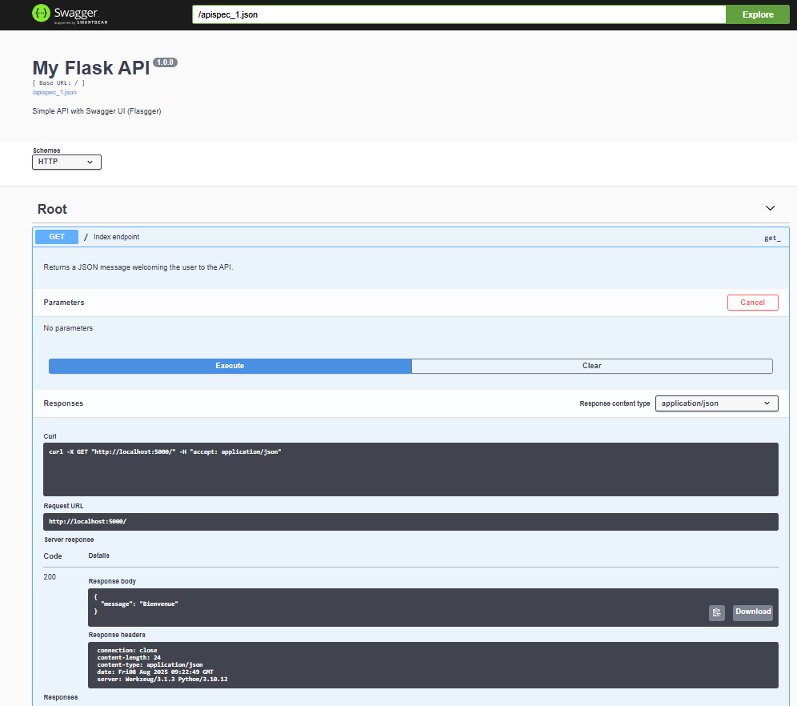
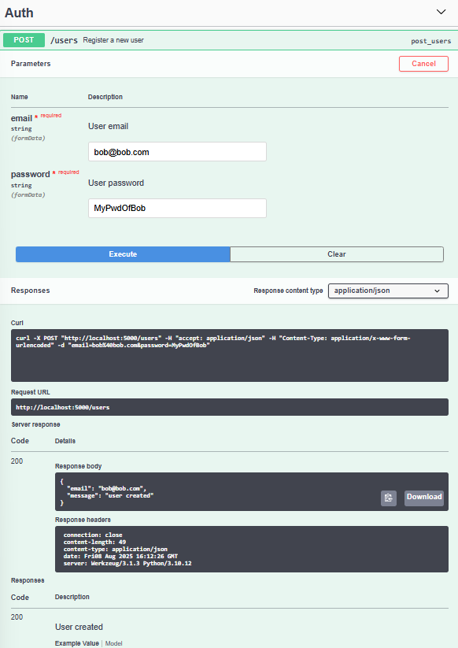
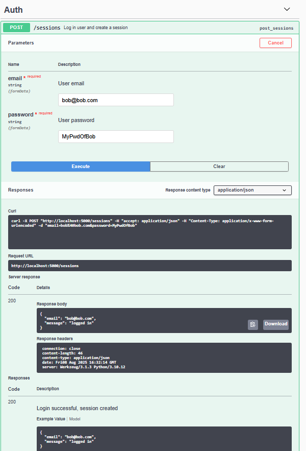
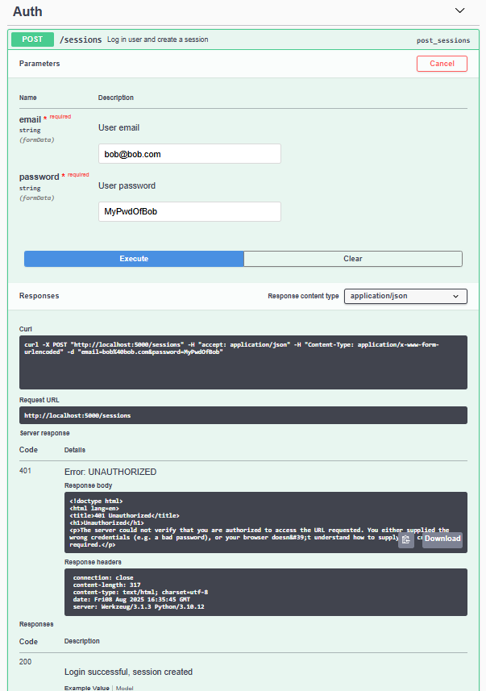
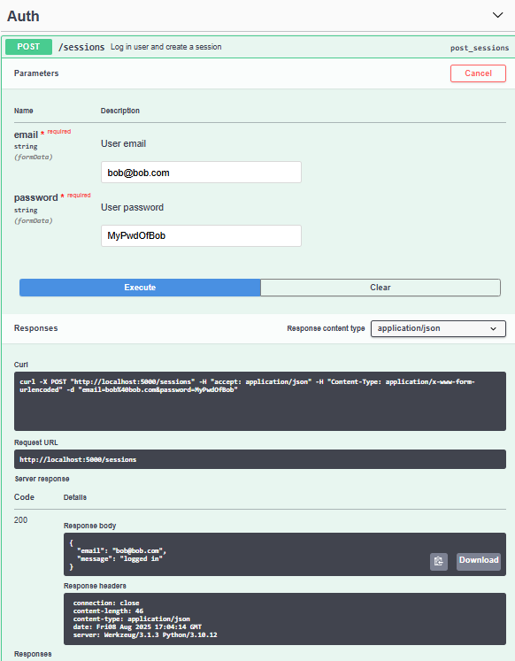

user_authentication_service

```python
python3 -m venv venv
```

```python
pip3 install bcrypt
pip3 install sqlalchemy

```

```bash
source venv/bin/activate
pip install -r requirements.txt

pip install sqlalchemy bcrypt
deactivate
```

Task0
user.py
```python
#!/usr/bin/env python3
"""
This module defines the User model for authentication.
"""
from sqlalchemy.ext.declarative import declarative_base
from sqlalchemy import Column, Integer, String

Base = declarative_base()


class User(Base):
    """
    SQLAlchemy model for the users table.
    """
    __tablename__ = 'users'

    id: int = Column(Integer, primary_key=True)
    email: str = Column(String(250), nullable=False)
    hashed_password: str = Column(String(250), nullable=False)
    session_id: str = Column(String(250), nullable=True)
    reset_token: str = Column(String(250), nullable=True)
```

main.py
```python
#!/usr/bin/env python3
"""
Main file
"""
from user import User

print(User.__tablename__)

for column in User.__table__.columns:
    print("{}: {}".format(column, column.type))
```


```bash
(venv) root@UID7E:/mnt/d/Users/steph/Documents/5ème_trimestre/holbe
rtonschool-web_back_end/user_authentication_service# python3 main.py
users
users.id: INTEGER
users.email: VARCHAR(250)
users.hashed_password: VARCHAR(250)
users.session_id: VARCHAR(250)
users.reset_token: VARCHAR(250)
```

Task1
db.py
```python
#!/usr/bin/env python3
"""DB module
"""
from sqlalchemy import create_engine
from sqlalchemy.ext.declarative import declarative_base
from sqlalchemy.orm import sessionmaker
from sqlalchemy.orm.session import Session

from user import Base, User  # 👈 N'oublie pas d'importer User


class DB:
    """DB class
    """

    def __init__(self) -> None:
        """Initialize a new DB instance
        """
        self._engine = create_engine("sqlite:///a.db", echo=True)
        Base.metadata.drop_all(self._engine)
        Base.metadata.create_all(self._engine)
        self.__session = None

    @property
    def _session(self) -> Session:
        """Memoized session object
        """
        if self.__session is None:
            DBSession = sessionmaker(bind=self._engine)
            self.__session = DBSession()
        return self.__session

    def add_user(self, email: str, hashed_password: str) -> User:
        """Add a new user to the database and return the User object."""
        user = User(email=email, hashed_password=hashed_password)
        self._session.add(user)
        self._session.commit()
        return user
```

main.py
```python
#!/usr/bin/env python3
"""
Main file
"""

from db import DB
from user import User

my_db = DB()

user_1 = my_db.add_user("test@test.com", "SuperHashedPwd")
print(user_1.id)

user_2 = my_db.add_user("test1@test.com", "SuperHashedPwd1")
print(user_2.id)
```

```bash
(venv) root@UID7E:/mnt/d/Users/steph/Documents/5ème_trimestre/holbe
rtonschool-web_back_end/user_authentication_service# python3 main.py
2025-08-07 15:45:01,878 INFO sqlalchemy.engine.Engine BEGIN (implicit)
2025-08-07 15:45:01,879 INFO sqlalchemy.engine.Engine PRAGMA main.table_info("users")
2025-08-07 15:45:01,879 INFO sqlalchemy.engine.Engine [raw sql] ()
2025-08-07 15:45:01,885 INFO sqlalchemy.engine.Engine PRAGMA temp.table_info("users")
2025-08-07 15:45:01,885 INFO sqlalchemy.engine.Engine [raw sql] ()
2025-08-07 15:45:01,886 INFO sqlalchemy.engine.Engine COMMIT
2025-08-07 15:45:01,886 INFO sqlalchemy.engine.Engine BEGIN (implicit)
2025-08-07 15:45:01,886 INFO sqlalchemy.engine.Engine PRAGMA main.table_info("users")
2025-08-07 15:45:01,886 INFO sqlalchemy.engine.Engine [raw sql] ()
2025-08-07 15:45:01,890 INFO sqlalchemy.engine.Engine PRAGMA temp.table_info("users")
2025-08-07 15:45:01,890 INFO sqlalchemy.engine.Engine [raw sql] ()
2025-08-07 15:45:01,891 INFO sqlalchemy.engine.Engine
CREATE TABLE users (
        id INTEGER NOT NULL,
        email VARCHAR(250) NOT NULL,
        hashed_password VARCHAR(250) NOT NULL,
        session_id VARCHAR(250),
        reset_token VARCHAR(250),
        PRIMARY KEY (id)
)


2025-08-07 15:45:01,892 INFO sqlalchemy.engine.Engine [no key 0.00028s] ()
2025-08-07 15:45:01,923 INFO sqlalchemy.engine.Engine COMMIT
2025-08-07 15:45:01,928 INFO sqlalchemy.engine.Engine BEGIN (implicit)
2025-08-07 15:45:01,930 INFO sqlalchemy.engine.Engine INSERT INTO users (email, hashed_password, session_id, reset_token) VALUES (?, ?, ?, ?)
2025-08-07 15:45:01,931 INFO sqlalchemy.engine.Engine [generated in 0.00039s] ('test@test.com', 'SuperHashedPwd', None, None)
2025-08-07 15:45:01,940 INFO sqlalchemy.engine.Engine COMMIT
2025-08-07 15:45:01,957 INFO sqlalchemy.engine.Engine BEGIN (implicit)
2025-08-07 15:45:01,961 INFO sqlalchemy.engine.Engine SELECT users.id AS users_id, users.email AS users_email, users.hashed_password AS users_hashed_password, users.session_id AS users_session_id, users.reset_token AS users_reset_token
FROM users
WHERE users.id = ?
2025-08-07 15:45:01,961 INFO sqlalchemy.engine.Engine [generated in 0.00042s] (1,)
1
2025-08-07 15:45:01,965 INFO sqlalchemy.engine.Engine INSERT INTO users (email, hashed_password, session_id, reset_token) VALUES (?, ?, ?, ?)
2025-08-07 15:45:01,965 INFO sqlalchemy.engine.Engine [cached since 0.0352s ago] ('test1@test.com', 'SuperHashedPwd1', None, None)
2025-08-07 15:45:01,975 INFO sqlalchemy.engine.Engine COMMIT
2025-08-07 15:45:01,991 INFO sqlalchemy.engine.Engine BEGIN (implicit)
2025-08-07 15:45:01,991 INFO sqlalchemy.engine.Engine SELECT users.id AS users_id, users.email AS users_email, users.hashed_password AS users_hashed_password, users.session_id AS users_session_id, users.reset_token AS users_reset_token
FROM users
WHERE users.id = ?
2025-08-07 15:45:01,992 INFO sqlalchemy.engine.Engine [cached since 0.03122s ago] (2,)
2
```

db.py
```python
#!/usr/bin/env python3
"""DB module
"""
from sqlalchemy import create_engine
from sqlalchemy.ext.declarative import declarative_base
from sqlalchemy.orm import sessionmaker
from sqlalchemy.orm.session import Session

from user import Base, User  # 👈 N'oublie pas d'importer User


class DB:
    """DB class
    """

    def __init__(self) -> None:
        """Initialize a new DB instance
        """
        self._engine = create_engine("sqlite:///a.db", echo=False)
        Base.metadata.drop_all(self._engine)
        Base.metadata.create_all(self._engine)
        self.__session = None

    @property
    def _session(self) -> Session:
        """Memoized session object
        """
        if self.__session is None:
            DBSession = sessionmaker(bind=self._engine)
            self.__session = DBSession()
        return self.__session

    def add_user(self, email: str, hashed_password: str) -> User:
        """Add a new user to the database and return the User object."""
        user = User(email=email, hashed_password=hashed_password)
        self._session.add(user)
        self._session.commit()
        return user
```

main.py
```python
#!/usr/bin/env python3
"""
Main file
"""

from db import DB
from user import User

my_db = DB()

user_1 = my_db.add_user("test@test.com", "SuperHashedPwd")
print(user_1.id)

user_2 = my_db.add_user("test1@test.com", "SuperHashedPwd1")
print(user_2.id)
```

```bash
(venv) root@UID7E:/mnt/d/Users/steph/Documents/5ème_trimestre/holbe
rtonschool-web_back_end/user_authentication_service# python3 main.py
1
2
(venv) root@UID7E:/mnt/d/Users/steph/Documents/5ème_trimestre/holbe
rtonschool-web_back_end/user_authentication_service#
```

Task2
db.py
```python
#!/usr/bin/env python3
"""DB module
"""
from sqlalchemy import create_engine
from sqlalchemy.ext.declarative import declarative_base
from sqlalchemy.orm import sessionmaker
from sqlalchemy.orm.session import Session
from sqlalchemy.orm.exc import NoResultFound  # ✅ CORRECT
from sqlalchemy.exc import InvalidRequestError  # ✅ Déjà utilisé


from user import Base, User  # 👈 N'oublie pas d'importer User


class DB:
    """DB class
    """

    def __init__(self) -> None:
        """Initialize a new DB instance
        """
        self._engine = create_engine("sqlite:///a.db", echo=False)
        Base.metadata.drop_all(self._engine)
        Base.metadata.create_all(self._engine)
        self.__session = None

    @property
    def _session(self) -> Session:
        """Memoized session object
        """
        if self.__session is None:
            DBSession = sessionmaker(bind=self._engine)
            self.__session = DBSession()
        return self.__session

    def add_user(self, email: str, hashed_password: str) -> User:
        """Add a new user to the database and return the User object."""
        user = User(email=email, hashed_password=hashed_password)
        self._session.add(user)
        self._session.commit()
        return user

    def find_user_by(self, **kwargs) -> User:
        """Find the first user matching the given filters.

        Args:
            **kwargs: fields to filter by.

        Returns:
            User: the user found.

        Raises:
            NoResultFound: if no user matches.
            InvalidRequestError: if an invalid field is provided.
        """
        if not kwargs:
            raise InvalidRequestError

        try:
            user = self._session.query(User).filter_by(**kwargs).first()
        except Exception as e:
            raise InvalidRequestError from e

        if user is None:
            raise NoResultFound

        return user
```

main.py
```python
#!/usr/bin/env python3
"""
Main file
"""
from db import DB
from user import User

from sqlalchemy.exc import InvalidRequestError
from sqlalchemy.orm.exc import NoResultFound


my_db = DB()

user = my_db.add_user("test@test.com", "PwdHashed")
print(user.id)

find_user = my_db.find_user_by(email="test@test.com")
print(find_user.id)

try:
    find_user = my_db.find_user_by(email="test2@test.com")
    print(find_user.id)
except NoResultFound:
    print("Not found")

try:
    find_user = my_db.find_user_by(no_email="test@test.com")
    print(find_user.id)
except InvalidRequestError:
    print("Invalid")
```

```bash
(venv) root@UID7E:/mnt/d/Users/steph/Documents/5ème_trimestre/holbe
rtonschool-web_back_end/user_authentication_service# python3 main.py
1
1
Not found
Invalid
(venv) root@UID7E:/mnt/d/Users/steph/Documents/5ème_trimestre/holbe
rtonschool-web_back_end/user_authentication_service#
```

Task3
db.py
```python
#!/usr/bin/env python3
"""DB module
"""
from sqlalchemy import create_engine
from sqlalchemy.ext.declarative import declarative_base
from sqlalchemy.orm import sessionmaker
from sqlalchemy.orm.session import Session
from sqlalchemy.orm.exc import NoResultFound  # ✅ CORRECT
from sqlalchemy.exc import InvalidRequestError  # ✅ Déjà utilisé


from user import Base, User  # 👈 N'oublie pas d'importer User


class DB:
    """DB class
    """

    def __init__(self) -> None:
        """Initialize a new DB instance
        """
        self._engine = create_engine("sqlite:///a.db", echo=False)
        Base.metadata.drop_all(self._engine)
        Base.metadata.create_all(self._engine)
        self.__session = None

    @property
    def _session(self) -> Session:
        """Memoized session object
        """
        if self.__session is None:
            DBSession = sessionmaker(bind=self._engine)
            self.__session = DBSession()
        return self.__session

    def add_user(self, email: str, hashed_password: str) -> User:
        """Add a new user to the database and return the User object."""
        user = User(email=email, hashed_password=hashed_password)
        self._session.add(user)
        self._session.commit()
        return user

    def find_user_by(self, **kwargs) -> User:
        """Find the first user matching the given filters.

        Args:
            **kwargs: fields to filter by.

        Returns:
            User: the user found.

        Raises:
            NoResultFound: if no user matches.
            InvalidRequestError: if an invalid field is provided.
        """
        if not kwargs:
            raise InvalidRequestError

        try:
            user = self._session.query(User).filter_by(**kwargs).first()
        except Exception as e:
            raise InvalidRequestError from e

        if user is None:
            raise NoResultFound

        return user

    def update_user(self, user_id: int, **kwargs) -> None:
        """Met à jour un utilisateur puis commit.
        Lève ValueError si un champ est invalide.
        """
        # récupère l'utilisateur (lèvera NoResultFound si introuvable)
        user = self.find_user_by(id=user_id)

        # applique les mises à jour demandées
        for field, value in kwargs.items():
            if not hasattr(user, field):
                raise ValueError(f"Invalid field: {field}")
            setattr(user, field, value)

        # enregistre en base
        self._session.commit()
```

main.py
```python
#!/usr/bin/env python3
"""
Main file
"""
from db import DB
from user import User

from sqlalchemy.exc import InvalidRequestError
from sqlalchemy.orm.exc import NoResultFound


my_db = DB()

email = 'test@test.com'
hashed_password = "hashedPwd"

user = my_db.add_user(email, hashed_password)
print(user.id)

try:
    my_db.update_user(user.id, hashed_password='NewPwd')
    print("Password updated")
except ValueError:
    print("Error")
```

```bash
(venv) root@UID7E:/mnt/d/Users/steph/Documents/5ème_trimestre/holbe
rtonschool-web_back_end/user_authentication_service# python3 main.py
1
Password updated
(venv) root@UID7E:/mnt/d/Users/steph/Documents/5ème_trimestre/holbe
rtonschool-web_back_end/user_authentication_service#
```

Task4
auth.py
```python
#!/usr/bin/env python3
"""Auth module
"""
import bcrypt


def _hash_password(password: str) -> bytes:
    """Retourne un hash bcrypt (bytes) du mot de passe fourni."""
    return bcrypt.hashpw(password.encode('utf-8'), bcrypt.gensalt())

```

main.py
```python
#!/usr/bin/env python3
"""
Main file
"""
from auth import _hash_password

print(_hash_password("Hello Holberton"))
```

```bash
(venv) root@UID7E:/mnt/d/Users/steph/Documents/5ème_trimestre/holbe
rtonschool-web_back_end/user_authentication_service# python3 main.py
b'$2b$12$DyuwYcoqvO5c9D9V8rmFS.IYKIuQtuaWgJwhsBZIWmJEbM/2l.Lti'
(venv) root@UID7E:/mnt/d/Users/steph/Documents/5ème_trimestre/holbe
rtonschool-web_back_end/user_authentication_service#
```

Task5
auth.py
```python
#!/usr/bin/env python3
"""Auth module: enregistrement et gestion des utilisateurs."""
from typing import Optional
import bcrypt
from sqlalchemy.orm.exc import NoResultFound

from db import DB
from user import User


def _hash_password(password: str) -> bytes:
    """Retourne un hash bcrypt (bytes) du mot de passe fourni."""
    return bcrypt.hashpw(password.encode('utf-8'), bcrypt.gensalt())


class Auth:
    """Auth class to interact with the authentication database."""

    def __init__(self) -> None:
        self._db = DB()

    def register_user(self, email: str, password: str) -> User:
        """Crée un nouvel utilisateur si l'email n'existe pas.

        - Si l'utilisateur existe déjà: lève ValueError("User <email> already
        exists")
        - Sinon: hash le mot de passe, crée l'utilisateur et le retourne.
        """
        try:
            # S'il existe déjà, find_user_by ne lèvera pas d'exception
            self._db.find_user_by(email=email)
        except NoResultFound:
            hashed = _hash_password(password)
            # On enregistre en base sous forme de str (bcrypt renvoie des bytes
            return self._db.add_user(email, hashed.decode("utf-8"))

        # Si on arrive ici, un user existe déjà
        raise ValueError(f"User {email} already exists")

```

main.py
```python
#!/usr/bin/env python3
"""
Main file
"""
from auth import _hash_password

print(_hash_password("Hello Holberton"))
```

```bash
(venv) root@UID7E:/mnt/d/Users/steph/Documents/5ème_trimestre/holbe
rtonschool-web_back_end/user_authentication_service# python3 main.py
successfully created a new user!
could not create a new user: User me@me.com already exists
(venv) root@UID7E:/mnt/d/Users/steph/Documents/5ème_trimestre/holbe
rtonschool-web_back_end/user_authentication_service#
```


Task6

```python
pip install flask
python3 app.py
```

app.py
```python
#!/usr/bin/env python3
"""Basic Flask app"""
from flask import Flask, jsonify

app = Flask(__name__)


@app.route("/", methods=["GET"])
def index():
    """GET / route - retourne un message JSON"""
    return jsonify({"message": "Bienvenue"})


if __name__ == "__main__":
    app.run(host="0.0.0.0", port="5000")
```

```bash
(venv) root@UID7E:/mnt/d/Users/steph/Documents/5ème_trimestre/holbe
rtonschool-web_back_end/user_authentication_service# python3 app.py
 * Serving Flask app 'app'
 * Debug mode: off
WARNING: This is a development server. Do not use it in a production deployment. Use a production WSGI server instead.
 * Running on all addresses (0.0.0.0)
 * Running on http://127.0.0.1:5000
 * Running on http://172.18.71.179:5000
Press CTRL+C to quit
```

app.py
```python
#!/usr/bin/env python3
"""Basic Flask app"""
from flask import Flask, jsonify
from flasgger import Swagger

app = Flask(__name__)

# (Optionnel) Métadonnées OpenAPI
swagger = Swagger(app, template={
    "swagger": "2.0",
    "info": {
        "title": "My Flask API",
        "description": "Simple API with Swagger UI (Flasgger)",
        "version": "1.0.0"
    },
    "basePath": "/",
    "schemes": ["http"]
})


@app.route("/", methods=["GET"])
def index():
    """
    Index endpoint
    ---
    tags:
      - Root
    summary: Welcome message
    description: Returns a JSON message welcoming the user to the API.
    produces:
      - application/json
    responses:
      200:
        description: A welcome message
        schema:
          type: object
          properties:
            message:
              type: string
              example: Bienvenue
    """
    # """GET / route - retourne un message JSON"""
    return jsonify({"message": "Bienvenue"})


if __name__ == "__main__":
    app.run(host="0.0.0.0", port="5000")
```


```bash
((venv) root@UID7E:/mnt/d/Users/steph/Documents/5ème_trimestre/holbe
rtonschool-web_back_end/user_authentication_service# python3 app.py
 * Serving Flask app 'app'
 * Debug mode: off
WARNING: This is a development server. Do not use it in a production deployment. Use a production WSGI server instead.
 * Running on all addresses (0.0.0.0)
 * Running on http://127.0.0.1:5000
 * Running on http://172.18.71.179:5000
Press CTRL+C to quit
127.0.0.1 - - [08/Aug/2025 11:22:39] "GET /apidocs/ HTTP/1.1" 200 -
127.0.0.1 - - [08/Aug/2025 11:22:39] "GET /flasgger_static/swagger-ui.css HTTP/1.1" 200 -
127.0.0.1 - - [08/Aug/2025 11:22:39] "GET /flasgger_static/swagger-ui-standalone-preset.js HTTP/1.1" 200 -
127.0.0.1 - - [08/Aug/2025 11:22:39] "GET /flasgger_static/swagger-ui-bundle.js HTTP/1.1" 200 -
127.0.0.1 - - [08/Aug/2025 11:22:40] "GET /flasgger_static/lib/jquery.min.js HTTP/1.1" 200 -
127.0.0.1 - - [08/Aug/2025 11:22:40] "GET /apispec_1.json HTTP/1.1" 200 -
127.0.0.1 - - [08/Aug/2025 11:22:40] "GET /flasgger_static/favicon-32x32.png HTTP/1.1" 200 -
127.0.0.1 - - [08/Aug/2025 11:22:49] "GET / HTTP/1.1" 200 -
```



Task7
app.py
```python
#!/usr/bin/env python3
"""Basic Flask app"""
from flask import Flask, jsonify, request
from flasgger import Swagger
from auth import Auth

app = Flask(__name__)
AUTH = Auth()

# (Optionnel) Métadonnées OpenAPI
swagger = Swagger(app, template={
    "swagger": "2.0",
    "info": {
        "title": "My Flask API",
        "description": "Simple API with Swagger UI (Flasgger)",
        "version": "1.0.0"
    },
    "basePath": "/",
    "schemes": ["http"]
})


@app.route("/", methods=["GET"])
def index():
    """
    Index endpoint
    ---
    tags:
      - Root
    summary: Welcome message
    description: Returns a JSON message welcoming the user to the API.
    produces:
      - application/json
    responses:
      200:
        description: A welcome message
        schema:
          type: object
          properties:
            message:
              type: string
              example: Bienvenue
    """
    # """GET / route - retourne un message JSON"""
    return jsonify({"message": "Bienvenue"})


@app.route("/users", methods=["POST"])
def users():
    """
    Register a new user
    ---
    tags: [Auth]
    consumes:
      - application/x-www-form-urlencoded
    parameters:
      - in: formData
        name: email
        type: string
        required: true
        description: User email
      - in: formData
        name: password
        type: string
        required: true
        description: User password
    responses:
      200:
        description: User created
        schema:
          type: object
          properties:
            email: {type: string, example: bob@me.com}
            message: {type: string, example: user created}
      400:
        description: Email already registered or missing fields
        schema:
          type: object
          properties:
            message: {type: string, example: email already registered}
    """
    email = request.form.get("email")
    password = request.form.get("password")

    try:
        user = AUTH.register_user(email, password)
        return jsonify({"email": email, "message": "user created"})
    except ValueError:
        return jsonify({"message": "email already registered"}), 400


if __name__ == "__main__":
    app.run(host="0.0.0.0", port="5000")
```

```bash
root@UID7E:/mnt/d/Users/steph/Documents/5ème_trimestre/holbe
rtonschool-web_back_end/user_authentication_service# python3 app.py
 * Serving Flask app 'app'
 * Debug mode: off
WARNING: This is a development server. Do not use it in a production deployment. Use a production WSGI server instead.
 * Running on all addresses (0.0.0.0)
 * Running on http://127.0.0.1:5000
 * Running on http://172.18.71.179:5000
Press CTRL+C to quit
127.0.0.1 - - [08/Aug/2025 13:32:20] "GET /apidocs/ HTTP/1.1" 200 -
127.0.0.1 - - [08/Aug/2025 13:32:20] "GET /flasgger_static/swagger-ui.css HTTP/1.1" 304 -
127.0.0.1 - - [08/Aug/2025 13:32:20] "GET /flasgger_static/swagger-ui-bundle.js HTTP/1.1" 304 -
127.0.0.1 - - [08/Aug/2025 13:32:20] "GET /flasgger_static/swagger-ui-standalone-preset.js HTTP/1.1" 304 -
127.0.0.1 - - [08/Aug/2025 13:32:20] "GET /flasgger_static/lib/jquery.min.js HTTP/1.1" 304 -
127.0.0.1 - - [08/Aug/2025 13:32:21] "GET /apispec_1.json HTTP/1.1" 200 -
127.0.0.1 - - [08/Aug/2025 13:32:21] "GET /flasgger_static/favicon-32x32.png HTTP/1.1" 304 -
```

```bash
(venv) root@UID7E:/mnt/d/Users/steph/Documents/5ème_trimestre/holbe
rtonschool-web_back_end/user_authentication_service# curl -XPOST localhost:5000/users -d 'email=bob@me.com' -d 'password=mySuperPwd' -v
Note: Unnecessary use of -X or --request, POST is already inferred.
*   Trying 127.0.0.1:5000...
* Connected to localhost (127.0.0.1) port 5000 (#0)
> POST /users HTTP/1.1
> Host: localhost:5000
> User-Agent: curl/7.81.0
> Accept: */*
> Content-Length: 36
> Content-Type: application/x-www-form-urlencoded
>
* Mark bundle as not supporting multiuse
< HTTP/1.1 200 OK
< Server: Werkzeug/3.1.3 Python/3.10.12
< Date: Fri, 08 Aug 2025 11:36:36 GMT
< Content-Type: application/json
< Content-Length: 48
< Connection: close
<
{"email":"bob@me.com","message":"user created"}
* Closing connection 0
(venv) root@UID7E:/mnt/d/Users/steph/Documents/5ème_trimestre/holbe
rtonschool-web_back_end/user_authentication_service# curl -XPOST localhost:5000/users -d 'email=bob@me.com' -d 'password=mySuperPwd' -v
Note: Unnecessary use of -X or --request, POST is already inferred.
*   Trying 127.0.0.1:5000...
* Connected to localhost (127.0.0.1) port 5000 (#0)
> POST /users HTTP/1.1
> Host: localhost:5000
> User-Agent: curl/7.81.0
> Accept: */*
> Content-Length: 36
> Content-Type: application/x-www-form-urlencoded
>
* Mark bundle as not supporting multiuse
< HTTP/1.1 400 BAD REQUEST
< Server: Werkzeug/3.1.3 Python/3.10.12
< Date: Fri, 08 Aug 2025 11:36:39 GMT
< Content-Type: application/json
< Content-Length: 39
< Connection: close
<
{"message":"email already registered"}
* Closing connection 0
(venv) root@UID7E:/mnt/d/Users/steph/Documents/5ème_trimestre/holbe
rtonschool-web_back_end/user_authentication_service#
```

Task8
auth.py
```python
#!/usr/bin/env python3
"""Auth module: enregistrement et gestion des utilisateurs."""
from typing import Optional
import bcrypt
from sqlalchemy.orm.exc import NoResultFound

from db import DB
from user import User


def _hash_password(password: str) -> bytes:
    """Retourne un hash bcrypt (bytes) du mot de passe fourni."""
    return bcrypt.hashpw(password.encode('utf-8'), bcrypt.gensalt())


class Auth:
    """Auth class to interact with the authentication database."""

    def __init__(self) -> None:
        self._db = DB()

    def register_user(self, email: str, password: str) -> User:
        """Crée un nouvel utilisateur si l'email n'existe pas.

        - Si l'utilisateur existe déjà: lève ValueError("User <email> already
        exists")
        - Sinon: hash le mot de passe, crée l'utilisateur et le retourne.
        """
        try:
            # S'il existe déjà, find_user_by ne lèvera pas d'exception
            self._db.find_user_by(email=email)
        except NoResultFound:
            hashed = _hash_password(password)
            # On enregistre en base sous forme de str (bcrypt renvoie des bytes
            return self._db.add_user(email, hashed.decode("utf-8"))

        # Si on arrive ici, un user existe déjà
        raise ValueError(f"User {email} already exists")

    def valid_login(self, email: str, password: str) -> bool:
        """Valide les identifiants d'un utilisateur."""
        try:
            user = self._db.find_user_by(email=email)
        except NoResultFound:
            return False

        if user.hashed_password is None:
            return False

        # bcrypt.checkpw attend les deux valeurs en bytes
        return bcrypt.checkpw(
            password.encode('utf-8'),
            user.hashed_password.encode('utf-8')
        )
```

main.py
```python
#!/usr/bin/env python3
"""
Main file
"""
from auth import Auth

email = 'bob@bob.com'
password = 'MyPwdOfBob'
auth = Auth()

auth.register_user(email, password)

print(auth.valid_login(email, password))

print(auth.valid_login(email, "WrongPwd"))

print(auth.valid_login("unknown@email", password))

```

```bash
(venv) root@UID7E:/mnt/d/Users/steph/Documents/5ème_trimestre/holbe
rtonschool-web_back_end/user_authentication_service# python3 main.py
True
False
False
```

Task9
auth.py
```python
#!/usr/bin/env python3
"""Auth module: enregistrement et gestion des utilisateurs."""
from typing import Optional
import bcrypt
import uuid  # ✅ Ajout de l'import pour Task 9
from sqlalchemy.orm.exc import NoResultFound

from db import DB
from user import User


def _hash_password(password: str) -> bytes:
    """Retourne un hash bcrypt (bytes) du mot de passe fourni."""
    return bcrypt.hashpw(password.encode('utf-8'), bcrypt.gensalt())


def _generate_uuid() -> str:
    """Génère et retourne un UUID4 en chaîne de caractères."""
    return str(uuid.uuid4())


class Auth:
    """Auth class to interact with the authentication database."""

    def __init__(self) -> None:
        self._db = DB()

    def register_user(self, email: str, password: str) -> User:
        """Crée un nouvel utilisateur si l'email n'existe pas.

        - Si l'utilisateur existe déjà: lève ValueError("User <email> already
        exists")
        - Sinon: hash le mot de passe, crée l'utilisateur et le retourne.
        """
        try:
            # S'il existe déjà, find_user_by ne lèvera pas d'exception
            self._db.find_user_by(email=email)
        except NoResultFound:
            hashed = _hash_password(password)
            # On enregistre en base sous forme de str (bcrypt renvoie des bytes
            return self._db.add_user(email, hashed.decode("utf-8"))

        # Si on arrive ici, un user existe déjà
        raise ValueError(f"User {email} already exists")

    def valid_login(self, email: str, password: str) -> bool:
        """Valide les identifiants d'un utilisateur."""
        try:
            user = self._db.find_user_by(email=email)
        except NoResultFound:
            return False

        if user.hashed_password is None:
            return False

        # bcrypt.checkpw attend les deux valeurs en bytes
        return bcrypt.checkpw(
            password.encode('utf-8'),
            user.hashed_password.encode('utf-8')
        )
```


```bash

```

Task10
auth.py
```python
#!/usr/bin/env python3
"""Auth module: enregistrement et gestion des utilisateurs."""
from typing import Optional
import bcrypt
from sqlalchemy.orm.exc import NoResultFound
import uuid  # ✅ Ajout de l'import pour Task 9

from db import DB
from user import User


def _hash_password(password: str) -> bytes:
    """Retourne un hash bcrypt (bytes) du mot de passe fourni."""
    return bcrypt.hashpw(password.encode('utf-8'), bcrypt.gensalt())


def _generate_uuid() -> str:
    """Génère et retourne un UUID4 en chaîne de caractères."""
    return str(uuid.uuid4())


class Auth:
    """Auth class to interact with the authentication database."""

    def __init__(self) -> None:
        self._db = DB()

    def register_user(self, email: str, password: str) -> User:
        """Crée un nouvel utilisateur si l'email n'existe pas.

        - Si l'utilisateur existe déjà: lève ValueError("User <email> already
        exists")
        - Sinon: hash le mot de passe, crée l'utilisateur et le retourne.
        """
        try:
            # S'il existe déjà, find_user_by ne lèvera pas d'exception
            self._db.find_user_by(email=email)
        except NoResultFound:
            hashed = _hash_password(password)
            # On enregistre en base sous forme de str (bcrypt renvoie des bytes
            return self._db.add_user(email, hashed.decode("utf-8"))

        # Si on arrive ici, un user existe déjà
        raise ValueError(f"User {email} already exists")

    def valid_login(self, email: str, password: str) -> bool:
        """Valide les identifiants d'un utilisateur."""
        try:
            user = self._db.find_user_by(email=email)
        except NoResultFound:
            return False

        if user.hashed_password is None:
            return False

        # bcrypt.checkpw attend les deux valeurs en bytes
        return bcrypt.checkpw(
            password.encode('utf-8'),
            user.hashed_password.encode('utf-8')
        )

    def create_session(self, email: str) -> Optional[str]:
        """Create a session for the user and return the session_id.
        Returns None if the email is unknown.
        """
        try:
            user = self._db.find_user_by(email=email)
        except NoResultFound:
            return None

        session_id = _generate_uuid()
        self._db.update_user(user.id, session_id=session_id)
        return session_id

```

main.py
```python
#!/usr/bin/env python3
"""
Main file
"""
from auth import Auth

email = 'bob@bob.com'
password = 'MyPwdOfBob'
auth = Auth()

auth.register_user(email, password)

print(auth.create_session(email))
print(auth.create_session("unknown@email.com"))
```

```bash
(venv) root@UID7E:/mnt/d/Users/steph/Documents/5ème_trimestre/holbe
rtonschool-web_back_end/user_authentication_service# python3 main.py
4a6350d6-9c9f-492c-a13d-ded1ea4ce603
None
(venv) root@UID7E:/mnt/d/Users/steph/Documents/5ème_trimestre/hol
bertonschool-web_back_end/user_authentication_service# python3 main.py
7ec258e2-67a1-498e-ac4f-fc81228a985d
None
(venv) root@UID7E:/mnt/d/Users/steph/Documents/5ème_trimestre/hol
bertonschool-web_back_end/user_authentication_service#
```

Task11
app.py
```python
#!/usr/bin/env python3
"""Basic Flask app"""
from flask import Flask, jsonify, request, abort
from flasgger import Swagger
from auth import Auth

app = Flask(__name__)
AUTH = Auth()

# (Optionnel) Métadonnées OpenAPI
swagger = Swagger(app, template={
    "swagger": "2.0",
    "info": {
        "title": "My Flask API",
        "description": "Simple API with Swagger UI (Flasgger)",
        "version": "1.0.0"
    },
    "basePath": "/",
    "schemes": ["http"]
})


@app.route("/", methods=["GET"])
def index():
    """
    Index endpoint
    ---
    tags:
      - Root
    summary: Welcome message
    description: Returns a JSON message welcoming the user to the API.
    produces:
      - application/json
    responses:
      200:
        description: A welcome message
        schema:
          type: object
          properties:
            message:
              type: string
              example: Bienvenue
    """
    # """GET / route - retourne un message JSON"""
    return jsonify({"message": "Bienvenue"})


@app.route("/users", methods=["POST"])
def users():
    """
    Register a new user
    ---
    tags: [Auth]
    consumes:
      - application/x-www-form-urlencoded
    parameters:
      - in: formData
        name: email
        type: string
        required: true
        description: User email
      - in: formData
        name: password
        type: string
        required: true
        description: User password
    responses:
      200:
        description: User created
        schema:
          type: object
          properties:
            email: {type: string, example: bob@me.com}
            message: {type: string, example: user created}
      400:
        description: Email already registered or missing fields
        schema:
          type: object
          properties:
            message: {type: string, example: email already registered}
    """
    email = request.form.get("email")
    password = request.form.get("password")

    try:
        user = AUTH.register_user(email, password)
        return jsonify({"email": email, "message": "user created"})
    except ValueError:
        return jsonify({"message": "email already registered"}), 400

@app.route("/sessions", methods=["POST"])
def login():
    """
    Log in user and create a session
    ---
    tags:
      - Auth
    consumes:
      - application/x-www-form-urlencoded
    parameters:
      - in: formData
        name: email
        type: string
        required: true
        description: User email
      - in: formData
        name: password
        type: string
        required: true
        description: User password
    responses:
      200:
        description: Login successful, session created
        schema:
          type: object
          properties:
            email:
              type: string
              example: bob@bob.com
            message:
              type: string
              example: logged in
        headers:
          Set-Cookie:
            description: Session cookie
            type: string
            example: session_id=163fe508-19a2-48ed-a7c8-d9c6e56fabd1; Path=/
      401:
        description: Unauthorized (invalid credentials)
    """
    email = request.form.get("email")
    password = request.form.get("password")

    if not email or not password or not AUTH.valid_login(email, password):
        abort(401)

    session_id = AUTH.create_session(email)
    if session_id is None:
        abort(401)

    resp = jsonify({"email": email, "message": "logged in"})
    resp.set_cookie("session_id", session_id, path="/")
    return resp

if __name__ == "__main__":
    app.run(host="0.0.0.0", port="5000")
```


```bash
(venv) root@UID7E:/mnt/d/Users/steph/Documents/5ème_trimestre/hol
bertonschool-web_back_end/user_authentication_service# curl -XPOST localhost:5000/users -d 'email=bob@bob.com' -d 'password=mySuperPwd'
{"email":"bob@bob.com","message":"user created"}
(venv) root@UID7E:/mnt/d/Users/steph/Documents/5ème_trimestre/hol
bertonschool-web_back_end/user_authentication_service# curl -XPOST localhost:5000/sessions -d 'email=bob@bob.com' -d 'password=mySuperPwd' -v
Note: Unnecessary use of -X or --request, POST is already inferred.
*   Trying 127.0.0.1:5000...
* Connected to localhost (127.0.0.1) port 5000 (#0)
> POST /sessions HTTP/1.1
> Host: localhost:5000
> User-Agent: curl/7.81.0
> Accept: */*
> Content-Length: 37
> Content-Type: application/x-www-form-urlencoded
>
* Mark bundle as not supporting multiuse
< HTTP/1.1 200 OK
< Server: Werkzeug/3.1.3 Python/3.10.12
< Date: Fri, 08 Aug 2025 16:34:33 GMT
< Content-Type: application/json
< Content-Length: 46
< Set-Cookie: session_id=86657708-ff82-4ca3-8343-479069bddbb6; Path=/
< Connection: close
<
{"email":"bob@bob.com","message":"logged in"}
* Closing connection 0
(venv) root@UID7E:/mnt/d/Users/steph/Documents/5ème_trimestre/hol
bertonschool-web_back_end/user_authentication_service# curl -XPOST localhost:5000/sessions -d 'email=bob@bob.com' -d 'password=BlaBla' -v
Note: Unnecessary use of -X or --request, POST is already inferred.
*   Trying 127.0.0.1:5000...
* Connected to localhost (127.0.0.1) port 5000 (#0)
> POST /sessions HTTP/1.1
> Host: localhost:5000
> User-Agent: curl/7.81.0
> Accept: */*
> Content-Length: 33
> Content-Type: application/x-www-form-urlencoded
>
* Mark bundle as not supporting multiuse
< HTTP/1.1 401 UNAUTHORIZED
< Server: Werkzeug/3.1.3 Python/3.10.12
< Date: Fri, 08 Aug 2025 16:35:13 GMT
< Content-Type: text/html; charset=utf-8
< Content-Length: 317
< Connection: close
<
<!doctype html>
<html lang=en>
<title>401 Unauthorized</title>
<h1>Unauthorized</h1>
<p>The server could not verify that you are authorized to access the URL requested. You either supplied the wrong credentials (e.g. a bad password), or your browser doesn&#39;t understand how to supply the credentials required.</p>
* Closing connection 0
(venv) root@UID7E:/mnt/d/Users/steph/Documents/5ème_trimestre/hol
bertonschool-web_back_end/user_authentication_service#
```

???



Task12
auth.py
```python
#!/usr/bin/env python3
"""Auth module: enregistrement et gestion des utilisateurs."""
from typing import Optional
import bcrypt
from sqlalchemy.orm.exc import NoResultFound
import uuid  # ✅ Ajout de l'import pour Task 9

from db import DB
from user import User


def _hash_password(password: str) -> bytes:
    """Retourne un hash bcrypt (bytes) du mot de passe fourni."""
    return bcrypt.hashpw(password.encode('utf-8'), bcrypt.gensalt())


def _generate_uuid() -> str:
    """Génère et retourne un UUID4 en chaîne de caractères."""
    return str(uuid.uuid4())


class Auth:
    """Auth class to interact with the authentication database."""

    def __init__(self) -> None:
        self._db = DB()

    def register_user(self, email: str, password: str) -> User:
        """Crée un nouvel utilisateur si l'email n'existe pas.

        - Si l'utilisateur existe déjà: lève ValueError("User <email> already
        exists")
        - Sinon: hash le mot de passe, crée l'utilisateur et le retourne.
        """
        try:
            # S'il existe déjà, find_user_by ne lèvera pas d'exception
            self._db.find_user_by(email=email)
        except NoResultFound:
            hashed = _hash_password(password)
            # On enregistre en base sous forme de str (bcrypt renvoie des bytes
            return self._db.add_user(email, hashed.decode("utf-8"))

        # Si on arrive ici, un user existe déjà
        raise ValueError(f"User {email} already exists")

    def valid_login(self, email: str, password: str) -> bool:
        """Valide les identifiants d'un utilisateur."""
        try:
            user = self._db.find_user_by(email=email)
        except NoResultFound:
            return False

        if user.hashed_password is None:
            return False

        # bcrypt.checkpw attend les deux valeurs en bytes
        return bcrypt.checkpw(
            password.encode('utf-8'),
            user.hashed_password.encode('utf-8')
        )

    def create_session(self, email: str) -> Optional[str]:
        """Create a session for the user and return the session_id.
        Returns None if the email is unknown.
        """
        try:
            user = self._db.find_user_by(email=email)
        except NoResultFound:
            return None

        session_id = _generate_uuid()
        self._db.update_user(user.id, session_id=session_id)
        return session_id

    def get_user_from_session_id(
            self, session_id: Optional[str]) -> Optional[User]:
        """
        Récupère un utilisateur à partir de son session_id.

        Args:
            session_id (Optional[str]): ID de session de l'utilisateur

        Returns:
            Optional[User]: L'utilisateur correspondant ou None
        """
        if session_id is None:
            return None

        try:
            return self._db.find_user_by(session_id=session_id)
        except NoResultFound:
            return None
```

mon main12.py
```bash
#!/usr/bin/env python3
"""
Test get_user_from_session_id
"""
from auth import Auth

auth = Auth()

# Étape 1 : Créer un utilisateur
email = "bob@bob.com"
password = "MyPwdOfBob"
try:
    user = auth.register_user(email, password)
except ValueError:
    print("Utilisateur déjà créé")

# Étape 2 : Créer une session pour l'utilisateur
session_id = auth.create_session(email)
print(f"Session ID créé : {session_id}")

# Étape 3 : Tester avec un session_id valide
user_from_session = auth.get_user_from_session_id(session_id)
print(f"Utilisateur trouvé : {user_from_session.email if user_from_session else None}")

# Étape 4 : Tester avec un session_id inexistant
invalid_session = auth.get_user_from_session_id("1234-uuid-invalide")
print(f"Avec UUID invalide : {invalid_session}")

# Étape 5 : Tester avec None
none_session = auth.get_user_from_session_id(None)
print(f"Avec None : {none_session}")
```

```bash
(venv) root@UID7E:/mnt/d/Users/steph/Documents/5ème_trimestre/hol
bertonschool-web_back_end/user_authentication_service# python3 main.py
Session ID créé : 9e2e6c07-095e-4fec-88fa-ea548216c2de
Utilisateur trouvé : bob@bob.com
Avec UUID invalide : None
Avec None : None
```


Task13
auth.py
```python
#!/usr/bin/env python3
"""Auth module: enregistrement et gestion des utilisateurs."""
from typing import Optional
import bcrypt
from sqlalchemy.orm.exc import NoResultFound
import uuid  # ✅ Ajout de l'import pour Task 9

from db import DB
from user import User


def _hash_password(password: str) -> bytes:
    """Retourne un hash bcrypt (bytes) du mot de passe fourni."""
    return bcrypt.hashpw(password.encode('utf-8'), bcrypt.gensalt())


def _generate_uuid() -> str:
    """Génère et retourne un UUID4 en chaîne de caractères."""
    return str(uuid.uuid4())


class Auth:
    """Auth class to interact with the authentication database."""

    def __init__(self) -> None:
        self._db = DB()

    def register_user(self, email: str, password: str) -> User:
        """Crée un nouvel utilisateur si l'email n'existe pas.

        - Si l'utilisateur existe déjà: lève ValueError("User <email> already
        exists")
        - Sinon: hash le mot de passe, crée l'utilisateur et le retourne.
        """
        try:
            # S'il existe déjà, find_user_by ne lèvera pas d'exception
            self._db.find_user_by(email=email)
        except NoResultFound:
            hashed = _hash_password(password)
            # On enregistre en base sous forme de str (bcrypt renvoie des bytes
            return self._db.add_user(email, hashed.decode("utf-8"))

        # Si on arrive ici, un user existe déjà
        raise ValueError(f"User {email} already exists")

    def valid_login(self, email: str, password: str) -> bool:
        """Valide les identifiants d'un utilisateur."""
        try:
            user = self._db.find_user_by(email=email)
        except NoResultFound:
            return False

        if user.hashed_password is None:
            return False

        # bcrypt.checkpw attend les deux valeurs en bytes
        return bcrypt.checkpw(
            password.encode('utf-8'),
            user.hashed_password.encode('utf-8')
        )

    def create_session(self, email: str) -> Optional[str]:
        """Create a session for the user and return the session_id.
        Returns None if the email is unknown.
        """
        try:
            user = self._db.find_user_by(email=email)
        except NoResultFound:
            return None

        session_id = _generate_uuid()
        self._db.update_user(user.id, session_id=session_id)
        return session_id

    def get_user_from_session_id(
            self, session_id: Optional[str]) -> Optional[User]:
        """
        Récupère un utilisateur à partir de son session_id.

        Args:
            session_id (Optional[str]): ID de session de l'utilisateur

        Returns:
            Optional[User]: L'utilisateur correspondant ou None
        """
        if session_id is None:
            return None

        try:
            return self._db.find_user_by(session_id=session_id)
        except NoResultFound:
            return None

    def destroy_session(self, user_id: int) -> None:
        """
        Destroys the session for the given user ID by setting
        their session_id to None.
        Uses only public methods of self._db.

        Args:
            user_id (int): ID of the user whose session must be destroyed.

        Returns:
            None
        """
        if user_id is None:
            return None

        try:
            # Récupérer l'utilisateur avec l'ID donné
            user = self._db.find_user_by(id=user_id)
        except NoResultFound:
            return None

        # Mettre à jour le champ session_id à None
        self._db.update_user(user_id, session_id=None)

        return None

```

13_main.py
```python
#!/usr/bin/env python3
from auth import Auth
from sqlalchemy.orm.exc import NoResultFound

def safe_register(auth: Auth, email: str, password: str):
    try:
        auth.register_user(email, password)
        print(f"[OK] Registered {email}")
    except ValueError:
        print(f"[i] {email} already registered")

def main():
    auth = Auth()

    email = "bob@example.com"
    password = "correcthorsebatterystaple"

    # 1) Register (idempotent)
    safe_register(auth, email, password)

    # 2) Login -> create session
    if not auth.valid_login(email, password):
        print("[ERR] valid_login failed")
        return

    session_id = auth.create_session(email)
    print(f"[OK] session created: {session_id!r}")

    # 3) get_user_from_session_id works
    user = auth.get_user_from_session_id(session_id)
    if user is None:
        print("[ERR] get_user_from_session_id returned None")
        return
    print(f"[OK] user fetched by session: id={user.id}, email={user.email}")

    # 4) destroy_session(user.id)
    auth.destroy_session(user.id)
    print("[OK] destroy_session called")

    # 5) old session should no longer resolve to a user
    user_after = auth.get_user_from_session_id(session_id)
    if user_after is None:
        print("[OK] session invalidated ✅")
    else:
        print("[ERR] session still valid after destroy_session ❌")

    # 6) calling with None should be a no-op (and not crash)
    auth.destroy_session(None)
    print("[OK] destroy_session(None) did not crash")

if __name__ == "__main__":
    main()

```
Enregistre ceci dans test_auth_destroy_session.py et lance python -m unittest -v
```python
import unittest
from auth import Auth

class TestDestroySession(unittest.TestCase):
    def setUp(self):
        self.auth = Auth()
        self.email = "alice@example.com"
        self.password = "s3cret"
        try:
            self.auth.register_user(self.email, self.password)
        except ValueError:
            pass

    def test_destroy_session(self):
        # login & create session
        self.assertTrue(self.auth.valid_login(self.email, self.password))
        sid = self.auth.create_session(self.email)
        self.assertIsNotNone(sid)
        # resolves to a user
        user = self.auth.get_user_from_session_id(sid)
        self.assertIsNotNone(user)
        # destroy by user.id
        self.auth.destroy_session(user.id)
        # old session no longer valid
        self.assertIsNone(self.auth.get_user_from_session_id(sid))

    def test_destroy_session_none(self):
        # should be no-op and not raise
        self.assertIsNone(self.auth.destroy_session(None))

if __name__ == "__main__":
    unittest.main()

```

```bash
(venv) root@UID7E:/mnt/d/Users/steph/Documents/5ème_trimestre/hol
bertonschool-web_back_end/user_authentication_service# python3 13_main.py
[OK] Registered bob@example.com
[OK] session created: 'a9d14e22-b7e0-48c7-a4eb-f7ecc072c4c3'
[OK] user fetched by session: id=1, email=bob@example.com
[OK] destroy_session called
[OK] session invalidated ✅
[OK] destroy_session(None) did not crash
(venv) root@UID7E:/mnt/d/Users/steph/Documents/5ème_trimestre/hol
bertonschool-web_back_end/user_authentication_service# python -m unittest -v
test_destroy_session (test_auth_destroy_session.TestDestroySession) ... ok
test_destroy_session_none (test_auth_destroy_session.TestDestroySession) ... ok

----------------------------------------------------------------------
Ran 2 tests in 1.083s

OK
(venv) root@UID7E:/mnt/d/Users/steph/Documents/5ème_trimestre/hol
bertonschool-web_back_end/user_authentication_service#
```

Task14
app.py
```python

```

```bash

```


Task15
app.py
```python

```

```bash

```

Task16
auth.py
```python

```

```bash

```


Task17
app.py
```python

```

```bash

```

Task18
auth.py
```python

```

```bash

```


Task19
main.py
```python

```

```bash

```


Taskx
app.py
```python

```

```bash

```
